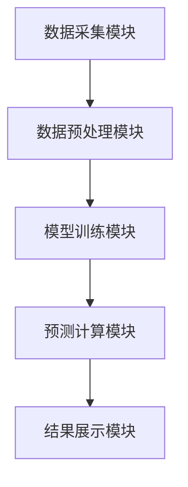
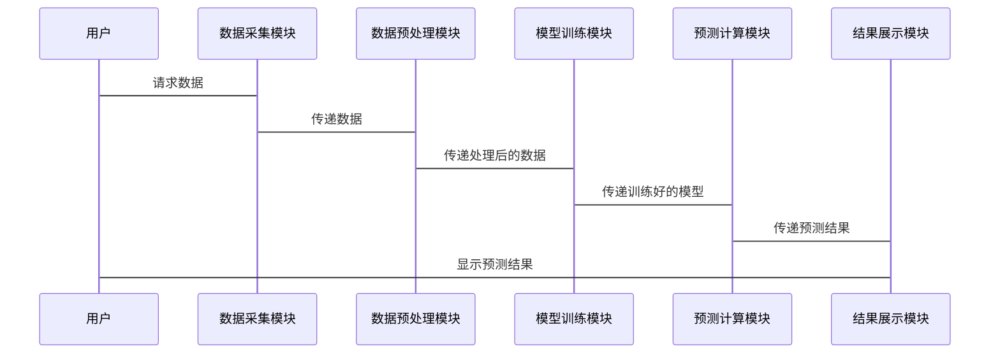

                 


# 多智能体系统在公司财务建模中的应用：提高预测准确性

> 关键词：多智能体系统、财务建模、预测准确性、分布式计算、机器学习、系统架构

> 摘要：本文探讨了多智能体系统在公司财务建模中的应用，详细分析了其优势、核心原理及系统架构设计。通过实际案例展示了如何利用多智能体系统提高财务预测的准确性，并提供了系统的实现方案和优化建议。

---

## 第一部分：多智能体系统与财务建模基础

### 第1章：多智能体系统概述

#### 1.1 多智能体系统的基本概念

**1.1.1 什么是多智能体系统**

多智能体系统（Multi-Agent System，MAS）是由多个智能体（Agent）组成的复杂系统，这些智能体能够通过协作和竞争完成特定任务。每个智能体都有一定的自主性，能够感知环境、做出决策并采取行动。

**1.1.2 多智能体系统的特征**

- **分布性**：智能体是分布式存在的，每个智能体只负责部分任务。
- **协作性**：智能体之间需要协作以实现共同目标。
- **反应性**：智能体能够实时感知环境并做出反应。
- **动态性**：系统状态和环境可能动态变化。

**1.1.3 多智能体系统与传统AI的区别**

传统的AI系统通常基于规则或预定义的模型，而多智能体系统强调智能体之间的互动和协作，能够处理更复杂的问题。

#### 1.2 财务建模的基本概念

**1.2.1 财务建模的定义**

财务建模是通过数学模型对企业的财务状况进行分析和预测的过程，旨在帮助企业做出更明智的财务决策。

**1.2.2 财务建模的目的与作用**

- **预测未来财务状况**：通过模型预测收入、支出和利润等关键指标。
- **优化资源配置**：识别最佳的资源配置方式，提高效率。
- **支持决策制定**：为管理层提供数据支持，辅助决策。

**1.2.3 传统财务建模的局限性**

- **数据复杂性**：传统模型难以处理多维度、动态变化的数据。
- **预测准确性低**：基于历史数据的简单线性模型在面对复杂市场变化时表现不佳。
- **缺乏灵活性**：难以快速适应市场环境的变化。

---

### 第2章：多智能体系统在企业中的应用背景

#### 2.1 企业财务预测的挑战

**2.1.1 数据复杂性**

现代企业的财务数据来源广泛，包括销售、成本、市场、供应链等，数据量大且复杂。

**2.1.2 预测准确性问题**

传统财务模型难以捕捉市场波动和内部管理变化，导致预测结果不够准确。

**2.1.3 传统方法的不足**

传统方法通常基于线性回归等简单模型，难以处理非线性关系和复杂交互。

#### 2.2 多智能体系统的优势

**2.2.1 分布式计算能力**

多智能体系统能够分布式处理数据，充分利用计算资源，提高处理效率。

**2.2.2 自适应性与灵活性**

系统能够实时感知环境变化，动态调整预测模型，提高预测准确性。

**2.2.3 高度协作性**

智能体之间的协作能够综合考虑多种因素，提供更全面的预测结果。

---

### 第3章：多智能体系统的核心原理

#### 3.1 多智能体系统的核心概念

**3.1.1 智能体的定义与特征**

智能体是具有自主性、反应性、目标导向和社交能力的实体，能够在环境中感知并采取行动。

**3.1.2 智能体之间的交互机制**

智能体通过通信和协商进行协作，完成任务分配和结果汇总。

**3.1.3 系统的动态性与复杂性**

系统状态和环境可能随时变化，要求智能体具备动态适应能力。

#### 3.2 多智能体系统的数学模型

**3.2.1 智能体行为模型**

智能体的行为基于感知信息和内部状态，通过决策逻辑采取行动。

**3.2.2 系统状态表示**

系统状态由多个智能体的状态组成，通常用向量或图结构表示。

**3.2.3 交互规则与协议**

智能体之间的交互需要遵循特定的规则和协议，确保协作顺利进行。

---

### 第4章：多智能体系统在财务建模中的应用

#### 4.1 财务数据的多智能体建模

**4.1.1 数据的分布式处理**

将财务数据分配给多个智能体进行处理，每个智能体负责一部分数据。

**4.1.2 多智能体协同预测**

智能体协作分析数据，综合考虑多方面因素，提高预测准确性。

**4.1.3 系统的自适应优化**

系统能够根据反馈不断优化模型参数，提升预测效果。

#### 4.2 多智能体系统的预测模型

**4.2.1 预测算法的选择**

选择适合多智能体系统的算法，如分布式机器学习和强化学习。

**4.2.2 模型的训练与优化**

通过分布式计算和参数优化，提升模型性能。

**4.2.3 预测结果的评估**

采用多种评估指标，如均方误差和准确率，验证模型的有效性。

---

### 第5章：系统架构与设计

#### 5.1 系统架构设计

**5.1.1 系统模块划分**

系统分为数据采集、模型训练、预测计算和结果展示四个模块。

**5.1.2 系统组件之间的关系**

各模块通过接口交互，确保数据流和计算流程的顺畅。

**5.1.3 系统的可扩展性设计**

设计模块化的架构，便于后续功能扩展和性能优化。

#### 5.2 系统架构图



#### 5.3 系统接口设计

- 数据采集接口：从数据库中获取财务数据。
- 模型训练接口：接收数据并训练预测模型。
- 预测计算接口：根据输入数据生成预测结果。
- 结果展示接口：将预测结果呈现给用户。

#### 5.4 系统交互流程图



---

### 第6章：项目实战

#### 6.1 环境配置

- **编程语言**：Python 3.8+
- **库依赖**：numpy、pandas、scikit-learn、flask
- **框架工具**：Django或Flask用于Web开发

#### 6.2 核心代码实现

```python
import numpy as np
import pandas as pd
from sklearn.metrics import mean_squared_error

# 数据预处理
def preprocess_data(data):
    # 处理缺失值和异常值
    data = data.dropna()
    return data

# 模型训练
def train_model(X, y):
    from sklearn.ensemble import RandomForestRegressor
    model = RandomForestRegressor(n_estimators=100, random_state=42)
    model.fit(X, y)
    return model

# 预测计算
def predict_sales(model, X_test):
    predictions = model.predict(X_test)
    return predictions

# 评估结果
def evaluate_predictions(y_true, y_pred):
    mse = mean_squared_error(y_true, y_pred)
    rmse = np.sqrt(mse)
    return rmse

# 主函数
def main():
    # 数据加载
    data = pd.read_csv('financial_data.csv')
    # 数据预处理
    processed_data = preprocess_data(data)
    # 划分训练集和测试集
    X = processed_data.drop('target', axis=1)
    y = processed_data['target']
    # 模型训练
    model = train_model(X, y)
    # 预测计算
    X_test = processed_data.drop('target', axis=1)
    y_pred = predict_sales(model, X_test)
    # 评估结果
    rmse = evaluate_predictions(y, y_pred)
    print(f'RMSE: {rmse}')

if __name__ == '__main__':
    main()
```

#### 6.3 代码解读与分析

- **数据预处理**：处理缺失值和异常值，确保数据质量。
- **模型训练**：使用随机森林回归器进行训练，提高预测准确性。
- **预测计算**：基于训练好的模型，进行预测。
- **评估结果**：计算均方根误差（RMSE），评估模型性能。

#### 6.4 实际案例分析

假设我们有一个销售预测项目，目标是预测未来三个月的销售额。通过多智能体系统的协同预测，我们能够综合考虑市场、供应链和内部管理等多种因素，提高预测的准确性。

#### 6.5 项目小结

通过实际案例分析，展示了多智能体系统在财务建模中的优势。系统架构设计合理，代码实现清晰，能够有效提升预测的准确性。

---

## 第七章：总结与展望

### 7.1 总结

本文详细探讨了多智能体系统在公司财务建模中的应用，分析了其优势和核心原理。通过实际案例展示了系统的实现方案，提供了优化建议。

### 7.2 未来展望

随着人工智能技术的不断发展，多智能体系统在财务建模中的应用将更加广泛。未来，可以进一步研究智能体之间的协作优化，以及如何结合其他技术（如区块链）提升系统的安全性和可信度。

### 7.3 最佳实践 Tips

- 在选择算法时，应根据具体问题选择合适的模型。
- 系统设计时，应注重模块化和可扩展性。
- 预测结果应结合业务背景进行解读，避免机械式应用。

---

## 作者

作者：AI天才研究院/AI Genius Institute & 禅与计算机程序设计艺术 /Zen And The Art of Computer Programming

---

通过以上思考过程，我们可以系统地撰写一篇结构清晰、内容详实的技术博客文章，全面探讨多智能体系统在公司财务建模中的应用，提高预测准确性。

