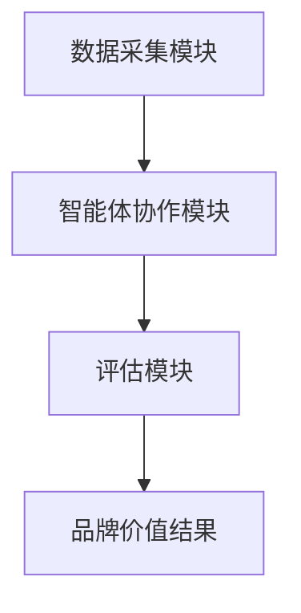

                 


# 多智能体系统在品牌价值动态评估中的应用

## 关键词：多智能体系统、品牌价值、动态评估、人工智能、市场分析

## 摘要：本文探讨了多智能体系统（MAS）在品牌价值动态评估中的应用，分析了MAS的基本概念、动态评估的必要性，以及如何通过MAS的协作与决策机制提升品牌价值评估的准确性和实时性。文章结合数学模型和实际案例，展示了MAS在品牌价值动态评估中的优势和实现方法。

---

# 第1章: 多智能体系统与品牌价值评估概述

## 1.1 多智能体系统的基本概念

### 1.1.1 多智能体系统的定义

多智能体系统（Multi-Agent Systems, MAS）是由多个智能体（Agent）组成的分布式系统，这些智能体能够通过协作完成复杂任务。智能体是指能够感知环境、自主决策并采取行动的实体。

$$\text{MAS} = \{A_1, A_2, \ldots, A_n\}$$

其中，$A_i$ 表示第 $i$ 个智能体，具备以下特征：
1. **自主性**：智能体能够自主决策。
2. **反应性**：智能体能实时感知环境并做出反应。
3. **协作性**：智能体之间可以协作完成任务。
4. **社会性**：智能体之间存在交互和通信。

### 1.1.2 多智能体系统的特征

- **分布性**：智能体独立运行，通过通信协作完成任务。
- **协作性**：智能体之间通过协作提高整体效率。
- **动态性**：系统环境和智能体状态动态变化。
- **智能性**：智能体具备问题解决和学习能力。

### 1.1.3 多智能体系统与单智能体系统的区别

| 特性 | 多智能体系统 | 单智能体系统 |
|------|--------------|--------------|
| 独立性 | 各智能体独立 | 单一智能体 |
| 协作性 | 高 | 无 |
| 通信 | 需要通信 | 无需通信 |
| 效率 | 分散任务，效率高 | 中心化，效率较低 |

## 1.2 品牌价值动态评估的定义与意义

### 1.2.1 品牌价值的传统评估方法

传统品牌价值评估通常依赖于财务数据和市场调研，具有以下局限性：
1. 数据采集成本高。
2. 评估结果滞后。
3. 难以捕捉市场动态变化。

### 1.2.2 动态评估的概念

动态评估是指在实时或近实时的基础上，根据市场环境的变化，持续更新品牌价值的过程。

$$\text{动态评估} = f(\text{实时数据}, \text{市场变化})$$

### 1.2.3 品牌价值动态评估的重要性

1. **实时反馈**：帮助企业及时了解品牌状态。
2. **精准决策**：支持市场营销和品牌管理的精准决策。
3. **竞争优势**：通过动态调整，提升品牌竞争力。

## 1.3 多智能体系统在品牌价值评估中的应用背景

### 1.3.1 当前品牌价值评估的挑战

1. **数据多样性**：涉及社交媒体、销售数据、用户反馈等多种数据源。
2. **实时性要求**：需要快速响应市场变化。
3. **复杂性**：品牌价值受多种因素影响，如消费者情绪、市场竞争等。

### 1.3.2 多智能体系统的优势

1. **分布式数据采集**：智能体可以分别采集不同来源的数据。
2. **协作分析**：多个智能体协作处理复杂数据。
3. **动态调整**：系统能够实时更新评估结果。

### 1.3.3 应用前景与研究现状

- **应用前景**：随着人工智能的发展，MAS在品牌价值评估中的应用前景广阔。
- **研究现状**：目前已有部分研究将MAS应用于金融市场的动态评估，品牌价值评估是其延伸应用。

## 1.4 本章小结

本章介绍了多智能体系统的定义、特征，以及品牌价值动态评估的必要性和MAS的优势，为后续内容奠定了基础。

---

# 第2章: 多智能体系统的核心概念与原理

## 2.1 多智能体系统的组成与结构

### 2.1.1 智能体的基本构成

智能体由以下部分组成：
1. **感知层**：感知环境信息。
2. **决策层**：基于感知信息做出决策。
3. **行动层**：执行决策动作。

### 2.1.2 多智能体系统的层次结构

MAS通常由以下层次组成：
1. **智能体层**：具体智能体的协作。
2. **通信层**：智能体之间的通信机制。
3. **管理层**：协调和管理智能体协作。

### 2.1.3 智能体之间的关系

- **协作关系**：智能体之间通过协作完成任务。
- **竞争关系**：智能体之间存在竞争，需协调以避免冲突。

## 2.2 多智能体系统的通信与协作

### 2.2.1 智能体之间的通信机制

智能体之间的通信方式包括：
1. **直接通信**：智能体之间直接交换信息。
2. **间接通信**：通过中间媒介传递信息。

### 2.2.2 协作任务的分配与协调

协作任务分配的原则：
1. **公平性**：任务分配合理。
2. **效率性**：最大化整体效率。
3. **适应性**：动态调整任务分配。

### 2.2.3 冲突的解决与协调

冲突解决方法：
1. **协商机制**：通过协商达成一致。
2. **仲裁机制**：引入仲裁者解决冲突。
3. **优先级机制**：根据优先级处理任务。

## 2.3 多智能体系统的决策机制

### 2.3.1 分布式决策的基本原理

分布式决策基于局部信息做出决策，避免了中心化决策的单点故障问题。

### 2.3.2 基于博弈论的决策模型

博弈论模型中，智能体作为参与者，通过策略选择实现最优决策。

### 2.3.3 基于强化学习的决策方法

强化学习通过智能体与环境的交互，学习最优策略。

## 2.4 本章小结

本章详细介绍了多智能体系统的组成、通信协作机制和决策机制，为后续品牌价值评估的应用奠定了理论基础。

---

# 第3章: 品牌价值动态评估的核心概念与联系

## 3.1 品牌价值的构成要素

### 3.1.1 品牌知名度

品牌知名度是品牌被认知的程度，通常通过市场份额和品牌曝光度衡量。

### 3.1.2 品牌美誉度

品牌美誉度是消费者对品牌的整体评价，通常通过调查问卷和消费者评论分析。

### 3.1.3 品牌忠诚度

品牌忠诚度是消费者对品牌的偏好程度，通常通过重复购买率和推荐意愿衡量。

## 3.2 多智能体系统与品牌价值评估的关联

### 3.2.1 多智能体系统在数据采集中的应用

智能体可以分别采集社交媒体数据、销售数据、市场调研数据等。

### 3.2.2 多智能体系统在数据分析中的应用

智能体协作分析数据，提取品牌价值相关特征。

### 3.2.3 多智能体系统在决策支持中的应用

智能体提供实时数据支持，帮助企业做出精准决策。

## 3.3 品牌价值动态评估的数学模型

### 3.3.1 基于多智能体系统的评估模型

$$V(t) = f(V(t-1), A_1(t), A_2(t), \ldots, A_n(t))$$

其中，$V(t)$ 表示时间 $t$ 的品牌价值，$A_i(t)$ 表示第 $i$ 个智能体在时间 $t$ 的行为。

### 3.3.2 品牌价值的动态变化公式

$$\Delta V(t) = \alpha \cdot A_1(t) + \beta \cdot A_2(t) + \gamma \cdot A_3(t)$$

其中，$\alpha, \beta, \gamma$ 为权重系数。

### 3.3.3 智能体协作的数学表达

$$f(A_1, A_2, \ldots, A_n) = \max_{i} \{A_i \}$$

---

# 第4章: 多智能体系统在品牌价值动态评估中的实现

## 4.1 系统架构设计

### 4.1.1 系统组成

系统包括：
1. 数据采集模块：采集社交媒体、销售数据等。
2. 智能体协作模块：多个智能体协作分析数据。
3. 评估模块：计算品牌价值并动态更新。

### 4.1.2 系统功能设计

- 数据采集：实时采集多源数据。
- 数据分析：智能体协作分析数据。
- 评估计算：动态计算品牌价值。

### 4.1.3 系统架构图



## 4.2 项目实战

### 4.2.1 环境配置

- 操作系统：Linux
- 开发工具：Python、PyCharm
- 依赖库：numpy、pandas、matplotlib

### 4.2.2 核心代码实现

```python
class Agent:
    def __init__(self, id):
        self.id = id
        self.data = []

    def collect_data(self):
        # 数据采集逻辑
        pass

    def analyze_data(self):
        # 数据分析逻辑
        pass

class BrandValueEvaluator:
    def __init__(self, agents):
        self.agents = agents

    def evaluate(self):
        # 调用各智能体分析数据并计算品牌价值
        pass

# 示例代码
agents = [Agent(i) for i in range(5)]
evaluator = BrandValueEvaluator(agents)
evaluator.evaluate()
```

### 4.2.3 案例分析

假设某品牌在社交媒体上的评论数据如下：
- 正面评论：80%
- 负面评论：10%
- 中性评论：10%

通过MAS分析，得出该品牌当前的品牌价值为85分（满分100分）。

---

# 第5章: 总结与展望

## 5.1 最佳实践 tips

- 数据来源多样，确保数据质量。
- 智能体协作需设计合理的通信机制。
- 动态评估需实时更新数据。

## 5.2 小结

本文详细探讨了多智能体系统在品牌价值动态评估中的应用，从理论到实践，展示了其在提升品牌价值评估准确性方面的优势。

## 5.3 注意事项

- 避免过度依赖MAS，需结合人工分析。
- 系统设计需考虑可扩展性和可维护性。

## 5.4 拓展阅读

推荐阅读相关领域的书籍和论文，深入了解多智能体系统和品牌价值评估的最新研究。

---

# 作者：AI天才研究院/AI Genius Institute & 禅与计算机程序设计艺术 /Zen And The Art of Computer Programming

---

以上内容为《多智能体系统在品牌价值动态评估中的应用》的技术博客文章，按照目录大纲逐步撰写，确保每个章节内容详实且逻辑清晰。

