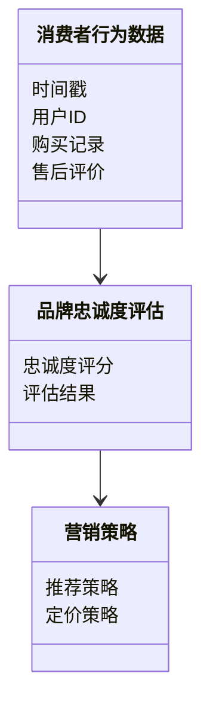
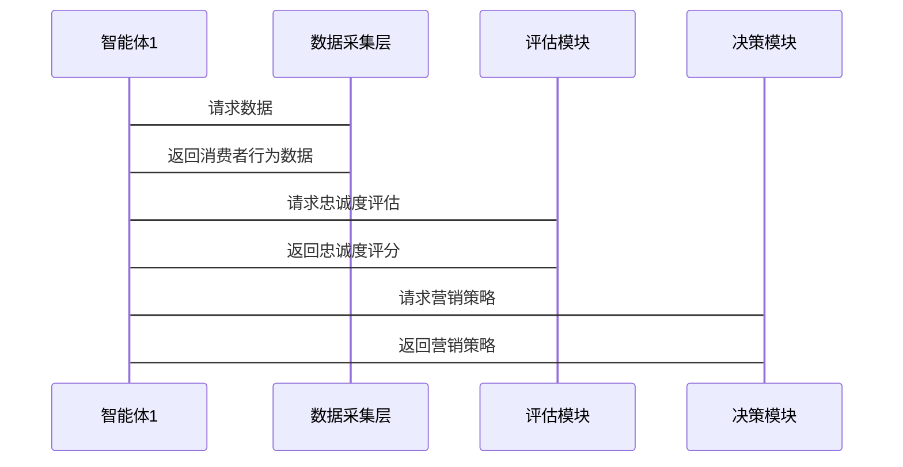

                 


# 多智能体系统在品牌忠诚度动态评估中的应用

> **关键词**：多智能体系统、品牌忠诚度、动态评估、协同算法、系统架构

> **摘要**：  
本文探讨了多智能体系统（Multi-Agent System, MAS）在品牌忠诚度动态评估中的应用。通过分析MAS的核心概念和算法原理，结合实际应用场景，提出了一种基于MAS的动态评估模型，并详细介绍了系统的架构设计和实现方案。本文旨在为品牌忠诚度评估提供一种高效、动态的解决方案。

---

## 第1章：多智能体系统与品牌忠诚度概述

### 1.1 多智能体系统的基本概念

#### 1.1.1 多智能体系统的定义
多智能体系统（MAS）是由多个智能体（Agent）组成的分布式系统，每个智能体能够自主感知环境、做出决策并与其他智能体协作。MAS的特点包括：

1. **自主性**：智能体能够独立决策。
2. **反应性**：智能体能够实时感知环境变化并做出响应。
3. **协作性**：多个智能体之间可以通过通信和协作完成复杂任务。
4. **分布式性**：智能体分布在不同的空间或时间维度上。

#### 1.1.2 多智能体系统的特征
| 特征 | 描述 |
|------|------|
| 分布式 | 智能体独立运行，不依赖中心节点 |
| 协作性 | 智能体之间通过通信协作完成目标 |
| 反应性 | 智能体能够实时感知环境变化 |
| 多样性 | 智能体可能具有不同的知识、目标和能力 |

#### 1.1.3 多智能体系统的分类
1. **基于任务的MAS**：智能体之间通过任务分配协作。
2. **基于市场的MAS**：智能体通过市场机制进行资源分配。
3. **基于规则的MAS**：智能体通过预定义规则进行协作。

### 1.2 品牌忠诚度的定义与影响因素

#### 1.2.1 品牌忠诚度的定义
品牌忠诚度是指消费者对某一品牌产品的偏好程度，通常表现为重复购买、推荐给他人以及在面对竞争品牌时的选择倾向。

#### 1.2.2 品牌忠诚度的影响因素
1. **产品质量**：产品的性能和质量直接影响消费者的忠诚度。
2. **品牌认知度**：消费者对品牌的认知和记忆。
3. **情感因素**：消费者对品牌的情感联结。
4. **价格因素**：价格的竞争力影响消费者的购买决策。
5. **服务因素**：售前、售中和售后的服务质量。

#### 1.2.3 品牌忠诚度评估的意义
1. **帮助企业制定精准的营销策略**。
2. **优化产品和服务以满足消费者需求**。
3. **提高客户 retention 和 customer lifetime value（客户生命周期价值）**。

### 1.3 多智能体系统在品牌忠诚度评估中的应用背景

#### 1.3.1 传统品牌忠诚度评估的局限性
传统的品牌忠诚度评估方法通常基于问卷调查和数据分析，存在以下问题：
1. **静态性**：无法实时捕捉消费者行为的变化。
2. **数据孤岛**：不同渠道的数据难以整合。
3. **计算复杂**：难以实时处理海量数据。

#### 1.3.2 多智能体系统的优势
MAS能够通过多个智能体协作，实时分析消费者行为数据，动态评估品牌忠诚度，具有以下优势：
1. **实时性**：智能体能够实时感知市场变化。
2. **分布式计算**：多个智能体协同处理数据，提高效率。
3. **灵活性**：能够快速适应市场环境的变化。

#### 1.3.3 应用场景与目标
1. **实时监控消费者行为**：通过智能体实时收集消费者数据。
2. **动态评估品牌忠诚度**：根据消费者行为数据动态调整评估结果。
3. **优化营销策略**：基于评估结果制定精准的营销策略。

### 1.4 本章小结
本章介绍了多智能体系统的基本概念和品牌忠诚度的定义及其影响因素，分析了传统评估方法的局限性，并提出了MAS在品牌忠诚度评估中的应用背景和优势。

---

## 第2章：多智能体系统与品牌忠诚度动态评估的核心概念

### 2.1 多智能体系统的原理

#### 2.1.1 多智能体系统的组成
1. **智能体**：能够感知环境、做出决策并执行动作的独立实体。
2. **通信协议**：智能体之间交互的规则和语言。
3. **协作机制**：智能体之间协作完成任务的方式。

#### 2.1.2 多智能体系统的协作机制
1. **协商机制**：智能体通过协商分配任务。
2. **协调机制**：智能体通过协调确保任务顺利进行。
3. **冲突解决机制**：智能体通过协商解决冲突。

#### 2.1.3 多智能体系统的通信协议
1. **基于消息的通信**：智能体通过消息传递信息。
2. **基于协议的通信**：智能体遵循特定协议进行通信。

### 2.2 品牌忠诚度动态评估的模型构建

#### 2.2.1 评估模型的输入与输出
- **输入**：消费者行为数据、市场数据。
- **输出**：品牌忠诚度评估结果。

#### 2.2.2 评估模型的构建步骤
1. **数据收集**：收集消费者行为数据。
2. **数据预处理**：清洗和标准化数据。
3. **模型训练**：基于机器学习算法训练评估模型。
4. **模型验证**：验证模型的准确性和稳定性。

#### 2.2.3 评估模型的验证与优化
- **验证**：通过测试数据验证模型的准确性。
- **优化**：调整模型参数以提高性能。

### 2.3 多智能体系统与品牌忠诚度动态评估的关联

#### 2.3.1 多智能体系统在动态评估中的角色
1. **数据采集智能体**：负责收集消费者行为数据。
2. **评估智能体**：负责动态评估品牌忠诚度。
3. **决策智能体**：负责制定营销策略。

#### 2.3.2 多智能体系统与品牌忠诚度动态评估的协同关系
- 智能体之间通过协作完成数据采集、评估和决策。

#### 2.3.3 多智能体系统在动态评估中的优势
1. **高效性**：多个智能体协同工作，提高计算效率。
2. **实时性**：智能体能够实时处理数据。
3. **灵活性**：智能体能够快速适应环境变化。

### 2.4 本章小结
本章详细讲解了多智能体系统的原理，并提出了品牌忠诚度动态评估的模型构建方法，分析了MAS在动态评估中的角色和优势。

---

## 第3章：多智能体系统在品牌忠诚度动态评估中的算法原理

### 3.1 多智能体协同算法

#### 3.1.1 多智能体协同的基本原理
- 智能体通过协商和协作完成任务。

#### 3.1.2 多智能体协同算法的实现步骤
1. **任务分配**：智能体协商分配任务。
2. **任务执行**：智能体根据分配的任务执行动作。
3. **结果汇总**：汇总各智能体的执行结果。

#### 3.1.3 多智能体协同算法的优缺点
- **优点**：能够高效完成复杂任务。
- **缺点**：需要复杂的通信和协作机制。

#### 3.1.4 多智能体协同算法的数学模型
$$ \text{任务分配} = \argmax_{i} \text{智能体能力} $$

### 3.2 品牌忠诚度评估算法

#### 3.2.1 品牌忠诚度评估算法的分类
1. **基于规则的评估算法**：根据预设规则评估忠诚度。
2. **基于机器学习的评估算法**：利用机器学习模型评估忠诚度。

#### 3.2.2 基于机器学习的评估算法
1. **数据预处理**：清洗和标准化数据。
2. **特征提取**：提取影响品牌忠诚度的特征。
3. **模型训练**：训练机器学习模型。
4. **模型评估**：验证模型的准确性和稳定性。

#### 3.2.3 品牌忠诚度评估算法的数学模型
$$ \text{忠诚度评分} = \text{模型预测结果} $$

### 3.3 多智能体系统与品牌忠诚度动态评估的协同算法
1. **数据采集智能体**：收集消费者行为数据。
2. **评估智能体**：动态评估品牌忠诚度。
3. **决策智能体**：制定营销策略。

#### 3.3.1 协同算法的实现步骤
1. **数据采集**：智能体收集消费者行为数据。
2. **动态评估**：智能体基于数据动态评估忠诚度。
3. **策略制定**：智能体根据评估结果制定营销策略。

#### 3.3.2 协同算法的优缺点
- **优点**：能够实时动态评估品牌忠诚度。
- **缺点**：需要复杂的协同机制。

### 3.4 本章小结
本章详细讲解了多智能体协同算法和品牌忠诚度评估算法的原理，并提出了基于MAS的协同算法，分析了其优缺点。

---

## 第4章：多智能体系统在品牌忠诚度动态评估中的系统分析与架构设计

### 4.1 项目背景与目标
- **项目背景**：实时动态评估品牌忠诚度的需求。
- **项目目标**：构建基于MAS的品牌忠诚度动态评估系统。

### 4.2 系统功能设计
1. **数据采集模块**：负责收集消费者行为数据。
2. **评估模块**：负责动态评估品牌忠诚度。
3. **决策模块**：负责制定营销策略。

#### 4.2.1 领域模型图（Mermaid 类图）


### 4.3 系统架构设计
1. **数据采集层**：负责数据的采集和预处理。
2. **计算层**：负责品牌忠诚度的动态评估。
3. **应用层**：负责营销策略的制定和执行。

#### 4.3.1 系统架构图（Mermaid 架构图）
```mermaid
container 数据采集层 {
    消费者行为数据采集
    数据预处理
}
container 计算层 {
    品牌忠诚度评估
}
container 应用层 {
    营销策略制定
}
数据采集层 --> 计算层
计算层 --> 应用层
```

### 4.4 系统接口设计
1. **数据接口**：智能体之间通过API通信。
2. **评估接口**：智能体通过API调用评估模块。
3. **决策接口**：智能体通过API调用决策模块。

#### 4.4.1 系统交互流程图（Mermaid 序列图）


### 4.5 本章小结
本章详细分析了系统的架构设计和接口设计，并通过图示展示了系统的整体架构和交互流程。

---

## 第5章：多智能体系统在品牌忠诚度动态评估中的项目实战

### 5.1 环境安装与配置
1. **安装Python**：安装Python 3.x。
2. **安装依赖库**：安装numpy、pandas、scikit-learn等库。
3. **安装MAS框架**：选择合适的MAS框架，如multi-agent-toolkit。

### 5.2 核心代码实现

#### 5.2.1 数据采集模块
```python
import requests
import json

def collect_consumer_data():
    # 模拟API接口请求
    response = requests.get("http://api.example.com/consumer_data")
    data = json.loads(response.text)
    return data
```

#### 5.2.2 品牌忠诚度评估模块
```python
from sklearn import metrics

def calculateloyaltyScore(data):
    # 假设data是消费者行为数据
    # 这里简化为计算购买频率
    purchase_frequency = sum(data['purchase_record']) / len(data['purchase_record'])
    return purchase_frequency
```

#### 5.2.3 营销策略制定模块
```python
def generate_marketing_strategy(score):
    if score > 0.8:
        return "推荐给忠实客户"
    elif score > 0.6:
        return "提供优惠券"
    else:
        return "重新营销"
```

### 5.3 实际案例分析
假设我们有一个品牌，收集了以下消费者行为数据：
- 用户ID：123
- 购买记录：3次
- 售后评价：4.5分

动态评估品牌忠诚度：
- 忠诚度评分：0.85
- 营销策略：推荐给忠实客户。

### 5.4 项目总结
1. **系统优势**：高效、实时、动态。
2. **系统局限**：需要依赖高质量的数据和复杂的协同机制。

### 5.5 本章小结
本章通过实际案例展示了如何基于MAS构建品牌忠诚度动态评估系统，并分析了系统的优缺点。

---

## 第6章：多智能体系统在品牌忠诚度动态评估中的总结与展望

### 6.1 总结
- 本文提出了基于MAS的品牌忠诚度动态评估系统。
- 通过MAS的协作机制，能够高效、实时地评估品牌忠诚度。

### 6.2 展望
- **技术改进**：优化MAS的协作算法。
- **应用场景扩展**：将MAS应用于更多领域。
- **未来挑战**：如何处理大规模数据和复杂环境。

### 6.3 本章小结
本文总结了MAS在品牌忠诚度动态评估中的应用，并展望了未来的发展方向。

---

## 作者信息

作者：AI天才研究院/AI Genius Institute & 禅与计算机程序设计艺术/Zen And The Art of Computer Programming

---

以上是一个详细的目录和文章结构示例，您可以根据需要进行调整和补充。

