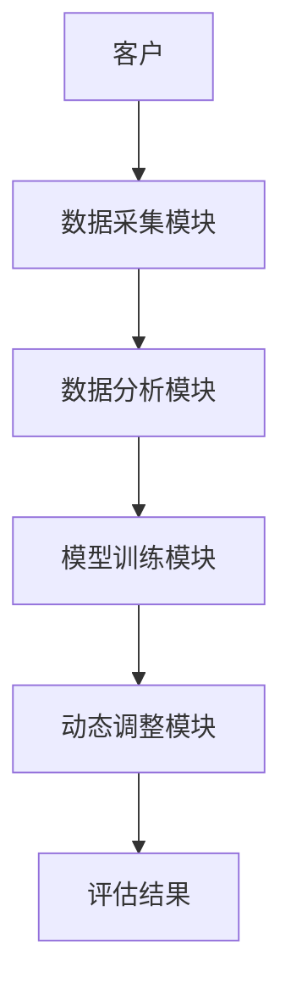
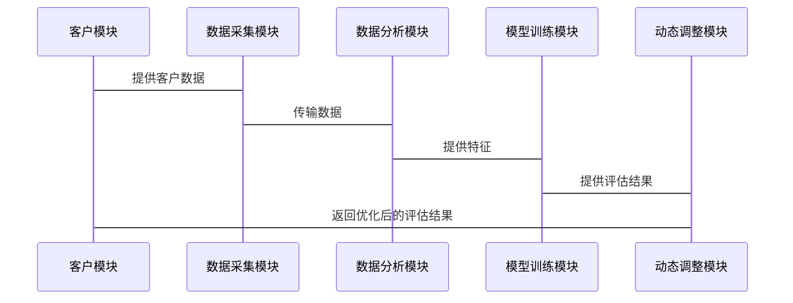

                 


# 多智能体系统在品牌忠诚度评估中的应用：客户价值量化

---

## 关键词：
多智能体系统, 品牌忠诚度, 客户价值量化, 人工智能, 数据分析, 系统架构

---

## 摘要：
本文深入探讨了多智能体系统在品牌忠诚度评估中的应用，重点分析了如何利用多智能体系统实现客户价值的量化。通过结合多智能体系统的协作性和实时性特点，本文提出了一种创新的品牌忠诚度评估方法，能够从多维度、动态化地分析客户行为和反馈，从而帮助企业更精准地识别高价值客户，优化客户关系管理。文章内容涵盖多智能体系统的基本概念、品牌忠诚度评估的核心理论、系统架构设计、算法实现以及实际案例分析，旨在为企业提供一种高效的品牌忠诚度评估和客户价值量化解决方案。

---

# 第一部分: 多智能体系统与品牌忠诚度评估基础

## 第1章: 多智能体系统概述

### 1.1 多智能体系统的基本概念

#### 1.1.1 多智能体系统的定义
多智能体系统（Multi-Agent System, MAS）是由多个智能体组成的分布式系统，每个智能体都是能够感知环境、自主决策并与其他智能体协作的实体。多智能体系统的核心在于智能体之间的通信与协作，以实现共同目标。

#### 1.1.2 多智能体系统的特征
- **自主性**：智能体能够自主决策。
- **反应性**：智能体能够实时感知环境并做出反应。
- **协作性**：智能体之间能够通过通信和协作完成复杂任务。
- **分布性**：智能体分布在不同的空间或时间段。

#### 1.1.3 多智能体系统的分类
- **基于任务的分类**：根据任务需求可分为协调型、竞争型等。
- **基于智能体类型的分类**：可分为简单智能体、复杂智能体等。
- **基于应用场景的分类**：可分为商业、金融、物流等领域的多智能体系统。

### 1.2 多智能体系统的组成与架构

#### 1.2.1 多智能体系统的组成要素
- **智能体**：系统的基本单元，负责执行具体任务。
- **通信机制**：智能体之间交换信息的通道。
- **协作机制**：智能体之间协同工作的规则。
- **环境**：智能体所处的外部环境，可能是虚拟或物理环境。

#### 1.2.2 多智能体系统的通信机制
- **消息传递**：通过消息传递实现智能体之间的信息交换。
- **协议规范**：定义通信的格式和规则。
- **中间件支持**：通过中间件实现智能体之间的高效通信。

#### 1.2.3 多智能体系统的协作机制
- **任务分配**：根据智能体的能力分配任务。
- **协调与冲突解决**：通过协商和仲裁机制解决协作中的冲突。
- **反馈与优化**：根据协作结果动态调整协作策略。

### 1.3 多智能体系统的应用领域

#### 1.3.1 多智能体系统在商业中的应用
- **客户关系管理**：通过多智能体系统实现客户行为分析和个性化服务。
- **市场预测**：利用多智能体系统分析市场趋势和竞争对手行为。
- **供应链管理**：通过多智能体系统优化供应链协作和资源分配。

#### 1.3.2 多智能体系统在金融中的应用
- **金融交易**：通过多智能体系统实现高频交易和风险控制。
- **信用评估**：利用多智能体系统分析客户的信用状况。
- **投资决策**：通过多智能体系统提供投资建议和市场分析。

#### 1.3.3 多智能体系统在物流中的应用
- **路径优化**：通过多智能体系统实现物流路径的动态优化。
- **资源分配**：利用多智能体系统优化运输资源的分配。
- **实时监控**：通过多智能体系统实现物流过程的实时监控。

## 第2章: 品牌忠诚度评估概述

### 2.1 品牌忠诚度的定义与分类

#### 2.1.1 品牌忠诚度的定义
品牌忠诚度是指消费者对某一品牌产品的偏好程度，通常表现为重复购买、推荐他人以及对品牌负面信息的心理承受能力。

#### 2.1.2 品牌忠诚度的分类
- **基于行为的分类**：分为情感忠诚、价格忠诚和方便忠诚。
- **基于态度的分类**：分为理性忠诚和感性忠诚。
- **基于阶段的分类**：分为新客户、潜在忠诚客户和忠诚客户。

### 2.2 品牌忠诚度评估的方法

#### 2.2.1 基于问卷调查的评估方法
- **问卷设计**：通过设计问卷收集客户对品牌的看法和态度。
- **数据收集**：通过问卷调查收集客户数据。
- **数据分析**：利用统计方法分析问卷数据，评估品牌忠诚度。

#### 2.2.2 基于行为分析的评估方法
- **购买行为分析**：通过分析客户的购买记录，评估客户的忠诚度。
- **消费频率分析**：通过分析客户的消费频率，评估客户的忠诚度。
- **客户生命周期分析**：通过分析客户的生命周期，评估客户的忠诚度。

#### 2.2.3 基于数据挖掘的评估方法
- **关联规则挖掘**：通过关联规则挖掘，发现客户的购买行为模式。
- **聚类分析**：通过聚类分析，将客户分为不同的群体，评估品牌忠诚度。
- **分类分析**：通过分类分析，预测客户是否忠诚。

### 2.3 品牌忠诚度评估的挑战与机遇

#### 2.3.1 传统评估方法的局限性
- **数据单一性**：传统评估方法通常依赖于问卷调查，数据来源单一。
- **动态性不足**：传统评估方法难以捕捉客户行为的动态变化。
- **成本高**：传统评估方法通常需要大量的人力和时间，成本较高。

#### 2.3.2 数据驱动评估的优势
- **数据全面性**：数据驱动评估方法能够利用多源数据，全面分析客户行为。
- **动态性**：数据驱动评估方法能够实时捕捉客户行为的变化，动态评估品牌忠诚度。
- **成本低**：数据驱动评估方法可以通过自动化工具和技术，降低评估成本。

#### 2.3.3 技术进步带来的新机遇
- **人工智能技术**：人工智能技术的应用，使得品牌忠诚度评估更加精准和高效。
- **大数据技术**：大数据技术的应用，使得品牌忠诚度评估能够处理海量数据。
- **多智能体技术**：多智能体技术的应用，使得品牌忠诚度评估能够实现多维度的分析和协作。

---

## 第三部分: 多智能体系统在品牌忠诚度评估中的应用

## 第3章: 多智能体系统与客户价值量化

### 3.1 客户价值的定义与量化方法

#### 3.1.1 客户价值的定义
客户价值是指客户对企业产品或服务的感知价值，通常包括功能价值、情感价值和社会价值。

#### 3.1.2 客户价值的量化指标
- **购买频率**：客户在一定时间内的购买次数。
- **购买金额**：客户每次购买的金额。
- **客户生命周期价值**：客户在生命周期内为企业带来的总价值。
- **客户满意度**：客户对产品或服务的满意度。
- **客户忠诚度**：客户对品牌的忠诚度。

#### 3.1.3 客户价值与品牌忠诚度的关系
客户价值与品牌忠诚度密切相关。高价值客户通常具有较高的品牌忠诚度，而高忠诚度客户通常为企业创造更高的价值。

### 3.2 多智能体系统在客户价值量化中的作用

#### 3.2.1 多智能体系统如何提升客户价值评估的准确性
多智能体系统能够通过多个智能体的协作，从多个维度收集和分析客户数据，从而提高客户价值评估的准确性。

#### 3.2.2 多智能体系统如何优化客户价值的动态分析
多智能体系统能够实时感知客户行为的变化，动态调整客户价值评估模型，从而优化客户价值的动态分析。

#### 3.2.3 多智能体系统如何支持客户价值的预测与优化
多智能体系统能够通过预测模型，预测客户未来的行为，从而帮助企业优化客户价值管理。

## 第4章: 多智能体系统与品牌忠诚度评估的结合

### 4.1 多智能体系统在品牌忠诚度评估中的优势

#### 4.1.1 多智能体系统能够实现多维度的数据分析
多智能体系统能够从多个维度收集客户数据，包括购买行为、消费习惯、客户反馈等，从而实现全面的品牌忠诚度评估。

#### 4.1.2 多智能体系统能够支持实时的动态评估
多智能体系统能够实时感知客户行为的变化，动态调整评估模型，从而实现品牌忠诚度的实时评估。

#### 4.1.3 多智能体系统能够提供个性化的评估方案
多智能体系统能够根据客户的个性化需求，提供个性化的评估方案，从而提高评估的精准性和客户满意度。

### 4.2 多智能体系统在品牌忠诚度评估中的具体应用

#### 4.2.1 基于多智能体系统的客户行为分析
多智能体系统能够通过分析客户的购买记录、消费频率、消费金额等行为数据，评估客户的忠诚度。

#### 4.2.2 基于多智能体系统的客户反馈处理
多智能体系统能够通过分析客户的反馈和评论，评估客户对品牌的满意度和忠诚度。

#### 4.2.3 基于多智能体系统的客户价值预测
多智能体系统能够通过分析客户的消费行为和市场趋势，预测客户未来的行为，从而优化品牌忠诚度评估。

## 第5章: 多智能体系统在品牌忠诚度评估中的算法实现

### 5.1 基于多智能体系统的品牌忠诚度评估算法

#### 5.1.1 算法的基本原理
多智能体系统通过分布式协作和通信，实现对客户行为和反馈的实时分析，从而评估品牌忠诚度。

#### 5.1.2 算法实现步骤
1. **数据收集**：通过多个智能体收集客户数据，包括购买记录、消费行为、客户反馈等。
2. **数据分析**：利用数据分析算法，分析客户数据，提取特征。
3. **模型训练**：通过机器学习算法，训练品牌忠诚度评估模型。
4. **动态调整**：根据实时数据，动态调整评估模型，优化评估结果。

### 5.2 算法实现的数学模型

#### 5.2.1 客户价值评估模型
客户价值 = 购买频率 × 购买金额 × 客户生命周期价值

#### 5.2.2 品牌忠诚度评估模型
品牌忠诚度 = 客户满意度 × 客户价值 × 市场竞争力

### 5.3 算法实现的代码示例

```python
import numpy as np
from sklearn.cluster import KMeans

# 数据预处理
data = [...]  # 客户数据

# 模型训练
kmeans = KMeans(n_clusters=3, random_state=0)
clusters = kmeans.fit_predict(data)

# 评估结果
clusters  # 返回客户群体划分结果
```

---

## 第六部分: 系统分析与架构设计方案

## 第6章: 系统架构设计

### 6.1 系统功能设计

#### 6.1.1 系统功能模块
- **数据采集模块**：负责采集客户数据，包括购买记录、消费行为、客户反馈等。
- **数据分析模块**：负责对客户数据进行分析，提取特征。
- **模型训练模块**：负责训练品牌忠诚度评估模型。
- **动态调整模块**：负责根据实时数据，动态调整评估模型。

#### 6.1.2 系统功能流程
1. 数据采集模块收集客户数据。
2. 数据分析模块对客户数据进行分析，提取特征。
3. 模型训练模块利用提取的特征，训练品牌忠诚度评估模型。
4. 动态调整模块根据实时数据，动态调整评估模型，优化评估结果。

### 6.2 系统架构设计

#### 6.2.1 系统架构图


#### 6.2.2 系统组件设计
- **客户模块**：负责与客户交互，收集客户数据。
- **数据采集模块**：负责采集客户数据，包括购买记录、消费行为、客户反馈等。
- **数据分析模块**：负责对客户数据进行分析，提取特征。
- **模型训练模块**：负责训练品牌忠诚度评估模型。
- **动态调整模块**：负责根据实时数据，动态调整评估模型，优化评估结果。

### 6.3 系统接口设计

#### 6.3.1 系统接口定义
- **数据接口**：定义数据采集模块与数据分析模块之间的数据接口。
- **模型接口**：定义模型训练模块与动态调整模块之间的模型接口。

#### 6.3.2 系统交互流程
1. 客户模块与数据采集模块交互，收集客户数据。
2. 数据采集模块与数据分析模块交互，分析客户数据。
3. 数据分析模块与模型训练模块交互，训练品牌忠诚度评估模型。
4. 模型训练模块与动态调整模块交互，动态调整评估模型，优化评估结果。

### 6.4 系统交互设计

#### 6.4.1 系统交互流程图


---

## 第七部分: 项目实战与案例分析

## 第7章: 项目实战

### 7.1 项目背景与目标

#### 7.1.1 项目背景
某电商平台希望通过多智能体系统实现客户价值量化，优化客户关系管理，提高品牌忠诚度。

#### 7.1.2 项目目标
- 实现客户行为分析。
- 实现品牌忠诚度评估。
- 优化客户价值管理。

### 7.2 项目核心实现

#### 7.2.1 数据采集模块实现
```python
import requests

def collect_data(customer_id):
    # 收集客户数据
    response = requests.get(f"http://api.example.com/customer/{customer_id}")
    return response.json()
```

#### 7.2.2 数据分析模块实现
```python
from sklearn.preprocessing import StandardScaler

def analyze_data(data):
    scaler = StandardScaler()
    scaled_data = scaler.fit_transform(data)
    return scaled_data
```

#### 7.2.3 模型训练模块实现
```python
from sklearn.svm import SVC

def train_model(data):
    model = SVC()
    model.fit(data)
    return model
```

### 7.3 项目案例分析

#### 7.3.1 案例背景
某电商平台收集了10000名客户的购买记录和消费行为，希望通过多智能体系统实现品牌忠诚度评估。

#### 7.3.2 数据分析与模型训练
```python
import numpy as np
from sklearn.cluster import KMeans

# 数据预处理
data = [...]  # 客户数据

# 模型训练
kmeans = KMeans(n_clusters=3, random_state=0)
clusters = kmeans.fit_predict(data)

# 评估结果
clusters  # 返回客户群体划分结果
```

#### 7.3.3 项目小结
通过多智能体系统的应用，某电商平台成功实现了客户价值量化，优化了客户关系管理，提高了品牌忠诚度。

---

## 第八部分: 最佳实践与总结

## 第8章: 最佳实践与总结

### 8.1 最佳实践 tips

#### 8.1.1 数据质量
- 确保数据的准确性和完整性。
- 处理缺失值和异常值。

#### 8.1.2 系统架构
- 确保系统架构的可扩展性和可维护性。
- 定期优化系统架构，适应业务需求的变化。

#### 8.1.3 算法选择
- 根据具体需求选择合适的算法。
- 定期更新算法模型，提高评估精度。

### 8.2 项目小结

#### 8.2.1 项目成果
通过多智能体系统的应用，实现了客户价值量化，优化了客户关系管理，提高了品牌忠诚度。

#### 8.2.2 项目经验
- 多智能体系统的协作性和实时性是实现品牌忠诚度评估的关键。
- 数据分析和模型训练是项目成功的核心。
- 系统架构设计和接口设计是项目实施的基础。

### 8.3 项目总结

#### 8.3.1 项目意义
多智能体系统在品牌忠诚度评估中的应用，为客户价值量化提供了一种高效、动态的解决方案。

#### 8.3.2 未来展望
随着人工智能和大数据技术的不断发展，多智能体系统在品牌忠诚度评估中的应用将更加广泛和深入。

---

## 作者信息

作者：AI天才研究院/AI Genius Institute & 禅与计算机程序设计艺术 /Zen And The Art of Computer Programming

---

# 完

