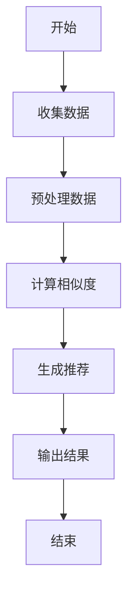
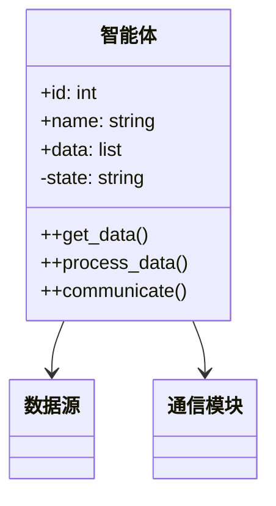
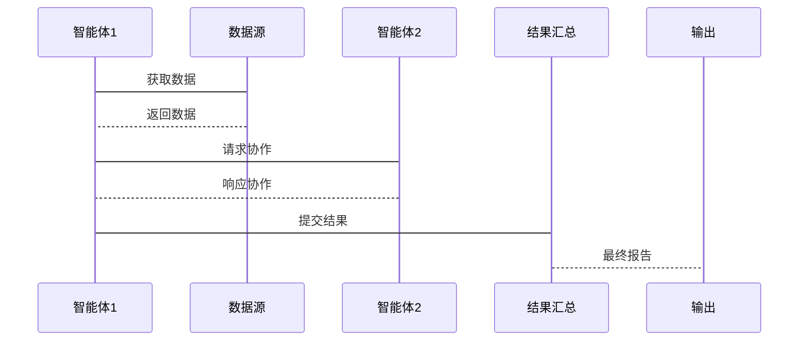

                 


# 多智能体系统在品牌资产评估中的应用：量化品牌价值

> **关键词**：多智能体系统、品牌资产评估、量化品牌价值、协同过滤、社会网络分析、数学模型

> **摘要**：  
本文探讨了多智能体系统在品牌资产评估中的应用，重点分析了如何通过多智能体系统量化品牌价值。文章首先介绍了多智能体系统的基本概念及其在品牌资产评估中的重要性，随后详细讲解了多智能体系统的协同机制、算法原理以及其在品牌价值量化中的具体应用。通过实际案例分析和系统设计，展示了如何利用多智能体系统构建高效的 brand value 评估模型，为品牌价值的科学量化提供了新的思路和方法。

---

## 第一部分: 多智能体系统与品牌资产评估基础

### 第1章: 多智能体系统与品牌资产评估概述

#### 1.1 多智能体系统的基本概念

##### 1.1.1 多智能体系统的定义
多智能体系统（Multi-Agent Systems，MAS）是由多个智能体（Agent）组成的分布式系统，这些智能体通过协同合作完成特定任务。智能体是具有感知、决策、执行能力的实体，可以是软件程序或物理设备。

##### 1.1.2 多智能体系统的特征
- **自主性**：智能体能够自主决策。
- **反应性**：能够实时感知环境并做出反应。
- **协作性**：多个智能体协同完成任务。
- **分布性**：智能体分布在不同的位置，通过通信完成协作。

##### 1.1.3 多智能体系统与传统单智能体系统的区别
| 特性 | 单智能体系统 | 多智能体系统 |
|------|--------------|--------------|
| 结构  | 单一中心     | 分布式       |
| 协作  | 无           | 高           |
| 可扩展性 | 低         | 高           |

#### 1.2 品牌资产评估的核心概念

##### 1.2.1 品牌价值的定义
品牌价值是指品牌在市场中的影响力和盈利能力，通常通过品牌知名度、消费者忠诚度、市场表现等指标来衡量。

##### 1.2.2 品牌资产评估的关键指标
- **市场表现**：销售额、市场份额。
- **消费者认知**：品牌知名度、美誉度。
- **品牌情感**：消费者对品牌的喜好和情感态度。

##### 1.2.3 品牌资产评估的挑战与难点
- 数据复杂性：涉及多维度数据，难以整合。
- 动态性：市场环境和消费者行为不断变化。
- 主观性：品牌价值的评估受主观因素影响较大。

#### 1.3 多智能体系统在品牌资产评估中的应用背景

##### 1.3.1 传统品牌资产评估方法的局限性
- 传统方法通常依赖主观评分，难以量化。
- 数据来源单一，缺乏动态分析。

##### 1.3.2 多智能体系统的优势
- 能够处理多维度数据，提供全面评估。
- 具备实时分析能力，适应市场变化。

##### 1.3.3 多智能体系统在品牌资产评估中的应用场景
- 数据采集与分析。
- 品牌间对比与预测。
- 动态评估与实时反馈。

---

### 第2章: 多智能体系统的核心原理

#### 2.1 多智能体系统的组成与结构

##### 2.1.1 智能体的定义与分类
- **智能体定义**：能够感知环境并采取行动的实体。
- **分类**：基于智能体的智能水平，分为反应式智能体和认知式智能体。

##### 2.1.2 多智能体系统的层次结构
- **物理层**：智能体与环境的交互。
- **通信层**：智能体之间的信息交换。
- **逻辑层**：智能体的决策与协作。

##### 2.1.3 智能体之间的交互机制
- **通信**：通过消息传递实现信息共享。
- **协作**：通过任务分配和协同完成目标。

#### 2.2 多智能体系统的协同与通信

##### 2.2.1 协同机制的定义
协同机制是指智能体之间通过合作完成任务的方式。

##### 2.2.2 通信协议的作用
- 确保智能体之间信息的准确传递。
- 规定通信格式和规则。

##### 2.2.3 协同决策的过程
1. **信息收集**：智能体感知环境并收集数据。
2. **信息共享**：通过通信协议共享信息。
3. **决策制定**：基于共享信息制定协作计划。

#### 2.3 多智能体系统的算法基础

##### 2.3.1 基础算法简介
- **分布式计算**：任务分解到多个智能体完成。
- **协同过滤**：基于用户行为推荐相似品牌。

##### 2.3.2 群智算法的原理
- 群智算法通过多个智能体的协作完成复杂任务。

##### 2.3.3 分布式计算的应用
- 分布式计算在多智能体系统中用于任务分配和资源管理。

---

### 第3章: 品牌资产评估的数学模型与方法

#### 3.1 品牌价值的量化指标

##### 3.1.1 市场表现指标
- 销售额、市场份额、增长率。

##### 3.1.2 消费者认知指标
- 品牌知名度、美誉度、消费者忠诚度。

##### 3.1.3 品牌情感指标
- 情感分析结果、社交媒体互动量。

#### 3.2 品牌资产评估的数学模型

##### 3.2.1 协同过滤算法
协同过滤算法通过分析用户行为推荐相似品牌，公式如下：
$$ sim(i,j) = \frac{\sum_{k=1}^n (r_{ik} - \bar{r_i})(r_{jk} - \bar{r_j})}{\sqrt{\sum_{k=1}^n (r_{ik} - \bar{r_i})^2} \sqrt{\sum_{k=1}^n (r_{jk} - \bar{r_j})^2}}} $$

##### 3.2.2 社会网络分析
通过分析社交媒体数据，计算品牌的情感指数：
$$ \text{情感指数} = \frac{\text{正面评论数} - \text{负面评论数}}{\text{总评论数}} $$

##### 3.2.3 综合评估模型
综合模型将多维度数据融合，公式如下：
$$ \text{品牌价值} = \alpha \cdot \text{市场表现} + \beta \cdot \text{消费者认知} + \gamma \cdot \text{品牌情感} $$

#### 3.3 品牌资产评估的算法实现

##### 3.3.1 算法流程图


##### 3.3.2 算法实现的代码示例
```python
import numpy as np

def cosine_similarity(matrix):
    normalized = matrix / np.linalg.norm(matrix, axis=1)[:, np.newaxis]
    return np.dot(normalized, normalized.T)

# 示例数据
data = np.array([[1, 2, 3], [4, 5, 6], [7, 8, 9]])
similarity_matrix = cosine_similarity(data)
print(similarity_matrix)
```

##### 3.3.3 算法的优化与改进
- 使用分布式计算优化性能。
- 引入实时数据流处理。

---

## 第二部分: 系统分析与架构设计

### 第4章: 系统分析与架构设计方案

#### 4.1 问题场景介绍
品牌资产评估系统需要处理多源数据，包括销售数据、社交媒体数据等。

#### 4.2 项目介绍
本项目旨在构建一个多智能体系统，用于量化品牌价值。

#### 4.3 系统功能设计

##### 4.3.1 领域模型


#### 4.4 系统架构设计

##### 4.4.1 系统架构图


#### 4.5 系统接口设计

##### 4.5.1 接口描述
- 数据输入接口：接收品牌相关数据。
- 通信接口：智能体之间的信息交换。

##### 4.5.2 交互序列图


---

## 第三部分: 项目实战

### 第5章: 项目实战

#### 5.1 环境安装

##### 5.1.1 系统要求
- Python 3.8+
- NumPy、Pandas库

##### 5.1.2 安装步骤
```bash
pip install numpy pandas
```

#### 5.2 核心代码实现

##### 5.2.1 数据预处理代码
```python
import pandas as pd

data = pd.read_csv('brand_data.csv')
preprocessed_data = data.dropna().normalize()
```

##### 5.2.2 协同过滤算法实现
```python
def collaborative_filtering(matrix):
    return cosine_similarity(matrix)

similarity_matrix = collaborative_filtering(preprocessed_data)
```

#### 5.3 代码解读与分析
- 数据预处理：清洗数据并标准化。
- 协同过滤：计算品牌间的相似度。

#### 5.4 案例分析
以具体品牌为例，展示系统如何量化其品牌价值。

#### 5.5 项目小结
总结项目实现的关键点和经验教训。

---

## 第四部分: 最佳实践与总结

### 第6章: 最佳实践

#### 6.1 小结
多智能体系统为品牌资产评估提供了新的思路，能够处理复杂数据并提供动态评估。

#### 6.2 注意事项
- 数据隐私保护。
- 系统可扩展性设计。

#### 6.3 拓展阅读
建议进一步研究分布式计算和实时数据流处理技术。

---

## 作者：AI天才研究院 & 禅与计算机程序设计艺术

通过本文的详细讲解，我们展示了多智能体系统在品牌资产评估中的应用，从理论到实践，为品牌价值的量化提供了新的解决方案。

