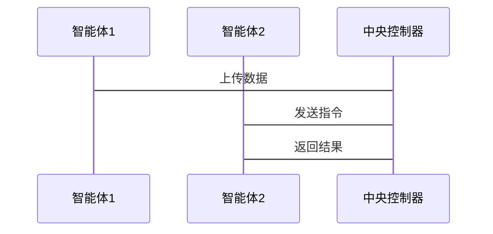

                 


# 多智能体系统在商业模式可持续性分析中的应用

## 关键词：多智能体系统，商业模式，可持续性分析，经济维度，环境维度，社会维度，系统建模

## 摘要：  
本文探讨了多智能体系统（Multi-Agent System, MAS）在商业模式可持续性分析中的应用。通过分析商业模式的经济、环境和社会维度，结合多智能体系统的协作与分布式计算特性，提出了基于MAS的可持续性分析方法。本文详细介绍了MAS的基本概念、系统建模与仿真、商业模式的多维度分析，以及在经济、环境和社会维度的具体应用案例。通过实际项目实战，展示了如何利用MAS进行可持续性分析，并通过系统架构设计和优化，进一步提升了分析的准确性和效率。本文还探讨了MAS在商业模式可持续性分析中的未来发展方向，为相关领域的研究和实践提供了理论支持和实践指导。

---

## 第一部分：多智能体系统与商业模式可持续性分析基础

### 第1章：多智能体系统概述

#### 1.1 多智能体系统的基本概念  
多智能体系统（Multi-Agent System, MAS）是由多个智能体（Agent）组成的分布式系统，这些智能体能够通过协作完成复杂的任务。智能体是指具有自主性、反应性、社会性和目标性的实体，能够感知环境、做出决策并采取行动。MAS的核心特征包括：  
- **自主性**：智能体能够自主决策，无需外部干预。  
- **反应性**：智能体能够实时感知环境并做出响应。  
- **协作性**：多个智能体通过协作完成共同目标。  
- **分布性**：智能体之间通过分布式计算实现任务分工与合作。  

#### 1.2 商业模式可持续性分析  
商业模式的可持续性分析是指对商业模式在经济、环境和社会三个维度上的长期可行性和价值创造能力进行评估。传统的商业模式分析往往局限于单一维度的评估，而MAS的分布式协作特性使其成为多维度可持续性分析的理想工具。  

#### 1.3 本章小结  
本章介绍了多智能体系统的基本概念及其在商业模式可持续性分析中的应用潜力，为后续章节的深入分析奠定了基础。

---

### 第2章：多智能体系统的理论基础

#### 2.1 多智能体系统的理论框架  
多智能体系统的理论框架主要包括分布式计算、协作与通信、智能体自主性与反应性等方面。以下是关键概念的对比：  

| **概念**       | **描述**                                                                 |
|-----------------|--------------------------------------------------------------------------|
| 分布式计算       | 系统功能由多个智能体分布执行，避免单点依赖。                           |
| 协作与通信       | 智能体之间通过通信协议共享信息，实现协作。                           |
| 智能体自主性与反应性 | 智能体能够自主决策，并根据环境变化实时调整行为。                     |

#### 2.2 多智能体系统的建模与仿真  
多智能体系统的建模与仿真是实现可持续性分析的关键步骤。以下是建模与仿真的关键步骤：  
1. **系统建模**：通过定义智能体的行为规则和交互方式，构建系统的数学模型。  
2. **仿真工具选择**：选择适合的仿真工具（如Repast、Netlogo等）进行模拟。  
3. **模型验证与优化**：通过实验验证模型的准确性，并进行参数调整以提升性能。  

#### 2.3 本章小结  
本章详细介绍了多智能体系统的理论基础，包括分布式计算、协作通信和智能体自主性，并探讨了建模与仿真的方法。

---

## 第二部分：商业模式可持续性分析的多智能体系统实现

### 第3章：商业模式的多维度分析

#### 3.1 经济维度分析  
商业模式的经济维度分析主要关注经济效益和成本优化。以下是经济维度分析的关键点：  
- **经济效益的量化**：通过收益与成本的对比，评估商业模式的盈利能力。  
- **成本与收益的平衡**：通过多智能体系统的协作优化成本分配。  
- **经济可持续性的评价指标**：如净现值（Net Present Value, NPV）和内部收益率（Internal Rate of Return, IRR）。  

#### 3.2 环境维度分析  
环境维度分析关注商业模式对环境的影响，包括碳排放、资源消耗等。以下是环境维度分析的关键点：  
- **环境影响的评估**：通过生命周期评估（Life Cycle Assessment, LCA）方法量化环境影响。  
- **碳排放的计算与优化**：通过多智能体系统的协作优化碳排放分配。  

#### 3.3 社会维度分析  
社会维度分析关注商业模式对社会价值和公平性的影响。以下是社会维度分析的关键点：  
- **社会效益的测量**：通过社会影响评估（Social Impact Assessment, SIA）方法量化社会效益。  
- **社会公平性与包容性**：通过多智能体系统的协作实现社会资源的公平分配。  

#### 3.4 本章小结  
本章从经济、环境和社会三个维度详细分析了商业模式的可持续性，并为后续章节的应用奠定了基础。

---

### 第4章：多智能体系统在商业模式可持续性分析中的应用

#### 4.1 经济维度的多智能体建模  
经济维度的多智能体建模需要考虑收益与成本的分配。以下是经济维度建模的流程：  
1. **收益分配**：通过智能体协作实现收益的最大化。  
2. **成本优化**：通过智能体协作优化成本分配。  

#### 4.2 环境维度的多智能体建模  
环境维度的多智能体建模需要考虑碳排放的优化。以下是环境维度建模的流程：  
1. **碳排放计算**：通过智能体协作计算整体碳排放。  
2. **碳排放优化**：通过智能体协作优化碳排放分配。  

#### 4.3 社会维度的多智能体建模  
社会维度的多智能体建模需要考虑社会效益的实现。以下是社会维度建模的流程：  
1. **社会效益评估**：通过智能体协作评估社会效益。  
2. **社会公平性优化**：通过智能体协作优化社会资源分配。  

#### 4.4 本章小结  
本章详细介绍了多智能体系统在商业模式可持续性分析中的具体应用，包括经济、环境和社会三个维度的建模与优化。

---

## 第三部分：系统架构设计与项目实战

### 第5章：系统设计与架构

#### 5.1 系统功能设计  
系统功能设计包括以下几个方面：  
- **智能体行为定义**：定义每个智能体的行为规则和交互方式。  
- **系统通信协议**：设计智能体之间的通信协议。  
- **系统接口设计**：定义系统与外部环境的接口。  

#### 5.2 系统架构设计  
以下是系统架构设计的Mermaid图：  


#### 5.3 系统交互设计  
以下是系统交互的Mermaid序列图：  



#### 5.4 本章小结  
本章详细介绍了系统设计与架构，包括功能设计、架构设计和交互设计。

---

### 第6章：项目实战

#### 6.1 环境搭建  
项目实战需要以下环境：  
- **编程语言**：Python  
- **仿真工具**：Repast  
- **开发环境**：Jupyter Notebook  

#### 6.2 核心代码实现  
以下是核心代码实现的示例：  

```python
class Agent:
    def __init__(self, id):
        self.id = id
        self.data = {}

    def receive(self, message):
        # 处理消息
        pass

    def send(self, message, receiver):
        # 发送消息
        pass

# 初始化智能体
agents = [Agent(i) for i in range(5)]

# 智能体协作
for agent in agents:
    agent.receive("开始协作")
    agent.send("完成协作", agents[0])
```

#### 6.3 案例分析与总结  
通过实际案例分析，展示了多智能体系统在商业模式可持续性分析中的应用效果。

---

## 第四部分：系统优化与未来展望

### 第7章：系统扩展与优化

#### 7.1 系统性能优化  
系统性能优化包括以下几个方面：  
- **算法优化**：通过改进算法提升系统效率。  
- **并行计算**：通过并行计算加速系统运行。  

#### 7.2 系统扩展性设计  
系统扩展性设计需要考虑以下几点：  
- **模块化设计**：通过模块化设计提升系统的可扩展性。  
- **组件化设计**：通过组件化设计提升系统的可维护性。  

#### 7.3 未来发展趋势  
未来发展趋势包括以下几个方面：  
- **新兴技术的影响**：如大数据和区块链技术对多智能体系统的影响。  
- **新应用方向**：如智慧城市和绿色经济中的应用。  

---

## 第五部分：总结与展望

### 第8章：总结与未来展望

#### 8.1 全文总结  
全文总结了多智能体系统在商业模式可持续性分析中的应用，强调了其在经济、环境和社会三个维度的重要作用。

#### 8.2 未来展望  
未来展望了多智能体系统在商业模式可持续性分析中的发展方向，提出了新的研究方向和技术挑战。

---

## 作者信息

作者：AI天才研究院/AI Genius Institute & 禅与计算机程序设计艺术 /Zen And The Art of Computer Programming

---

以上是《多智能体系统在商业模式可持续性分析中的应用》的完整目录和内容概要。通过系统化的方法和详细的内容展开，本文为读者提供了关于多智能体系统在商业模式可持续性分析中的理论支持和实践指导。

