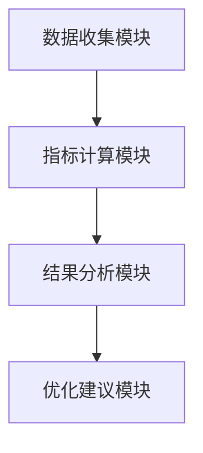
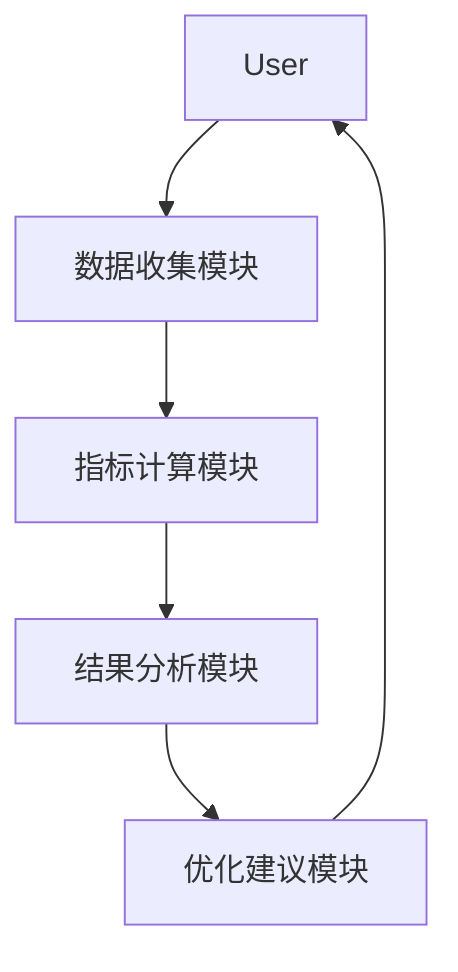

                 


# 多智能体系统在商业模式可持续性评估中的应用

> 关键词：多智能体系统，商业模式，可持续性评估，智能体协作，算法实现，系统架构

> 摘要：本文探讨了多智能体系统（MAS）在商业模式可持续性评估中的应用，分析了MAS的核心概念、商业模式可持续性评估的框架、MAS在评估中的具体应用方法，以及系统的架构设计和算法实现。通过实际案例分析，展示了MAS在商业模式可持续性评估中的优势和实际价值。

---

# 第1章: 多智能体系统与商业模式可持续性评估概述

## 1.1 多智能体系统的定义与特点

### 1.1.1 多智能体系统的定义
多智能体系统（Multi-Agent Systems, MAS）是由多个智能体（Agent）组成的分布式系统，每个智能体都是具有独立性、自主性和协作能力的实体。智能体能够感知环境、自主决策并与其他智能体或外部系统进行交互。

### 1.1.2 多智能体系统的核心特点
- **分布式性**：智能体独立运行，通过通信协作完成任务。
- **自主性**：智能体能够自主决策，无需外部干预。
- **协作性**：智能体之间通过协作实现系统目标。
- **动态性**：环境和任务可能动态变化，智能体需具备适应能力。

### 1.1.3 多智能体系统的主要应用场景
- 智能交通管理
- 分布式计算与任务分配
- 电子商务与推荐系统
- 金融风险评估

## 1.2 商业模式可持续性评估的定义与重要性

### 1.2.1 商业模式的定义
商业模式是企业通过核心产品或服务获取价值的逻辑，包括价值主张、客户关系、分销渠道、资源分配和财务结构等要素。

### 1.2.2 可持续性评估的核心要素
- 环境影响：资源消耗、碳排放。
- 社会影响：社会责任、员工福利。
- 经济影响：盈利能力、风险控制。

### 1.2.3 商业模式可持续性评估的必要性
- 企业需要在经济、社会和环境三个维度上实现平衡。
- 可持续性评估是企业长期发展的重要保障。

## 1.3 多智能体系统在商业模式可持续性评估中的应用背景

### 1.3.1 当前商业模式面临的挑战
- 竞争加剧：企业需要更高效地优化资源配置。
- 环境压力：可持续发展成为全球关注的焦点。
- 技术驱动：数字化转型要求企业采用新技术提升竞争力。

### 1.3.2 多智能体系统的优势
- 分布式计算能力：能够处理复杂系统的动态变化。
- 协作能力：智能体之间可以高效协作，优化资源配置。
- 自适应性：能够快速响应环境变化。

### 1.3.3 应用前景
- 企业可以通过MAS实现资源优化配置。
- MAS能够帮助企业在可持续性评估中实现多目标优化。

## 1.4 本章小结
本章介绍了多智能体系统的基本概念、核心特点及其在商业模式可持续性评估中的应用背景。通过分析当前商业模式面临的挑战和MAS的优势，为后续章节的深入探讨奠定了基础。

---

# 第2章: 多智能体系统的核心概念与原理

## 2.1 多智能体系统的结构与功能

### 2.1.1 多智能体系统的组成结构
- **智能体**：独立的、能够感知环境并采取行动的实体。
- **通信机制**：智能体之间进行信息交换的协议。
- **协作机制**：智能体之间实现任务分配和协同工作的规则。
- **环境**：智能体所处的外部世界，可能是物理环境或虚拟环境。

### 2.1.2 智能体的基本特征
- **自主性**：智能体能够自主决策。
- **反应性**：智能体能够感知环境并实时响应。
- **协作性**：智能体能够与其他智能体协作完成任务。
- **学习能力**：智能体能够通过经验优化自身行为。

### 2.1.3 多智能体系统的协作机制
- **任务分配**：智能体根据自身能力和环境需求分配任务。
- **信息共享**：智能体之间共享信息，优化决策。
- **冲突解决**：智能体之间通过协商或仲裁机制解决冲突。

## 2.2 多智能体系统的关键技术

### 2.2.1 智能体通信协议
智能体之间的通信需要遵循特定的协议，确保信息的准确传递和处理。常见的通信协议包括基于消息队列的通信和基于发布-订阅模式的通信。

### 2.2.2 协作与学习机制
- **协作机制**：包括任务分配、资源分配和角色分配。
- **学习机制**：智能体通过强化学习或监督学习优化自身行为。

### 2.2.3 多智能体系统的动态性与适应性
- **动态性**：系统中智能体和环境的状态可能随时变化。
- **适应性**：智能体能够根据环境变化调整自身行为。

## 2.3 多智能体系统的数学模型与算法基础

### 2.3.1 多智能体系统的数学建模
多智能体系统可以用图论、博弈论和分布式计算理论进行建模。例如，可以用图结构表示智能体之间的关系，用博弈论模型表示智能体的决策过程。

### 2.3.2 常见算法介绍
- **分布式算法**：如分布式一致性算法、分布式任务分配算法。
- **协作算法**：如多智能体协作算法、基于协商的算法。
- **学习算法**：如强化学习、转移学习。

### 2.3.3 算法的优缺点分析
- **优点**：能够处理复杂的分布式问题，适应性强。
- **缺点**：算法复杂度高，实现难度大。

## 2.4 本章小结
本章详细介绍了多智能体系统的核心概念与原理，包括系统的组成结构、协作机制、通信协议以及相关的数学模型和算法基础。这些内容为后续章节的应用分析奠定了理论基础。

---

# 第3章: 商业模式可持续性评估的核心要素与框架

## 3.1 商业模式的构成要素

### 3.1.1 价值主张
企业通过提供产品或服务满足客户的需求，创造价值。

### 3.1.2 客户关系
企业与客户之间的关系管理，包括客户获取、维护和忠诚度提升。

### 3.1.3 分销渠道
产品或服务的分销方式，包括直接销售和间接销售。

### 3.1.4 资源分配
企业所需的资源，包括人力资源、财务资源和技术资源。

### 3.1.5 财务结构
企业的收入、成本和利润结构。

## 3.2 可持续性评估的核心要素

### 3.2.1 环境维度
- **资源消耗**：企业在生产过程中消耗的资源。
- **碳排放**：企业生产过程中的温室气体排放。

### 3.2.2 社会维度
- **社会责任**：企业对社会的贡献，包括公益事业和员工福利。
- **员工关系**：企业与员工之间的关系，包括薪酬、福利和工作环境。

### 3.2.3 经济维度
- **盈利能力**：企业的财务健康状况。
- **风险管理**：企业面临的财务风险和市场风险。

## 3.3 可持续性评估的框架

### 3.3.1 评估指标体系
- **环境指标**：如单位产品碳排放、能源消耗效率。
- **社会指标**：如员工满意度、社会责任投入。
- **经济指标**：如净利润率、投资回报率。

### 3.3.2 评估流程
1. **数据收集**：收集企业的经营数据。
2. **指标计算**：根据指标体系计算各项指标。
3. **结果分析**：分析指标结果，找出改进方向。
4. **优化建议**：提出改进建议，提升可持续性。

## 3.4 本章小结
本章详细介绍了商业模式的构成要素和可持续性评估的核心要素，构建了可持续性评估的指标体系和评估框架。这些内容为后续章节的应用分析提供了理论依据。

---

# 第4章: 多智能体系统在商业模式可持续性评估中的应用

## 4.1 多智能体系统在商业模式可持续性评估中的应用框架

### 4.1.1 分析框架
多智能体系统可以用于分析商业模式的各个要素，包括价值主张、客户关系、分销渠道、资源分配和财务结构。

### 4.1.2 评估框架
多智能体系统可以用于评估商业模式的可持续性，包括环境、社会和经济三个维度的评估。

## 4.2 多智能体系统的协作与学习机制

### 4.2.1 协作机制
智能体之间通过协作机制优化资源配置，提升评估效率。

### 4.2.2 学习机制
智能体通过学习机制优化自身行为，提升评估的准确性。

## 4.3 多智能体系统在商业模式可持续性评估中的实际应用

### 4.3.1 案例分析
某企业利用多智能体系统对其商业模式进行可持续性评估，优化资源配置，提升盈利能力。

### 4.3.2 应用效果
通过多智能体系统的应用，企业实现了资源优化配置，提升了可持续性评估的效率和准确性。

## 4.4 本章小结
本章介绍了多智能体系统在商业模式可持续性评估中的应用框架和实际应用案例，展示了MAS在提升企业可持续性评估效率和准确性方面的优势。

---

# 第5章: 多智能体系统在商业模式可持续性评估中的系统设计

## 5.1 系统功能设计

### 5.1.1 领域模型
通过领域模型描述商业模式可持续性评估的核心功能，包括数据收集、指标计算和结果分析。

### 5.1.2 系统功能模块
- **数据收集模块**：收集企业的经营数据。
- **指标计算模块**：根据指标体系计算各项指标。
- **结果分析模块**：分析指标结果，找出改进方向。
- **优化建议模块**：提出改进建议，提升可持续性。

## 5.2 系统架构设计

### 5.2.1 系统架构图
使用Mermaid绘制系统架构图，展示系统的各个部分及其交互。



### 5.2.2 系统接口设计
系统需要与企业内部的各个模块进行接口对接，包括财务系统、CRM系统和资源管理系统。

## 5.3 系统交互设计

### 5.3.1 系统交互流程
使用Mermaid绘制系统交互流程图，展示系统的各个交互步骤。



## 5.4 本章小结
本章详细介绍了多智能体系统在商业模式可持续性评估中的系统设计，包括功能设计、架构设计和交互设计。这些设计为系统的实际实现提供了指导。

---

# 第6章: 多智能体系统在商业模式可持续性评估中的算法实现

## 6.1 算法原理

### 6.1.1 多智能体协作算法
智能体通过协作算法优化资源配置，提升评估效率。

### 6.1.2 评估模型
基于多智能体系统的评估模型，包括环境、社会和经济三个维度的评估指标。

## 6.2 算法实现

### 6.2.1 Python实现
以下是多智能体协作算法的Python实现示例：

```python
class Agent:
    def __init__(self, id):
        self.id = id
        self.resource = 0

    def request_resource(self, amount):
        print(f"Agent {self.id} requests {amount} resources")
        # 通过通信机制分配资源
        pass

    def allocate_resource(self, amount):
        self.resource += amount
        print(f"Agent {self.id} allocated {amount} resources")

# 初始化智能体
agents = [Agent(i) for i in range(1, 5)]

# 多智能体协作算法
for agent in agents:
    agent.request_resource(10)
```

### 6.2.2 数学模型
以下是多智能体系统评估模型的数学表达式：

$$
\text{评估结果} = \sum_{i=1}^{n} w_i \cdot x_i
$$

其中，$w_i$ 是评估指标的权重，$x_i$ 是评估指标的值。

## 6.3 算法优化

### 6.3.1 算法优化策略
通过强化学习优化多智能体协作算法，提升评估效率。

### 6.3.2 优化效果
优化后的算法能够更快地响应环境变化，提升评估结果的准确性。

## 6.4 本章小结
本章详细介绍了多智能体系统在商业模式可持续性评估中的算法实现，包括算法原理、实现方法和优化策略。这些内容为系统的实际应用提供了技术支持。

---

# 第7章: 多智能体系统在商业模式可持续性评估中的案例分析

## 7.1 案例背景

### 7.1.1 案例介绍
某制造企业利用多智能体系统对其商业模式进行可持续性评估，优化资源配置，提升盈利能力。

### 7.1.2 案例需求
企业希望通过多智能体系统实现资源优化配置，提升可持续性评估的效率和准确性。

## 7.2 案例分析

### 7.2.1 数据收集与处理
企业收集了过去三年的经营数据，包括资源消耗、碳排放、员工满意度和财务数据。

### 7.2.2 指标计算与分析
根据可持续性评估指标体系，计算各项指标并进行分析。

### 7.2.3 优化建议
根据分析结果，提出优化建议，包括减少资源消耗、提升员工满意度和优化财务结构。

## 7.3 案例总结

### 7.3.1 应用效果
通过多智能体系统的应用，企业实现了资源优化配置，提升了可持续性评估的效率和准确性。

### 7.3.2 经验总结
多智能体系统在商业模式可持续性评估中的应用具有显著的优势，能够帮助企业实现资源优化配置和可持续性提升。

## 7.4 本章小结
本章通过实际案例分析，展示了多智能体系统在商业模式可持续性评估中的应用效果和优化建议。案例分析证明了MAS在提升企业可持续性评估效率和准确性方面的优势。

---

# 第8章: 总结与展望

## 8.1 总结
本文探讨了多智能体系统在商业模式可持续性评估中的应用，分析了MAS的核心概念、商业模式可持续性评估的框架、MAS在评估中的具体应用方法，以及系统的架构设计和算法实现。通过实际案例分析，展示了MAS在商业模式可持续性评估中的优势和实际价值。

## 8.2 展望
未来，随着人工智能和分布式计算技术的不断发展，MAS在商业模式可持续性评估中的应用将更加广泛和深入。研究者可以通过优化MAS算法、拓展应用场景和提升系统性能，进一步推动MAS在商业模式可持续性评估中的应用。

## 8.3 注意事项
在实际应用中，需要注意智能体之间的通信效率和协作效果，确保系统运行的稳定性和可靠性。

## 8.4 最佳实践
建议企业在实施MAS时，充分考虑自身的业务需求和资源条件，选择合适的MAS架构和算法，确保系统的高效运行和优化效果。

## 8.5 拓展阅读
推荐读者阅读《Multi-Agent Systems: Algorithmic, Complexity Theoretic, and Game Theoretic Foundations》和《Business Model Innovation》等书籍，深入了解MAS和商业模式的相关知识。

---

# 作者：AI天才研究院/AI Genius Institute & 禅与计算机程序设计艺术/Zen And The Art of Computer Programming

