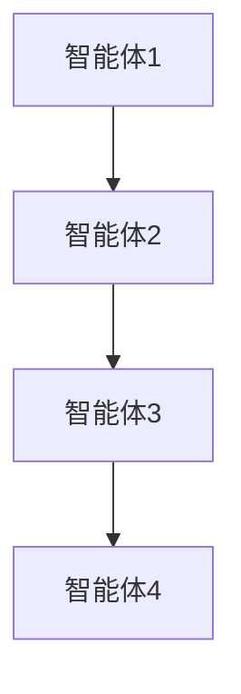
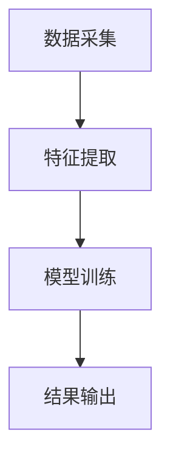
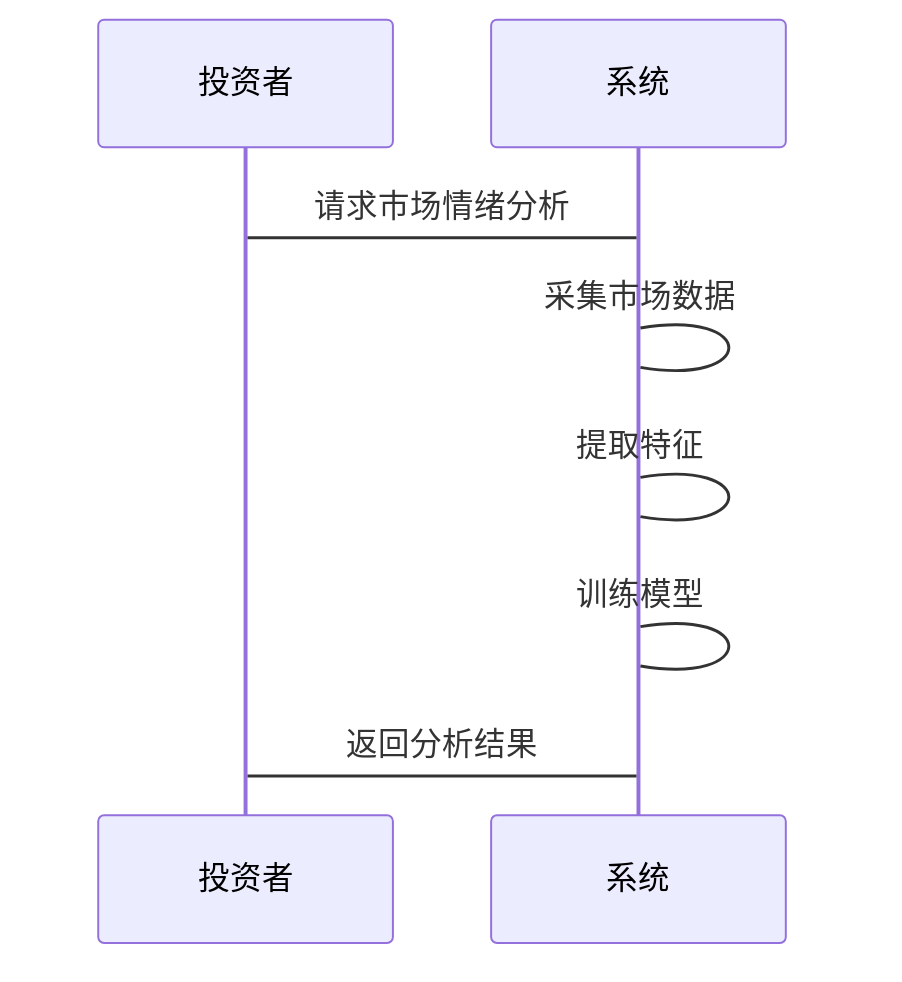

                 


# 多智能体系统在市场情绪分析中的应用：价值投资者的新工具

> **关键词**: 多智能体系统, 市场情绪分析, 价值投资, 人工智能, 金融市场

> **摘要**: 多智能体系统在市场情绪分析中的应用为价值投资者提供了全新的工具。本文系统地介绍了多智能体系统的原理、市场情绪分析的方法及其在投资决策中的应用。通过详细讲解算法原理、系统架构设计和项目实战，展示了如何利用多智能体系统提升市场情绪分析的准确性和效率，为价值投资者提供了新的视角和工具。

---

## 第一部分: 多智能体系统与市场情绪分析概述

### 第1章: 多智能体系统与市场情绪分析的背景介绍

#### 1.1 多智能体系统的基本概念

##### 1.1.1 多智能体系统的定义与特点
多智能体系统（Multi-Agent System, MAS）是由多个相互作用的智能体组成的系统，这些智能体能够通过感知环境、协作和推理来实现特定目标。其特点包括分布性、协作性、反应性和主动性。

##### 1.1.2 多智能体系统的核心要素
- **智能体**: 具备感知、推理、决策和行动能力的独立实体。
- **通信机制**: 智能体之间通过消息传递进行信息交流。
- **协作机制**: 智能体通过协作实现共同目标。
- **环境**: 智能体所处的外部环境，可能是金融市场、社交网络等。

##### 1.1.3 多智能体系统的演进历程
从分布式人工智能到现代MAS，多智能体系统经历了理论研究到实际应用的演变，广泛应用于金融、交通等领域。

#### 1.2 市场情绪分析的定义与重要性

##### 1.2.1 市场情绪分析的定义
市场情绪分析是通过分析市场参与者的言论、交易行为等，评估市场的乐观或悲观情绪。情绪分析结果为投资者提供决策支持。

##### 1.2.2 市场情绪分析的分类
- **文本情绪分析**: 基于新闻、评论等文本数据。
- **交易情绪分析**: 基于买卖行为数据。
- **综合情绪分析**: 结合文本和交易数据。

##### 1.2.3 市场情绪分析在投资决策中的作用
帮助投资者识别市场趋势，降低非理性决策风险，优化投资组合。

#### 1.3 多智能体系统与市场情绪分析的结合

##### 1.3.1 多智能体系统在金融领域的应用
MAS在金融领域的应用包括高频交易、风险控制、市场预测等。

##### 1.3.2 市场情绪分析的多智能体实现
通过MAS实现分布式市场情绪分析，提高计算效率和准确性。

##### 1.3.3 价值投资者的新工具
MAS为价值投资者提供实时市场情绪监控、风险预警等服务，辅助投资决策。

---

### 第2章: 多智能体系统与市场情绪分析的核心概念与联系

#### 2.1 多智能体系统的原理

##### 2.1.1 多智能体系统的组成结构
使用Mermaid图展示MAS的组成结构：



##### 2.1.2 多智能体系统的通信机制
智能体之间通过消息传递进行通信，例如使用HTTP或WebSocket协议。

##### 2.1.3 多智能体系统的协作机制
基于分布式计算和协作学习，智能体协同完成任务。

#### 2.2 市场情绪分析的原理

##### 2.2.1 市场情绪的量化方法
- **文本分析**: 使用自然语言处理技术提取情感特征。
- **交易数据**: 通过买卖量、价格波动等指标量化情绪。

##### 2.2.2 市场情绪分析的特征提取
- **文本特征**: 词频、TF-IDF、情感词汇等。
- **交易特征**: 交易量、波动率、买卖信号等。

##### 2.2.3 市场情绪分析的模型构建
基于机器学习的分类模型，如SVM、随机森林、神经网络等。

#### 2.3 多智能体系统与市场情绪分析的关联

##### 2.3.1 多智能体系统在市场情绪分析中的角色
- **数据采集**: 多个智能体分别采集不同来源的市场数据。
- **特征提取**: 智能体协作提取多维度的市场情绪特征。
- **模型训练**: 分布式训练提升模型性能和效率。

##### 2.3.2 多智能体系统的协作优势
- **并行处理**: 多智能体同时处理数据，提高效率。
- **分布式计算**: 分散任务降低单点故障风险。

##### 2.3.3 多智能体系统的优化方向
- **智能体协作机制**: 提升协作效率和准确性。
- **通信效率**: 优化消息传递机制，减少延迟。

---

### 第3章: 多智能体系统与市场情绪分析的算法原理

#### 3.1 市场情绪分析的算法流程

##### 3.1.1 数据预处理
清洗数据，去除噪声，标准化处理。

##### 3.1.2 特征提取
使用TF-IDF提取关键词，构建特征向量。

##### 3.1.3 情感分类
训练分类模型，如支持向量机（SVM）或长短期记忆网络（LSTM）。

##### 3.1.4 情感预测
基于模型预测市场情绪，输出结果。

#### 3.2 多智能体协作算法

##### 3.2.1 分布式计算
使用分布式计算框架（如Spark）处理大数据。

##### 3.2.2 协作学习
智能体协作训练模型，提升泛化能力。

##### 3.2.3 联合推理
智能体协同推理，综合多个视角的分析结果。

---

## 第四部分: 系统分析与架构设计方案

### 第4章: 系统分析与架构设计方案

#### 4.1 问题场景介绍
设计一个多智能体系统，实时分析市场情绪，为投资者提供实时监控服务。

#### 4.2 系统功能设计
- **数据采集模块**: 采集市场数据。
- **特征提取模块**: 提取市场情绪特征。
- **模型训练模块**: 训练情感分类模型。
- **结果输出模块**: 输出市场情绪分析结果。

#### 4.3 系统架构设计
使用Mermaid图展示系统架构：



#### 4.4 系统接口设计
- **数据接口**: 提供API获取市场数据。
- **模型接口**: 提供API调用情感分类模型。

#### 4.5 系统交互设计
使用Mermaid序列图展示交互流程：



---

## 第五部分: 项目实战

### 第5章: 项目实战

#### 5.1 环境安装
安装必要的Python库，如pandas、numpy、scikit-learn、transformers。

#### 5.2 核心代码实现

##### 5.2.1 数据采集
```python
import requests
def get_market_data(url):
    response = requests.get(url)
    return response.text
```

##### 5.2.2 特征提取
```python
from sklearn.feature_extraction.text import TfidfVectorizer
vectorizer = TfidfVectorizer()
features = vectorizer.fit_transform(text_data)
```

##### 5.2.3 情感分类
```python
from sklearn.svm import SVC
model = SVC()
model.fit(features, labels)
```

##### 5.2.4 结果输出
```python
def predict_emotion(model, vectorizer, text):
    feature = vectorizer.transform([text])
    return model.predict(feature)[0]
```

#### 5.3 案例分析
分析某次市场波动，展示系统如何预测市场情绪。

#### 5.4 项目小结
总结项目实现过程中的经验教训，提出改进建议。

---

## 第六部分: 总结与展望

### 第6章: 总结与展望

#### 6.1 最佳实践 tips
- **数据质量**: 确保数据来源可靠。
- **模型优化**: 定期更新模型参数。
- **系统维护**: 定期检查系统性能。

#### 6.2 小结
本文详细介绍了多智能体系统在市场情绪分析中的应用，展示了其在价值投资中的潜力。

#### 6.3 注意事项
- 避免过度依赖单一数据源。
- 注意模型的泛化能力。

#### 6.4 拓展阅读
推荐相关书籍和论文，供读者深入学习。

---

## 作者信息

作者：AI天才研究院/AI Genius Institute & 禅与计算机程序设计艺术 /Zen And The Art of Computer Programming

---

以上是文章的详细大纲和部分章节内容。

