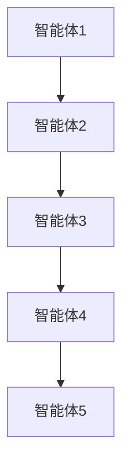
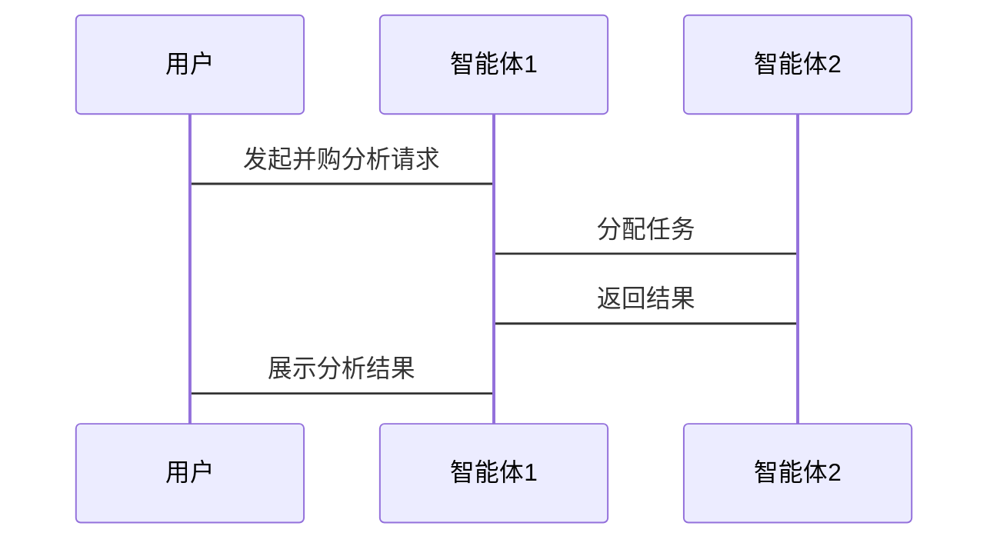

                 


# 多智能体系统在并购分析中的应用：评估长期价值创造

> 关键词：多智能体系统, 并购分析, 企业价值评估, 并购整合, 风险分析, 多智能体协作, 价值创造

> 摘要：本文探讨了多智能体系统在并购分析中的应用，重点分析了如何利用多智能体系统的核心原理和算法，结合企业价值评估、并购风险分析和整合策略优化，实现长期价值创造。文章通过详细讲解多智能体系统的概念、算法原理、系统架构设计和项目实战，全面展示了多智能体系统在并购分析中的实际应用价值。

---

# 第1章: 多智能体系统与并购分析的背景与基础

## 1.1 多智能体系统的基本概念

### 1.1.1 多智能体系统的定义

多智能体系统（Multi-Agent System, MAS）是由多个智能体（Agent）组成的分布式系统，这些智能体能够通过自主决策、协作和通信，共同完成特定任务。智能体具有以下特征：
1. **自主性**：智能体能够在没有外部干预的情况下独立决策。
2. **反应性**：智能体能够感知环境并做出实时反应。
3. **协作性**：智能体之间能够通过通信和协作完成共同目标。
4. **社会性**：智能体之间存在复杂的交互和协作关系。

### 1.1.2 多智能体系统的特征

| 特征 | 描述 |
|------|------|
| 分布式 | 系统由多个独立的智能体组成，不存在集中控制。 |
| 协作性 | 智能体之间通过协作完成共同目标，而非简单分工。 |
| 动态性 | 系统环境和智能体状态可能动态变化，需要实时调整。 |
| 复杂性 | 系统中智能体的数量和交互关系可能非常复杂。 |

### 1.1.3 多智能体系统的应用领域

多智能体系统广泛应用于以下领域：
1. **分布式计算**：如分布式文件系统、云计算。
2. **机器人协作**：如多机器人协作完成任务。
3. **经济与金融**：如股票交易、风险评估。
4. **游戏开发**：如多人在线游戏中的AI角色。
5. **企业决策支持**：如企业战略规划、并购分析。

## 1.2 并购分析的基本概念

### 1.2.1 并购的定义与类型

**并购（Mergers and Acquisitions, M&A）**是指一家企业合并或收购另一家企业，以实现战略目标或扩大业务范围。并购的类型包括：
1. **横向并购**：同一行业内的企业合并。
2. **纵向并购**：产业链上下游企业的合并。
3. **混合并购**：不同行业之间的企业合并。

### 1.2.2 并购分析的核心问题

1. **企业价值评估**：评估目标企业的市场价值。
2. **并购风险分析**：识别并评估并购过程中的风险。
3. **整合策略优化**：制定有效的整合计划，确保并购后的企业协同效应。

### 1.2.3 并购分析的挑战与难点

1. **信息不对称**：并购双方可能掌握的信息不一致，导致估值偏差。
2. **整合风险**：企业整合过程中可能遇到文化冲突、管理混乱等问题。
3. **外部环境不确定性**：市场波动、政策变化等因素可能影响并购结果。

## 1.3 多智能体系统在并购分析中的应用前景

### 1.3.1 多智能体系统的优势

1. **分布式计算能力**：多智能体系统能够处理复杂的分布式问题，适合企业并购中的多维度分析。
2. **协作与优化**：智能体之间的协作可以优化并购整合策略，提高企业协同效应。
3. **动态适应性**：多智能体系统能够实时响应环境变化，适应市场波动。

### 1.3.2 并购分析对多智能体系统的需求

1. **复杂性需求**：并购分析涉及多个维度，如财务、市场、法律等，需要多智能体系统的协作能力。
2. **实时性需求**：并购过程中需要实时分析市场变化和企业动态，多智能体系统能够快速响应。
3. **智能化需求**：通过智能体的自主决策，实现并购分析的智能化和自动化。

### 1.3.3 应用前景与发展趋势

随着人工智能技术的快速发展，多智能体系统在并购分析中的应用前景广阔。未来，多智能体系统将更加智能化、分布式和协作化，能够更好地支持企业的并购决策和整合策略。

## 1.4 本章小结

本章介绍了多智能体系统的基本概念和特征，并详细讲解了并购分析的核心问题和挑战。最后，分析了多智能体系统在并购分析中的应用优势和未来发展趋势，为后续章节的深入分析奠定了基础。

---

# 第2章: 多智能体系统与并购分析的核心概念与联系

## 2.1 多智能体系统的原理

### 2.1.1 多智能体系统的组成

多智能体系统由以下几部分组成：
1. **智能体**：系统的最小功能单元，负责完成特定任务。
2. **通信机制**：智能体之间的通信方式，如消息传递。
3. **协作机制**：智能体之间的协作规则和策略。
4. **环境**：智能体所处的外部环境，如市场环境。

### 2.1.2 多智能体系统的通信机制

多智能体系统中的通信机制可以通过以下几种方式实现：
1. **直接通信**：智能体之间直接交换信息。
2. **间接通信**：通过中间媒介（如数据库）进行信息传递。
3. **发布-订阅模型**：智能体发布信息，其他智能体订阅感兴趣的信息。

### 2.1.3 多智能体系统的协作机制

多智能体系统的协作机制包括以下几种：
1. **基于规则的协作**：通过预定义的规则实现协作。
2. **基于博弈论的协作**：通过博弈论模型优化协作策略。
3. **基于学习的协作**：通过机器学习算法实现动态协作。

## 2.2 并购分析的核心要素

### 2.2.1 企业价值评估

企业价值评估是并购分析的核心内容之一，主要包括以下几个方面：
1. **财务指标分析**：如净利润、营业收入、资产负债率等。
2. **市场价值评估**：如市盈率、市净率等。
3. **未来现金流预测**：通过DCF模型评估企业价值。

### 2.2.2 并购风险分析

并购风险分析是并购成功的关键因素之一，主要包括：
1. **市场风险**：如行业波动、政策变化等。
2. **整合风险**：如文化冲突、管理混乱等。
3. **法律风险**：如反垄断审查、合规性问题等。

### 2.2.3 并购整合策略

并购整合策略是确保并购成功的重要环节，主要包括：
1. **战略协同**：通过整合实现战略目标。
2. **组织优化**：优化组织结构，提高效率。
3. **文化融合**：促进企业文化融合，增强员工凝聚力。

## 2.3 多智能体系统与并购分析的联系

### 2.3.1 多智能体系统在并购分析中的角色

1. **数据采集与处理**：智能体负责采集和处理企业数据。
2. **价值评估**：通过协作实现企业价值的准确评估。
3. **风险分析**：智能体协作完成并购风险的全面分析。
4. **策略优化**：通过多智能体协作优化并购整合策略。

### 2.3.2 多智能体系统如何支持企业价值评估

多智能体系统可以通过以下方式支持企业价值评估：
1. **数据共享与协作**：多个智能体协同工作，共享数据和信息。
2. **实时分析**：智能体实时分析市场动态，提供准确的评估结果。
3. **优化模型**：通过博弈论模型优化价值评估的准确性。

### 2.3.3 多智能体系统如何优化并购整合策略

多智能体系统可以通过以下方式优化并购整合策略：
1. **动态协作**：智能体实时协作，动态调整整合策略。
2. **风险管理**：通过智能体协作，识别和规避整合风险。
3. **目标优化**：通过智能体协作，实现整合目标的最优化。

## 2.4 本章小结

本章详细讲解了多智能体系统的原理，并购分析的核心要素，以及多智能体系统与并购分析的联系。通过分析多智能体系统在并购分析中的角色和作用，为后续章节的算法实现和系统设计奠定了基础。

---

# 第3章: 多智能体系统在并购分析中的算法原理

## 3.1 多智能体系统的算法基础

### 3.1.1 分布式计算与多智能体系统

分布式计算是多智能体系统的核心基础，主要包括以下内容：
1. **分布式任务分配**：将任务分配给多个智能体。
2. **分布式计算模型**：如MapReduce模型。
3. **分布式通信协议**：如RPC（远程过程调用）、HTTP等。

### 3.1.2 协作式算法的基本原理

协作式算法是多智能体系统的核心算法之一，主要包括以下步骤：
1. **问题分解**：将问题分解为多个子问题。
2. **任务分配**：将子问题分配给不同的智能体。
3. **协作与通信**：智能体之间通过通信协作，共同完成任务。
4. **结果整合**：将各智能体的结果整合，得到最终的解决方案。

### 3.1.3 多智能体系统中的博弈论模型

博弈论模型在多智能体系统中广泛应用，主要用于解决智能体之间的协作与竞争问题。常用的博弈论模型包括：
1. **纳什均衡**：所有智能体都采取最优策略，使得任何单个智能体都无法通过单方面改变策略而提高自身收益。
2. **极大极小算法**：用于解决智能体之间的竞争问题，确保智能体的决策能够最大化自身收益。

## 3.2 并购分析的算法实现

### 3.2.1 企业价值评估的数学模型

企业价值评估的数学模型可以表示为：
$$ V = E \times (1 + g) / (r - g) $$
其中：
- \( V \) 表示企业价值。
- \( E \) 表示企业未来现金流。
- \( g \) 表示现金流增长率。
- \( r \) 表示折现率。

### 3.2.2 并购风险分析的算法流程

并购风险分析的算法流程如下：
1. **数据采集**：采集企业财务数据、市场数据等。
2. **风险因子识别**：识别影响并购的主要风险因子。
3. **风险评估**：通过博弈论模型评估各风险因子的影响程度。
4. **风险控制**：制定风险控制策略，降低并购风险。

### 3.2.3 并购整合策略的优化算法

并购整合策略的优化算法如下：
1. **目标设定**：设定并购整合的目标，如提高市场份额、降低成本等。
2. **任务分解**：将整合任务分解为多个子任务。
3. **智能体协作**：多个智能体协作完成子任务。
4. **结果优化**：通过智能体协作，优化整合策略，实现目标最大化。

## 3.3 算法实现的数学模型与公式

### 3.3.1 企业价值评估公式

企业价值评估公式：
$$ V = \frac{E(1 + g)}{r - g} $$

其中：
- \( E \) 是企业未来现金流。
- \( g \) 是现金流增长率。
- \( r \) 是折现率。

### 3.3.2 并购风险评估模型

并购风险评估模型：
$$ R = \alpha \times \text{市场风险} + \beta \times \text{行业风险} $$

其中：
- \( \alpha \) 和 \( \beta \) 是风险因子的权重。
- 市场风险和行业风险是具体的风险指标。

### 3.3.3 并购整合优化模型

并购整合优化模型：
$$ S = \max \sum_{i=1}^{n} w_i \times x_i $$

其中：
- \( S \) 是整合策略的优化结果。
- \( w_i \) 是各子任务的权重。
- \( x_i \) 是各子任务的优化结果。

## 3.4 算法实现的Python代码示例

### 3.4.1 企业价值评估代码

```python
def calculate_value(enterprise_value, growth_rate, discount_rate):
    return enterprise_value * (1 + growth_rate) / (discount_rate - growth_rate)
```

### 3.4.2 并购风险评估代码

```python
def calculate_risk(market_risk, industry_risk, alpha, beta):
    return alpha * market_risk + beta * industry_risk
```

## 3.5 本章小结

本章详细讲解了多智能体系统的算法基础，并购分析的算法实现，以及相关的数学模型和公式。通过具体的Python代码示例，进一步展示了算法实现的具体步骤和方法。

---

# 第4章: 多智能体系统与并购分析的系统架构设计

## 4.1 系统功能设计

### 4.1.1 问题场景介绍

在企业并购分析中，通常需要分析企业的财务数据、市场环境、行业趋势等多个维度，以评估企业的长期价值。传统的分析方法往往依赖人工计算和经验判断，效率较低且容易出错。通过引入多智能体系统，可以实现多维度的协同分析和优化，提高并购分析的准确性和效率。

### 4.1.2 项目介绍

本项目旨在开发一个多智能体系统，用于支持企业并购分析。系统将通过多个智能体协作完成以下任务：
1. 数据采集与处理。
2. 企业价值评估。
3. 并购风险分析。
4. 整合策略优化。

### 4.1.3 系统功能设计

系统功能设计包括以下几个方面：
1. **数据采集**：智能体从多个数据源采集企业数据。
2. **数据处理**：对采集的数据进行清洗和预处理。
3. **价值评估**：通过协作计算企业价值。
4. **风险分析**：识别和评估并购风险。
5. **策略优化**：优化并购整合策略。

## 4.2 系统架构设计

### 4.2.1 系统架构图

以下是一个多智能体系统的架构图：



### 4.2.2 系统功能模块

系统功能模块包括：
1. **数据采集模块**：负责从外部数据源采集企业数据。
2. **数据处理模块**：对采集的数据进行清洗和预处理。
3. **价值评估模块**：通过协作计算企业价值。
4. **风险分析模块**：识别和评估并购风险。
5. **策略优化模块**：优化并购整合策略。

### 4.2.3 系统接口设计

系统接口设计包括：
1. **数据接口**：与外部数据源的接口，如数据库、API等。
2. **协作接口**：智能体之间的协作接口，如消息队列、RPC等。
3. **用户接口**：供用户使用的界面，如Web界面、命令行等。

### 4.2.4 系统交互设计

以下是一个简单的系统交互图：



## 4.3 本章小结

本章详细讲解了多智能体系统在并购分析中的系统架构设计，包括功能设计、架构图、接口设计和交互设计。通过系统化的架构设计，为后续的项目实现奠定了坚实的基础。

---

# 第5章: 多智能体系统与并购分析的项目实战

## 5.1 项目环境安装

### 5.1.1 环境要求

1. **操作系统**：Linux/Windows/MacOS。
2. **Python版本**：Python 3.6及以上。
3. **依赖库**：如NumPy、Pandas、Matplotlib等。

### 5.1.2 安装步骤

1. 安装Python：
   ```bash
   # 在终端中运行以下命令
   python --version
   ```
   如果没有安装Python，可以访问 [Python官方下载页面](https://www.python.org/downloads/) 进行安装。

2. 安装依赖库：
   ```bash
   pip install numpy pandas matplotlib
   ```

## 5.2 系统核心实现源代码

### 5.2.1 多智能体协作代码

```python
import numpy as np
import pandas as pd

class Agent:
    def __init__(self, name):
        self.name = name
        self.data = None

    def receive_data(self, data):
        self.data = data
        print(f"{self.name} received data: {data}")

    def process_data(self):
        # 示例：计算企业价值
        if self.data is not None:
            enterprise_value = self.data['enterprise_value']
            growth_rate = self.data['growth_rate']
            discount_rate = self.data['discount_rate']
            value = enterprise_value * (1 + growth_rate) / (discount_rate - growth_rate)
            print(f"{self.name} calculated value: {value}")
            return value
        return None

# 初始化智能体
agent1 = Agent("Agent1")
agent2 = Agent("Agent2")

# 数据传递
agent1.receive_data({'enterprise_value': 100, 'growth_rate': 0.05, 'discount_rate': 0.10})
value = agent1.process_data()
if value is not None:
    agent2.receive_data({'enterprise_value': value, 'growth_rate': 0.03, 'discount_rate': 0.08})
    agent2.process_data()
```

### 5.2.2 并购风险评估代码

```python
def calculate_risk(market_risk, industry_risk, alpha, beta):
    return alpha * market_risk + beta * industry_risk

# 示例参数
market_risk = 0.08
industry_risk = 0.05
alpha = 0.6
beta = 0.4

risk = calculate_risk(market_risk, industry_risk, alpha, beta)
print(f"Calculated risk: {risk}")
```

## 5.3 代码应用解读与分析

### 5.3.1 多智能体协作代码解读

上述代码实现了两个智能体之间的协作：
1. **数据接收**：智能体1接收数据并进行计算。
2. **数据处理**：智能体1计算企业价值后，将数据传递给智能体2。
3. **结果展示**：智能体2接收数据后进行二次计算，并输出结果。

### 5.3.2 并购风险评估代码解读

上述代码实现了并购风险的评估：
1. **函数定义**：定义了`calculate_risk`函数，用于计算并购风险。
2. **参数设置**：设置了市场风险、行业风险、alpha和beta的值。
3. **风险计算**：调用函数计算风险，并输出结果。

## 5.4 实际案例分析与详细讲解

### 5.4.1 案例背景

假设某企业计划并购另一家企业，需要进行企业价值评估和风险分析。

### 5.4.2 案例分析

1. **数据采集**：从数据库中获取目标企业的财务数据。
2. **企业价值评估**：通过多智能体协作计算企业价值。
3. **并购风险分析**：通过博弈论模型评估并购风险。
4. **整合策略优化**：优化并购整合策略，确保并购成功。

## 5.5 本章小结

本章通过实际案例展示了多智能体系统在并购分析中的应用，详细讲解了项目的环境安装、核心代码实现以及案例分析。通过实际操作，读者可以更好地理解多智能体系统在并购分析中的具体应用。

---

# 第6章: 多智能体系统在并购分析中的最佳实践

## 6.1 小结

本章总结了多智能体系统在并购分析中的应用，强调了其在企业价值评估、风险分析和整合策略优化中的优势。

## 6.2 最佳实践 Tips

1. **数据质量**：确保数据的准确性和完整性，避免信息不对称。
2. **智能体协作**：合理设计智能体的协作机制，提高系统的效率和准确性。
3. **风险管理**：制定有效的风险管理策略，降低并购风险。
4. **系统优化**：定期优化系统架构和算法，提高系统的适应性和可扩展性。

## 6.3 注意事项

1. **系统维护**：定期维护系统，确保系统的稳定性和安全性。
2. **团队协作**：并购分析是一个复杂的系统工程，需要团队的紧密协作。
3. **持续学习**：多智能体系统技术发展迅速，需要持续学习和更新。

## 6.4 拓展阅读

1. **多智能体系统**：建议阅读《Multi-Agent Systems》相关书籍。
2. **并购分析**：建议阅读《并购分析与价值评估》相关书籍。
3. **博弈论**：建议学习博弈论的基础知识，以更好地理解多智能体系统的协作机制。

## 6.5 本章小结

本章通过总结多智能体系统在并购分析中的应用，提出了最佳实践的建议，并指出了未来的发展方向，帮助读者更好地应用多智能体系统于实际的并购分析中。

---

# 作者

作者：AI天才研究院/AI Genius Institute & 禅与计算机程序设计艺术/Zen And The Art of Computer Programming

