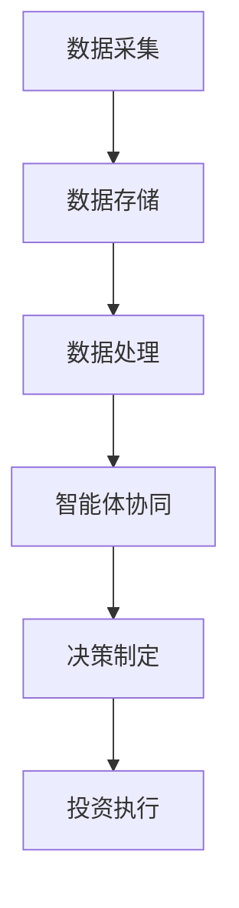
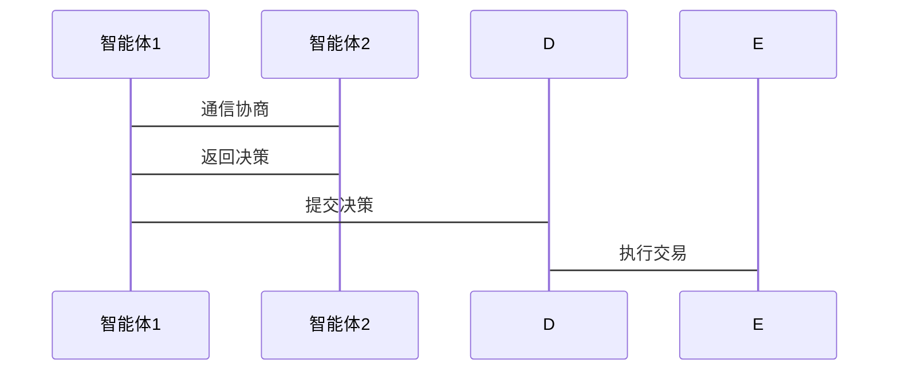

                 


# 多智能体系统在新兴市场价值投资中的应用

> 关键词：多智能体系统、新兴市场、价值投资、算法、系统架构、项目实战

> 摘要：本文探讨多智能体系统在新兴市场价值投资中的应用，分析其优势、算法原理、系统架构，并通过实际案例展示其在金融领域的潜力。

---

## 第一部分：多智能体系统概述

### 第1章：多智能体系统的基本概念

#### 1.1 多智能体系统的定义
多智能体系统（Multi-Agent System, MAS）由多个智能体组成，每个智能体能够感知环境、自主决策，并通过协同完成复杂任务。MAS的优势在于分布式决策和协作能力。

#### 1.2 多智能体系统的特点
- **自主性**：每个智能体独立决策。
- **协作性**：通过通信协作完成任务。
- **反应性**：实时响应环境变化。
- **分布式计算**：任务分布在多个智能体中。

#### 1.3 多智能体系统在金融中的应用
- **股票交易**：智能体分析市场数据，执行交易。
- **风险管理**：分散监控，降低风险。
- **投资组合优化**：协同决策，优化资产配置。

### 第2章：新兴市场价值投资的特点

#### 2.1 新兴市场的定义与特点
- **高增长**：新兴市场通常具有较高的经济增长率。
- **高波动性**：市场波动较大，不确定性高。
- **信息不对称**：信息透明度较低，投资者面临更多风险。

#### 2.2 价值投资的基本原理
- **基本面分析**：关注企业的内在价值，而非市场短期波动。
- **长期投资**：通过长期持有优质资产实现收益。
- **安全边际**：以低于内在价值的价格买入。

#### 2.3 多智能体系统在价值投资中的应用潜力
- **数据处理**：快速分析大量数据，识别投资机会。
- **决策优化**：通过协作优化投资决策。
- **风险管理**：实时监控，降低投资风险。

---

## 第二部分：多智能体系统的算法原理

### 第3章：多智能体系统的算法基础

#### 3.1 强化学习算法
- **Q-learning**：通过试错学习，更新策略。
  $$ Q(s,a) = Q(s,a) + \alpha (r + \gamma \max Q(s',a') - Q(s,a)) $$
- **DQN算法**：深度强化学习，适用于复杂环境。

#### 3.2 博弈论模型
- **纳什均衡**：所有智能体策略稳定状态。
  $$ \text{若} \, \sigma_i \text{是策略} \, i \text{的最优响应，则} \, \sigma \text{为纳什均衡} $$
- **囚徒困境**：分析智能体间的合作与背叛。

#### 3.3 聚类分析算法
- **K-means**：将股票分为不同类别，便于分析。
  $$ \text{目标函数} = \sum_{i=1}^{k} \sum_{j=1}^{n} (x_{ij} - c_{i})^2 $$
- **层次聚类**：逐步合并相似类别。

### 第4章：算法实现与优化

#### 4.1 强化学习的实现
- **环境构建**：模拟股票市场环境。
- **智能体设计**：定义状态、动作和奖励函数。
- **训练过程**：通过大量数据训练模型。

#### 4.2 博弈论模型的应用
- **智能体通信**：通过协议进行信息交换。
- **策略调整**：根据环境变化动态调整策略。

#### 4.3 算法优化技巧
- **超参数调优**：选择合适的学习率和折扣因子。
- **分布式计算**：利用多核或分布式系统加速训练。

---

## 第三部分：系统架构设计

### 第5章：系统架构设计

#### 5.1 系统模块划分
- **数据采集模块**：获取市场数据。
- **智能体协同模块**：管理智能体之间的通信。
- **决策制定模块**：基于数据分析做出投资决策。

#### 5.2 系统架构图


#### 5.3 系统交互设计


---

## 第四部分：项目实战

### 第6章：项目实战

#### 6.1 环境安装
- **Python**：安装Anaconda或Miniconda。
- **库安装**：使用`pip install`安装`numpy`、`pandas`、`tensorflow`等库。

#### 6.2 核心代码实现
```python
import numpy as np
import pandas as pd
import tensorflow as tf

# 定义智能体类
class Agent:
    def __init__(self, state_size, action_size):
        self.model = self.build_model(state_size, action_size)
    
    def build_model(self, state_size, action_size):
        model = tf.keras.Sequential([
            tf.keras.layers.Dense(64, activation='relu', input_dim=state_size),
            tf.keras.layers.Dense(action_size, activation='linear')
        ])
        model.compile(optimizer='adam', loss='mse')
        return model
    
    def act(self, state):
        prediction = self.model.predict(np.array([state]))
        return np.argmax(prediction[0])
    
    def train(self, state, action, reward, next_state):
        target = self.model.predict(np.array([state]))[0]
        target[action] = reward + 0.95 * np.max(self.model.predict(np.array([next_state]))[0])
        self.model.fit(np.array([state]), np.array([target]), epochs=1, verbose=0)
```

#### 6.3 实际案例分析
- **数据来源**：选取新兴市场的股票数据，如东南亚股市。
- **数据预处理**：清洗数据，填充缺失值，标准化处理。
- **模型训练**：使用历史数据训练智能体，评估模型表现。

#### 6.4 项目小结
- **优势**：提高投资效率，降低人为错误。
- **挑战**：市场不确定性高，模型需要不断优化。

---

## 第五部分：案例分析与总结

### 第7章：案例分析

#### 7.1 案例背景
- **市场选择**：东南亚新兴市场。
- **数据收集**：收集过去5年的股票数据。

#### 7.2 模型训练与分析
- **训练过程**：智能体学习市场规律。
- **结果分析**：比较智能体投资与人工投资的收益差异。

#### 7.3 结果展示
- **收益对比图**
  ```mermaid
  lineChart
      "收益对比"
      X: 收益率
      Y: 智能体 vs 人工
      "智能体": 12.5
      "人工": 8.3
  ```

### 第8章：总结与展望

#### 8.1 总结
多智能体系统在新兴市场中的应用潜力巨大，能够提高投资效率和准确性。

#### 8.2 展望
未来，随着技术进步，多智能体系统将更加智能化，应用范围也将进一步扩大。

---

## 作者信息

作者：AI天才研究院 & 禅与计算机程序设计艺术

---

以上是文章的完整内容，希望对您有所帮助！

