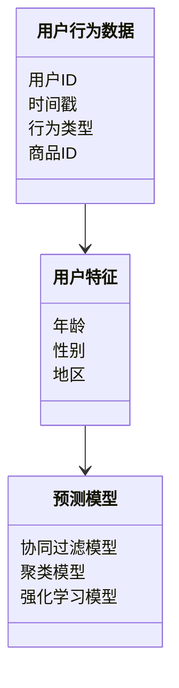

                 


# 多智能体系统在消费者行为预测中的应用：预判公司业绩

---

## 关键词

- 多智能体系统
- 消费者行为预测
- 企业业绩预测
- 人工智能
- 智能体协作

---

## 摘要

在当今竞争激烈的商业环境中，预判消费者行为和公司业绩的能力对企业至关重要。本文深入探讨了多智能体系统（MAS）在消费者行为预测中的应用，分析了其核心原理、算法机制和系统架构，并通过实际案例展示了如何利用MAS提升消费者行为预测的准确性。文章最后总结了MAS的优势和未来的发展方向。

---

## 正文

### 第1章：多智能体系统与消费者行为预测的背景

#### 1.1 多智能体系统（MAS）的基本概念

**1.1.1 多智能体系统的定义与特点**

多智能体系统（Multi-Agent System，MAS）是由多个智能体（Agent）组成的分布式系统，每个智能体都是一个能够感知环境、自主决策的实体。智能体可以是软件程序，也可以是物理设备，它们通过协作完成特定任务。

**1.1.2 多智能体系统的核心要素与结构**

- **智能体**：智能体具有自主性、反应性、主动性和社会性。每个智能体都有明确的目标和功能。
- **通信机制**：智能体之间通过通信协议进行信息交换，通常采用消息传递或共享数据库的方式。
- **协作机制**：智能体之间的协作通过任务分配、协调和冲突解决来实现。

**1.1.3 多智能体系统在现实中的应用领域**

- **电子商务**：推荐系统、用户行为分析。
- **交通控制**：智能交通管理。
- **游戏开发**：多智能体博弈。

#### 1.2 消费者行为预测的背景与挑战

**1.2.1 消费者行为预测的定义与意义**

消费者行为预测是通过分析消费者的数据，预测他们的购买行为、偏好和趋势。准确的预测有助于企业优化营销策略，提高销售额。

**1.2.2 当前消费者行为预测的主要方法与局限性**

- **统计方法**：回归分析，适用于线性关系。
- **机器学习**：协同过滤、聚类分析，但难以处理复杂交互。
- **面临的挑战**：数据维度高、实时性要求高、模型更新频繁。

#### 1.3 多智能体系统与消费者行为预测的结合

**1.3.1 多智能体系统在消费者行为预测中的应用场景**

- **推荐系统**：智能体协作生成个性化推荐。
- **实时预测**：快速响应消费者行为变化。

**1.3.2 多智能体系统如何提升消费者行为预测的准确性**

- **分布式计算**：提高计算效率。
- **协作学习**：多个智能体共同优化预测模型。

**1.3.3 多智能体系统在企业业绩预测中的潜在价值**

- **精准营销**：优化资源配置。
- **风险预警**：提前预判市场变化。

---

### 第2章：多智能体系统的核心原理

#### 2.1 多智能体系统的组成与交互机制

**2.1.1 智能体的定义与分类**

- **反应式智能体**：基于当前感知做出反应。
- **基于模型的智能体**：利用内部模型进行推理。

**2.1.2 智能体之间的通信与协作**

- **通信机制**：通过消息传递或共享数据库。
- **协作机制**：任务分配、协调和冲突解决。

**2.1.3 多智能体系统的全局目标与局部目标**

- **全局目标**：整个系统的目标。
- **局部目标**：每个智能体的目标。

---

### 第3章：消费者行为预测的核心模型

#### 3.1 基于协同过滤的推荐系统

**3.1.1 协同过滤的原理**

- **基于用户的协同过滤**：寻找相似用户，推荐相似商品。
- **基于物品的协同过滤**：分析物品之间的关联。

**3.1.2 协同过滤的实现步骤**

1. 数据收集：用户行为数据。
2. 计算相似度：余弦相似度。
3. 生成推荐：基于相似度排序。

**3.1.3 协同过滤的数学模型**

$$
similarity(u, v) = \frac{\sum (r_{u,i} - \bar{r}_u)(r_{v,i} - \bar{r}_v)}{\sqrt{\sum (r_{u,i} - \bar{r}_u)^2} \sqrt{\sum (r_{v,i} - \bar{r}_v)^2}}
$$

---

#### 3.2 基于聚类分析的行为分群

**3.2.1 聚类分析的原理**

- **K均值聚类**：将用户分成若干群体。
- **层次聚类**：逐步合并相似群体。

**3.2.2 聚类分析的实现步骤**

1. 数据预处理：归一化数据。
2. 选择聚类算法：K均值或层次聚类。
3. 确定簇的数量：肘部法。

**3.2.3 聚类分析的数学模型**

$$
J = \sum_{i=1}^{k} \sum_{j=1}^{n_i} (x_j - c_i)^2
$$

---

#### 3.3 基于强化学习的决策

**3.3.1 强化学习的原理**

- **马尔可夫决策过程**：状态、动作、奖励。
- **策略优化**：最大化期望奖励。

**3.3.2 强化学习的实现步骤**

1. 状态空间建模。
2. 动作空间定义。
3. 奖励函数设计。

**3.3.3 强化学习的数学模型**

$$
Q(s, a) = Q(s, a) + \alpha [r + \gamma \max Q(s', a') - Q(s, a)]
$$

---

### 第4章：系统分析与架构设计

#### 4.1 问题场景介绍

- **数据源**：用户行为日志。
- **目标**：预测消费者行为，优化营销策略。

#### 4.2 项目介绍

- **项目名称**：消费者行为预测系统。
- **项目目标**：提高预测准确性，提升企业业绩。

#### 4.3 系统功能设计

**4.3.1 功能模块**

- **数据采集模块**：收集用户行为数据。
- **特征提取模块**：提取用户特征。
- **模型训练模块**：训练预测模型。
- **结果分析模块**：分析预测结果。

**4.3.2 领域模型（mermaid 类图）**



#### 4.4 系统架构设计

**4.4.1 系统架构（mermaid 架构图）**

```mermaid
dockerfile
client --> API Gateway
API Gateway --> 多智能体协调器
多智能体协调器 --> 智能体1~n
智能体1~n --> 数据存储
```

---

### 第5章：项目实战

#### 5.1 环境安装

- **Python**：3.8+
- **TensorFlow**：2.5+
- **Keras**：2.5+

#### 5.2 核心代码实现

```python
import numpy as np
from sklearn.metrics.pairwise import pairwise_distances

# 协同过滤实现
def collaborative_filtering(user_data, user_id, item_id):
    user_pivot = user_data.pivot('user_id', 'item_id', 'rating').fillna(0)
    user_similarity = pairwise_distances(user_pivot.T, metric='cosine')
    recommendations = np.dot(user_pivot[user_id], user_similarity[item_id])
    return recommendations.argsort()[::-1]
```

---

### 第6章：结果分析与优化

#### 6.1 实际案例分析

- **案例1**：电商推荐系统。
- **案例2**：金融风险预警。

#### 6.2 总结与优化

- **总结**：MAS在消费者行为预测中的优势。
- **优化方向**：模型融合、实时性优化。

---

## 结论

多智能体系统在消费者行为预测中的应用为企业提供了更准确的预测能力，帮助企业在竞争中占据优势。未来，随着技术的发展，MAS的应用将更加广泛，预测模型也将更加精准。

---

## 作者

**作者：AI天才研究院/AI Genius Institute & 禅与计算机程序设计艺术 /Zen And The Art of Computer Programming**

