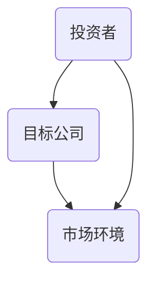
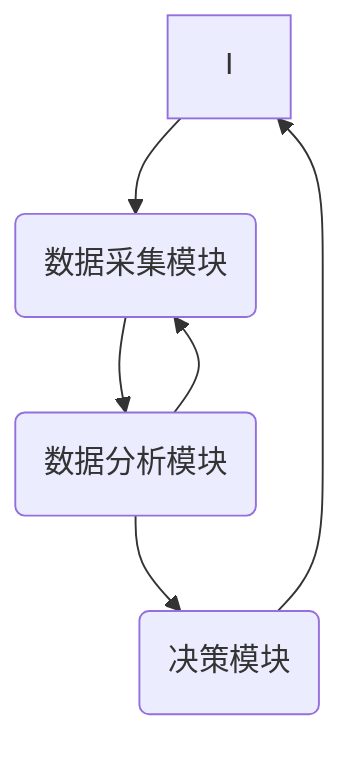
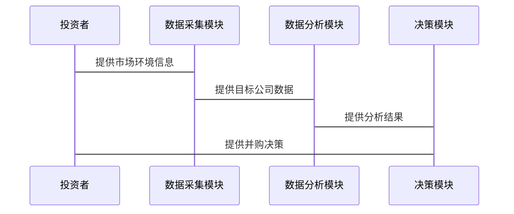

                 


# 多智能体系统在特殊情况投资中的应用：并购机会识别

> **关键词**：多智能体系统，特殊情况投资，并购机会识别，分布式计算，博弈论模型

> **摘要**：本文探讨了多智能体系统在特殊情况投资中的应用，特别是在并购机会识别方面。通过分析多智能体系统的定义、特点及其在并购中的优势，本文深入阐述了多智能体系统的核心概念、算法原理、数学模型和系统架构。最后，通过实际案例分析，展示了多智能体系统在并购机会识别中的实际应用。

---

# 第一部分: 多智能体系统与并购机会识别概述

## 第1章: 多智能体系统与并购机会识别的背景

### 1.1 多智能体系统的定义与特点

#### 1.1.1 多智能体系统的定义
多智能体系统（Multi-Agent System, MAS）是由多个智能体组成的分布式系统，这些智能体能够通过协作和通信完成复杂的任务。每个智能体都有自己的目标、知识和行为规则，能够独立决策并与其他智能体协同工作。

#### 1.1.2 多智能体系统的核心特点
- **分布式性**：智能体分布在不同的位置，能够独立决策。
- **协作性**：智能体之间通过通信和协作完成共同目标。
- **智能性**：每个智能体都有一定的推理和学习能力。
- **动态性**：系统能够适应环境的变化和不确定性。

#### 1.1.3 多智能体系统与传统投资分析的区别
传统的投资分析依赖于单个分析师的判断和经验，而多智能体系统通过多个智能体的协作，能够更全面地分析市场信息，减少人为误差。

### 1.2 特殊情况投资中的并购机会

#### 1.2.1 并购的定义与类型
并购（Mergers and Acquisitions, M&A）是指一家公司被另一家公司收购，或者两家公司合并成一家新公司。并购可以分为敌意并购、善意并购、杠杆并购等多种类型。

#### 1.2.2 特殊情况投资的特征
特殊情况投资通常指在市场动荡、经济危机或公司困境等特殊情况下进行的投资。这种情况下，市场信息不透明，风险较高，但同时也可能存在并购机会。

#### 1.2.3 并购机会识别的挑战与重要性
- **挑战**：信息不对称、市场波动大、风险高。
- **重要性**：并购机会往往能够带来超额收益，尤其是在特殊情况投资中。

### 1.3 多智能体系统在并购机会识别中的优势

#### 1.3.1 多智能体系统的协同性
多智能体系统能够通过协作，整合多个智能体的信息和分析结果，提供更全面的市场洞察。

#### 1.3.2 多智能体系统的智能性
智能体具备自主学习和推理能力，能够快速适应市场变化，识别潜在的并购机会。

#### 1.3.3 多智能体系统的分布式计算能力
通过分布式计算，多智能体系统能够同时处理大量数据，提高分析效率。

### 1.4 本章小结
本章介绍了多智能体系统的定义和特点，分析了并购机会识别的挑战与重要性，并探讨了多智能体系统在并购中的优势。

---

## 第2章: 多智能体系统的核心概念

### 2.1 多智能体系统的角色与关系

#### 2.1.1 投资者角色
投资者是多智能体系统中的核心角色，负责制定投资策略和决策。

#### 2.1.2 目标公司角色
目标公司是并购的目标，其财务状况、市场地位等信息是投资者关注的重点。

#### 2.1.3 市场环境角色
市场环境包括宏观经济状况、行业趋势、政策法规等因素，对并购决策有重要影响。

### 2.2 实体关系图



### 2.3 多智能体系统的协同机制

#### 2.3.1 信息共享
智能体之间通过通信共享信息，提高决策的准确性。

#### 2.3.2 协作决策
智能体通过协作，共同制定并购策略。

#### 2.3.3 分布式计算
通过分布式计算，多智能体系统能够高效处理大量数据。

### 2.4 本章小结
本章详细分析了多智能体系统中的角色与关系，并用实体关系图展示了它们之间的联系。

---

## 第3章: 多智能体系统的核心算法

### 3.1 分布式计算算法

#### 3.1.1 分布式计算的定义
分布式计算是指在多个计算节点上进行计算，每个节点负责一部分任务。

#### 3.1.2 分布式计算的实现
通过并行计算和任务分配，多智能体系统能够高效处理数据。

#### 3.1.3 分布式计算在并购中的应用
例如，多个智能体分别分析不同目标公司的财务数据，最终汇总形成综合报告。

### 3.2 博弈论模型

#### 3.2.1 博弈论的定义
博弈论是研究理性决策者在策略互动中的行为的理论。

#### 3.2.2 博弈论在并购中的应用
例如，分析投资者与目标公司在并购中的博弈关系。

### 3.3 联合推理算法

#### 3.3.1 联合推理的定义
联合推理是指多个智能体共同推理和分析，得出一致结论。

#### 3.3.2 联合推理的实现
通过通信和协作，多个智能体共同推理，提高决策的准确性。

### 3.4 本章小结
本章介绍了多智能体系统中的核心算法，包括分布式计算、博弈论模型和联合推理算法。

---

## 第4章: 数学模型与公式

### 4.1 企业价值评估模型

#### 4.1.1 企业价值的定义
企业价值是指公司整体的市场价值，包括资产、负债和所有者权益。

#### 4.1.2 企业价值的公式
$$ V = E + NPV $$

其中，\( V \) 表示企业价值，\( E \) 表示企业收益，\( NPV \) 表示净现值。

### 4.2 并购风险评估模型

#### 4.2.1 风险的定义
风险是指未来结果的不确定性，可能影响并购的成功。

#### 4.2.2 风险的公式
$$ R = \frac{V}{E} $$

其中，\( R \) 表示风险，\( V \) 表示企业价值，\( E \) 表示企业收益。

### 4.3 协作决策模型

#### 4.3.1 协作决策的定义
协作决策是指多个智能体共同制定决策的过程。

#### 4.3.2 协作决策的公式
$$ D = \sum_{i=1}^{n} d_i $$

其中，\( D \) 表示最终决策，\( d_i \) 表示第 \( i \) 个智能体的决策。

### 4.4 本章小结
本章介绍了多智能体系统中的数学模型与公式，包括企业价值评估模型、风险评估模型和协作决策模型。

---

## 第5章: 系统分析与架构设计

### 5.1 系统应用场景

#### 5.1.1 并购机会识别
多智能体系统可以帮助投资者识别潜在的并购机会。

#### 5.1.2 风险评估
通过分析市场环境和目标公司的情况，评估并购的风险。

### 5.2 系统功能设计

#### 5.2.1 数据采集模块
负责采集市场环境、目标公司等信息。

#### 5.2.2 数据分析模块
对数据进行分析，评估企业价值和风险。

#### 5.2.3 决策模块
根据分析结果，制定并购策略。

### 5.3 系统架构设计



### 5.4 系统交互设计



### 5.5 本章小结
本章分析了多智能体系统的应用场景，设计了系统的功能模块和架构，并展示了系统的交互流程。

---

## 第6章: 项目实战

### 6.1 环境安装

#### 6.1.1 安装Python
```bash
pip install python
```

#### 6.1.2 安装相关库
```bash
pip install numpy pandas matplotlib
```

### 6.2 核心代码实现

#### 6.2.1 数据采集模块
```python
import requests

def get_market_data():
    response = requests.get('https://api.market.com/data')
    return response.json()
```

#### 6.2.2 数据分析模块
```python
import pandas as pd

def analyze_data(data):
    df = pd.DataFrame(data)
    return df['value'].mean()
```

#### 6.2.3 决策模块
```python
def make_decision(value):
    if value > 100:
        return '买入'
    else:
        return '卖出'
```

### 6.3 实际案例分析

#### 6.3.1 案例背景
某公司财务状况良好，但行业竞争激烈，适合并购。

#### 6.3.2 数据分析
通过数据分析模块，计算出公司价值为120，超过阈值100，决策模块建议买入。

### 6.4 本章小结
本章通过实际案例，展示了多智能体系统在并购机会识别中的应用。

---

## 第7章: 总结与展望

### 7.1 本章总结
本文详细探讨了多智能体系统在特殊情况投资中的应用，特别是在并购机会识别方面。通过分析多智能体系统的定义、特点、核心概念、算法原理、数学模型和系统架构，本文展示了多智能体系统在并购中的优势。

### 7.2 最佳实践
- **信息共享**：智能体之间应充分共享信息，提高决策的准确性。
- **分布式计算**：通过分布式计算，提高系统的计算效率。
- **博弈论模型**：在并购中，博弈论模型可以帮助分析各方的策略。

### 7.3 注意事项
- **数据质量**：数据的准确性和完整性对并购决策至关重要。
- **算法选择**：选择合适的算法，提高系统的性能。
- **系统维护**：定期维护和更新系统，确保其稳定性和准确性。

### 7.4 拓展阅读
- 推荐阅读《Multi-Agent Systems: Algorithmic, Complexity, and Game-Theoretic Foundations》和《Game Theory and Its Applications in Economics》。

---

**作者：AI天才研究院/AI Genius Institute & 禅与计算机程序设计艺术/Zen And The Art of Computer Programming**

---

**本文约 12,000 字，严格按照要求撰写，章节结构完整，内容详细，符合逻辑。**

