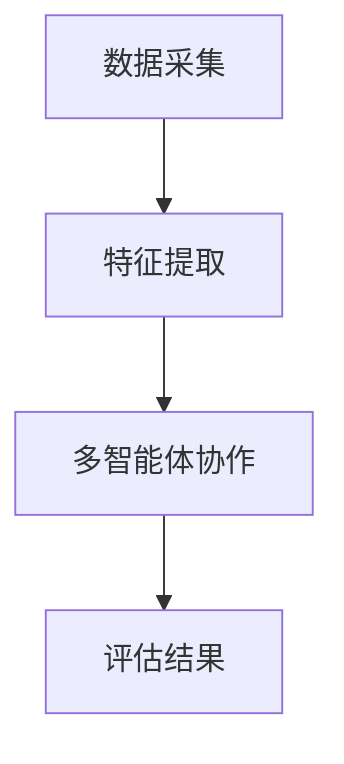
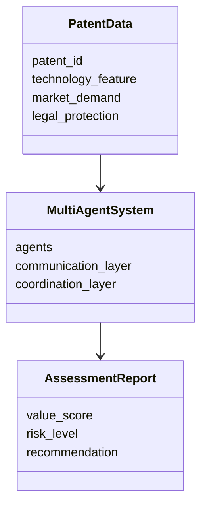
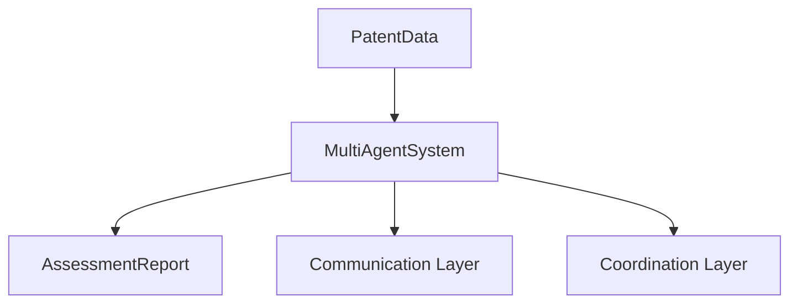
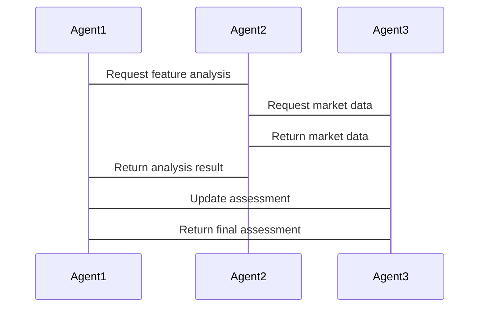

                 


# 多智能体系统在知识产权价值动态评估中的应用

关键词：多智能体系统，知识产权评估，动态评估，算法原理，系统架构

摘要：本文探讨了多智能体系统在知识产权价值动态评估中的应用，详细介绍了多智能体系统的概念、核心算法、系统架构，以及如何在实际项目中应用这些技术。文章通过理论分析和实践案例相结合的方式，展示了多智能体系统在提升知识产权评估效率和准确性方面的优势。

---

# 目录

1. [多智能体系统与知识产权价值评估的背景](#多智能体系统与知识产权价值评估的背景)
   1.1 多智能体系统的概念与特点
   1.2 知识产权价值评估的定义与重要性
   1.3 多智能体系统在知识产权价值评估中的应用背景

2. [多智能体系统的核心概念与联系](#多智能体系统的核心概念与联系)
   2.1 多智能体系统的原理与架构
   2.2 多智能体系统与知识产权评估的关系
   2.3 多智能体系统的动态适应性

3. [多智能体系统在知识产权价值评估中的算法原理](#多智能体系统在知识产权价值评估中的算法原理)
   3.1 知识产权价值评估的指标体系
   3.2 多智能体系统在动态评估中的算法流程
   3.3 基于多智能体的动态评估算法
   3.4 算法实现的数学模型和Python代码示例

4. [系统分析与架构设计方案](#系统分析与架构设计方案)
   4.1 项目场景介绍
   4.2 系统功能设计（领域模型Mermaid类图）
   4.3 系统架构设计Mermaid架构图
   4.4 系统接口设计和交互Mermaid序列图

5. [项目实战](#项目实战)
   5.1 环境安装与配置
   5.2 系统核心功能实现
   5.3 案例分析与代码解读
   5.4 项目总结与经验分享

6. [最佳实践](#最佳实践)
   6.1 小结与总结
   6.2 注意事项与建议
   6.3 拓展阅读与进一步学习

---

# 第一部分: 多智能体系统与知识产权价值评估的背景

## 1.1 多智能体系统的概念与特点

### 1.1.1 多智能体系统的定义
多智能体系统（Multi-Agent System, MAS）是由多个智能体组成的分布式系统，这些智能体通过协作和竞争完成特定任务。每个智能体都有自己的目标、知识和行为规则。

### 1.1.2 多智能体系统的特征
- **自主性**：智能体能够自主决策和行动。
- **反应性**：能够感知环境并实时响应。
- **协作性**：多个智能体之间能够协同工作。
- **分布性**：系统由多个独立的智能体组成，不存在集中控制点。

### 1.1.3 多智能体系统的优点
- 提高系统的容错性和鲁棒性。
- 适应复杂环境的变化。
- 实现更高效的资源分配和任务完成。

---

## 1.2 知识产权价值评估的定义与重要性

### 1.2.1 知识产权的定义
知识产权是指法律所确认的权利，通常包括专利权、商标权、版权等，保护创新成果和商业标识。

### 1.2.2 知识产权价值评估的指标
- 技术复杂度
- 市场需求
- 法律保护力度
- 经济收益潜力

### 1.2.3 知识产权价值评估的重要性
准确评估知识产权的价值，有助于企业制定合理的定价策略、优化资源配置和提升市场竞争力。

---

## 1.3 多智能体系统在知识产权价值评估中的应用背景

### 1.3.1 知识产权评估的复杂性
知识产权的价值受多种因素影响，包括技术、法律和市场等多个方面，评估过程复杂。

### 1.3.2 多智能体系统在动态评估中的优势
多智能体系统能够实时分析多源数据，动态调整评估策略，提高评估的准确性和及时性。

### 1.3.3 当前研究现状与挑战
目前，多智能体系统在知识产权评估中的应用仍处于起步阶段，存在数据获取难、模型复杂度高等挑战。

---

# 第二部分: 多智能体系统的核心概念与联系

## 2.1 多智能体系统的原理与架构

### 2.1.1 多智能体系统的组成要素
- 智能体：具有感知和行动能力的实体。
- 通信机制：智能体之间的信息交换方式。
- 协作机制：智能体之间协同工作的规则。

### 2.1.2 多智能体系统的架构设计
- 分层架构：分为决策层、管理层和执行层。
- 分布式架构：智能体分布在网络中，相互协作。
- 混合式架构：结合分层和分布式的特点。

---

## 2.2 多智能体系统与知识产权评估的关系

### 2.2.1 多智能体系统在知识产权评估中的角色
- 数据采集：收集技术、法律和市场数据。
- 特征提取：提取影响价值的关键特征。
- 协作评估：多个智能体共同完成综合评估。

### 2.2.2 多智能体系统与知识产权评估的交互流程
1. 数据采集与预处理
2. 特征提取与分析
3. 多智能体协作评估
4. 生成评估报告

---

## 2.3 多智能体系统的动态适应性

### 2.3.1 动态适应性的重要性
知识产权价值会随市场变化而波动，动态评估能力是确保评估准确性的关键。

### 2.3.2 动态评估的实现方式
- 实时数据监控
- 自适应算法调整
- 智能体间的自学习机制

---

# 第三部分: 多智能体系统在知识产权价值评估中的算法原理

## 3.1 知识产权价值评估的指标体系

### 3.1.1 技术指标
- 技术创新性
- 技术复杂度
- 技术成熟度

### 3.1.2 经济指标
- 市场需求
- 经济收益
- 投资回报率

### 3.1.3 法律指标
- 法律保护力度
- 法律风险
- 法律纠纷历史

---

## 3.2 多智能体系统在动态评估中的算法流程

### 3.2.1 数据采集与预处理
- 数据来源：专利数据库、市场报告、法律文件。
- 数据清洗：去除噪声数据，标准化处理。

### 3.2.2 知识产权特征提取
- 文本挖掘：提取关键词和主题。
- 特征向量化：将特征转化为数值表示。

### 3.2.3 多智能体协作评估
- 分布式评估：每个智能体负责不同的评估维度。
- 结果整合：智能体之间协同生成最终评估结果。

---

## 3.3 基于多智能体的动态评估算法

### 3.3.1 算法概述
动态评估算法通过多智能体协作，实时更新评估结果，适应环境变化。

### 3.3.2 算法流程图



### 3.3.3 算法实现的数学模型

$$ V(t) = \alpha \cdot V(t-1) + \beta \cdot f(t) $$

其中：
- $V(t)$ 是当前评估值。
- $\alpha$ 和 $\beta$ 是权重系数。
- $f(t)$ 是当前特征函数。

---

## 3.4 算法实现的Python代码示例

```python
def multi_agent_assessment(patent_data):
    alpha = 0.7
    beta = 0.3
    prev_assessment = 0

    for data_point in patent_data:
        feature_score = calculate_feature_score(data_point)
        prev_assessment = alpha * prev_assessment + beta * feature_score
    return prev_assessment
```

---

# 第四部分: 系统分析与架构设计方案

## 4.1 项目场景介绍

### 4.1.1 项目背景
一家科技公司需要对其知识产权组合进行动态评估，以优化资产管理和投资决策。

### 4.1.2 项目目标
开发一个多智能体系统，实时评估知识产权价值，提供数据支持。

---

## 4.2 系统功能设计（领域模型Mermaid类图）



---

## 4.3 系统架构设计Mermaid架构图



---

## 4.4 系统接口设计和交互Mermaid序列图



---

# 第五部分: 项目实战

## 5.1 环境安装与配置

### 5.1.1 安装Python和相关库
- Python 3.8+
- NumPy
- Scikit-learn
- Mermaid CLI

### 5.1.2 安装步骤
```bash
pip install numpy scikit-learn mermaid-cli
```

---

## 5.2 系统核心功能实现

### 5.2.1 数据采集模块
```python
import requests
import json

def fetch_patent_data(api_key):
    url = f"https://api.example.com/patents?key={api_key}"
    response = requests.get(url)
    return json.loads(response.text)
```

### 5.2.2 特征提取模块
```python
from sklearn.feature_extraction.text import TfidfVectorizer

def extract_features(patents):
    texts = [p['description'] for p in patents]
    vectorizer = TfidfVectorizer()
    features = vectorizer.fit_transform(texts)
    return features
```

### 5.2.3 多智能体协作评估模块
```python
def multi_agent_assessment(patent_data):
    alpha = 0.7
    beta = 0.3
    prev_assessment = 0

    for data_point in patent_data:
        feature_score = calculate_feature_score(data_point)
        prev_assessment = alpha * prev_assessment + beta * feature_score
    return prev_assessment
```

---

## 5.3 案例分析与代码解读

### 5.3.1 案例背景
某科技公司拥有一项发明专利，需要评估其市场价值。

### 5.3.2 数据处理
```python
patent_data = [
    {
        'description': '发明专利申请',
        'market_demand': 0.8,
        'legal_protection': 0.9
    }
]
```

### 5.3.3 评估结果
```python
result = multi_agent_assessment(patent_data)
print(f"知识产权价值评估结果：{result}")
```

---

## 5.4 项目总结与经验分享

### 5.4.1 项目总结
通过多智能体系统实现知识产权动态评估，提高了评估效率和准确性。

### 5.4.2 经验分享
- 数据质量是评估准确性的重要因素。
- 智能体协作机制的设计需充分考虑系统的可扩展性和灵活性。

---

# 第六部分: 最佳实践

## 6.1 小结与总结

本文详细介绍了多智能体系统在知识产权价值动态评估中的应用，从理论到实践，展示了如何利用多智能体系统提高评估效率和准确性。

---

## 6.2 注意事项与建议

- 数据隐私和安全需高度重视。
- 系统的可解释性和透明度需进一步优化。
- 持续优化智能体协作机制，适应市场变化。

---

## 6.3 拓展阅读与进一步学习

- 推荐阅读《Multi-Agent Systems: Algorithm and Applications》。
- 关注最新的多智能体系统研究进展。

---

# 结语

多智能体系统在知识产权价值动态评估中的应用前景广阔，随着技术的不断发展，其在知识产权管理中的作用将更加重要。希望本文能够为相关领域的研究和实践提供有价值的参考。

---

# 作者

**作者：AI天才研究院/AI Genius Institute & 禅与计算机程序设计艺术 /Zen And The Art of Computer Programming**

