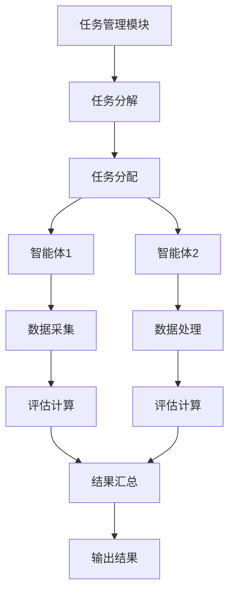
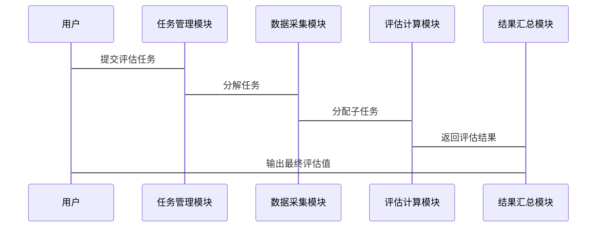

                 


# 多智能体系统在知识产权价值评估中的应用

> **关键词**: 多智能体系统, 知识产权评估, 价值评估, 人工智能, 知识产权

> **摘要**: 本文探讨了多智能体系统（Multi-Agent Systems, MAS）在知识产权价值评估中的应用。首先，介绍了知识产权评估的现状及其面临的挑战，分析了多智能体系统的定义、特征及其在知识产权评估中的潜力。接着，详细讲解了多智能体系统的原理与实现，包括通信机制、协作机制、决策机制等。然后，阐述了多智能体协作算法的原理与实现，包括数学模型与公式、算法优化与改进等。最后，通过实际案例分析，展示了多智能体系统在知识产权评估中的具体应用，总结了系统架构设计、项目实战经验及最佳实践。本文旨在为知识产权评估领域提供一种基于多智能体系统的新思路，推动该领域的智能化与高效化。

---

## 第一章: 多智能体系统与知识产权评估的概述

### 1.1 知识产权评估的现状与挑战

#### 1.1.1 知识产权的基本概念
知识产权（Intellectual Property, IP）是指人们在创造性的智力劳动中所形成的成果，包括专利、商标、著作权、商业秘密等。知识产权评估是对知识产权的价值进行量化的过程，通常涉及技术评估、市场分析、法律判断等多个方面。

#### 1.1.2 知识产权评估的难点与痛点
知识产权评估的难点主要体现在以下几个方面：
1. **信息分散**：知识产权涉及的技术、法律、市场等信息分散在不同的领域，难以整合。
2. **评估复杂性**：知识产权的价值不仅取决于技术本身的先进性，还与市场需求、法律保护等因素密切相关，评估过程复杂。
3. **数据不足**：许多情况下，知识产权的市场数据不足，难以准确评估其价值。
4. **评估标准不统一**：不同领域的知识产权评估标准存在差异，缺乏统一的评估框架。

#### 1.1.3 多智能体系统在知识产权评估中的潜在价值
多智能体系统（MAS）是一种由多个智能体组成的分布式系统，每个智能体都有一定的自主性，能够通过通信和协作完成复杂任务。MAS在知识产权评估中的潜在价值主要体现在以下几个方面：
1. **信息整合**：多个智能体可以分别负责不同领域（如技术分析、市场调研、法律咨询）的信息收集与分析，实现信息的高效整合。
2. **协作优化**：通过智能体之间的协作，可以优化评估过程，提高评估的准确性和效率。
3. **动态适应**：MAS能够根据外部环境的变化（如市场波动、政策调整）动态调整评估策略，增强评估的灵活性。

### 1.2 多智能体系统的基本概念

#### 1.2.1 多智能体系统的定义与特征
多智能体系统（MAS）是由多个智能体（Agent）组成的分布式系统，这些智能体通过通信和协作完成共同的目标。MAS具有以下特征：
1. **自主性**：每个智能体都具有一定的自主性，能够独立决策。
2. **反应性**：智能体能够根据环境的变化做出实时反应。
3. **协作性**：智能体之间通过通信和协作完成复杂任务。
4. **分布性**：智能体分布在网络的不同节点上，具有一定的独立性。

#### 1.2.2 多智能体系统的核心组成部分
多智能体系统的核心组成部分包括：
1. **智能体**：具有自主性、反应性和协作性的智能实体。
2. **通信机制**：智能体之间进行信息交换的通道。
3. **协作机制**：智能体之间实现协作的规则和协议。
4. **决策机制**：智能体根据环境信息做出决策的算法。

#### 1.2.3 多智能体系统与单智能体系统的区别
| 特性                | 多智能体系统（MAS）                              | 单智能体系统（SAS）                              |
|---------------------|-----------------------------------------------|-----------------------------------------------|
| 系统结构            | 分布式结构，多个智能体协作                     | 集中式结构，单个智能体独立运行                   |
| 信息处理能力        | 能够处理大规模、复杂的信息                   | 信息处理能力有限，难以应对复杂任务               |
| 协作能力            | 智能体之间能够协作完成复杂任务               | 单个智能体无法协作，任务独立性高                   |
| 灵活性              | 系统具有较高的灵活性，能够适应环境变化        | 系统灵活性较低，难以快速适应环境变化             |
| 应用场景            | 适用于需要多领域协作的复杂任务，如知识产权评估 | 适用于简单、独立的任务，如单一领域的数据分析   |

### 1.3 多智能体系统与知识产权评估的结合意义

#### 1.3.1 知识产权评估中的信息处理需求
知识产权评估需要综合考虑技术、法律、市场等多个维度的信息，涉及大量的数据收集与分析工作。传统的评估方法往往依赖于人工操作，效率低下且容易出错。

#### 1.3.2 多智能体系统在信息处理中的优势
多智能体系统能够通过多个智能体分别负责不同的信息处理任务，实现信息的高效整合与分析。例如，一个智能体可以负责技术分析，另一个智能体负责市场调研，通过协作完成综合评估。

#### 1.3.3 两者的结合对知识产权评估的创新意义
通过将多智能体系统引入知识产权评估，可以实现信息处理的智能化与高效化，提升评估的准确性和效率。同时，MAS的协作机制能够优化评估流程，降低评估成本，推动知识产权评估领域的创新。

### 1.4 本章小结
本章主要介绍了知识产权评估的现状与挑战，以及多智能体系统的基本概念和特征。通过分析MAS在知识产权评估中的潜在价值，为后续章节的深入探讨奠定了基础。

---

## 第二章: 多智能体系统的核心概念与知识产权评估的联系

### 2.1 多智能体系统的原理与实现

#### 2.1.1 多智能体系统的通信机制
通信机制是MAS实现协作的基础。智能体之间的通信可以通过以下几种方式实现：
1. **直接通信**：智能体之间通过共享内存或消息队列直接交换信息。
2. **间接通信**：智能体通过中间媒介（如数据库或消息 brokers）进行信息交换。

#### 2.1.2 多智能体系统的协作机制
协作机制是MAS实现共同目标的关键。常见的协作机制包括：
1. **基于承诺的协作**：智能体通过承诺（commitment）来协调行动。
2. **基于合同的协作**：智能体通过签订合同（contract）来明确各自的责任与义务。
3. **基于协商的协作**：智能体通过协商（negotiation）来达成一致。

#### 2.1.3 多智能体系统的决策机制
决策机制是MAS中智能体做出决策的核心。常见的决策机制包括：
1. **基于规则的决策**：根据预定义的规则做出决策。
2. **基于推理的决策**：通过逻辑推理得出决策。
3. **基于学习的决策**：通过机器学习算法进行决策。

### 2.2 多智能体系统与知识产权评估的核心联系

#### 2.2.1 知识产权评估中的信息处理需求
知识产权评估需要综合考虑技术、法律、市场等多个维度的信息，涉及大量的数据收集与分析工作。传统的评估方法往往依赖于人工操作，效率低下且容易出错。

#### 2.2.2 多智能体系统在信息处理中的具体应用
多智能体系统可以通过多个智能体分别负责不同的信息处理任务，实现信息的高效整合与分析。例如：
1. **技术分析智能体**：负责对专利的技术先进性进行评估。
2. **市场分析智能体**：负责对知识产权的市场价值进行评估。
3. **法律咨询智能体**：负责对知识产权的法律风险进行评估。

#### 2.2.3 两者的结合对知识产权评估的提升作用
通过将多智能体系统引入知识产权评估，可以实现信息处理的智能化与高效化，提升评估的准确性和效率。同时，MAS的协作机制能够优化评估流程，降低评估成本，推动知识产权评估领域的创新。

### 2.3 本章小结
本章主要探讨了多智能体系统的原理与实现，以及其与知识产权评估的核心联系。通过分析MAS在信息处理中的优势，为后续章节的深入探讨奠定了基础。

---

## 第三章: 多智能体协作算法的原理与实现

### 3.1 多智能体协作算法的基本原理

#### 3.1.1 基于多智能体协作的知识产权评估算法
基于多智能体协作的知识产权评估算法是一种分布式计算算法，通过多个智能体的协作完成知识产权价值的评估。算法的核心思想是将评估任务分解为多个子任务，由不同的智能体分别完成，最后将结果汇总得到最终的评估结果。

#### 3.1.2 算法的数学模型与公式
以下是一个简化的多智能体协作算法的数学模型：
$$
\text{评估值} = \sum_{i=1}^{n} w_i \cdot x_i
$$
其中，$w_i$ 是第 $i$ 个智能体的权重，$x_i$ 是第 $i$ 个智能体的评估结果。

#### 3.1.3 算法的核心步骤
1. **任务分解**：将知识产权评估任务分解为多个子任务。
2. **智能体分配**：将子任务分配给不同的智能体。
3. **信息收集**：智能体收集与子任务相关的数据。
4. **评估计算**：智能体根据收集的数据计算子任务的评估结果。
5. **结果汇总**：将所有智能体的评估结果汇总，得到最终的评估值。

### 3.2 多智能体协作算法的实现

#### 3.2.1 算法的优化与改进
为了提高多智能体协作算法的效率，可以采用以下优化措施：
1. **负载均衡**：合理分配任务，避免某个智能体过载。
2. **通信优化**：减少智能体之间的通信次数，降低通信开销。
3. **协作策略优化**：设计高效的协作策略，提高智能体的协作效率。

#### 3.2.2 算法的实现步骤
1. 初始化：定义评估任务，初始化智能体。
2. 任务分解：将评估任务分解为多个子任务。
3. 任务分配：将子任务分配给不同的智能体。
4. 数据收集：智能体收集与子任务相关的数据。
5. 评估计算：智能体根据收集的数据计算子任务的评估结果。
6. 结果汇总：将所有智能体的评估结果汇总，得到最终的评估值。
7. 输出结果：输出最终的知识产权评估结果。

#### 3.2.3 算法的代码实现
以下是一个简化的多智能体协作算法的Python代码示例：

```python
class Agent:
    def __init__(self, id):
        self.id = id
        self.task = None
        self.result = None

    def process_task(self):
        if self.task is not None:
            # 处理任务并计算结果
            self.result = self.calculate_result()
            # 通知协调器任务完成
            self.coordinate_agent.receive_result(self.id, self.result)
            self.task = None

class Coordinator:
    def __init__(self, agents):
        self.agents = agents
        self.results = {}

    def assign_task(self, task, agent_id):
        # 分配任务给指定智能体
        for agent in self.agents:
            if agent.id == agent_id:
                agent.task = task
                agent.process_task()
                break

    def receive_result(self, agent_id, result):
        # 接收智能体的结果
        self.results[agent_id] = result
        # 汇总结果并输出最终评估值
        total = sum(self.results.values())
        print(f"知识产权评估结果为: {total}")

# 初始化智能体
agent1 = Agent(1)
agent2 = Agent(2)
agents = [agent1, agent2]

# 初始化协调器
coordinator = Coordinator(agents)

# 分配任务
coordinator.assign_task("技术分析", 1)
coordinator.assign_task("市场分析", 2)
```

### 3.3 多智能体协作算法在知识产权评估中的应用

#### 3.3.1 算法在知识产权评估中的具体应用
以下是一个多智能体协作算法在知识产权评估中的具体应用案例：
1. **任务分解**：将知识产权评估任务分解为技术分析、市场分析、法律咨询三个子任务。
2. **任务分配**：将技术分析任务分配给智能体1，市场分析任务分配给智能体2，法律咨询任务分配给智能体3。
3. **数据收集**：每个智能体分别收集与各自任务相关的数据。
4. **评估计算**：智能体根据收集的数据计算子任务的评估结果。
5. **结果汇总**：将所有智能体的评估结果汇总，得到最终的知识产权评估值。

#### 3.3.2 算法的优化与改进
为了提高算法的效率，可以采用以下优化措施：
1. **负载均衡**：合理分配任务，避免某个智能体过载。
2. **通信优化**：减少智能体之间的通信次数，降低通信开销。
3. **协作策略优化**：设计高效的协作策略，提高智能体的协作效率。

### 3.4 本章小结
本章主要探讨了多智能体协作算法的基本原理与实现，以及其在知识产权评估中的具体应用。通过分析算法的优化与改进，为后续章节的深入探讨奠定了基础。

---

## 第四章: 多智能体系统在知识产权价值评估中的系统架构设计

### 4.1 系统架构设计概述

#### 4.1.1 系统功能设计
知识产权价值评估系统的功能设计包括：
1. **任务管理模块**：负责任务的分解与分配。
2. **数据采集模块**：负责数据的采集与处理。
3. **评估计算模块**：负责子任务的评估与计算。
4. **结果汇总模块**：负责结果的汇总与输出。

#### 4.1.2 系统架构设计
知识产权价值评估系统的架构设计可以采用分层架构，包括：
1. **数据层**：存储知识产权相关的数据。
2. **业务逻辑层**：实现系统的业务逻辑。
3. **表现层**：与用户进行交互。

#### 4.1.3 系统交互流程
系统的交互流程包括：
1. 用户提交评估任务。
2. 任务管理模块将任务分解为子任务。
3. 子任务分配给不同的智能体。
4. 智能体分别处理子任务并返回结果。
5. 结果汇总模块将所有结果汇总并输出最终评估值。

### 4.2 系统架构设计的详细说明

#### 4.2.1 问题场景介绍
知识产权价值评估系统需要解决以下问题：
1. 如何高效地分解与分配任务？
2. 如何保证数据的准确性和完整性？
3. 如何高效地汇总与输出结果？

#### 4.2.2 系统功能设计
系统功能设计包括：
1. **任务管理模块**：负责任务的分解与分配。
2. **数据采集模块**：负责数据的采集与处理。
3. **评估计算模块**：负责子任务的评估与计算。
4. **结果汇总模块**：负责结果的汇总与输出。

#### 4.2.3 系统架构图
以下是一个简化的系统架构图：



#### 4.2.4 系统接口设计
系统接口设计包括：
1. **任务管理接口**：负责任务的分解与分配。
2. **数据采集接口**：负责数据的采集与处理。
3. **评估计算接口**：负责子任务的评估与计算。
4. **结果汇总接口**：负责结果的汇总与输出。

#### 4.2.5 系统交互流程图
以下是一个简化的系统交互流程图：



### 4.3 本章小结
本章主要探讨了多智能体系统在知识产权价值评估中的系统架构设计，包括功能设计、架构设计、接口设计和交互流程设计。通过分析系统的交互流程，为后续章节的深入探讨奠定了基础。

---

## 第五章: 多智能体系统在知识产权价值评估中的项目实战

### 5.1 项目实战环境安装

#### 5.1.1 系统环境要求
1. **操作系统**：Windows 10 或更高版本，或 Linux 系统。
2. **Python 版本**：Python 3.6 或更高版本。
3. **依赖库**：安装 `mermaid`, `graphviz`, `numpy` 等库。

#### 5.1.2 安装依赖库
在终端中运行以下命令安装依赖库：
```bash
pip install mermaid graphviz numpy
```

### 5.2 系统核心实现

#### 5.2.1 任务管理模块的实现
任务管理模块负责任务的分解与分配。以下是一个简化的任务管理模块的Python代码示例：

```python
import numpy as np

class TaskManager:
    def __init__(self):
        self.tasks = []

    def add_task(self, task):
        self.tasks.append(task)

    def decompose_task(self, task):
        # 简单的任务分解方法
        sub_tasks = []
        for t in task:
            sub_tasks.append(t)
        return sub_tasks

    def assign_task(self, sub_tasks, agents):
        # 简单的任务分配方法
        for i, agent in enumerate(agents):
            agent.receive_task(sub_tasks[i])

class Agent:
    def __init__(self, id):
        self.id = id
        self.current_task = None

    def receive_task(self, task):
        self.current_task = task
        self.process_task()

    def process_task(self):
        # 简单的任务处理方法
        print(f"智能体 {self.id} 正在处理任务: {self.current_task}")
        # 模拟处理时间
        np.random.seed(self.id)
        import time
        time.sleep(np.random.randint(1, 3))
        print(f"智能体 {self.id} 完成任务: {self.current_task}")

# 初始化任务管理模块
task_manager = TaskManager()

# 添加任务
task_manager.add_task(["技术分析", "市场分析", "法律咨询"])

# 分解任务
sub_tasks = task_manager.decompose_task(task_manager.tasks[0])

# 初始化智能体
agents = [Agent(1), Agent(2), Agent(3)]

# 分配任务
task_manager.assign_task(sub_tasks, agents)
```

#### 5.2.2 数据采集模块的实现
数据采集模块负责数据的采集与处理。以下是一个简化的数据采集模块的Python代码示例：

```python
import requests
import json

class DataCollector:
    def __init__(self):
        self.data = {}

    def collect_data(self, task):
        # 模拟数据采集
        if task == "技术分析":
            response = requests.get("http://example.com/tech_data")
            self.data["技术分析"] = response.json()
        elif task == "市场分析":
            response = requests.get("http://example.com/market_data")
            self.data["市场分析"] = response.json()
        elif task == "法律咨询":
            response = requests.get("http://example.com/legal_data")
            self.data["法律咨询"] = response.json()

    def get_data(self, task):
        return self.data.get(task, {})

# 初始化数据采集模块
data_collector = DataCollector()

# 采集数据
data_collector.collect_data("技术分析")
data_collector.collect_data("市场分析")
data_collector.collect_data("法律咨询")

# 获取数据
print(data_collector.get_data("技术分析"))
print(data_collector.get_data("市场分析"))
print(data_collector.get_data("法律咨询"))
```

#### 5.2.3 评估计算模块的实现
评估计算模块负责子任务的评估与计算。以下是一个简化的评估计算模块的Python代码示例：

```python
class Evaluator:
    def __init__(self):
        self.results = {}

    def evaluate_task(self, task, data):
        # 简单的评估方法
        if task == "技术分析":
            self.results[task] = len(data["技术分析"]) * 0.5
        elif task == "市场分析":
            self.results[task] = data["市场分析"]["市场规模"] * 0.3
        elif task == "法律咨询":
            self.results[task] = data["法律咨询"]["风险系数"] * 0.2

    def get_result(self, task):
        return self.results.get(task, 0)

# 初始化评估计算模块
evaluator = Evaluator()

# 评估任务
evaluator.evaluate_task("技术分析", data_collector.get_data("技术分析"))
evaluator.evaluate_task("市场分析", data_collector.get_data("市场分析"))
evaluator.evaluate_task("法律咨询", data_collector.get_data("法律咨询"))

# 获取评估结果
print(evaluator.get_result("技术分析"))
print(evaluator.get_result("市场分析"))
print(evaluator.get_result("法律咨询"))
```

#### 5.2.4 结果汇总模块的实现
结果汇总模块负责结果的汇总与输出。以下是一个简化的结果汇总模块的Python代码示例：

```python
class ResultAggregator:
    def __init__(self):
        self.total = 0

    def aggregate_results(self, results):
        self.total = sum(results)

    def get_total(self):
        return self.total

# 初始化结果汇总模块
result_aggregator = ResultAggregator()

# 汇总结果
result_aggregator.aggregate_results([evaluator.get_result("技术分析"),
                                     evaluator.get_result("市场分析"),
                                     evaluator.get_result("法律咨询")])

# 输出最终评估结果
print(f"知识产权评估结果为: {result_aggregator.get_total()}")
```

### 5.3 案例分析与详细解读

#### 5.3.1 案例分析
以下是一个具体的案例分析：
1. **任务分解**：将知识产权评估任务分解为技术分析、市场分析、法律咨询三个子任务。
2. **任务分配**：将技术分析任务分配给智能体1，市场分析任务分配给智能体2，法律咨询任务分配给智能体3。
3. **数据采集**：每个智能体分别采集与各自任务相关的数据。
4. **评估计算**：智能体根据采集的数据计算子任务的评估结果。
5. **结果汇总**：将所有智能体的评估结果汇总，得到最终的知识产权评估值。

#### 5.3.2 详细解读
通过上述案例分析，可以得出以下结论：
1. **任务分解与分配**：任务分解与分配是知识产权评估的关键步骤，合理的任务分解可以提高评估的效率与准确性。
2. **数据采集**：数据采集是评估的基础，准确的数据采集可以提高评估的准确性。
3. **评估计算**：评估计算是评估的核心，科学的评估方法可以提高评估的科学性与合理性。
4. **结果汇总**：结果汇总是评估的最后一步，合理的汇总方法可以提高评估的全面性与综合性。

### 5.4 本章小结
本章主要通过项目实战，展示了多智能体系统在知识产权价值评估中的具体应用。通过任务分解、数据采集、评估计算和结果汇总四个步骤，详细解读了多智能体系统在知识产权评估中的优势与应用价值。

---

## 第六章: 总结与展望

### 6.1 总结

#### 6.1.1 多智能体系统的核心优势
多智能体系统在知识产权价值评估中的核心优势体现在以下几个方面：
1. **信息整合**：多智能体系统能够通过协作实现信息的高效整合，提高评估的准确性。
2. **协作优化**：多智能体系统通过智能体之间的协作，优化了评估流程，提高了评估的效率。
3. **动态适应**：多智能体系统能够根据环境的变化动态调整评估策略，提高了评估的灵活性。

#### 6.1.2 多智能体系统在知识产权评估中的应用价值
多智能体系统在知识产权评估中的应用价值主要体现在以下几个方面：
1. **提高评估效率**：多智能体系统通过协作提高了评估的效率，减少了人工操作的时间与成本。
2. **增强评估准确性**：多智能体系统通过信息的高效整合与分析，提高了评估的准确性。
3. **推动创新**：多智能体系统的引入为知识产权评估领域带来了新的思路与方法，推动了该领域的创新发展。

### 6.2 未来研究方向

#### 6.2.1 算法优化与改进
未来的研究可以进一步优化多智能体协作算法，提高算法的效率与准确性。例如，可以研究更加高效的协作策略，或者引入机器学习算法，提高智能体的学习与自适应能力。

#### 6.2.2 系统架构优化
未来的研究可以进一步优化多智能体系统的架构设计，提高系统的可扩展性与可维护性。例如，可以研究更加灵活的架构设计，或者引入云计算等技术，提高系统的计算能力。

#### 6.2.3 应用场景拓展
未来的研究可以进一步拓展多智能体系统在知识产权评估中的应用场景。例如，可以研究多智能体系统在知识产权保护、知识产权交易等领域的应用，进一步推动知识产权评估领域的智能化与高效化。

### 6.3 本章小结
本章主要总结了多智能体系统在知识产权价值评估中的核心优势与应用价值，并展望了未来的研究方向。通过总结与展望，为读者提供了更加全面的视角，进一步推动了多智能体系统在知识产权评估中的应用与发展。

---

## 作者信息

**作者：AI天才研究院/AI Genius Institute & 禅与计算机程序设计艺术 /Zen And The Art of Computer Programming**

---

以上就是《多智能体系统在知识产权价值评估中的应用》的完整目录和内容结构。

