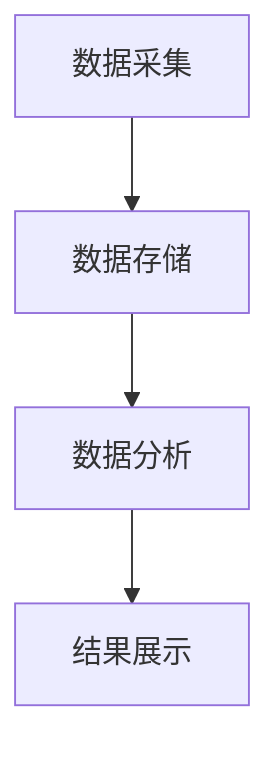
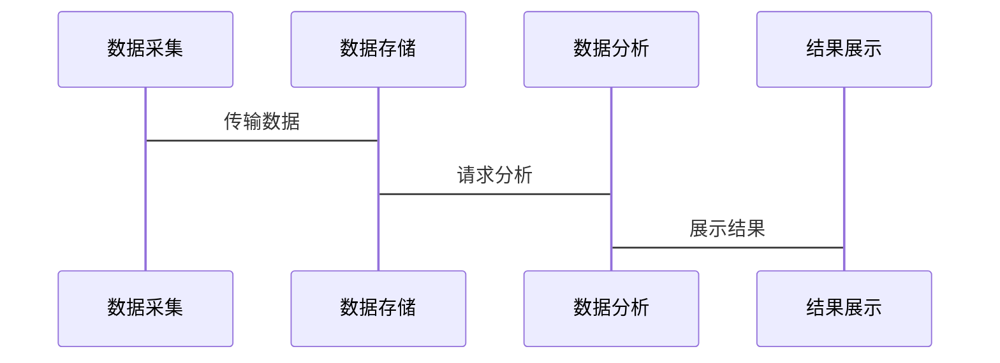

                 


```markdown
# 多智能体系统在行业分析中的创新应用

## 关键词：多智能体系统、行业分析、创新应用、分布式计算、协作学习、智能体协作、行业优化

## 摘要：  
多智能体系统（MAS，Multi-Agent Systems）作为一种新兴的分布式计算范式，正在逐渐成为解决复杂行业分析问题的重要工具。本文将深入探讨多智能体系统的核心概念、算法原理及其在金融、医疗、交通等行业的创新应用，通过具体案例展示其在提升行业分析效率和决策能力方面的优势。  

---

# 第1章 多智能体系统概述

## 1.1 多智能体系统的基本概念

### 1.1.1 多智能体系统的定义
多智能体系统是指由多个智能体组成的分布式系统，这些智能体能够通过交互和协作完成复杂的任务。每个智能体都有一定的自主性、反应性和社会性。

### 1.1.2 多智能体系统的特征
- **自主性**：智能体能够独立决策和行动。
- **反应性**：能够感知环境并做出实时响应。
- **分布式性**：智能体通过网络进行通信和协作。
- **协作性**：多个智能体协同完成复杂任务。

### 1.1.3 多智能体系统的优缺点
- **优点**：高并发处理、分布式计算、适应性强。
- **缺点**：复杂性高、通信开销大、协作困难。

## 1.2 多智能体系统与行业分析的结合

### 1.2.1 行业分析的基本概念
行业分析是对行业内的市场结构、竞争格局、发展趋势等进行研究，以支持决策。

### 1.2.2 多智能体系统在行业分析中的优势
- 提高数据处理效率。
- 实现多维度数据分析。
- 支持实时决策。

### 1.2.3 行业分析中多智能体系统的应用场景
- 金融风险评估。
- 供应链优化。
- 市场趋势预测。

## 1.3 本章小结
本章介绍了多智能体系统的基本概念及其在行业分析中的应用潜力。

---

# 第2章 多智能体系统的核心概念与联系

## 2.1 多智能体系统的组成结构

### 2.1.1 智能体的定义与分类
- **智能体**：具有感知和行动能力的实体。
- **分类**：简单智能体、复杂智能体。

### 2.1.2 多智能体系统的层次结构
- **物理层**：硬件设备。
- **逻辑层**：智能体的逻辑结构。
- **通信层**：智能体之间的通信机制。

### 2.1.3 智能体之间的关系
- **协作关系**：智能体之间通过协作完成任务。
- **竞争关系**：智能体之间存在竞争。

## 2.2 多智能体系统的核心原理

### 2.2.1 智能体的通信机制
- **通信协议**：智能体之间通过特定协议进行数据交换。
- **消息传递**：通过消息队列实现异步通信。

### 2.2.2 智能体的协作机制
- **任务分配**：智能体根据自身能力分配任务。
- **协同决策**：多个智能体共同决策。

### 2.2.3 智能体的学习机制
- **强化学习**：通过奖励机制优化决策。
- **迁移学习**：将知识迁移到新任务。

## 2.3 多智能体系统与行业分析的联系

### 2.3.1 行业分析中的数据处理
- 数据采集、清洗、分析。
- 数据建模、预测。

### 2.3.2 多智能体系统在行业分析中的具体应用
- 金融市场的实时数据分析。
- 供应链的优化管理。

## 2.4 本章小结
本章详细介绍了多智能体系统的组成和核心原理，并探讨了其在行业分析中的应用。

---

# 第3章 多智能体系统的算法原理

## 3.1 多智能体系统的算法概述

### 3.1.1 分布式计算的基本原理
- **分布式计算**：任务分解到多个节点并行处理。
- **一致性**：保证数据一致性。

### 3.1.2 多智能体强化学习的原理
- **强化学习**：智能体通过与环境交互获得奖励，优化策略。
- **多智能体协作**：多个智能体协作完成任务，共享奖励。

### 3.1.3 多智能体协作算法
- **基于状态的协作**：基于环境状态进行协作。
- **基于任务的协作**：基于任务需求进行协作。

## 3.2 多智能体系统的算法实现

### 3.2.1 分布式计算的实现
- **任务分配**：根据节点负载分配任务。
- **结果汇总**：将各节点结果汇总。

### 3.2.2 多智能体强化学习的实现
- **智能体策略**：定义智能体的策略函数。
- **环境建模**：建立环境模型，模拟真实场景。

## 3.3 多智能体系统在行业分析中的算法应用

### 3.3.1 金融市场的实时数据分析
- **算法实现**：实时数据采集、分析和预测。

### 3.3.2 供应链的优化管理
- **算法优化**：通过算法优化供应链流程。

## 3.4 本章小结
本章详细讲解了多智能体系统的算法原理及其在行业分析中的应用。

---

# 第4章 多智能体系统的系统分析与架构设计

## 4.1 问题场景介绍

### 4.1.1 行业分析中的问题
- 数据量大、复杂。
- 需要实时分析。

### 4.1.2 多智能体系统的解决方案
- 分布式计算。
- 多智能体协作。

## 4.2 系统功能设计

### 4.2.1 系统功能模块
- 数据采集模块。
- 数据分析模块。
- 结果展示模块。

### 4.2.2 系统功能流程
- 数据采集 -> 数据分析 -> 结果展示。

## 4.3 系统架构设计

### 4.3.1 系统架构图


### 4.3.2 系统交互序列图


## 4.4 本章小结
本章通过系统分析和架构设计，展示了多智能体系统在行业分析中的具体实现。

---

# 第5章 多智能体系统在行业分析中的项目实战

## 5.1 金融风险分析案例

### 5.1.1 环境配置
- 数据源：股票市场数据。
- 工具：Python、Pandas、NumPy。

### 5.1.2 核心代码实现
```python
import pandas as pd
import numpy as np

# 数据采集
data = pd.read_csv('stock.csv')

# 数据分析
def analyzeRisk(data):
    # 计算波动率
    volatility = data['price'].std()
    return volatility

risk = analyzeRisk(data)
print(f'波动率：{risk}')
```

### 5.1.3 代码解读与分析
- 数据采集：从CSV文件读取股票数据。
- 数据分析：计算价格波动率。
- 结果展示：输出波动率。

### 5.1.4 案例分析
- 风险评估结果：波动率越高，风险越大。

## 5.2 供应链优化案例

### 5.2.1 环境配置
- 数据源：供应链数据。
- 工具：Python、NetworkX。

### 5.2.2 核心代码实现
```python
import networkx as nx

# 数据采集
data = pd.read_csv('supply_chain.csv')

# 数据分析
def optimizeSupplyChain(data):
    # 构建供应链网络
    G = nx.from_pandas_edgelist(data, 'from', 'to')
    # 计算最短路径
    shortest_path = nx.shortest_path(G, source=' supplier', target='customer')
    return shortest_path

path = optimizeSupplyChain(data)
print(f'最短路径：{path}')
```

### 5.2.3 代码解读与分析
- 数据采集：从CSV文件读取供应链数据。
- 数据分析：构建网络图，计算最短路径。
- 结果展示：输出最短路径。

### 5.2.4 案例分析
- 优化结果：最短路径减少运输时间，降低成本。

## 5.3 本章小结
本章通过具体案例展示了多智能体系统在金融和供应链行业的实际应用。

---

# 第6章 多智能体系统在行业分析中的总结与展望

## 6.1 本章总结
- 多智能体系统在行业分析中具有广泛的应用前景。
- 通过具体案例展示了其在金融、供应链等行业的优势。

## 6.2 未来展望
- 技术优化：提高智能体协作效率。
- 行业扩展：应用到更多行业。

## 6.3 最佳实践 tips
- **技术选型**：根据需求选择合适的算法。
- **性能优化**：通过分布式计算提高效率。
- **安全性考虑**：确保数据安全。

## 6.4 拓展阅读
- 推荐书籍：《Multi-Agent Systems: Algorithmic, Complexity Theoretic, and Game Theoretic Foundations》
- 推荐博客：[AI Genius Institute](https://www.aigeniusinstitute.com)

---

# 作者：AI天才研究院 & 禅与计算机程序设计艺术

---

> 通过以上结构，文章详细讲解了多智能体系统在行业分析中的创新应用，结合实际案例，帮助读者理解和掌握这一技术的核心内容。
```

