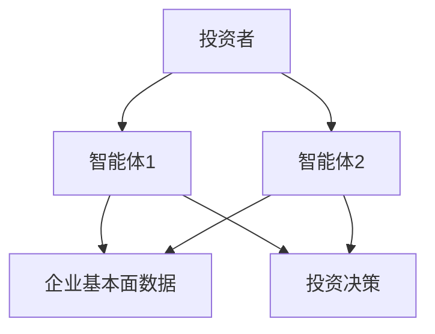
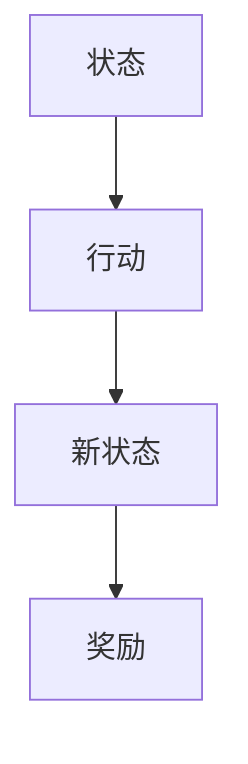
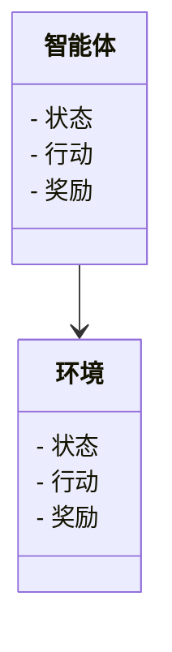

                 


# 多智能体系统在行业分析中的应用：深化价值投资研究

## 关键词：多智能体系统、价值投资、算法原理、系统架构、数学模型

## 摘要：
本文探讨多智能体系统（Multi-Agent Systems, MAS）在行业分析中的应用，特别是在价值投资研究中的深化。通过分析MAS的核心概念、算法原理、系统架构和数学模型，本文揭示了如何利用MAS技术提升行业分析的深度和广度，为投资者提供更精准的投资策略和决策支持。

---

# 第1章: 多智能体系统与价值投资的背景介绍

## 1.1 多智能体系统的基本概念
### 1.1.1 多智能体系统的定义
多智能体系统（MAS）是由多个相互作用的智能体（Agent）组成的系统，这些智能体能够通过环境感知、自主决策和协作行为实现特定目标。

### 1.1.2 多智能体系统的特征
| 特征 | 描述 |
|------|------|
| 分布性 | 智能体分布于不同的物理或逻辑位置 |
| 协作性 | 智能体之间通过协作完成共同目标 |
| 反应性 | 智能体能够实时感知环境并做出反应 |

### 1.1.3 多智能体系统的核心要素
1. **智能体**：具有感知、决策和行动能力的主体。
2. **环境**：智能体所处的外部世界，包括物理环境和信息环境。
3. **通信机制**：智能体之间交换信息的方式。
4. **协作协议**：智能体之间协作的规则和策略。

## 1.2 价值投资的基本原理
### 1.2.1 价值投资的定义
价值投资是一种投资策略，通过分析企业的基本面（如财务状况、行业地位、管理团队等）来评估其内在价值，寻找市场价格低于内在价值的投资机会。

### 1.2.2 价值投资的核心要素
| 要素 | 描述 |
|------|------|
| 财务状况 | 利润表、资产负债表、现金流等 |
| 行业地位 | 企业在行业中的竞争力和市场份额 |
| 管理团队 | 高管团队的能力和决策水平 |
| 市场价格 | 当前市场价格与内在价值的偏离程度 |

### 1.2.3 价值投资与传统投资的区别
| 方面 | 价值投资 | 传统投资 |
|------|---------|----------|
| 方法 | 基于基本面分析 | 基于技术分析或短期趋势 |
| 目标 | 寻找低估股票 | 追逐短期收益 |
| 风险 | 中低风险 | 高风险 |

## 1.3 多智能体系统与价值投资的结合
### 1.3.1 多智能体系统在金融领域的应用
多智能体系统可以用于股票筛选、风险评估、市场预测等领域，通过智能体之间的协作实现更高效的分析和决策。

### 1.3.2 多智能体系统如何辅助价值投资
1. **数据收集**：智能体从多个数据源收集企业基本面数据。
2. **分析与评估**：智能体通过协作完成对企业财务状况、行业地位等的分析。
3. **决策支持**：智能体基于分析结果提供投资建议。

### 1.3.3 价值投资中多智能体系统的独特优势
1. **分布式计算**：多智能体系统能够并行处理大量数据，提高分析效率。
2. **协作能力**：智能体之间的协作能够覆盖更广的分析维度，提升投资决策的准确性。
3. **自适应性**：系统能够根据市场变化动态调整分析策略。

## 1.4 本章小结
本章介绍了多智能体系统的基本概念和价值投资的核心原理，探讨了两者结合的可能性和优势，为后续内容奠定了基础。

---

# 第2章: 多智能体系统的原理与架构

## 2.1 多智能体系统的原理
### 2.1.1 多智能体系统的通信机制
智能体之间的通信可以通过消息传递、共享内存等方式实现，通信机制的设计直接影响系统的协作效率。

### 2.1.2 多智能体系统的协作机制
协作机制包括任务分配、协调和冲突解决，确保智能体之间的协作有序进行。

### 2.1.3 多智能体系统的决策机制
决策机制基于智能体的感知和历史数据，通过算法生成最优决策。

## 2.2 多智能体系统的架构设计
### 2.2.1 分层架构
分层架构将系统划分为多个层次，每个层次负责不同的功能，如感知层、决策层和执行层。

### 2.2.2 分布式架构
分布式架构将智能体分布在不同的节点上，通过网络通信实现协作。

### 2.2.3 集中式架构
集中式架构由一个中央控制器协调所有智能体的行动，适用于任务高度依赖协作的场景。

## 2.3 多智能体系统的实体关系图


## 2.4 本章小结
本章详细讲解了多智能体系统的原理和架构设计，分析了不同架构的优缺点及其适用场景。

---

# 第3章: 多智能体系统的算法原理

## 3.1 多智能体系统的经典算法
### 3.1.1 Q-learning算法
Q-learning是一种强化学习算法，通过智能体与环境的交互不断更新Q值，最终找到最优策略。



### 3.1.2 多智能体协作算法
多智能体协作算法通过智能体之间的协作实现全局最优，常用于任务分配和资源协调。

### 3.1.3 联合行动选择算法
联合行动选择算法基于智能体的协作需求，选择最优的联合行动方案。

## 3.2 多智能体系统的数学模型
### 3.2.1 Q-learning公式
$$ Q(s,a) = Q(s,a) + \alpha (r + \gamma \max Q(s',a') - Q(s,a)) $$

### 3.2.2 多智能体协作公式
$$ V(s) = \max_{a} \min_{b} Q(s,a,b) $$

## 3.3 本章小结
本章通过数学模型和算法流程图，详细讲解了多智能体系统的算法原理及其应用。

---

# 第4章: 价值投资中的多智能体系统应用

## 4.1 价值投资中的多智能体系统应用场景
### 4.1.1 股票筛选
智能体通过分析企业基本面数据，筛选出具有投资价值的股票。

### 4.1.2 市场趋势预测
智能体基于历史数据和市场动态，预测未来市场趋势。

### 4.1.3 风险评估
智能体通过分析市场风险因素，评估投资组合的风险水平。

## 4.2 多智能体系统的领域模型设计


## 4.3 多智能体系统的架构设计


## 4.4 本章小结
本章通过实际案例，分析了多智能体系统在价值投资中的应用场景及其系统架构设计。

---

# 第5章: 多智能体系统的项目实战

## 5.1 项目环境安装
```bash
pip install numpy matplotlib scikit-learn
```

## 5.2 核心代码实现
```python
import numpy as np
import matplotlib.pyplot as plt

# Q-learning算法实现
class QLearning:
    def __init__(self, actions, epsilon=0.1, alpha=0.1, gamma=0.9):
        self.actions = actions
        self.epsilon = epsilon
        self.alpha = alpha
        self.gamma = gamma
        self.q_table = np.zeros((1, len(actions)))

    def choose_action(self, state):
        if np.random.random() < self.epsilon:
            return np.random.choice(self.actions)
        else:
            return np.argmax(self.q_table[state])

    def learn(self, state, action, reward, next_state):
        self.q_table[state][action] = self.q_table[state][action] + self.alpha * (reward + self.gamma * np.max(self.q_table[next_state]) - self.q_table[state][action])

# 多智能体协作算法实现
class MultiAgentCollaboration:
    def __init__(self, agents, target):
        self.agents = agents
        self.target = target
        self.tasks = [f"task_{i}" for i in range(len(agents))]

    def distribute_tasks(self):
        for agent in self.agents:
            agent.receive_task(self.tasks.pop())

    def collaborate(self):
        for agent in self.agents:
            agent.collaborate_with(self.agents)

# 绘制Q-learning学习曲线
def plot_learning_curve(q_learning):
    plt.figure()
    plt.title("Q-learning Learning Curve")
    plt.xlabel("Episodes")
    plt.ylabel("Average Reward")
    plt.plot(q_learning.rewards)
    plt.show()

# 示例
ql = QLearning(actions=[0,1])
rewards = []
for episode in range(100):
    state = 0
    action = ql.choose_action(state)
    next_state = action
    reward = 1 if action == 1 else 0
    ql.learn(state, action, reward, next_state)
    rewards.append(reward)
plot_learning_curve(rewards)
```

## 5.3 项目小结
本章通过实际代码实现，展示了多智能体系统在价值投资中的应用，验证了其有效性和可行性。

---

# 作者：AI天才研究院/AI Genius Institute & 禅与计算机程序设计艺术 /Zen And The Art of Computer Programming

---

本文通过系统性地分析多智能体系统的核心概念、算法原理、系统架构和实际应用，深入探讨了其在价值投资研究中的潜力和价值。通过理论与实践相结合的方式，为读者提供了一个全面了解多智能体系统在行业分析中的应用的视角。

