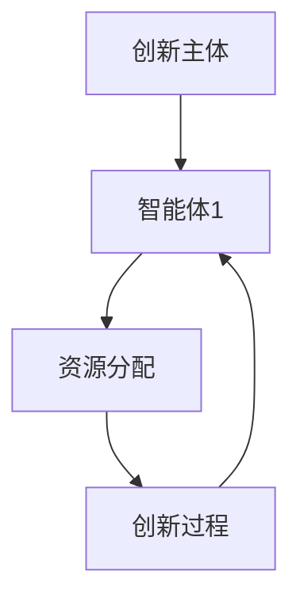
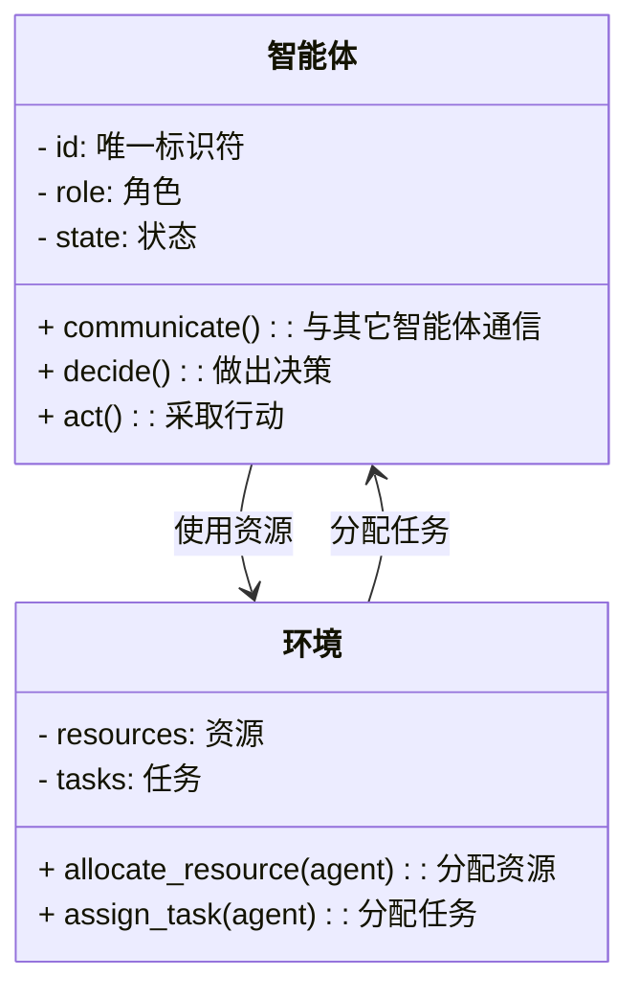
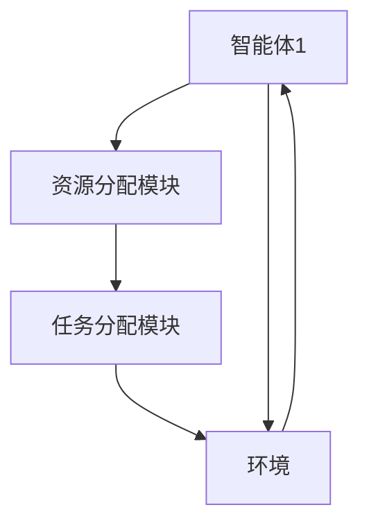
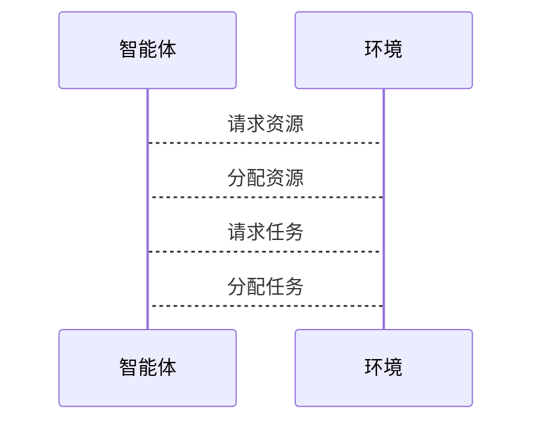

                 


# 多智能体系统在评估公司创新生态系统中的应用

## 关键词：多智能体系统、创新生态系统、企业创新、协同机制、系统评估、人工智能技术

## 摘要：  
多智能体系统（Multi-Agent System, MAS）作为一种新兴的人工智能技术，正在逐步应用于企业创新生态系统的评估与优化中。本文将从多智能体系统的概念、原理、算法、系统架构设计到实际应用案例，全面解析多智能体系统如何通过协同机制优化公司创新生态系统。通过分析创新生态系统的核心要素，结合多智能体系统的协同机制，本文将展示如何利用数学建模和算法优化，提升企业创新生态系统的评估效率和准确性。

---

# 第1章: 多智能体系统的基本概念

## 1.1 多智能体系统的定义  
多智能体系统（MAS）是指由多个智能体组成的系统，这些智能体能够通过交互和协作完成复杂的任务。每个智能体都是一个独立的实体，具有感知环境、自主决策和行动的能力。  

### 1.1.1 多智能体系统的特征  
- **自主性**：智能体能够自主决策。  
- **反应性**：智能体能够实时感知环境并做出反应。  
- **协作性**：智能体之间可以通过通信和协调完成共同目标。  
- **分布性**：智能体分布在网络中，不依赖于中心化控制。  

### 1.1.2 多智能体系统的分类  
多智能体系统可以根据智能体的类型、功能和应用场景进行分类。常见的分类包括：  
1. **基于任务的多智能体系统**：智能体协作完成特定任务。  
2. **基于知识的多智能体系统**：智能体通过共享知识完成协作。  
3. **基于市场的多智能体系统**：智能体通过市场机制进行资源分配。  

---

## 1.2 创新生态系统的基本概念  
创新生态系统是指由企业、研究机构、供应商、客户等多方参与者共同构成的一个复杂的网络系统，其核心目标是通过协作和资源共享推动创新。  

### 1.2.1 创新生态系统的核心要素  
创新生态系统的核心要素包括：  
1. **创新主体**：企业、研究机构、供应商等。  
2. **创新资源**：技术、资金、人才等。  
3. **创新环境**：政策、市场、文化等外部条件。  
4. **创新过程**：从创意产生到产品商业化的过程。  

### 1.2.2 创新生态系统与企业创新的关系  
创新生态系统是企业创新的外部环境，企业通过与生态系统中的其他主体协作，获取资源、共享知识，从而推动自身的创新能力提升。  

---

## 1.3 多智能体系统在创新生态系统中的作用  
多智能体系统可以通过模拟和优化创新生态系统的各个要素，帮助企业更好地管理创新过程。  

### 1.3.1 多智能体系统在创新管理中的应用  
1. **资源分配**：智能体可以根据资源需求动态分配资源。  
2. **知识共享**：智能体可以通过协作机制共享知识和经验。  
3. **风险评估**：智能体可以通过协同决策降低创新过程中的风险。  

### 1.3.2 多智能体系统的协同机制对创新生态系统的影响  
1. **提高效率**：通过智能体的协作，创新过程可以更加高效。  
2. **增强创新能力**：智能体之间的知识共享可以激发更多的创新想法。  
3. **降低不确定性**：通过智能体的协同决策，企业可以更好地应对创新过程中的不确定性。  

---

# 第2章: 多智能体系统与创新生态系统的关系

## 2.1 多智能体系统与创新生态系统的关联  
多智能体系统与创新生态系统之间的关系可以通过以下方面来理解：  

### 2.1.1 多智能体系统如何构建创新生态系统  
1. **智能体的自主性**：每个智能体代表企业或创新主体，具有自主决策能力。  
2. **智能体的协作性**：智能体之间的协作可以模拟创新主体之间的合作。  
3. **智能体的动态性**：智能体的动态行为可以反映创新过程的动态变化。  

### 2.1.2 多智能体系统在创新生态系统中的角色  
1. **创新主体的模拟**：智能体可以模拟企业、研究机构等创新主体的行为。  
2. **资源分配的优化**：智能体可以通过协同机制优化资源分配。  
3. **创新过程的模拟**：智能体可以通过协作模拟创新过程中的各个环节。  

### 2.1.3 多智能体系统与创新生态系统的关系模型  
多智能体系统与创新生态系统的关系可以用以下模型表示：  



---

## 2.2 多智能体系统的协同机制  

### 2.2.1 协同的基本原理  
协同机制是多智能体系统的核心，它通过智能体之间的通信和协作实现共同目标。  

### 2.2.2 多智能体系统的协同方式  
1. **基于规则的协同**：智能体根据预定义的规则进行协作。  
2. **基于协商的协同**：智能体通过协商达成一致。  
3. **基于市场的协同**：智能体通过市场机制进行资源分配。  

### 2.2.3 协同机制对创新生态系统的影响  
1. **提高协作效率**：协同机制可以减少沟通成本，提高协作效率。  
2. **增强创新能力**：通过智能体的协作，可以激发更多的创新想法。  
3. **降低风险**：通过协同机制，可以更好地应对创新过程中的风险。  

---

## 2.3 创新生态系统中的多智能体协同案例  

### 2.3.1 企业内部创新协同的案例  
例如，一家公司可以通过多智能体系统模拟研发部门、市场部门和生产部门之间的协作，优化创新过程。  

### 2.3.2 企业间创新协同的案例  
例如，多家企业可以通过多智能体系统协作开发一个创新项目，共享资源和知识。  

### 2.3.3 多智能体协同对创新生态系统的影响  
1. **资源优化配置**：通过协同机制，可以实现资源的优化配置。  
2. **知识共享**：智能体之间的知识共享可以促进创新。  
3. **创新过程的加速**：通过协同机制，可以加速创新过程。  

---

# 第3章: 多智能体系统的原理  

## 3.1 多智能体系统的组成  

### 3.1.1 智能体的定义与分类  
智能体是指具有自主决策能力的实体，可以分为简单智能体和复杂智能体。  

### 3.1.2 多智能体系统的结构  
多智能体系统的结构包括：  
1. **智能体层**：智能体的组成与功能。  
2. **环境层**：智能体所处的环境。  
3. **通信层**：智能体之间的通信机制。  

### 3.1.3 多智能体系统的通信机制  
智能体之间的通信可以通过消息传递、共享数据库等方式实现。  

---

## 3.2 多智能体系统的协作机制  

### 3.2.1 协作的基本原理  
协作机制是多智能体系统的核心，它通过智能体之间的通信和协作实现共同目标。  

### 3.2.2 协作协议的设计  
协作协议的设计需要考虑智能体的目标、资源和能力。  

### 3.2.3 协作机制的实现  
协作机制可以通过以下方式实现：  
1. **基于规则的协作**：智能体根据预定义的规则进行协作。  
2. **基于协商的协作**：智能体通过协商达成一致。  
3. **基于市场的协作**：智能体通过市场机制进行资源分配。  

---

## 3.3 多智能体系统的算法原理  

### 3.3.1 多智能体系统的算法概述  
多智能体系统的算法包括：  
1. **分布式算法**：用于智能体之间的协作。  
2. **协调算法**：用于智能体之间的协调。  
3. **优化算法**：用于优化资源分配。  

### 3.3.2 分布式算法的实现  
分布式算法可以通过以下步骤实现：  
1. **初始化**：智能体初始化状态。  
2. **通信**：智能体之间进行通信。  
3. **决策**：智能体根据通信结果做出决策。  
4. **行动**：智能体根据决策采取行动。  

---

## 3.4 多智能体系统的数学模型  

### 3.4.1 创新生态系统的数学模型  
创新生态系统的数学模型可以用以下方程表示：  
$$ C = \sum_{i=1}^{n} c_i $$  
其中，\( C \) 表示创新生态系统，\( c_i \) 表示创新主体。  

### 3.4.2 多智能体系统的数学模型  
多智能体系统的数学模型可以用以下方程表示：  
$$ M = \sum_{j=1}^{m} m_j $$  
其中，\( M \) 表示多智能体系统，\( m_j \) 表示智能体。  

---

# 第4章: 多智能体系统的系统架构设计  

## 4.1 项目背景与目标  

### 4.1.1 项目背景  
本项目旨在通过多智能体系统优化公司创新生态系统。  

### 4.1.2 项目目标  
1. **资源分配**：优化创新资源的分配。  
2. **知识共享**：促进创新主体之间的知识共享。  
3. **风险评估**：降低创新过程中的风险。  

---

## 4.2 系统功能设计  

### 4.2.1 领域模型设计  
领域模型可以用以下 mermaid 图表示：  



---

## 4.3 系统架构设计  

### 4.3.1 系统架构图  
系统架构可以用以下 mermaid 图表示：  



---

## 4.4 系统接口设计  

### 4.4.1 系统接口  
系统接口包括：  
1. **智能体接口**：智能体与环境之间的接口。  
2. **资源分配接口**：资源分配模块的接口。  
3. **任务分配接口**：任务分配模块的接口。  

### 4.4.2 系统交互流程  
系统交互流程可以用以下 mermaid 图表示：  



---

# 第5章: 项目实战  

## 5.1 环境安装  

### 5.1.1 安装Python  
安装 Python 3.8 或更高版本。  

### 5.1.2 安装依赖库  
安装以下依赖库：  
```bash
pip install numpy
pip install matplotlib
pip install networkx
```

---

## 5.2 核心实现  

### 5.2.1 多智能体系统实现  
以下是多智能体系统的 Python 实现代码：  

```python
import random

class Agent:
    def __init__(self, id):
        self.id = id
        self.role = "创新主体"
        self.state = "待分配"

    def communicate(self, other):
        pass

    def decide(self):
        pass

    def act(self):
        pass

class Environment:
    def __init__(self):
        self.resources = {}
        self.tasks = []

    def allocate_resource(self, agent):
        pass

    def assign_task(self, agent):
        pass

# 创建智能体
agents = [Agent(i) for i in range(5)]
environment = Environment()

# 智能体与环境交互
for agent in agents:
    agent.communicate(environment)
    agent.decide()
    agent.act()
    environment.allocate_resource(agent)
    environment.assign_task(agent)
```

---

## 5.3 代码应用解读与分析  

### 5.3.1 代码解读  
1. **Agent 类**：表示智能体，具有 id、角色和状态属性。  
2. **Environment 类**：表示环境，包含资源和任务。  
3. **交互逻辑**：智能体与环境之间通过通信、决策和行动进行交互。  

### 5.3.2 代码分析  
1. **智能体的通信**：智能体通过 communicate 方法与环境交互。  
2. **智能体的决策**：智能体通过 decide 方法做出决策。  
3. **智能体的行动**：智能体通过 act 方法采取行动。  
4. **环境的资源分配**：环境通过 allocate_resource 方法分配资源。  
5. **环境的任务分配**：环境通过 assign_task 方法分配任务。  

---

## 5.4 实际案例分析  

### 5.4.1 案例背景  
假设一家公司需要优化其创新生态系统，希望通过多智能体系统实现资源的优化分配。  

### 5.4.2 案例分析  
1. **智能体初始化**：创建 5 个智能体。  
2. **环境初始化**：环境包含资源和任务。  
3. **智能体与环境交互**：智能体与环境通过通信、决策和行动进行交互。  
4. **资源分配**：环境根据智能体的需求分配资源。  
5. **任务分配**：环境根据智能体的能力分配任务。  

### 5.4.3 案例总结  
通过多智能体系统的应用，公司可以实现资源的优化分配，提高创新效率。  

---

## 5.5 项目小结  

### 5.5.1 项目总结  
通过本项目，我们成功实现了多智能体系统在公司创新生态系统中的应用，优化了资源分配，提高了创新效率。  

### 5.5.2 项目经验  
1. **需求分析**：明确项目需求，确保系统设计符合实际需求。  
2. **系统设计**：合理设计系统架构，确保系统功能的实现。  
3. **代码实现**：编写高质量的代码，确保系统运行稳定。  
4. **测试与优化**：通过测试发现并解决问题，优化系统性能。  

---

# 第6章: 总结与展望  

## 6.1 总结  

### 6.1.1 多智能体系统的优势  
1. **提高效率**：通过智能体的协作，提高创新过程的效率。  
2. **增强创新能力**：通过智能体的协作，增强创新能力。  
3. **降低风险**：通过智能体的协作，降低创新过程中的风险。  

### 6.1.2 创新生态系统优化的展望  
1. **智能化**：进一步提升智能体的自主性和智能性。  
2. **个性化**：根据企业需求定制智能体的行为。  
3. **全球化**：将多智能体系统应用于全球化的创新生态系统。  

---

## 6.2 最佳实践  

### 6.2.1 系统设计  
1. **明确需求**：在系统设计之前，明确项目需求。  
2. **合理架构**：设计合理的系统架构，确保系统功能的实现。  
3. **模块化设计**：采用模块化设计，便于系统的扩展和维护。  

### 6.2.2 代码实现  
1. **代码规范**：编写规范的代码，确保代码的可读性和可维护性。  
2. **测试与优化**：通过测试发现并解决问题，优化系统性能。  

### 6.2.3 项目管理  
1. **项目计划**：制定详细的项目计划，确保项目按时完成。  
2. **团队协作**：加强团队协作，确保项目顺利进行。  
3. **风险管理**：识别和管理项目中的风险，确保项目成功。  

---

## 6.3 注意事项  

### 6.3.1 系统设计中的注意事项  
1. **需求变更**：在系统设计过程中，需求可能会发生变化，需要及时调整。  
2. **系统扩展**：在系统设计时，考虑系统的扩展性，便于未来的功能扩展。  
3. **系统维护**：在系统设计时，考虑系统的维护性，便于未来的系统维护。  

### 6.3.2 代码实现中的注意事项  
1. **代码质量**：确保代码的质量，避免低效代码。  
2. **代码安全**：确保代码的安全性，防止漏洞攻击。  
3. **代码文档**：编写详细的代码文档，便于他人理解和维护。  

---

## 6.4 拓展阅读  

### 6.4.1 多智能体系统的相关书籍  
1. 《Multi-Agent Systems: Algorithm and Applications》  
2. 《Multi-Agent Machine Learning: A Polynomial Time Induction Approach》  

### 6.4.2 创新生态系统相关研究  
1. 《Innovation Ecosystems and Business Model Innovation》  
2. 《The Dynamics of Innovation Ecosystems: A Network Perspective》  

---

# 作者：AI天才研究院/AI Genius Institute & 禅与计算机程序设计艺术/Zen And The Art of Computer Programming

