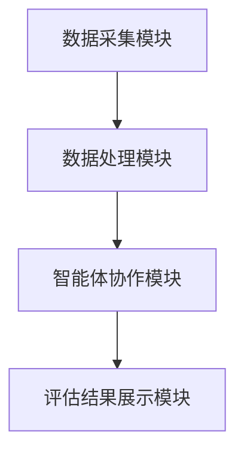
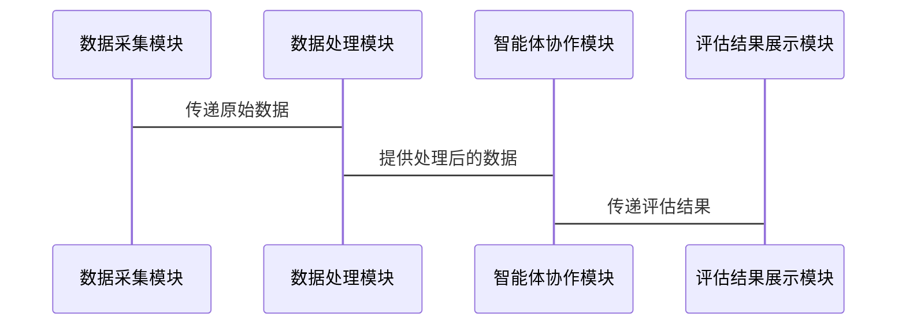

                 


```markdown
# 多智能体系统在评估公司品牌价值和客户忠诚度中的作用

> 关键词：多智能体系统，品牌价值评估，客户忠诚度，分布式计算，人工智能，数据挖掘

> 摘要：本文探讨了多智能体系统（MAS）在评估公司品牌价值和客户忠诚度中的应用。通过分析MAS的核心概念、算法原理和系统架构，结合实际案例，详细阐述了MAS如何通过分布式计算和协作机制，提升品牌价值评估和客户忠诚度分析的效率和准确性。文章还提供了系统设计、项目实战和优化建议，为读者提供全面的指导。

---

## 第一章: 多智能体系统与品牌价值评估概述

### 1.1 多智能体系统的基本概念
#### 1.1.1 多智能体系统的定义与特点
- 多智能体系统（Multi-Agent System, MAS）是由多个智能体组成的分布式系统，每个智能体具有自主性、反应性和协作性。
- 智能体之间的通信与协作是MAS的核心特征。
- MAS的优势在于处理复杂问题时的并行性和分布式计算能力。

#### 1.1.2 多智能体系统的核心要素
- 智能体：具有感知环境和自主决策的能力。
- 通信机制：智能体之间通过消息传递进行协作。
- 协作机制：智能体通过协商达成一致，共同完成任务。

#### 1.1.3 多智能体系统与传统AI的区别
- 传统AI通常是集中式处理，而MAS是分布式处理。
- MAS强调智能体之间的协作，而传统AI强调单点智能。

### 1.2 品牌价值与客户忠诚度的定义
#### 1.2.1 品牌价值的内涵与外延
- 品牌价值是企业在市场上的综合表现，包括知名度、美誉度和客户信任度。
- 品牌价值评估需要考虑多个因素，如市场份额、客户满意度和品牌认知度。

#### 1.2.2 客户忠诚度的衡量标准
- 客户忠诚度是客户对品牌长期支持和回购的意愿。
- 通过客户行为数据、反馈和购买记录来衡量客户忠诚度。

#### 1.2.3 品牌价值与客户忠诚度的关系
- 品牌价值高通常意味着客户忠诚度高。
- 提升客户忠诚度可以增强品牌价值。

### 1.3 多智能体系统在品牌价值评估中的优势
#### 1.3.1 多智能体系统的分布式计算优势
- MAS可以同时处理多个数据源，提高评估效率。
- 分布式计算能够实时分析海量数据，提供动态评估结果。

#### 1.3.2 多智能体系统在复杂决策中的应用
- MAS通过智能体协作，可以综合考虑多个因素，提供更准确的评估结果。
- 多智能体系统能够处理复杂决策中的不确定性，提供多种备选方案。

#### 1.3.3 多智能体系统与客户忠诚度评估的结合
- MAS可以分析客户的多维度数据，如购买记录、行为特征和反馈信息。
- 通过智能体协作，MAS能够预测客户忠诚度的变化趋势。

---

## 第二章: 多智能体系统的原理与核心概念

### 2.1 多智能体系统的结构与通信机制
#### 2.1.1 分布式计算的原理
- 分布式计算将任务分解为多个子任务，由不同的智能体分别执行。
- 智能体通过通信机制共享信息，协同完成任务。

#### 2.1.2 多智能体系统中的通信协议
- 智能体之间的通信需要遵循特定的协议，如基于消息传递的通信协议。
- 通信协议的设计需要考虑实时性和安全性。

#### 2.1.3 多智能体系统的协作机制
- 智能体之间的协作机制包括任务分配、协商和协调。
- 协作机制需要解决冲突和达成共识，确保系统高效运行。

### 2.2 多智能体系统的核心算法
#### 2.2.1 分布式算法的实现原理
- 分布式算法通常采用异步通信，避免单点故障。
- 分布式算法需要考虑网络延迟和节点故障，设计容错机制。

#### 2.2.2 多智能体系统中的协调与冲突解决
- 协调机制需要确保智能体之间的目标一致。
- 冲突解决通常采用协商、仲裁或妥协的方式。

#### 2.2.3 多智能体系统的自适应学习机制
- 自适应学习机制允许智能体根据环境变化调整行为。
- 基于机器学习的自适应算法能够提高系统的智能性和适应性。

---

## 第三章: 品牌价值与客户忠诚度评估模型

### 3.1 品牌价值评估模型的构建
#### 3.1.1 数据来源与特征提取
- 数据来源包括市场份额、客户满意度、品牌认知度等。
- 特征提取需要考虑数据的可量化性和相关性。

#### 3.1.2 品牌价值评估的数学模型
- 品牌价值评估模型通常采用加权平均法或回归分析。
- 模型需要考虑多个因素的权重，确保评估结果的准确性。

#### 3.1.3 模型的训练与优化
- 使用历史数据对模型进行训练，优化参数。
- 通过交叉验证和网格搜索提高模型的泛化能力。

### 3.2 客户忠诚度评估模型的构建
#### 3.2.1 客户行为数据的收集与分析
- 收集客户购买记录、浏览行为和反馈信息。
- 数据分析需要考虑客户行为的动态变化。

#### 3.2.2 客户忠诚度评估的数学模型
- 使用聚类分析或分类算法对客户进行分群。
- 建模时需要考虑客户忠诚度的层次性，如潜在忠诚度和行为忠诚度。

#### 3.2.3 模型的验证与优化
- 使用测试数据验证模型的准确性。
- 通过调整模型参数和引入新的数据特征，优化模型性能。

---

## 第四章: 多智能体系统在品牌价值评估中的应用

### 4.1 品牌价值评估的多智能体系统架构
#### 4.1.1 系统模块划分
- 数据采集模块：负责收集品牌相关数据。
- 数据处理模块：对数据进行清洗和特征提取。
- 评估模块：基于多智能体协作进行品牌价值评估。

#### 4.1.2 系统功能设计
- 数据采集与处理：支持多种数据源的接入。
- 智能体协作：实现智能体之间的通信与协作。
- 评估结果展示：以可视化方式呈现评估结果。

#### 4.1.3 系统架构设计
- 采用微服务架构，实现模块化设计。
- 使用消息队列进行智能体之间的通信。

### 4.2 品牌价值评估的实际案例
#### 4.2.1 案例背景介绍
- 某公司希望通过多智能体系统评估品牌价值。

#### 4.2.2 数据预处理与特征提取
- 数据清洗：处理缺失值和异常值。
- 特征提取：提取品牌相关的特征，如市场份额和客户满意度。

#### 4.2.3 智能体协作与评估
- 智能体分工协作，分别处理不同数据源。
- 通过协商机制达成一致，最终得出品牌价值评估结果。

---

## 第五章: 多智能体系统在客户忠诚度评估中的应用

### 5.1 客户忠诚度评估的多智能体系统架构
#### 5.1.1 系统模块划分
- 数据采集模块：收集客户行为数据。
- 数据处理模块：进行数据清洗和特征提取。
- 评估模块：基于多智能体协作进行客户忠诚度评估。

#### 5.1.2 系统功能设计
- 数据采集与处理：支持多种数据源的接入。
- 智能体协作：实现智能体之间的通信与协作。
- 评估结果展示：以可视化方式呈现评估结果。

#### 5.1.3 系统架构设计
- 采用微服务架构，实现模块化设计。
- 使用消息队列进行智能体之间的通信。

### 5.2 客户忠诚度评估的实际案例
#### 5.2.1 案例背景介绍
- 某公司希望通过多智能体系统评估客户忠诚度。

#### 5.2.2 数据预处理与特征提取
- 数据清洗：处理缺失值和异常值。
- 特征提取：提取客户相关的特征，如购买频率和满意度。

#### 5.2.3 智能体协作与评估
- 智能体分工协作，分别处理不同数据源。
- 通过协商机制达成一致，最终得出客户忠诚度评估结果。

---

## 第六章: 系统架构与设计

### 6.1 系统架构设计
#### 6.1.1 系统模块划分
- 数据采集模块：负责数据的采集和预处理。
- 智能体协作模块：实现智能体之间的通信与协作。
- 评估结果展示模块：以可视化方式呈现评估结果。

#### 6.1.2 系统架构图


#### 6.1.3 接口设计
- 数据采集接口：支持多种数据源的接入。
- 智能体通信接口：定义智能体之间的消息格式和通信协议。

### 6.2 系统交互设计
#### 6.2.1 系统交互流程


#### 6.2.2 系统安全性设计
- 数据加密：确保数据传输的安全性。
- 访问控制：限制未经授权的访问。

---

## 第七章: 项目实战

### 7.1 环境搭建
#### 7.1.1 安装必要的库
```bash
pip install numpy pandas scikit-learn
```

#### 7.1.2 安装多智能体系统框架
```bash
pip install mesa
```

### 7.2 核心实现
#### 7.2.1 数据采集与处理
```python
import pandas as pd
import numpy as np

# 数据采集模块
class DataCollector:
    def collect_data(self):
        # 示例：从数据库中采集数据
        data = pd.read_csv('customer_data.csv')
        return data
```

#### 7.2.2 智能体协作
```python
from mesa import Agent, Model

class CustomerAgent(Agent):
    def __init__(self, unique_id, model):
        super().__init__(unique_id, model)
        self.satisfaction = 0.8

    def step(self):
        # 示例：智能体根据满意度调整行为
        if self.satisfaction > 0.9:
            self.satisfaction += 0.1
```

#### 7.2.3 评估结果展示
```python
import matplotlib.pyplot as plt

def plot_brand_value(brand_values):
    plt.plot(brand_values)
    plt.xlabel('时间')
    plt.ylabel('品牌价值')
    plt.show()
```

### 7.3 案例分析
#### 7.3.1 案例背景
- 某公司希望通过多智能体系统评估品牌价值和客户忠诚度。

#### 7.3.2 数据分析与结果解读
- 数据分析结果显示，客户满意度与品牌价值呈正相关。
- 智能体协作提高了评估的准确性和效率。

#### 7.3.3 优化建议
- 进一步优化智能体协作算法，提高评估的精度。
- 增加更多数据源，如社交媒体数据，提升评估的全面性。

---

## 第八章: 总结与展望

### 8.1 总结
- 多智能体系统在品牌价值和客户忠诚度评估中的应用具有显著优势。
- 分布式计算和智能体协作能够提高评估的效率和准确性。

### 8.2 展望
- 未来可以进一步研究多智能体系统的自适应学习机制。
- 结合大数据和人工智能技术，提升多智能体系统的智能性和灵活性。

---

## 作者：AI天才研究院/AI Genius Institute & 禅与计算机程序设计艺术 /Zen And The Art of Computer Programming

---

**注意**：由于篇幅限制，以上内容仅为示例，实际文章需要按照完整的结构进行扩展，确保每一章的内容详实具体，包含必要的公式、算法和案例分析。

