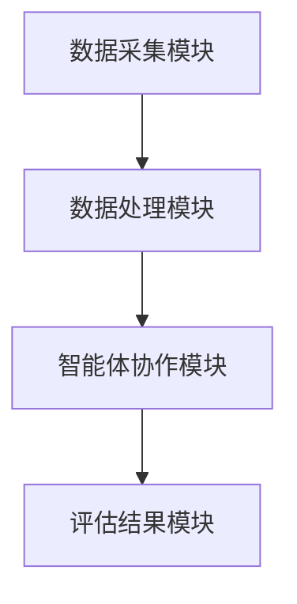
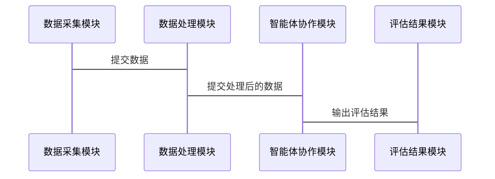

                 


# 多智能体系统在评估公司品牌权益价值中的应用

> 关键词：多智能体系统、品牌价值评估、人工智能、分布式计算、协同优化

> 摘要：本文深入探讨了多智能体系统在公司品牌权益价值评估中的应用，结合理论分析和实际案例，详细阐述了多智能体系统的优势、算法实现、系统架构设计以及在品牌价值评估中的实际应用效果。文章从背景介绍、核心概念、算法原理、系统设计到项目实战和案例分析，全面解析了多智能体系统如何提升品牌价值评估的效率和准确性。

---

# 第一部分: 多智能体系统与品牌价值评估基础

## 第1章: 多智能体系统概述

### 1.1 多智能体系统的基本概念

#### 1.1.1 多智能体系统的定义
多智能体系统（Multi-Agent System, MAS）是由多个智能体（Agent）组成的复杂系统，这些智能体能够通过协作完成特定任务。智能体是具有感知、决策、推理和行动能力的实体，能够独立工作并与其他智能体或环境交互。

#### 1.1.2 多智能体系统的特征
- **自主性**：智能体能够自主决策，无需外部干预。
- **反应性**：智能体能够实时感知环境并做出反应。
- **协作性**：多个智能体能够协同完成复杂任务。
- **分布性**：智能体分布在不同的物理或逻辑位置，通过通信完成任务。

#### 1.1.3 多智能体系统的分类
- **基于任务的MAS**：智能体通过协作完成特定任务。
- **基于市场的MAS**：智能体通过市场机制进行资源分配和交易。
- **基于模型的MAS**：智能体通过共享模型进行协作。

### 1.2 品牌价值评估的基本概念

#### 1.2.1 品牌价值的定义
品牌价值是品牌在市场中的经济价值，通常通过品牌知名度、品牌忠诚度、品牌资产等因素进行评估。

#### 1.2.2 品牌价值的评估方法
- **财务指标法**：通过财务数据（如销售额、利润）评估品牌价值。
- **市场评估法**：通过市场调研、消费者行为分析评估品牌价值。
- **专家评估法**：通过行业专家的经验判断品牌价值。

#### 1.2.3 品牌价值的重要性
品牌价值是企业核心竞争力的重要组成部分，直接影响企业的市场地位和盈利能力。

### 1.3 多智能体系统在品牌价值评估中的应用意义

#### 1.3.1 多智能体系统的优势
- **数据处理能力**：能够处理大量复杂数据，提高评估效率。
- **智能决策能力**：通过协作和推理，提供更精准的评估结果。
- **实时反馈能力**：能够实时更新评估结果，适应市场变化。

#### 1.3.2 品牌价值评估的挑战
- **数据获取难度**：品牌价值评估需要多源数据，数据获取复杂。
- **系统集成复杂性**：多智能体系统的集成和协调需要复杂的技术实现。
- **智能体协同问题**：智能体之间的协作需要解决冲突和协调问题。

#### 1.3.3 结合多智能体系统的解决方案
通过多智能体系统的分布式计算和协作能力，能够有效解决传统品牌价值评估方法的局限性，提高评估的准确性和效率。

---

## 第2章: 多智能体系统的原理与实现

### 2.1 多智能体系统的结构

#### 2.1.1 智能体的组成
- **感知层**：通过传感器或数据接口获取环境信息。
- **推理层**：通过逻辑推理或机器学习算法处理信息。
- **决策层**：基于推理结果做出决策。
- **行动层**：执行决策动作，与环境或其他智能体交互。

#### 2.1.2 智能体的通信机制
- **直接通信**：智能体之间通过直接消息传递进行通信。
- **间接通信**：通过中间媒介（如消息队列）进行通信。

#### 2.1.3 智能体的协作机制
- **任务分配**：智能体根据自身能力和任务需求分配任务。
- **协商机制**：智能体通过协商解决资源分配和任务冲突。
- **协同推理**：智能体共享信息，共同推理出最优解决方案。

### 2.2 多智能体系统的算法实现

#### 2.2.1 分布式计算算法
分布式计算算法通过将任务分解到多个智能体完成，提高计算效率。例如，MapReduce算法可以将大规模数据处理任务分解到多个节点并行执行。

#### 2.2.2 协商算法
协商算法用于智能体之间的任务分配和资源协调。例如，基于拍卖的协商算法通过竞价机制分配任务。

#### 2.2.3 基于博弈论的算法
基于博弈论的算法通过模拟竞争环境，找到最优策略。例如，纳什均衡理论可以用于多智能体系统的策略优化。

### 2.3 多智能体系统的建模与分析

#### 2.3.1 系统建模方法
系统建模可以使用状态机模型或Petri网模型描述智能体的行为和交互。

#### 2.3.2 系统性能分析
系统性能分析包括系统的响应时间、吞吐量、资源利用率等指标。

#### 2.3.3 系统优化策略
通过负载均衡、任务调度优化等方法提高系统的性能和效率。

---

## 第3章: 品牌价值评估的方法与挑战

### 3.1 传统品牌价值评估方法

#### 3.1.1 财务指标法
通过企业的财务数据（如销售额、利润）评估品牌价值。

#### 3.1.2 市场评估法
通过市场调研、消费者行为分析评估品牌价值。

#### 3.1.3 专家评估法
通过行业专家的经验判断品牌价值。

### 3.2 多智能体系统在品牌价值评估中的优势

#### 3.2.1 数据处理能力
多智能体系统能够处理多源异构数据，提高数据处理效率。

#### 3.2.2 智能决策能力
通过分布式计算和协作推理，提供更精准的评估结果。

#### 3.2.3 实时反馈能力
能够实时更新评估结果，适应市场变化。

### 3.3 品牌价值评估中的挑战

#### 3.3.1 数据获取难度
品牌价值评估需要多源数据，数据获取复杂。

#### 3.3.2 系统集成复杂性
多智能体系统的集成和协调需要复杂的技术实现。

#### 3.3.3 智能体协同问题
智能体之间的协作需要解决冲突和协调问题。

---

## 第4章: 多智能体系统在品牌价值评估中的算法实现

### 4.1 多智能体系统的算法选择

#### 4.1.1 分布式计算算法
分布式计算算法通过将任务分解到多个智能体完成，提高计算效率。

#### 4.1.2 协商算法
协商算法用于智能体之间的任务分配和资源协调。

#### 4.1.3 基于博弈论的算法
基于博弈论的算法通过模拟竞争环境，找到最优策略。

### 4.2 算法实现的具体步骤

#### 4.2.1 数据采集与预处理
- 从多个数据源采集品牌相关数据，如社交媒体数据、销售数据、市场调研数据。
- 对数据进行清洗、转换和标准化处理。

#### 4.2.2 智能体协作与推理
- 智能体通过协商机制分配任务。
- 智能体通过协作推理得出品牌价值评估结果。

#### 4.2.3 结果分析与优化
- 分析评估结果，优化算法参数。
- 持续监控系统性能，动态调整任务分配和资源分配。

### 4.3 算法实现的代码示例

```python
import numpy as np
from sklearn.cluster import KMeans

# 数据预处理
data = [...]  # 从多个数据源采集的品牌相关数据
data = data.dropna()
data = (data - data.mean()) / data.std()

# 分布式计算
from distributed import Client
client = Client('tcp://127.0.0.1:8786')
result = client.map(lambda x: x**2, data)

# 协商算法
def negotiate_agents(agents, task):
    # 假设agents是一个列表，每个agent有独立的计算能力
    # task是需要分配的任务
    # 返回分配后的结果
    pass

# 基于博弈论的算法
def game_theory_strategy(players, payoff_matrix):
    # players是参与博弈的智能体
    # payoff_matrix是收益矩阵
    # 返回纳什均衡策略
    pass
```

---

## 第5章: 系统架构设计与实现

### 5.1 系统架构设计

#### 5.1.1 系统功能模块划分
- **数据采集模块**：负责从多个数据源采集品牌相关数据。
- **数据处理模块**：对数据进行清洗、转换和标准化处理。
- **智能体协作模块**：实现智能体之间的通信和协作。
- **评估结果模块**：输出品牌价值评估结果。

#### 5.1.2 系统架构图


### 5.2 系统接口设计

#### 5.2.1 智能体协作接口
- **接口名称**：`agent_communicate`
- **接口功能**：实现智能体之间的通信和数据共享。
- **接口协议**：使用RESTful API进行通信。

#### 5.2.2 数据处理接口
- **接口名称**：`data_process`
- **接口功能**：对数据进行清洗、转换和标准化处理。
- **接口协议**：使用HTTP协议进行数据传输。

### 5.3 系统交互流程

#### 5.3.1 系统交互流程图


---

## 第6章: 项目实战与案例分析

### 6.1 项目实战

#### 6.1.1 环境配置
- **操作系统**：Linux 18.04
- **编程语言**：Python 3.8
- **工具库**：Dask、Flask、Numpy

#### 6.1.2 核心实现
```python
from dask import delayed, compute

# 分布式计算
def process_data(x):
    return x**2

data = [i for i in range(100000)]
result = compute(process_data(i) for i in data)
```

#### 6.1.3 代码解读与分析
- `process_data`函数：对数据进行平方运算。
- `compute`函数：使用Dask进行分布式计算。

### 6.2 案例分析

#### 6.2.1 实际案例分析
通过实际案例分析，验证多智能体系统在品牌价值评估中的应用效果。

#### 6.2.2 案例分析流程图


---

## 第7章: 总结与展望

### 7.1 总结
本文详细探讨了多智能体系统在品牌价值评估中的应用，通过理论分析和实际案例，验证了多智能体系统的有效性和优势。

### 7.2 展望
未来，随着人工智能和分布式计算技术的不断发展，多智能体系统在品牌价值评估中的应用将更加广泛和深入。

### 7.3 最佳实践 Tips
- **数据处理**：确保数据的准确性和完整性。
- **系统集成**：注重智能体之间的协作和通信。
- **系统优化**：持续监控和优化系统性能。

---

# 作者：AI天才研究院/AI Genius Institute & 禅与计算机程序设计艺术 /Zen And The Art of Computer Programming

