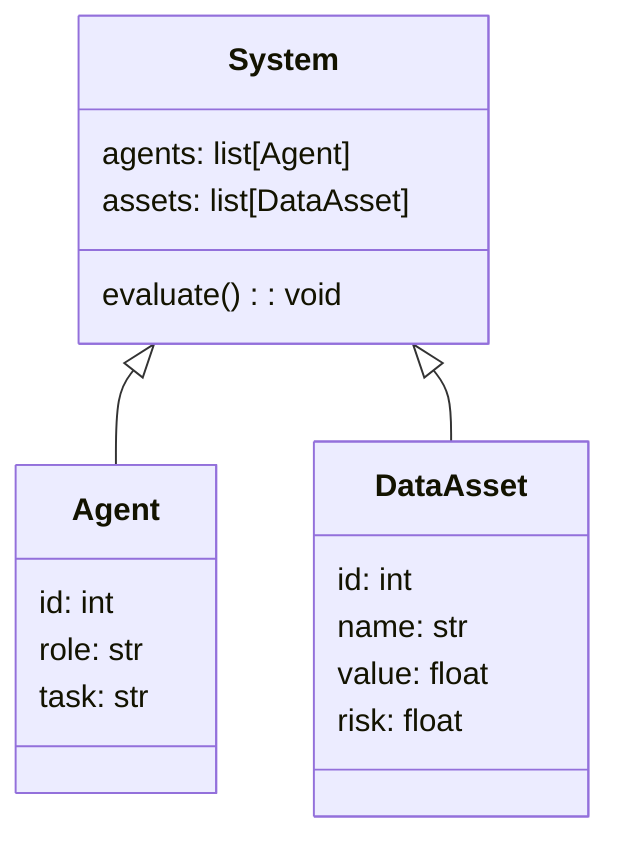
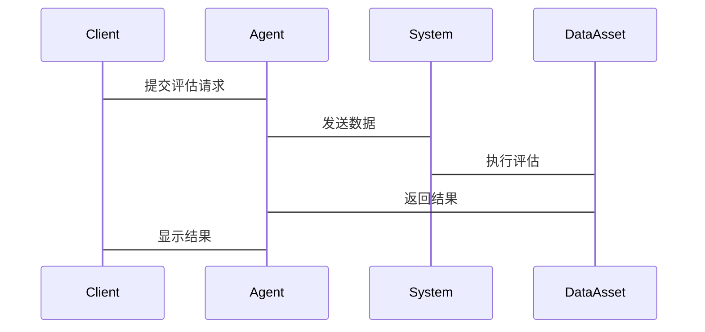

                 


```markdown
# 多智能体系统在评估公司数据资产价值中的应用

> 关键词：多智能体系统, 数据资产, 价值评估, 分布式计算, 机器学习

> 摘要：  
多智能体系统（Multi-Agent System, MAS）在数据资产价值评估中的应用，通过分布式计算和协同学习，有效提升了数据资产评估的准确性和效率。本文将从背景、核心概念、算法原理、系统架构到项目实战，详细阐述多智能体系统如何助力数据资产评估。

---

## 第一部分: 多智能体系统与数据资产评估背景

### 第1章: 多智能体系统概述

#### 1.1 多智能体系统的基本概念
##### 1.1.1 智能体的定义与分类
智能体（Agent）是指能够感知环境、自主决策、执行任务的实体。多智能体系统由多个智能体组成，通过协同工作完成复杂任务。

- 分类：
  - 单智能体系统：独立决策，无协作。
  - 多智能体系统：多个智能体协同，共同完成任务。

##### 1.1.2 多智能体系统的特征与优势
- 特征：
  - 分布式：任务分散处理。
  - 协作性：智能体之间协同工作。
  - 动态性：环境和任务可变。

- 优势：
  - 提高计算效率。
  - 增强系统鲁棒性。
  - 适应复杂任务需求。

##### 1.1.3 多智能体系统的应用场景
- 数据分析。
- 网络安全。
- 机器人协作。

#### 1.2 数据资产评估的背景与意义
##### 1.2.1 数据资产的定义与重要性
- 数据资产：企业拥有或控制的数据资源，具有价值。
- 重要性：
  - 支持企业决策。
  - 提供竞争优势。
  - 实现业务价值。

##### 1.2.2 数据资产评估的挑战与机遇
- 挑战：
  - 数据量大。
  - 数据异构。
  - 价值评估复杂。

- 机遇：
  - 技术进步。
  - 数据驱动决策。
  - 提高数据利用效率。

##### 1.2.3 多智能体系统在数据资产评估中的作用
- 多智能体系统能够高效、准确地评估数据资产价值，通过分布式计算和协作学习，提升评估结果的准确性和效率。

---

### 第2章: 多智能体系统的核心概念与联系

#### 2.1 多智能体系统的原理
##### 2.1.1 智能体的通信与协作
- 智能体之间通过消息传递进行通信，协作完成任务。

##### 2.1.2 多智能体系统的架构模型
- 分层架构：
  - 顶层：全局决策。
  - 中层：任务分配。
  - 底层：智能体执行。

##### 2.1.3 智能体的决策机制
- 基于感知和反馈的决策模型。

#### 2.2 数据资产评估的核心要素
##### 2.2.1 数据的属性与价值评估指标
- 数据属性：
  - 准确性。
  - 完整性。
  - 及时性。

- 价值指标：
  - 商业价值。
  - 技术价值。
  - 战略价值。

##### 2.2.2 数据资产评估的方法与模型
- 分析方法：
  - 定量分析。
  - 定性分析。
  - 综合评估。

- 评估模型：
  - 层次分析模型。
  - 指标加权模型。

##### 2.2.3 数据资产评估的流程与步骤
1. 数据收集。
2. 数据清洗。
3. 价值计算。
4. 风险评估。
5. 结果呈现。

#### 2.3 多智能体系统与数据资产评估的关联
##### 2.3.1 多智能体系统在数据资产评估中的角色
- 数据收集：智能体负责数据采集。
- 价值计算：多智能体协同分析。
- 风险评估：智能体实时监控。

##### 2.3.2 数据资产评估对多智能体系统的需求
- 高效计算能力。
- 协作通信机制。
- 灵活适应性。

##### 2.3.3 两者的协同效应与整合策略
- 协同效应：
  - 提高评估效率。
  - 增强系统稳定性。
  - 降低评估成本。

---

### 第3章: 多智能体系统在数据资产评估中的算法原理

#### 3.1 多智能体系统中的算法基础
##### 3.1.1 分布式计算与通信协议
- 分布式计算：任务分解，分布式处理。
- 通信协议：智能体间信息传递的规则。

##### 3.1.2 协商算法与共识机制
- 协商算法：智能体达成一致的协议。
- 共识机制：确保系统一致性的算法。

##### 3.1.3 联合学习与数据共享
- 联合学习：分布式学习，保护数据隐私。
- 数据共享：智能体间共享数据，提升评估准确性。

#### 3.2 数据资产评估中的算法应用
##### 3.2.1 数据清洗与预处理算法
- 数据清洗：去除噪声，处理缺失值。
- 数据预处理：标准化、归一化。

##### 3.2.2 数据价值评估的回归分析
- 线性回归：预测数据价值。
- 支持向量回归：处理非线性关系。

##### 3.2.3 数据风险评估的分类算法
- 支持向量机：分类数据风险。
- 随机森林：处理复杂数据。

#### 3.3 算法实现与优化
##### 3.3.1 算法的实现步骤与代码示例
```python
import pandas as pd
from sklearn.linear_model import LinearRegression

# 数据加载
data = pd.read_csv('data.csv')

# 数据预处理
data = data.dropna()

# 模型训练
model = LinearRegression()
model.fit(data[['feature1', 'feature2']], data['target'])

# 预测
predictions = model.predict(data[['feature1', 'feature2']])
```

##### 3.3.2 算法的优化策略与性能提升
- 参数优化：调整模型参数，提升准确率。
- 并行计算：分布式计算，提高效率。

##### 3.3.3 算法的可扩展性与鲁棒性
- 扩展性：支持大规模数据处理。
- 鲁棒性：抗干扰能力强。

---

### 第4章: 数据资产评估的数学模型与公式

#### 4.1 数据价值评估的数学模型
##### 4.1.1 数据价值的度量公式
$$ V = \alpha \cdot Q + \beta \cdot R + \gamma \cdot T $$
其中，\( Q \) 是数据质量，\( R \) 是数据相关性，\( T \) 是数据时间价值，\( \alpha, \beta, \gamma \) 是权重系数。

##### 4.1.2 数据质量的评估指标
$$ Q = \frac{\sum_{i=1}^{n} w_i x_i}{\sum_{i=1}^{n} w_i} $$
其中，\( w_i \) 是指标权重，\( x_i \) 是指标得分。

##### 4.1.3 数据资产的经济价值模型
$$ E = \sum_{j=1}^{m} V_j \cdot C_j $$
其中，\( V_j \) 是数据资产价值，\( C_j \) 是使用成本。

#### 4.2 数据风险评估的数学模型
##### 4.2.1 风险概率的计算公式
$$ P(r) = \prod_{k=1}^{n} (1 - p_k) $$
其中，\( p_k \) 是每个风险事件发生的概率。

##### 4.2.2 风险影响的评估方法
$$ I = \sum_{i=1}^{m} w_i \cdot l_i $$
其中，\( w_i \) 是风险影响权重，\( l_i \) 是风险损失。

##### 4.2.3 风险缓解的优化模型
$$ Minimize \quad \sum_{j=1}^{n} c_j \cdot x_j $$
$$ Subject \quad to \quad \sum_{j=1}^{n} r_j \cdot x_j \leq T $$
其中，\( c_j \) 是成本，\( x_j \) 是缓解措施投入，\( T \) 是预算限制。

---

## 第二部分: 系统分析与架构设计

### 第5章: 问题场景介绍

#### 5.1 数据资产评估的业务场景
- 企业数据资产管理。
- 数据价值挖掘。
- 数据驱动决策。

#### 5.2 项目介绍
- 项目目标：构建多智能体系统，评估公司数据资产价值。
- 项目范围：数据收集、清洗、分析、评估。
- 项目技术选型：Python、机器学习、分布式系统。

---

### 第6章: 系统功能设计

#### 6.1 领域模型（Mermaid 类图）


#### 6.2 系统架构设计（Mermaid 架构图）


#### 6.3 系统接口设计
- 接口1：数据采集接口。
- 接口2：评估结果接口。
- 接口3：用户查询接口。

#### 6.4 系统交互设计（Mermaid 序列图）


---

## 第三部分: 项目实战

### 第7章: 环境安装与核心代码实现

#### 7.1 环境安装
- Python 3.8+
- Jupyter Notebook
- Pandas, Scikit-learn, NumPy

#### 7.2 核心代码实现
```python
import pandas as pd
from sklearn.linear_model import LinearRegression

# 数据加载
data = pd.read_csv('data.csv')

# 数据预处理
data = data.dropna()

# 模型训练
model = LinearRegression()
model.fit(data[['feature1', 'feature2']], data['target'])

# 预测
predictions = model.predict(data[['feature1', 'feature2']])
```

#### 7.3 代码应用解读与分析
- 数据加载：从CSV文件读取数据。
- 数据预处理：删除缺失值。
- 模型训练：训练线性回归模型。
- 预测：使用模型进行预测。

#### 7.4 实际案例分析与详细讲解
- 案例：某公司数据资产评估。
- 分析步骤：
  1. 数据收集。
  2. 数据清洗。
  3. 价值评估。
  4. 风险评估。
  5. 结果展示。

#### 7.5 项目小结
- 项目目标实现。
- 系统功能完善。
- 数据资产评估准确高效。

---

## 第四部分: 总结与展望

### 第8章: 最佳实践 tips

#### 8.1 数据资产评估的关键点
- 数据质量。
- 数据相关性。
- 数据时间价值。

#### 8.2 多智能体系统的实施建议
- 系统设计要模块化。
- 智能体协作机制要清晰。
- 数据安全要注意。

#### 8.3 项目实施中的注意事项
- 数据隐私保护。
- 系统可扩展性。
- 智能体协同效率。

---

### 第9章: 小结

#### 9.1 核心内容回顾
- 多智能体系统的基本概念。
- 数据资产评估的方法。
- 算法实现与优化。
- 系统架构设计。
- 项目实战经验。

#### 9.2 总结
多智能体系统通过分布式计算和协同学习，显著提升了数据资产评估的效率和准确性。本文详细介绍了多智能体系统在数据资产评估中的应用，为企业的数据资产管理提供了新的思路和方法。

---

### 第10章: 注意事项与拓展阅读

#### 10.1 注意事项
- 数据隐私保护。
- 系统安全性。
- 算法可扩展性。

#### 10.2 拓展阅读
- 多智能体系统的最新研究。
- 数据资产评估的前沿技术。
- 人工智能在数据管理中的应用。

---

## 作者：AI天才研究院 & 禅与计算机程序设计艺术

---

感谢您的阅读！希望本文能为您提供有价值的信息和启发，帮助您更好地理解和应用多智能体系统在数据资产评估中的应用。
```

