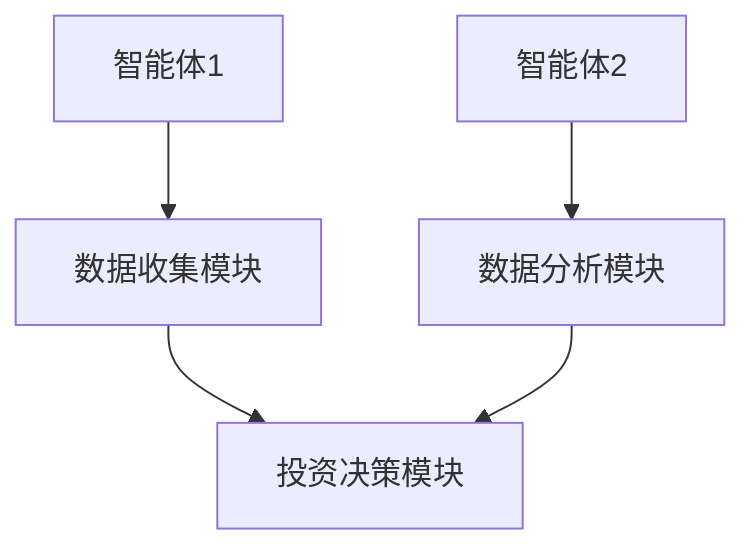
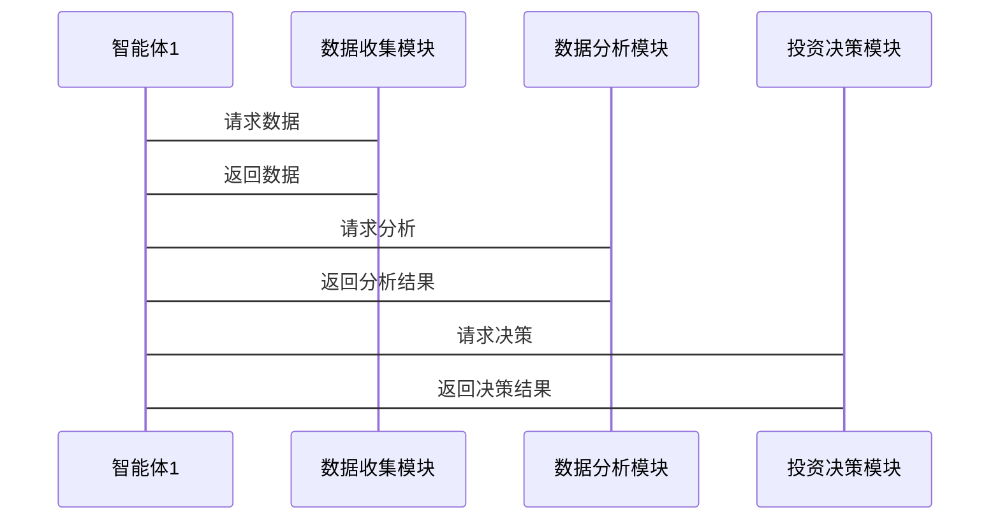

                 


# 多智能体系统在识别和评估社会责任投资机会中的作用

> 关键词：多智能体系统，社会责任投资，投资机会识别，算法原理，系统架构

> 摘要：本文探讨了多智能体系统（MAS）在社会责任投资（SRI）中的应用，特别是如何利用MAS来识别和评估社会责任投资机会。通过分析MAS的原理、算法实现、系统架构以及实际案例，本文详细阐述了MAS在SRI中的优势和挑战，并提出了相应的解决方案。

---

## 第1章: 多智能体系统与社会责任投资的背景介绍

### 1.1 多智能体系统的定义与特点

#### 1.1.1 多智能体系统的定义
多智能体系统（Multi-Agent System, MAS）是由多个智能体（Agent）组成的分布式系统，这些智能体能够通过协作完成复杂的任务。每个智能体都是独立的实体，具有感知环境、自主决策和学习的能力。

#### 1.1.2 多智能体系统的核心特点
- **分布式性**：智能体分布在不同的位置，独立运行。
- **协作性**：智能体之间通过通信和协作完成共同目标。
- **反应性**：智能体能够实时感知环境并做出反应。
- **自主性**：智能体具有自主决策的能力，无需外部干预。

#### 1.1.3 多智能体系统与传统单智能体系统的区别
| 特性         | 多智能体系统（MAS）                | 单智能体系统（SAS）                |
|--------------|------------------------------------|------------------------------------|
| 结构         | 分布式，多个智能体协作            | 集中式，单个智能体控制            |
| 通信         | 智能体之间需要通信与协作        | 智能体独立运行，无须通信          |
| 灵活性       | 系统适应性强，能够处理复杂任务    | 系统适应性较弱，处理任务有限      |
| 效率         | 可通过协作提高整体效率            | 单个智能体效率受限                |

### 1.2 社会责任投资的定义与背景

#### 1.2.1 社会责任投资的定义
社会责任投资（Socially Responsible Investment, SRI）是一种投资策略，旨在在追求财务回报的同时，考虑社会、环境和治理（ESG）因素。SRI强调投资于那些在社会和环境方面表现良好的企业。

#### 1.2.2 社会责任投资的发展历程
社会责任投资起源于20世纪60年代，最初关注于避免投资于烟草、酒精等有害行业。随着全球可持续发展意识的增强，SRI逐渐扩展到更广泛的领域，包括环境保护、社会责任等方面。

#### 1.2.3 社会责任投资的核心原则与目标
- **核心原则**：注重企业的ESG表现，避免投资于负面企业。
- **目标**：在实现财务回报的同时，促进社会和环境的可持续发展。

### 1.3 多智能体系统在社会责任投资中的作用

#### 1.3.1 多智能体系统在社会责任投资中的应用场景
- **数据收集与分析**：智能体收集企业ESG数据，分析其表现。
- **投资决策支持**：智能体协作提供投资建议，帮助投资者做出决策。
- **风险评估与预警**：智能体实时监控企业动态，评估投资风险。

#### 1.3.2 多智能体系统在社会责任投资中的优势
- **高效性**：多个智能体协作，提高数据处理效率。
- **准确性**：通过多智能体的协作，提高数据分析的准确性。
- **实时性**：智能体能够实时感知市场变化，快速做出反应。

#### 1.3.3 多智能体系统在社会责任投资中的挑战与解决方案
- **挑战**：智能体之间的通信和协作需要高效且安全的机制。
- **解决方案**：采用分布式计算和区块链技术，确保数据的安全性和可追溯性。

### 1.4 本章小结
本章介绍了多智能体系统和社会责任投资的基本概念和背景，分析了MAS在SRI中的作用和优势，并提出了相应的解决方案。

---

## 第2章: 多智能体系统与社会责任投资的核心概念与联系

### 2.1 多智能体系统的原理与实现机制

#### 2.1.1 多智能体系统的组成与结构
- **智能体**：独立的个体，能够感知环境并做出决策。
- **通信机制**：智能体之间的通信方式，如消息传递。
- **协作机制**：智能体之间的协作方式，如任务分配。

#### 2.1.2 多智能体系统的通信与协作机制
- **通信方式**：智能体之间通过消息传递进行通信。
- **协作机制**：智能体之间通过协商和协作完成任务。

#### 2.1.3 多智能体系统的决策与学习机制
- **决策机制**：智能体根据感知信息做出决策。
- **学习机制**：智能体通过学习提高决策能力。

### 2.2 社会责任投资的核心要素与评价指标

#### 2.2.1 社会责任投资的主要评价指标
- **环境因素（E）**：企业的碳排放、能源消耗等。
- **社会因素（S）**：企业的社会责任履行情况。
- **治理因素（G）**：企业的治理结构和透明度。

#### 2.2.2 社会责任投资的核心要素分析
- **环境因素**：企业的环保表现。
- **社会因素**：企业的社会责任履行情况。
- **治理因素**：企业的治理结构和透明度。

#### 2.2.3 社会责任投资的评价方法与模型
- **评价方法**：使用ESG评分模型对企业的ESG表现进行评分。
- **模型**：基于ESG评分模型，构建投资组合。

### 2.3 多智能体系统与社会责任投资的关联性分析

#### 2.3.1 多智能体系统在社会责任投资中的核心作用
- **数据收集与分析**：智能体收集企业的ESG数据，分析其表现。
- **投资决策支持**：智能体协作提供投资建议，帮助投资者做出决策。
- **风险评估与预警**：智能体实时监控企业动态，评估投资风险。

#### 2.3.2 多智能体系统与社会责任投资的协同效应
- **高效性**：多个智能体协作，提高数据处理效率。
- **准确性**：通过多智能体的协作，提高数据分析的准确性。
- **实时性**：智能体能够实时感知市场变化，快速做出反应。

#### 2.3.3 多智能体系统在社会责任投资中的创新应用
- **智能体协作投资决策**：多个智能体协作，提供更精准的投资建议。
- **实时监控与预警**：智能体实时监控企业动态，及时预警潜在风险。

### 2.4 本章小结
本章分析了多智能体系统和社会责任投资的核心概念和联系，探讨了MAS在SRI中的应用和创新。

---

## 第3章: 多智能体系统在社会责任投资中的算法原理与实现

### 3.1 多智能体系统的核心算法与实现

#### 3.1.1 多智能体协同学习算法
- **协同学习**：多个智能体通过协作学习，提高整体的决策能力。
- **算法实现**：采用分布式协同学习算法，实现智能体之间的协作。

#### 3.1.2 多智能体协作决策算法
- **协作决策**：智能体通过协作，共同做出决策。
- **算法实现**：采用协商算法，实现智能体之间的协作决策。

#### 3.1.3 多智能体系统中的通信与协调算法
- **通信算法**：智能体之间的通信方式，如消息传递。
- **协调算法**：智能体之间的协作方式，如任务分配。

### 3.2 多智能体系统在社会责任投资中的数学模型与公式

#### 3.2.1 多智能体系统的数学模型
$$
\text{总收益} = \sum_{i=1}^{n} \text{智能体}_i \times \text{投资金额}_i
$$

#### 3.2.2 多智能体系统中的协作机制公式
$$
\text{协作收益} = \sum_{i=1}^{n} \text{协作贡献}_i
$$

#### 3.2.3 多智能体系统在社会责任投资中的优化模型
$$
\max \sum_{i=1}^{n} \text{收益}_i - \sum_{i=1}^{n} \text{风险}_i
$$

### 3.3 多智能体系统在社会责任投资中的算法实现

#### 3.3.1 算法实现的步骤与流程
1. **数据收集**：智能体收集企业的ESG数据。
2. **数据分析**：智能体分析企业的ESG表现。
3. **投资决策**：智能体协作做出投资决策。

#### 3.3.2 算法实现的代码示例

```python
# 定义智能体类
class Agent:
    def __init__(self, id):
        self.id = id
        self.data = []

    def collect_data(self, company):
        # 收集企业数据
        self.data.append(company)

    def analyze_data(self):
        # 分析数据并返回评分
        return self.data

# 定义协作算法
def collaborate_agents(agents):
    for agent in agents:
        agent.analyze_data()

# 实例化智能体
agent1 = Agent(1)
agent2 = Agent(2)
agents = [agent1, agent2]

# 收集数据
agent1.collect_data("公司A")
agent2.collect_data("公司B")

# 协作分析
collaborate_agents(agents)
```

#### 3.3.3 算法实现的优化与改进
- **优化**：提高智能体之间的通信效率。
- **改进**：采用更高效的协作算法，如分布式协作算法。

### 3.4 本章小结
本章详细阐述了多智能体系统在社会责任投资中的算法原理与实现，通过代码示例和数学公式，进一步解释了算法的实现过程。

---

## 第4章: 多智能体系统与社会责任投资的系统分析与架构设计

### 4.1 系统分析与需求分析

#### 4.1.1 系统功能需求分析
- **数据收集**：智能体收集企业的ESG数据。
- **数据分析**：智能体分析企业的ESG表现。
- **投资决策**：智能体协作做出投资决策。

#### 4.1.2 系统性能需求分析
- **处理速度**：系统需要快速处理大量数据。
- **扩展性**：系统需要支持大量智能体的协作。

#### 4.1.3 系统边界与接口设计
- **系统边界**：系统的输入和输出接口。
- **接口设计**：智能体之间的通信接口。

### 4.2 系统架构设计

#### 4.2.1 系统功能设计
- **数据收集模块**：负责收集企业的ESG数据。
- **数据分析模块**：负责分析企业的ESG表现。
- **投资决策模块**：负责做出投资决策。

#### 4.2.2 系统架构图


#### 4.2.3 系统接口设计
- **数据接口**：智能体之间的数据接口。
- **通信接口**：智能体之间的通信接口。

#### 4.2.4 系统交互设计


### 4.3 系统优化与改进

#### 4.3.1 系统优化
- **提高处理速度**：优化数据处理算法。
- **增强扩展性**：采用分布式架构。

#### 4.3.2 系统改进
- **提高安全性**：采用加密通信。
- **增强容错性**：采用冗余设计。

### 4.4 本章小结
本章分析了多智能体系统在社会责任投资中的系统架构设计，探讨了系统的功能设计、架构图以及接口设计，并提出了相应的优化与改进措施。

---

## 作者信息

作者：AI天才研究院/AI Genius Institute & 禅与计算机程序设计艺术 /Zen And The Art of Computer Programming

---

通过以上思考，我们可以看到，多智能体系统在识别和评估社会责任投资机会中具有重要的作用。通过MAS的应用，可以提高投资决策的准确性和效率，同时促进社会和环境的可持续发展。

