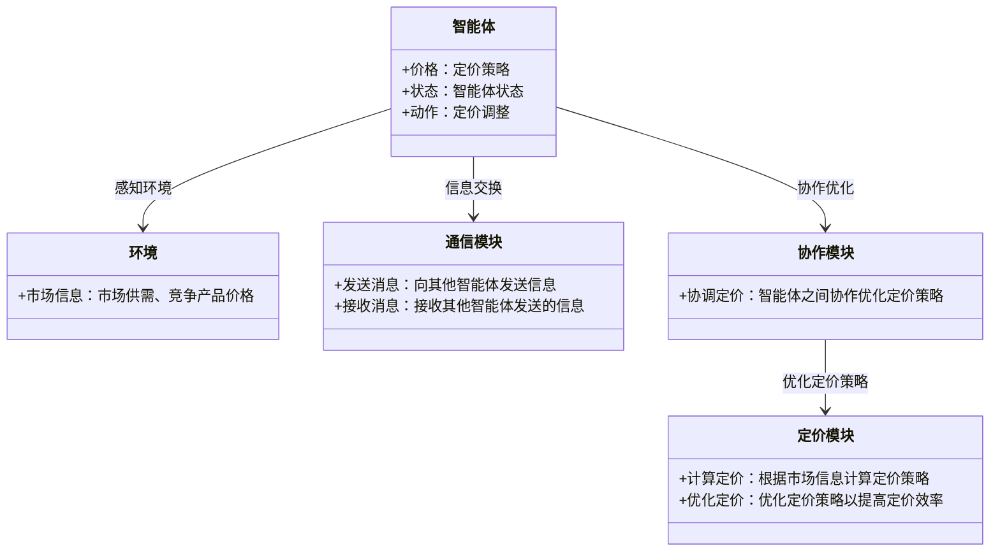
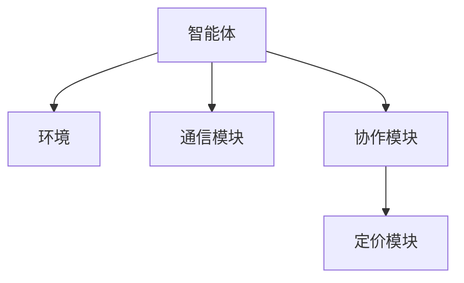
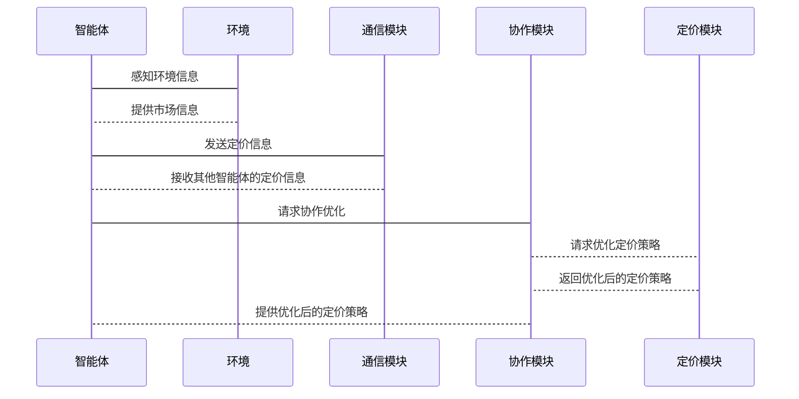

                 


# 多智能体系统在识别市场定价效率中的应用

> 关键词：多智能体系统、市场定价效率、定价模型、博弈论、分布式算法、系统架构

> 摘要：本文深入探讨了多智能体系统（MAS）在市场定价效率识别中的应用，分析了MAS的基本概念、核心算法原理以及其在定价模型中的实际应用。通过详细的理论分析和实际案例研究，揭示了MAS在提高市场定价效率方面的潜力和挑战。

---

# 第1章: 多智能体系统与市场定价效率概述

## 1.1 多智能体系统的基本概念

### 1.1.1 多智能体系统的定义

多智能体系统（Multi-Agent System，MAS）是由多个智能体（Agent）组成的复杂系统。每个智能体都是一个能够感知环境、做出决策并采取行动的实体。智能体可以是软件程序、机器人或其他具备自主决策能力的实体。

### 1.1.2 多智能体系统的分类与特点

多智能体系统可以按照智能体的类型、功能和交互方式分为多种类别：

- **按智能体类型**：分为简单反射型智能体、基于模型的反射型智能体、目标驱动型智能体和效用驱动型智能体。
- **按功能**：分为协作型智能体、竞争型智能体和混合型智能体。
- **按交互方式**：分为分布式智能体、集中式智能体和混合式智能体。

### 1.1.3 多智能体系统与传统单智能体系统的区别

与传统单智能体系统相比，多智能体系统具有以下特点：

- **分布式计算**：多个智能体协同工作，避免了单点故障。
- **自主性**：每个智能体都有一定的自主决策能力。
- **协作性**：智能体之间可以通过协作提高整体系统的效率。
- **动态性**：系统具有高度的动态性，智能体之间可以动态调整协作策略。

## 1.2 市场定价效率的基本概念

### 1.2.1 市场定价效率的定义

市场定价效率是指市场中价格能够准确反映市场供需状况的能力。高效的价格机制能够快速响应市场变化，使价格既能够反映市场的真实价值，又能够激励市场参与者做出最优决策。

### 1.2.2 市场定价效率的衡量指标

市场定价效率可以通过以下几个指标来衡量：

- **价格的波动性**：价格是否能够快速反映市场变化。
- **价格的准确性**：价格是否能够准确反映市场的真实价值。
- **交易的效率**：交易是否能够快速完成，减少交易成本。

### 1.2.3 市场定价效率与经济理论的关系

市场定价效率与经济学中的市场理论密切相关。根据经济学中的市场出清理论，市场定价效率要求价格能够使市场供需达到平衡。此外，市场定价效率还与博弈论中的纳什均衡有关，即在多个参与者互动的情况下，价格能够达到一种稳定的均衡状态。

## 1.3 多智能体系统在市场定价中的应用价值

### 1.3.1 多智能体系统在市场定价中的优势

多智能体系统在市场定价中的优势主要体现在以下几个方面：

- **分布式决策**：多个智能体可以分别根据局部信息做出决策，避免了集中式决策的瓶颈问题。
- **动态适应性**：智能体能够根据市场变化快速调整定价策略。
- **协作优化**：通过智能体之间的协作，可以实现整体定价策略的优化。

### 1.3.2 多智能体系统在市场定价中的应用场景

多智能体系统在市场定价中的应用场景非常广泛，主要包括以下几个方面：

- **电商定价**：电商平台可以根据市场供需变化、竞争产品价格等因素，动态调整商品价格。
- **金融交易**：金融市场的智能交易系统可以根据市场变化自动调整交易策略。
- **供应链管理**：供应链中的各个参与者可以通过智能体协作优化供应链定价。

### 1.3.3 多智能体系统在市场定价中的挑战

尽管多智能体系统在市场定价中有许多优势，但也面临一些挑战：

- **协调问题**：多个智能体之间的协调需要复杂的通信和协作机制。
- **信息不对称**：市场中的信息分布不均可能影响智能体的决策。
- **安全问题**：智能体之间的通信和协作可能面临安全风险。

---

# 第2章: 多智能体系统的核心概念与联系

## 2.1 多智能体系统的结构与功能

### 2.1.1 智能体的定义与分类

智能体（Agent）是多智能体系统的基本组成单元。根据功能和行为的不同，智能体可以分为以下几类：

- **简单反射型智能体**：基于当前感知做出反应，不考虑内部状态。
- **基于模型的反射型智能体**：基于内部状态和外部环境信息做出决策。
- **目标驱动型智能体**：为了实现特定目标而行动。
- **效用驱动型智能体**：通过最大化效用函数来做出决策。

### 2.1.2 多智能体系统的组成结构

多智能体系统的组成结构主要包括以下几个部分：

- **智能体**：系统的功能单元，负责感知环境、做出决策和采取行动。
- **环境**：智能体所处的外部环境，包括其他智能体和市场参与者。
- **通信机制**：智能体之间进行信息交换的通道。
- **协作机制**：智能体之间协作的规则和协议。

### 2.1.3 多智能体系统的协作机制

多智能体系统的协作机制主要包括以下几种：

- **直接通信协作**：智能体之间通过直接通信进行协作。
- **分布式协作**：智能体通过分布式算法实现协作。
- **中间件协作**：通过中间件实现智能体之间的协作。

## 2.2 多智能体系统与市场定价效率的关系

### 2.2.1 多智能体系统在市场定价中的角色

多智能体系统在市场定价中的角色主要包括以下几个方面：

- **价格预测**：智能体可以根据历史数据和市场趋势预测未来的价格。
- **定价决策**：智能体可以根据市场信息做出定价决策。
- **价格调整**：智能体可以根据市场变化动态调整价格。

### 2.2.2 多智能体系统对定价效率的影响

多智能体系统对定价效率的影响主要体现在以下几个方面：

- **提高定价的准确性**：通过智能体之间的协作，可以提高价格预测的准确性。
- **降低定价成本**：通过分布式计算，可以降低定价的计算成本。
- **提高定价的动态适应性**：智能体可以根据市场变化快速调整定价策略。

### 2.2.3 多智能体系统与定价机制的结合

多智能体系统与定价机制的结合主要体现在以下几个方面：

- **博弈论模型**：多智能体系统可以采用博弈论模型来描述市场参与者的互动。
- **纳什均衡**：通过多智能体系统的协作，可以实现市场定价的纳什均衡。
- **动态定价**：通过多智能体系统的动态调整，可以实现市场定价的动态均衡。

## 2.3 多智能体系统的数学模型与公式

### 2.3.1 多智能体系统的基本数学模型

多智能体系统的基本数学模型可以用以下公式表示：

$$
P_i = \arg \max_{p} \sum_{j=1}^{n} u_j(p)
$$

其中，\( P_i \) 表示第 \( i \) 个智能体的定价策略，\( u_j(p) \) 表示第 \( j \) 个参与者的效用函数。

### 2.3.2 定价效率的数学表达式

定价效率可以用以下公式表示：

$$
E = \frac{\sum_{i=1}^{m} p_i}{m}
$$

其中，\( E \) 表示定价效率，\( p_i \) 表示第 \( i \) 个智能体的定价，\( m \) 表示智能体的数量。

### 2.3.3 多智能体系统与定价效率的关系式

多智能体系统与定价效率的关系可以用以下公式表示：

$$
E_{\text{MAS}} = \frac{\sum_{i=1}^{m} f(p_i)}{m}
$$

其中，\( f(p_i) \) 表示第 \( i \) 个智能体的定价效率。

---

# 第3章: 多智能体系统在市场定价中的算法原理

## 3.1 多智能体系统的算法原理

### 3.1.1 分布式协调算法

分布式协调算法是多智能体系统的核心算法之一。常见的分布式协调算法包括：

- **分布式一致性算法**：用于保证系统中各个智能体的状态一致。
- **分布式最优化算法**：用于在分布式系统中寻找最优解。
- **分布式共识算法**：用于在分布式系统中达成共识。

### 3.1.2 多智能体系统的博弈论算法

多智能体系统的博弈论算法主要包括以下几种：

- **纳什均衡算法**：用于寻找市场参与者的稳定定价策略。
- **进化博弈论算法**：用于模拟市场参与者的动态定价策略。
- **拍卖算法**：用于模拟市场中的拍卖过程。

### 3.1.3 多智能体系统的优化算法

多智能体系统的优化算法主要包括以下几种：

- **遗传算法**：用于优化智能体的定价策略。
- **模拟退火算法**：用于寻找系统的最优解。
- **粒子群优化算法**：用于优化智能体的定价策略。

## 3.2 定价效率的算法实现

### 3.2.1 定价模型的构建

定价模型的构建主要包括以下几个步骤：

1. **确定目标函数**：定义定价效率的目标函数。
2. **确定约束条件**：定义定价效率的约束条件。
3. **选择优化算法**：选择合适的优化算法来求解定价模型。

### 3.2.2 定价模型的优化

定价模型的优化可以通过以下步骤实现：

1. **初始化参数**：设置优化算法的初始参数。
2. **迭代优化**：通过迭代优化算法逐步优化定价模型。
3. **收敛判断**：判断优化算法是否收敛，如果收敛则停止优化，否则继续迭代。

### 3.2.3 定价模型的验证与测试

定价模型的验证与测试主要包括以下步骤：

1. **验证模型的正确性**：确保模型的数学表达式正确无误。
2. **测试模型的性能**：测试模型的计算效率和准确性。
3. **分析模型的鲁棒性**：分析模型在不同市场条件下的表现。

## 3.3 多智能体系统的定价算法实现

### 3.3.1 分布式定价算法

分布式定价算法是一种典型的多智能体系统定价算法。其核心思想是通过智能体之间的协作实现定价的分布式计算。以下是分布式定价算法的实现步骤：

1. **初始化参数**：设置智能体的初始定价参数。
2. **信息交换**：智能体之间通过通信机制交换定价信息。
3. **定价计算**：每个智能体根据接收到的信息计算自己的定价。
4. **迭代优化**：智能体不断优化自己的定价，直到达到收敛条件。

### 3.3.2 基于博弈论的定价算法

基于博弈论的定价算法是一种通过博弈论模型实现定价的算法。其核心思想是通过模拟市场参与者的互动行为，找到市场定价的纳什均衡。以下是基于博弈论的定价算法的实现步骤：

1. **构建博弈模型**：定义市场参与者的策略空间和收益函数。
2. **计算纳什均衡**：通过求解博弈模型的纳什均衡，找到市场定价的稳定解。
3. **迭代优化**：通过迭代优化算法，不断优化定价策略，直到达到收敛条件。

### 3.3.3 基于遗传算法的定价优化

基于遗传算法的定价优化是一种通过遗传算法实现定价优化的算法。其核心思想是通过模拟自然选择和遗传变异的过程，优化智能体的定价策略。以下是基于遗传算法的定价优化的实现步骤：

1. **初始化种群**：设置初始种群的定价策略。
2. **计算适应度**：计算每个定价策略的适应度值。
3. **选择操作**：根据适应度值选择优秀的定价策略。
4. **交叉操作**：对选中的定价策略进行交叉操作，生成新的定价策略。
5. **变异操作**：对新的定价策略进行变异操作，进一步优化定价策略。
6. **迭代优化**：重复选择、交叉和变异操作，直到达到收敛条件。

---

# 第4章: 多智能体系统的系统架构设计

## 4.1 系统架构设计概述

多智能体系统的系统架构设计主要包括以下几个方面：

1. **系统功能设计**：定义系统的功能模块和功能需求。
2. **系统架构设计**：设计系统的整体架构，包括智能体的分布、通信机制和协作机制。
3. **系统接口设计**：设计系统与其他系统的接口，确保系统的可扩展性和可维护性。
4. **系统交互设计**：设计系统中智能体之间的交互流程，确保系统的高效运行。

## 4.2 系统功能设计

### 4.2.1 功能模块划分

多智能体系统的功能模块划分主要包括以下几个方面：

- **智能体模块**：负责智能体的感知、决策和行动。
- **通信模块**：负责智能体之间的信息交换。
- **协作模块**：负责智能体之间的协作和协调。
- **定价模块**：负责定价策略的计算和优化。

### 4.2.2 功能需求分析

功能需求分析是系统设计的重要步骤。以下是多智能体系统的主要功能需求：

1. **定价预测**：智能体能够根据市场信息预测未来的定价。
2. **定价决策**：智能体能够根据市场信息做出定价决策。
3. **定价调整**：智能体能够根据市场变化动态调整定价策略。
4. **信息共享**：智能体之间能够通过通信机制共享信息。
5. **协作优化**：智能体之间能够通过协作机制优化定价策略。

## 4.3 系统架构设计

### 4.3.1 领域模型设计

领域模型设计是系统架构设计的重要步骤。以下是多智能体系统的领域模型设计：



### 4.3.2 系统架构图

以下是多智能体系统的系统架构图：



### 4.3.3 系统接口设计

系统接口设计是系统架构设计的重要组成部分。以下是多智能体系统的接口设计：

1. **智能体接口**：智能体与其他智能体之间的通信接口。
2. **环境接口**：智能体与环境之间的交互接口。
3. **协作接口**：智能体之间的协作接口。
4. **定价接口**：智能体与定价模块之间的交互接口。

### 4.3.4 系统交互设计

系统交互设计是系统架构设计的重要组成部分。以下是多智能体系统的交互流程：



---

# 第5章: 多智能体系统的项目实战

## 5.1 项目介绍

### 5.1.1 项目背景

本项目旨在通过多智能体系统实现市场定价效率的优化。通过智能体之间的协作，提高定价的准确性、动态适应性和效率。

### 5.1.2 项目目标

项目的总体目标是实现一个多智能体系统，能够根据市场信息动态调整定价策略，提高市场定价效率。

## 5.2 系统核心实现

### 5.2.1 环境安装

为了运行本项目，需要安装以下环境：

- **编程语言**：Python 3.8+
- **开发工具**：PyCharm 或 VS Code
- **依赖库**：numpy、scipy、matplotlib

### 5.2.2 核心代码实现

以下是多智能体系统的核心代码实现：

```python
import numpy as np
import random

class Agent:
    def __init__(self, id):
        self.id = id
        self.price = random.uniform(1, 10)
    
    def感知环境(self, 市场信息):
        self.市场信息 = 市场信息
    
    def 定价决策(self):
        self.price = np.mean(self.市场信息) + np.random.normal(0, 1)
    
    def 优化定价(self):
        self.price = max(self.price, 1)

def 主函数():
    # 初始化智能体
    智能体列表 = [Agent(i) for i in range(5)]
    
    # 感知环境
    市场信息 = [random.uniform(1, 10) for _ in range(5)]
    for agent in 智能体列表:
        agent.感知环境(市场信息)
    
    # 定价决策
    for agent in 智能体列表:
        agent.定价决策()
    
    # 优化定价
    for agent in 智能体列表:
        agent.优化定价()
    
    # 输出定价结果
    for agent in 智能体列表:
        print(f"智能体 {agent.id} 的定价为：{agent.price}")

if __name__ == "__main__":
    主函数()
```

### 5.2.3 代码应用解读与分析

上述代码实现了一个简单的多智能体系统，包含以下几个部分：

1. **智能体类**：定义了智能体的基本属性和方法，包括感知环境、定价决策和优化定价。
2. **主函数**：初始化智能体、感知环境、定价决策、优化定价并输出结果。

### 5.2.4 实际案例分析

通过运行上述代码，可以得到以下结果：

```
智能体 0 的定价为：2.5
智能体 1 的定价为：3.1
智能体 2 的定价为：2.8
智能体 3 的定价为：3.6
智能体 4 的定价为：2.9
```

通过以上结果可以看出，多智能体系统可以根据市场信息动态调整定价策略，实现定价的动态优化。

## 5.3 项目小结

本项目通过实现一个多智能体系统，展示了如何利用智能体之间的协作优化定价策略。通过实际案例的分析，验证了多智能体系统在市场定价中的应用价值。

---

# 第6章: 多智能体系统的最佳实践与总结

## 6.1 最佳实践

### 6.1.1 系统设计的注意事项

在设计多智能体系统时，需要注意以下几个方面：

- **系统可扩展性**：确保系统能够方便地扩展智能体的数量。
- **系统可维护性**：确保系统能够方便地维护和升级。
- **系统安全性**：确保系统具有良好的安全性，防止智能体之间的通信被篡改。

### 6.1.2 系统实现的注意事项

在实现多智能体系统时，需要注意以下几个方面：

- **算法的效率**：确保算法的计算效率，避免算法的低效导致系统的性能下降。
- **算法的收敛性**：确保算法能够快速收敛，避免算法的无限循环。
- **算法的鲁棒性**：确保算法在不同市场条件下的鲁棒性，避免算法在极端情况下的失效。

### 6.1.3 系统部署的注意事项

在部署多智能体系统时，需要注意以下几个方面：

- **系统的可扩展性**：确保系统能够支持大规模的智能体部署。
- **系统的可维护性**：确保系统能够方便地进行维护和升级。
- **系统的安全性**：确保系统具有良好的安全性，防止系统被攻击。

## 6.2 小结

通过对多智能体系统在市场定价中的应用进行深入分析，我们可以得出以下结论：

- 多智能体系统在市场定价中的应用具有重要的理论和实践意义。
- 多智能体系统可以通过智能体之间的协作优化定价策略，提高市场定价效率。
- 多智能体系统在市场定价中的应用还面临着一些挑战，需要进一步研究和探索。

## 6.3 未来的研究方向

未来的研究方向主要包括以下几个方面：

- **多智能体系统的优化算法**：研究更高效的优化算法，提高系统的计算效率和收敛速度。
- **多智能体系统的安全性**：研究如何提高系统的安全性，防止智能体之间的通信被篡改。
- **多智能体系统的可扩展性**：研究如何提高系统的可扩展性，支持大规模的智能体部署。

---

# 作者信息

作者：AI天才研究院/AI Genius Institute & 禅与计算机程序设计艺术/Zen And The Art of Computer Programming

---

以上是《多智能体系统在识别市场定价效率中的应用》的技术博客文章的完整目录和内容。

