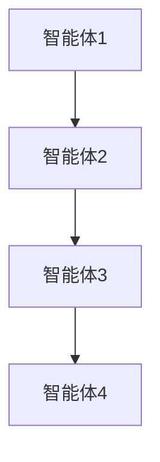
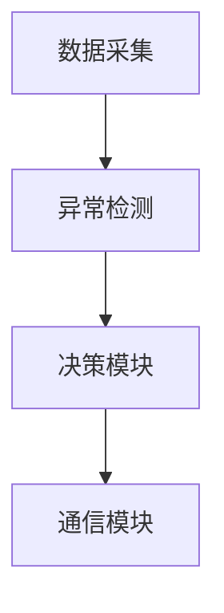
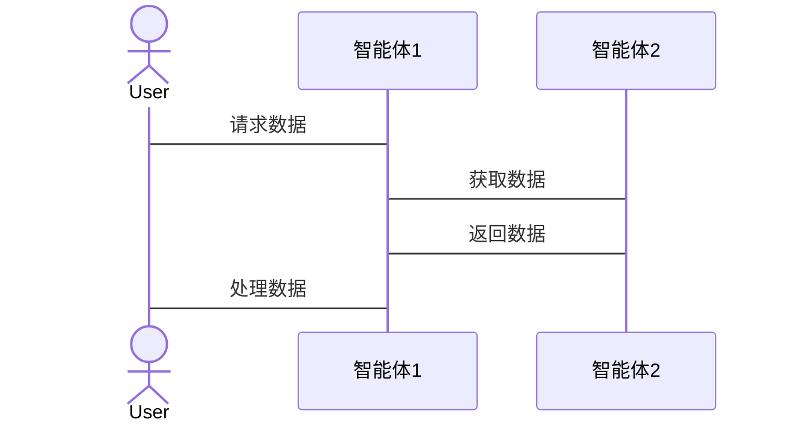

                 


# 多智能体系统在识别市场异常机会中的应用

## 关键词：多智能体系统, 市场异常机会, 分布式计算, 市场分析, 人工智能

## 摘要：  
多智能体系统（Multi-Agent Systems, MAS）在金融市场中的应用日益广泛，尤其是在识别市场异常机会方面展现出了独特的优势。本文通过详细分析多智能体系统的概念、算法、架构及其在市场异常检测中的应用，探讨其在捕捉市场机会中的潜力。我们从多智能体系统的背景介绍入手，逐步深入到其核心算法、系统设计以及实际案例分析，最终总结其在金融市场中的应用前景。

---

# 第1章 多智能体系统概述

## 1.1 多智能体系统的基本概念

### 1.1.1 多智能体系统的定义
多智能体系统（MAS）是指由多个智能体（Agent）组成的分布式系统，这些智能体能够通过交互协作完成复杂任务。智能体是具有感知、决策和行动能力的实体，可以是软件程序或物理设备。

### 1.1.2 多智能体系统的特点
- **分布式性**：智能体独立运行，通过通信协作完成任务。
- **自主性**：每个智能体都具有自主决策能力。
- **协作性**：智能体之间通过协作提高整体系统的性能。
- **反应性**：能够实时感知环境并做出响应。

### 1.1.3 多智能体系统与传统单智能体系统的区别
| 特性           | 单智能体系统            | 多智能体系统            |
|----------------|------------------------|-------------------------|
| 决策中心化     | 单个决策中心           | 分布式决策，多个智能体协作 |
| 资源利用率     | 高，但资源集中使用       | 更高效，资源分散利用     |
| 系统复杂性     | 简单，易于管理          | 复杂，需要协调多个智能体  |

---

## 1.2 多智能体系统的组成与结构

### 1.2.1 智能体的定义与分类
智能体可以分为**反应式智能体**和**基于模型的智能体**。反应式智能体仅依赖当前感知做出决策，而基于模型的智能体则依赖内部状态和模型进行推理。

### 1.2.2 多智能体系统的组织结构
多智能体系统的组织结构可以分为**集中式**和**分布式**两种：
- **集中式**：有一个中央协调器，负责分配任务和协调智能体。
- **分布式**：智能体之间直接通信，无中央协调器。

### 1.2.3 智能体之间的通信与协作
智能体之间的通信通常通过**消息传递**或**共享数据库**实现。协作机制包括**任务分配**、**协调协议**和**冲突解决**。

---

## 1.3 多智能体系统的应用领域

### 1.3.1 金融领域的应用
- **股票交易**：多智能体系统可以实时分析市场数据，识别异常交易模式。
- **风险管理**：通过协作智能体实时监控市场风险，及时发出预警。

### 1.3.2 其他领域的应用案例
- **物流与供应链**：优化货物运输路径。
- **智能家居**：协调家中各种智能设备。

---

# 第2章 市场异常机会识别的背景与挑战

## 2.1 市场异常机会的定义
市场异常机会是指在金融市场中出现的短期价格波动、交易异常等现象，通常可以通过技术手段识别并利用这些机会进行获利。

---

## 2.2 传统市场分析方法的局限性

### 2.2.1 基于单一指标的分析方法
传统分析方法通常依赖单一指标（如K线图、均线等），难以捕捉复杂的市场动态。

### 2.2.2 传统市场分析的不足
- **信息处理能力有限**：难以处理海量数据。
- **反应速度慢**：传统方法通常依赖人工分析，无法实时响应市场变化。

---

## 2.3 多智能体系统在市场分析中的优势

### 2.3.1 多智能体系统的分布式计算能力
- **并行处理**：多个智能体可以同时分析不同数据源。
- **实时性**：能够快速响应市场变化。

### 2.3.2 多智能体系统的协作能力
- **信息共享**：智能体之间可以实时共享信息，提高整体分析能力。
- **任务分配**：智能体可以根据任务需求动态分配资源。

---

# 第3章 多智能体系统的核心算法与数学模型

## 3.1 分布式计算与协调算法

### 3.1.1 分布式计算的基本原理
分布式计算通过多个节点协作完成任务，每个节点仅负责部分计算。

### 3.1.2 多智能体系统的协调机制
- **一致性协议**：如Paxos、Raft等算法，用于确保系统状态一致。
- **任务分配算法**：如负载均衡算法，用于动态分配任务。

### 3.1.3 一致性协议
一致性协议确保多个智能体之间达成一致状态。例如，Raft算法用于分布式系统中的领导选举。


---

## 3.2 多智能体系统的数学模型

### 3.2.1 多智能体系统的状态表示
状态表示通常包括市场数据（如价格、成交量）和智能体内部状态（如信念、决策）。

### 3.2.2 多智能体系统的动作选择
智能体根据当前状态选择动作，如“买入”、“卖出”或“持有”。

### 3.2.3 多智能体系统的环境建模
环境建模包括市场动态、交易规则等。

---

## 3.3 基于MAS的异常检测

### 3.3.1 异常检测算法
- **基于统计的方法**：如Z-score、孤立森林。
- **基于机器学习的方法**：如聚类、分类。

### 3.3.2 异常检测的数学模型
$$
\text{异常概率} = f(x, y, z)
$$
其中，$x$、$y$、$z$是市场数据的不同维度。

---

## 3.4 多智能体系统的协作算法

### 3.4.1 协作机制
- **任务分配**：根据智能体能力和当前负载动态分配任务。
- **信息共享**：智能体之间共享数据，提高整体分析能力。

### 3.4.2 协作算法


---

# 第4章 多智能体系统的系统架构设计

## 4.1 系统功能设计

### 4.1.1 系统功能模块
- **数据采集模块**：实时采集市场数据。
- **异常检测模块**：识别市场异常。
- **决策模块**：根据检测结果做出交易决策。
- **通信模块**：智能体之间通信协作。

### 4.1.2 功能模块的交互流程


---

## 4.2 系统架构设计

### 4.2.1 分布式架构
- **客户-服务器架构**：适合集中式管理。
- **对等网络架构**：适合分布式协作。

### 4.2.2 系统架构图


---

## 4.3 系统接口设计

### 4.3.1 接口定义
- **数据接口**：数据采集模块与外部数据源的接口。
- **通信接口**：智能体之间通信的接口。

---

## 4.4 系统交互设计

### 4.4.1 交互流程


---

# 第5章 项目实战：基于MAS的股票市场异常检测

## 5.1 项目背景

### 5.1.1 项目目标
识别股票市场的异常交易模式，帮助投资者抓住市场机会。

---

## 5.2 项目环境配置

### 5.2.1 系统环境
- 操作系统：Linux
- 开发工具：Python、Django
- 依赖库：numpy、pandas、scikit-learn

---

## 5.3 核心代码实现

### 5.3.1 数据采集模块
```python
import requests
import json

def get_stock_data(symbol):
    url = f"https://api.example.com/stock/{symbol}"
    response = requests.get(url)
    return json.loads(response.text)
```

---

## 5.4 算法实现

### 5.4.1 异常检测算法
```python
from sklearn.ensemble import IsolationForest

def detect_anomaly(data):
    model = IsolationForest(n_estimators=100)
    model.fit(data)
    return model.predict(data)
```

---

## 5.5 代码解读与分析

### 5.5.1 数据处理
```python
import pandas as pd

data = pd.DataFrame({
    'price': [100, 105, 98, 110, 108],
    'volume': [1000, 900, 1200, 800, 1100]
})

data['price'].plot()
```

---

## 5.6 实际案例分析

### 5.6.1 案例分析
某股票在短时间内价格急剧下跌，异常检测算法识别出这一异常，并发出预警。

---

## 5.7 项目总结

### 5.7.1 成功经验
- 系统实现了高效的异常检测。
- 智能体之间的协作提高了检测精度。

### 5.7.2 改进方向
- 提高系统的实时性。
- 增强系统的鲁棒性。

---

# 第6章 总结与展望

## 6.1 总结
多智能体系统在识别市场异常机会中展现出独特的优势，通过分布式计算和协作机制，能够高效地捕捉市场机会。

---

## 6.2 未来展望
随着人工智能技术的发展，多智能体系统在金融领域的应用将更加广泛，异常检测算法也将更加智能化。

---

## 6.3 最佳实践 tips
- 在实际应用中，建议结合具体场景优化算法。
- 注意数据质量和模型的可解释性。

---

## 小结
通过本文的分析，我们了解了多智能体系统在识别市场异常机会中的应用，从理论到实践，为读者提供了一个全面的视角。

---

## 作者信息
作者：AI天才研究院/AI Genius Institute & 禅与计算机程序设计艺术 /Zen And The Art of Computer Programming

---

感谢您的阅读！希望本文对您理解多智能体系统在金融市场中的应用有所帮助。

