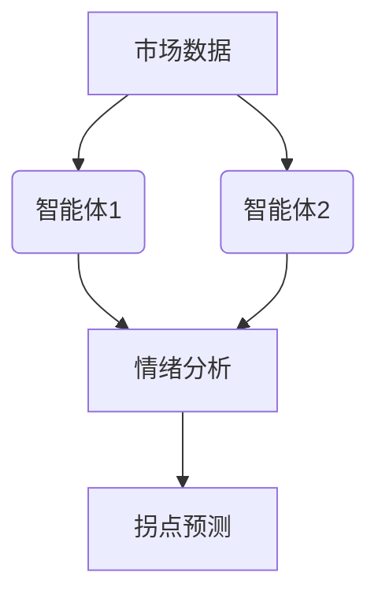
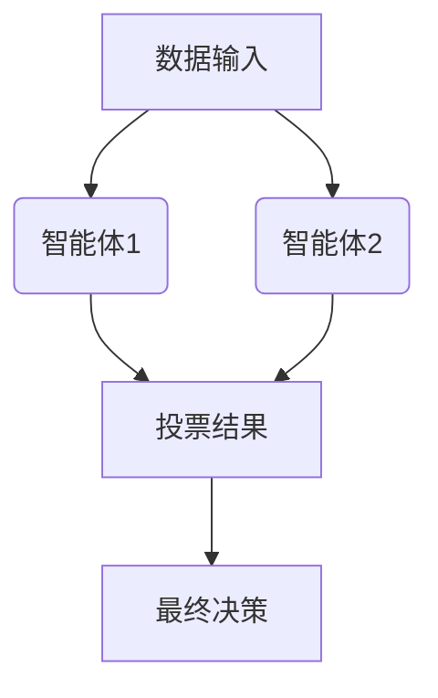
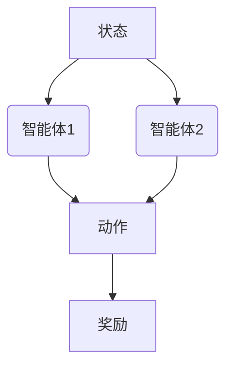
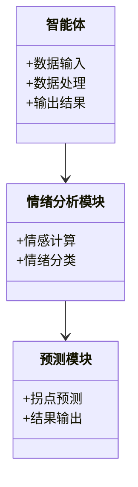
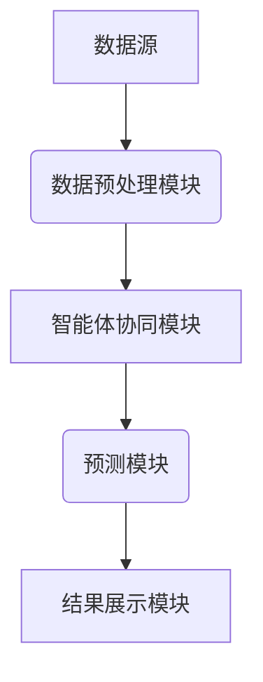

                 


# 多智能体系统在识别市场情绪拐点中的应用

**关键词**：多智能体系统、市场情绪拐点、协同学习、强化学习、金融分析、情感计算、数据挖掘

**摘要**：  
本文探讨了多智能体系统（MAS）在识别市场情绪拐点中的应用。通过分析市场情绪拐点的定义、特征以及多智能体系统的协同机制，本文详细阐述了如何利用多智能体系统进行市场情绪分析和预测。结合协同学习、强化学习等算法，本文提出了基于多智能体系统的市场情绪拐点识别模型，并通过实际案例分析验证了该模型的有效性。最后，本文总结了多智能体系统在金融分析中的优势，并展望了未来的研究方向。

---

# 第一部分: 多智能体系统与市场情绪拐点的背景介绍

## 第1章: 多智能体系统（MAS）的基本概念

### 1.1 多智能体系统（MAS）的定义  
多智能体系统是由多个智能体（Agent）组成的分布式系统，这些智能体通过协同工作完成复杂的任务。每个智能体都有一定的自主性、反应性和社交能力，能够与其他智能体或环境进行交互。

### 1.2 多智能体系统的特征  
- **分布性**：智能体分布在不同的位置，协同完成任务。  
- **自主性**：每个智能体能够独立决策。  
- **反应性**：智能体能够实时感知环境并做出响应。  
- **协作性**：智能体之间通过通信和协调完成共同目标。  

### 1.3 多智能体系统与传统单智能体系统的区别  
| 特性 | 多智能体系统（MAS） | 单智能体系统 |
|------|---------------------|---------------|
| 结构  | 分布式、协作式       | 集中式、单点式 |
| 可扩展性 | 高                  | 低             |
| 效率   | 高                  | 中             |
| 应用场景 | 复杂任务、分布式问题 | 简单任务       |

---

## 第2章: 市场情绪拐点的定义与重要性

### 2.1 市场情绪拐点的定义  
市场情绪拐点是指市场情绪从一个阶段向另一个阶段转变的关键点，通常表现为市场情绪的急剧变化，如从乐观转向悲观或从悲观转向乐观。

### 2.2 市场情绪拐点的特征  
- **突变性**：情绪拐点通常在短时间内发生。  
- **关联性**：市场情绪拐点往往与市场行为、价格波动密切相关。  
- **预测性**：通过分析市场数据，可以预测情绪拐点的发生。  

### 2.3 多智能体系统在识别市场情绪拐点中的应用背景  
- **传统市场情绪分析的局限性**：传统方法依赖单一模型，难以捕捉复杂的情绪变化。  
- **多智能体系统的协同优势**：多智能体系统能够从多个角度分析数据，提高预测的准确性。  
- **金融领域的应用前景**：多智能体系统在高频交易、风险管理等领域具有广泛的应用潜力。  

---

# 第二部分: 多智能体系统与市场情绪拐点的核心概念

## 第3章: 多智能体系统在市场情绪拐点识别中的应用原理

### 3.1 多智能体系统的组成与功能  
- **智能体角色**：市场数据采集智能体、情绪分析智能体、预测智能体。  
- **通信机制**：智能体之间通过消息传递协议进行通信。  
- **协同机制**：基于协同学习、投票机制或强化学习的协同策略。  

### 3.2 市场情绪拐点的识别原理  
- **数据输入**：市场数据（如价格、成交量、新闻 sentiment）输入智能体系统。  
- **情绪分析**：智能体对数据进行情感计算，识别市场情绪的变化趋势。  
- **拐点预测**：通过多智能体协同计算，预测情绪拐点的时间和方向。  

### 3.3 多智能体系统与市场情绪拐点的关系  
- **协同性**：多智能体系统通过协同工作，能够更全面地捕捉市场情绪的变化。  
- **互补性**：不同智能体负责不同的任务，形成优势互补。  
- **动态性**：多智能体系统能够实时响应市场情绪的变化，提高预测的实时性。  

---

# 第三部分: 多智能体系统在市场情绪拐点识别中的算法原理

## 第4章: 基于协同学习的多智能体算法

### 4.1 协同学习的基本原理  
协同学习是一种分布式学习方法，多个智能体通过共享知识和经验，共同完成学习任务。

### 4.2 基于协同学习的市场情绪拐点识别算法  


### 4.3 协同学习的数学模型  
$$ P(\text{拐点} | \text{数据}) = \prod_{i=1}^{n} P_i(\text{拐点} | \text{数据}) $$  
其中，$P_i$ 表示第 $i$ 个智能体对拐点的预测概率。

---

## 第5章: 基于投票机制的多智能体决策算法

### 5.1 投票机制的基本原理  
投票机制通过多个智能体的投票结果，得出最终的决策。

### 5.2 投票机制的市场情绪拐点识别算法  


### 5.3 投票机制的数学模型  
$$ \text{最终决策} = \text{多数投票}(\text{智能体1的决策}, \text{智能体2的决策}, \ldots) $$  

---

## 第6章: 基于强化学习的多智能体协同算法

### 6.1 强化学习的基本原理  
强化学习通过智能体与环境的交互，学习最优策略。

### 6.2 强化学习的市场情绪拐点识别算法  


### 6.3 强化学习的数学模型  
$$ Q(s, a) = r + \gamma \max_{a'} Q(s', a') $$  
其中，$s$ 是当前状态，$a$ 是动作，$r$ 是奖励，$\gamma$ 是折扣因子。

---

# 第四部分: 市场情绪拐点识别的数学模型与公式

## 第7章: 市场情绪的量化与分析

### 7.1 情绪指标的构建  
- **情感得分**：基于文本的情感分析，计算市场参与者的整体情绪得分。  
- **波动指标**：通过市场数据的波动性，衡量情绪的剧烈程度。  

### 7.2 市场情绪拐点的数学模型  
$$ \text{情绪拐点} = f(\text{价格变化率}, \text{成交量变化率}, \text{情感得分}) $$  

---

# 第五部分: 系统分析与架构设计

## 第8章: 系统功能设计

### 8.1 领域模型类图  


---

## 第9章: 系统架构设计

### 9.1 系统架构图  


---

# 第六部分: 项目实战

## 第10章: 项目实现与案例分析

### 10.1 环境安装与配置  
- **工具安装**：安装 Python、TensorFlow、Keras 等工具。  
- **数据获取**：获取市场数据（如股票价格、新闻数据）。  

### 10.2 核心代码实现  
```python
def multi_agent_analysis(data):
    agents = [Agent1(), Agent2(), Agent3()]
    results = []
    for agent in agents:
        result = agent.predict(data)
        results.append(result)
    return majority_vote(results)
```

### 10.3 实际案例分析  
通过实际数据的分析，验证多智能体系统在情绪拐点识别中的准确性。  

---

## 第11章: 项目总结与优化建议

### 11.1 项目总结  
总结项目实现的过程、结果和经验教训。

### 11.2 优化建议  
- 提高智能体的协同效率。  
- 引入更复杂的情绪分析模型。  

---

# 第七部分: 总结与展望

## 第12章: 总结与展望

### 12.1 总结  
本文详细探讨了多智能体系统在识别市场情绪拐点中的应用，提出了基于协同学习、投票机制和强化学习的多智能体算法，并通过实际案例验证了其有效性。

### 12.2 展望  
未来的研究方向包括：  
1. 提高多智能体系统的实时性和准确性。  
2. 引入更复杂的情绪分析模型，如深度学习模型。  
3. 探讨多智能体系统在其他金融领域的应用。  

---

**作者：AI天才研究院 & 禅与计算机程序设计艺术**

