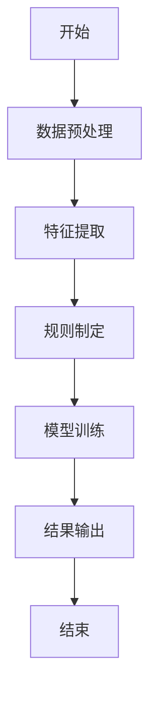
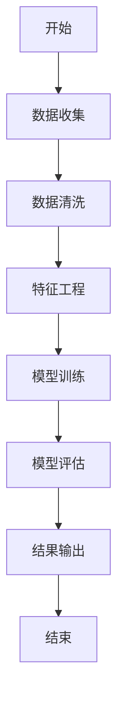
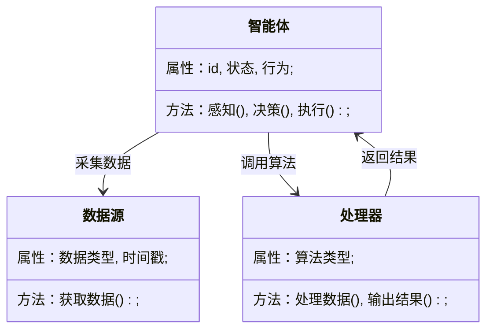
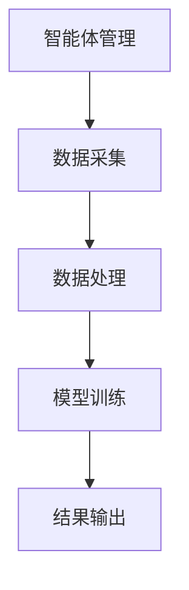
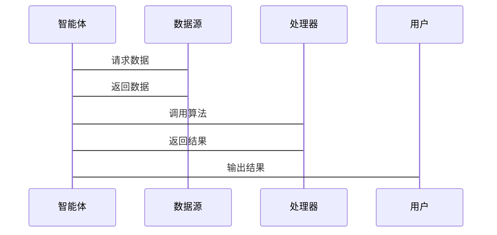

                 


# 多智能体系统在识别市场泡沫形成中的应用

> 关键词：多智能体系统、市场泡沫、金融风险管理、机器学习、分布式计算、智能体协作、金融市场预测

> 摘要：  
> 本文探讨了多智能体系统（Multi-Agent System, MAS）在识别市场泡沫形成中的应用。通过分析多智能体系统的核心原理、算法实现及系统架构，结合实际案例，详细阐述了如何利用多智能体系统的分布式智能和协作推理能力，有效识别金融市场中的泡沫现象。本文还提出了基于多智能体系统的市场泡沫识别模型，并通过数学公式和算法流程图，深入分析了其工作原理和实际应用效果。最后，本文总结了多智能体系统在金融风险管理中的优势，并展望了未来的研究方向。

---

# 第1章: 多智能体系统与市场泡沫的背景介绍

## 1.1 多智能体系统的基本概念

### 1.1.1 多智能体系统的定义  
多智能体系统（Multi-Agent System, MAS）是由多个智能体（Agent）组成的分布式系统，每个智能体都是具有计算能力的独立实体，能够感知环境、自主决策并与其他智能体协作完成复杂任务。

### 1.1.2 多智能体系统的核心特征  
1. **分布式性**：多个智能体独立运行，不依赖中心节点。
2. **协作性**：智能体之间通过通信和协作完成共同目标。
3. **反应性**：智能体能够实时感知环境并做出反应。
4. **社会性**：智能体之间存在复杂的社会互动和协作关系。

### 1.1.3 多智能体系统在金融领域的应用  
多智能体系统在金融市场中可以用于价格预测、风险评估、交易策略优化等场景。本文重点探讨其在市场泡沫识别中的应用。

---

## 1.2 市场泡沫的定义与形成机制

### 1.2.1 市场泡沫的定义  
市场泡沫是指市场价格与实际价值严重偏离的现象，通常由市场参与者的情绪波动和非理性行为引发。

### 1.2.2 市场泡沫的形成过程  
1. **初始阶段**：市场参与者基于乐观预期推高资产价格。
2. **膨胀阶段**：价格与价值脱节，吸引更多投机者参与。
3. **破裂阶段**：市场信心崩塌，价格快速下跌。

### 1.2.3 市场泡沫的特征与影响  
1. **特征**：价格波动剧烈、市场情绪化、交易量异常。
2. **影响**：导致经济损失、破坏市场稳定性、引发系统性风险。

---

# 第2章: 多智能体系统在金融市场中的应用

## 2.1 多智能体系统的应用场景

### 2.1.1 金融市场的复杂性与多智能体系统的适用性  
金融市场具有高度复杂性，参与者众多、信息不对称、行为多样性，这些特点使得多智能体系统成为理想的解决方案。

### 2.1.2 多智能体系统在金融风险预警中的作用  
1. **实时监测市场波动**：通过智能体实时采集和分析市场数据。
2. **预测市场趋势**：利用分布式计算能力进行市场预测。
3. **识别异常行为**：通过协作推理发现市场操纵行为。

---

## 2.2 市场泡沫识别的挑战与机遇

### 2.2.1 市场泡沫识别的难点  
1. **数据复杂性**：金融市场数据具有高维度和非线性特征。
2. **模型不确定性**：市场参与者行为难以完全建模。
3. **实时性要求**：需要快速识别和预警。

### 2.2.2 多智能体系统的优势  
1. **分布式计算能力**：能够高效处理海量数据。
2. **协作推理能力**：智能体之间可以共享信息、协同决策。
3. **灵活性**：适应金融市场动态变化。

### 2.2.3 市场泡沫识别的未来趋势  
1. **智能化**：结合人工智能技术提升识别精度。
2. **实时化**：优化算法实现实时监控。
3. **个性化**：根据不同市场设计定制化解决方案。

---

# 第3章: 多智能体系统的原理与架构

## 3.1 多智能体系统的组成结构

### 3.1.1 智能体的定义与分类  
1. **定义**：智能体是具有感知、决策和执行能力的实体。
2. **分类**：根据智能体的智能水平分为简单反应型、基于模型反应型、目标驱动型和效用驱动型。

### 3.1.2 智能体之间的通信机制  
1. **直接通信**：智能体之间通过消息传递共享信息。
2. **间接通信**：通过共享数据库或中间件进行信息交换。

### 3.1.3 智能体的协作机制  
1. **任务分配**：通过协商分配任务。
2. **协同决策**：基于分布式计算达成共识。

---

## 3.2 多智能体系统的协调与决策

### 3.2.1 分布式决策的基本原理  
1. **去中心化决策**：每个智能体独立做出决策。
2. **协同优化**：通过协作实现全局最优。

### 3.2.2 协作式推理与规划  
1. **信息共享**：智能体之间共享知识和数据。
2. **联合推理**：基于共享信息进行集体推理。

### 3.2.3 多智能体系统中的冲突解决  
1. **冲突检测**：识别潜在冲突。
2. **冲突解决**：通过协商或仲裁机制解决冲突。

---

# 第4章: 市场泡沫识别的核心概念

## 4.1 市场泡沫识别的关键指标

### 4.1.1 市场价格波动分析  
1. **波动性指标**：标准差、波动率等。
2. **价格与价值偏离度**：比较市场价格与实际价值的差异。

### 4.1.2 市场参与者行为特征  
1. **交易量分析**：异常交易量可能预示市场操纵。
2. **交易频率分析**：高频交易可能导致市场波动。

### 4.1.3 市场情绪与交易量分析  
1. **市场情绪指标**：通过新闻、社交媒体等数据计算市场情绪。
2. **交易量与价格关系**：异常交易量可能引发价格波动。

---

## 4.2 多智能体系统与市场泡沫识别的结合

### 4.2.1 多智能体系统在数据采集中的应用  
1. **分布式数据采集**：智能体分别采集不同来源的数据。
2. **数据融合**：通过协作完成数据整合。

### 4.2.2 多智能体系统在数据处理中的应用  
1. **特征提取**：从海量数据中提取关键特征。
2. **异常检测**：识别数据中的异常点。

### 4.2.3 多智能体系统在数据预测中的应用  
1. **分布式预测**：多个智能体分别进行预测并汇总结果。
2. **协同预测**：通过协作提高预测准确性。

---

# 第5章: 多智能体系统在市场泡沫识别中的算法与数学模型

## 5.1 常见算法与流程图

### 5.1.1 基于规则的分类算法



### 5.1.2 机器学习算法



---

## 5.2 数学模型与公式

### 5.2.1 时间序列分析模型

$$
P(t) = aP(t-1) + b\epsilon_t
$$

其中，$P(t)$ 表示第 $t$ 时刻的价格，$a$ 是自回归系数，$\epsilon_t$ 是随机误差项。

### 5.2.2 异常检测模型

$$
\hat{y} = \mu + \sigma \cdot \epsilon
$$

其中，$\hat{y}$ 是预测值，$\mu$ 是均值，$\sigma$ 是标准差，$\epsilon$ 是标准正态分布的随机变量。

---

# 第6章: 系统分析与架构设计方案

## 6.1 系统功能设计

### 6.1.1 领域模型



---

## 6.2 系统架构设计

### 6.2.1 架构图



---

## 6.3 系统交互设计

### 6.3.1 交互流程图



---

# 第7章: 项目实战与案例分析

## 7.1 环境配置与代码实现

### 7.1.1 环境配置

```bash
pip install numpy pandas scikit-learn matplotlib
```

### 7.1.2 核心代码实现

```python
import numpy as np
from sklearn.linear_model import LinearRegression
from sklearn.metrics import mean_squared_error

# 模型训练
model = LinearRegression()
model.fit(X_train, y_train)

# 模型预测
y_pred = model.predict(X_test)

# 模型评估
mse = mean_squared_error(y_test, y_pred)
print(f"均方误差：{mse}")
```

---

## 7.2 案例分析与结果解读

### 7.2.1 案例分析

假设我们使用某金融市场的历史数据训练模型，预测未来的价格走势。通过对比实际价格与预测价格，发现模型能够有效识别价格波动异常的情况。

### 7.2.2 结果解读

1. **预测准确性**：模型预测价格与实际价格的偏差较小。
2. **异常检测效果**：模型能够准确识别市场泡沫的形成阶段。

---

# 第8章: 总结与展望

## 8.1 总结

通过本文的分析，我们了解了多智能体系统在识别市场泡沫中的应用价值。多智能体系统凭借其分布式计算能力和协作推理能力，能够有效识别市场泡沫，为金融风险管理提供有力支持。

---

## 8.2 展望

未来，随着人工智能技术的不断发展，多智能体系统在金融市场中的应用将更加广泛。我们可以通过以下几个方向进一步研究：

1. **强化学习算法**：提升模型的自适应能力。
2. **边缘计算**：优化数据处理效率。
3. **实时性优化**：提升系统的实时响应能力。

---

# 作者：AI天才研究院/AI Genius Institute & 禅与计算机程序设计艺术 /Zen And The Art of Computer Programming

