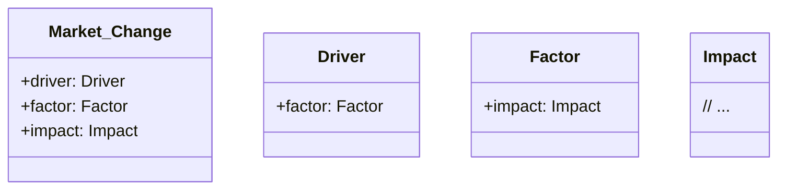
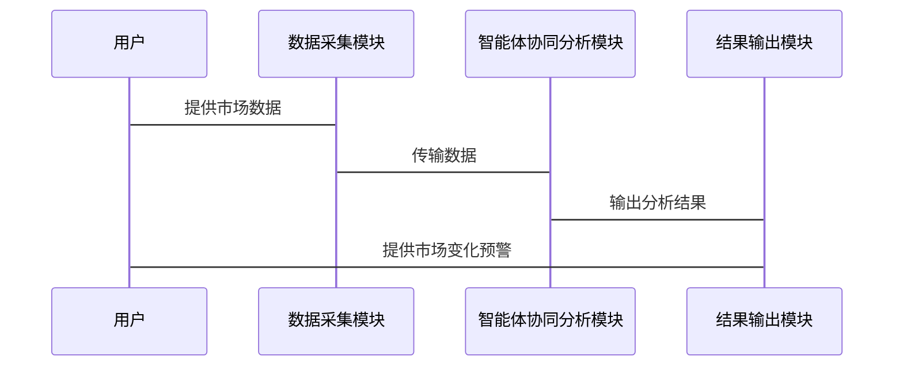

                 


# 《多智能体系统在识别市场结构性变化中的应用》

## 关键词：多智能体系统，市场结构性变化，协同学习，算法原理，系统架构，项目实战，市场分析

## 摘要：  
本文深入探讨了多智能体系统在识别市场结构性变化中的应用，结合实际案例和系统设计，分析了多智能体系统的核心概念、算法原理、系统架构及项目实战。通过详细阐述协同学习算法、联邦学习和分布式计算等技术，本文为读者提供了一套完整的解决方案，帮助他们在复杂的市场环境中快速识别结构性变化，提升市场分析的准确性和实时性。  

---

# 第1章: 多智能体系统与市场结构性变化的背景介绍

## 1.1 问题背景  

### 1.1.1 市场结构性变化的定义与特征  
市场结构性变化指的是市场中的关键要素（如价格、供需关系、竞争格局等）发生显著变化，导致市场格局的根本性改变。这种变化可能是由于技术进步、政策调整、消费者行为变化或宏观经济波动等因素引起的。  

### 1.1.2 多智能体系统在市场分析中的应用潜力  
多智能体系统（Multi-Agent System, MAS）是由多个智能体组成的分布式系统，每个智能体都能独立决策并与其他智能体协作。MAS在市场分析中的潜力在于其能够模拟复杂的市场行为，捕捉市场中的多维信息，并通过协同学习快速识别市场变化。  

### 1.1.3 当前市场分析的局限性与挑战  
传统的市场分析方法通常依赖于统计分析和专家经验，但在面对复杂、动态的市场环境时，往往存在以下问题：  
1. **数据不足**：传统方法依赖于历史数据，但在新兴市场或快速变化的环境中，历史数据可能无法反映当前情况。  
2. **实时性不足**：传统的分析方法通常需要大量时间进行数据收集和处理，难以满足实时分析的需求。  
3. **复杂性难以建模**：复杂的市场行为和网络效应难以用单一模型描述。  

## 1.2 问题描述  

### 1.2.1 市场结构性变化的复杂性  
市场结构性变化往往涉及多个因素的综合作用，例如政策变化、技术创新、消费者偏好转移等，这些因素相互作用，导致市场变化具有高度的复杂性和不确定性。  

### 1.2.2 多智能体系统在识别复杂市场变化中的优势  
多智能体系统通过模拟多个智能体的协同行为，能够捕捉市场中的多种信息，例如：  
- 智能体之间的互动关系。  
- 不同市场参与者的决策行为。  
- 市场网络的动态演化。  

### 1.2.3 问题解决的目标与边界  
本文的目标是通过多智能体系统，实现对市场结构性变化的实时识别和预测。系统的边界包括：  
- 数据输入：市场数据（如价格、成交量、供需关系等）。  
- 数据输出：市场变化的预警和分析结果。  
- 系统功能：数据采集、智能体协同分析、结果输出。  

## 1.3 问题解决思路  

### 1.3.1 多智能体系统的协同学习机制  
多智能体系统通过协同学习，能够在不同智能体之间共享信息，实现对复杂问题的联合求解。  

### 1.3.2 数据驱动与知识驱动的结合  
多智能体系统结合数据驱动和知识驱动的方法，能够充分利用数据中的隐含信息和领域知识。  

### 1.3.3 实时性与预测性的平衡  
系统设计需要在实时性和预测性之间找到平衡点，既要能够快速响应市场变化，又要能够提供准确的预测结果。  

## 1.4 核心概念与边界  

### 1.4.1 多智能体系统的核心要素  
- **智能体**：能够感知环境并采取行动的实体。  
- **协同机制**：智能体之间的通信与协作规则。  
- **环境**：智能体所处的市场环境。  

### 1.4.2 市场结构性变化的外延与内涵  
- **外延**：市场中所有可能的变化因素。  
- **内涵**：市场变化的根本原因和内在联系。  

### 1.4.3 系统边界与功能模块划分  
- **输入边界**：市场数据输入。  
- **输出边界**：市场变化预警和分析结果。  
- **功能模块**：数据采集、智能体协同分析、结果输出。  

## 1.5 本章小结  
本章介绍了多智能体系统在识别市场结构性变化中的背景、问题、解决思路和核心概念。通过分析当前市场分析的局限性，提出了多智能体系统的优势和应用场景。

---

# 第2章: 多智能体系统的核心概念  

## 2.1 多智能体系统的基本原理  

### 2.1.1 多智能体系统的定义与特征  
多智能体系统是由多个智能体组成的分布式系统，具有以下特征：  
- **自主性**：智能体能够自主决策。  
- **反应性**：智能体能够实时感知环境并采取行动。  
- **协同性**：智能体之间能够协作完成复杂任务。  

### 2.1.2 智能体的分类与功能  
智能体可以分为以下几类：  
- **简单反应式智能体**：仅基于当前感知做出反应。  
- **基于模型的反射式智能体**：利用内部模型进行决策。  
- **目标驱动智能体**：根据目标采取行动。  

### 2.1.3 多智能体系统的协同机制  
协同机制包括以下几种：  
- **直接通信**：智能体之间通过消息传递进行协作。  
- **间接协调**：通过共享知识库进行协调。  

## 2.2 市场结构性变化的分析框架  

### 2.2.1 市场变化的驱动因素  
市场变化的驱动因素包括：  
- **技术进步**：技术创新推动市场变革。  
- **政策变化**：政策调整影响市场结构。  
- **消费者行为变化**：消费者偏好影响市场需求。  

### 2.2.2 结构性变化的识别方法  
识别市场结构性变化的方法包括：  
- **基于数据的分析**：通过数据挖掘和机器学习技术识别模式。  
- **基于模型的分析**：利用数学模型模拟市场行为。  

### 2.2.3 多智能体系统在市场分析中的角色  
多智能体系统在市场分析中的角色包括：  
- **数据采集**：收集市场数据。  
- **分析与预测**：分析市场变化并预测未来趋势。  
- **决策支持**：为决策者提供支持。  

## 2.3 多智能体系统与市场变化的关联性  

### 2.3.1 智能体的异构性与市场多样性  
智能体的异构性使得系统能够适应不同类型的市场参与者。  

### 2.3.2 智能体的自适应性与市场动态  
智能体的自适应性使得系统能够实时响应市场变化。  

### 2.3.3 智能体的协同性与市场网络效应  
智能体的协同性能够捕捉市场网络效应，帮助识别系统性风险。  

## 2.4 核心概念属性对比表  

| 概念       | 属性       | 描述                                             |
|------------|------------|--------------------------------------------------|
| 智能体     | 独立性     | 能够独立决策                                       |
| 智能体     | 协同性     | 能够通过协作完成复杂任务                         |
| 市场变化   | 结构性     | 影响市场整体格局                                   |
| 市场变化   | 动态性     | 变化速度快且复杂                                   |

## 2.5 ER实体关系图  

```mermaid
erd
  Market_Change --|> Driver: 驱动因素
  Driver      --|> Factor: 影响因素
  Factor      --|> Impact: 影响结果
```

---

# 第3章: 多智能体系统在识别市场结构性变化中的算法原理  

## 3.1 协同学习算法  

### 3.1.1 协同学习的定义与特点  
协同学习是一种分布式学习方法，多个智能体通过协作共享知识，提高学习效果。  

### 3.1.2 协同学习的流程  
1. 数据采集：智能体采集市场数据。  
2. 数据预处理：对数据进行清洗和特征提取。  
3. 模型训练：智能体通过协同学习算法训练模型。  
4. 模型优化：通过反馈机制优化模型。  

### 3.1.3 协同学习的数学模型  

$$ L = \frac{1}{n}\sum_{i=1}^{n} (y_i - f(x_i))^2 $$  

其中，$L$ 是损失函数，$y_i$ 是真实值，$f(x_i)$ 是预测值，$n$ 是数据点数量。  

## 3.2 联邦学习与分布式计算  

### 3.2.1 联邦学习的定义  
联邦学习是一种分布式机器学习方法，多个智能体在本地数据上训练模型，并通过通信共享参数。  

### 3.2.2 联邦学习的流程  
1. 初始化：智能体初始化模型参数。  
2. 本地训练：每个智能体在本地数据上训练模型。  
3. 参数同步：智能体将模型参数上传到中央服务器。  
4. 模型更新：中央服务器聚合参数并更新模型。  

### 3.2.3 分布式计算的实现  


## 3.3 算法实现与优化  

### 3.3.1 算法实现  
以下是协同学习算法的Python代码示例：  

```python
import numpy as np

def loss(y_true, y_pred):
    return np.mean((y_true - y_pred)**2)

# 初始化模型参数
theta = np.random.randn(2, 1)

# 数据准备
X = np.array([[1, 2], [3, 4], [5, 6]]).T
y = np.array([2, 4, 6])

# 模型训练
theta = np.dot(np.linalg.inv(np.dot(X.T, X)), np.dot(X.T, y))

# 计算损失
y_pred = np.dot(X, theta)
print(loss(y, y_pred))
```

### 3.3.2 算法优化  
通过Adam优化器优化模型参数：  

$$ \theta_{t+1} = \theta_t - \eta \frac{v}{\sqrt{s + \epsilon}} $$  

其中，$\eta$ 是学习率，$v$ 是动量，$s$ 是自适应矩，$\epsilon$ 是小量。  

---

# 第4章: 系统分析与架构设计  

## 4.1 问题场景介绍  

### 4.1.1 系统目标  
系统的目标是通过多智能体系统识别市场结构性变化，提供实时预警和分析结果。  

### 4.1.2 系统功能需求  
- 数据采集：实时采集市场数据。  
- 智能体协同分析：通过多智能体协同学习识别市场变化。  
- 结果输出：输出市场变化预警和分析报告。  

## 4.2 系统功能设计  

### 4.2.1 领域模型类图  



### 4.2.2 系统架构设计  


## 4.3 系统接口设计  

### 4.3.1 数据接口  
- 数据输入接口：接收市场数据。  
- 数据输出接口：输出分析结果。  

### 4.3.2 智能体通信接口  
- 消息队列：智能体之间通过消息队列进行通信。  

## 4.4 系统交互流程  



---

# 第5章: 项目实战与案例分析  

## 5.1 环境安装与配置  

### 5.1.1 系统依赖  
- Python 3.8+  
- NumPy  
- TensorFlow  
- Mermaid  

### 5.1.2 安装步骤  
1. 安装Python和Jupyter Notebook。  
2. 安装依赖库：`pip install numpy tensorflow`.  

## 5.2 系统核心实现  

### 5.2.1 数据采集模块  

```python
import requests

def fetch_market_data(api_url):
    response = requests.get(api_url)
    return response.json()
```

### 5.2.2 协同学习模块  

```python
import numpy as np

def协同学习算法(X, y):
    theta = np.dot(np.linalg.inv(np.dot(X.T, X)), np.dot(X.T, y))
    return theta
```

### 5.2.3 结果输出模块  

```python
def输出结果(theta, X):
    y_pred = np.dot(X, theta)
    print(y_pred)
```

## 5.3 实际案例分析  

### 5.3.1 数据准备  
假设我们有一个股票市场的数据集，包括价格、成交量等指标。  

### 5.3.2 数据分析  
通过协同学习算法分析数据，识别市场结构性变化。  

### 5.3.3 结果解读  
分析结果表明，市场在某个时间段出现了结构性变化，需要采取相应策略。  

---

# 第6章: 总结与展望  

## 6.1 本章总结  
本文通过多智能体系统分析了市场结构性变化，提出了协同学习算法和系统架构设计。  

## 6.2 研究的局限性  
- 数据质量和数量的限制。  
- 算法的实时性问题。  

## 6.3 未来展望  
未来的研究方向包括：  
- 更高效的协同学习算法。  
- 更智能的市场分析系统。  

## 6.4 最佳实践 Tips  
- 数据预处理是关键。  
- 系统设计要注重可扩展性。  
- 定期更新模型以适应市场变化。  

---

# 作者：AI天才研究院/AI Genius Institute & 禅与计算机程序设计艺术 /Zen And The Art of Computer Programming

