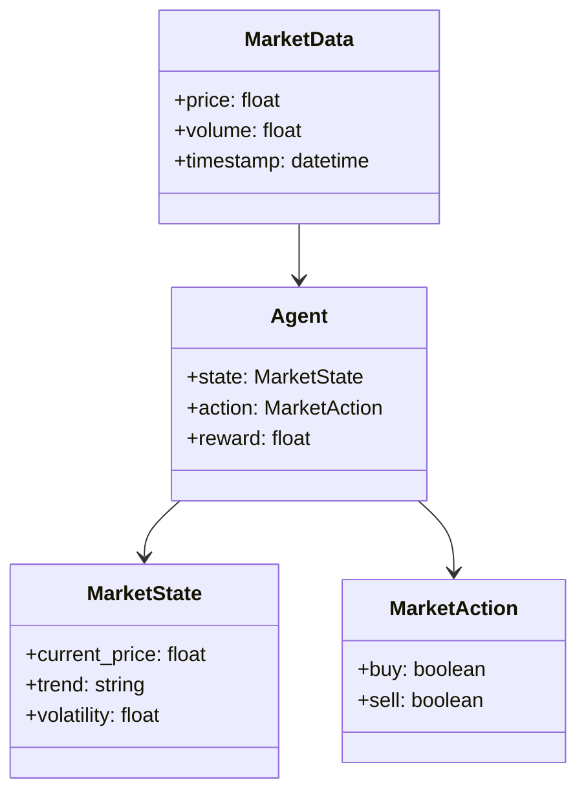
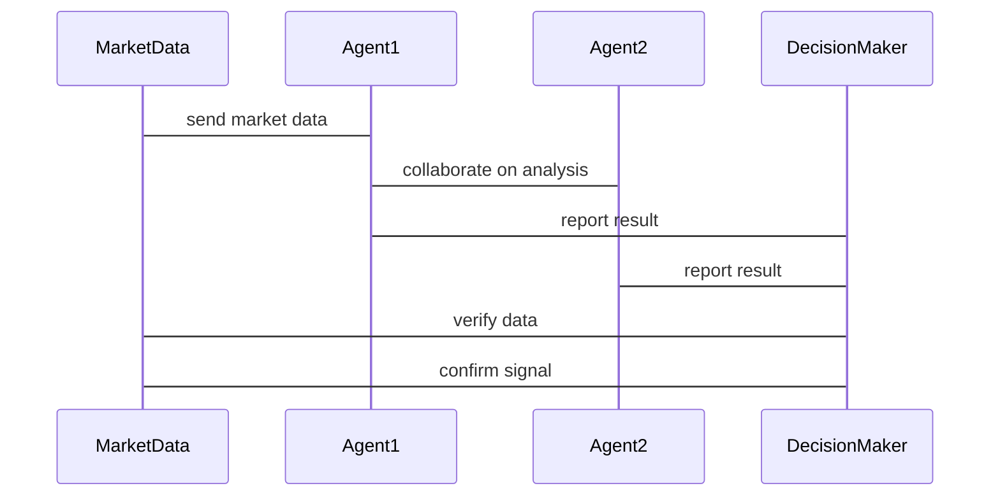

                 


# 多智能体系统在识别市场转折点中的应用

## 关键词：多智能体系统、市场转折点、协同学习、金融数据分析、人工智能

## 摘要：本文探讨了多智能体系统在金融市场中的应用，特别是如何利用多智能体的协同学习来识别市场转折点。通过分析多智能体系统的架构、算法原理和实际案例，本文揭示了其在金融数据中的优势和挑战，为投资者提供了新的视角和工具。

---

# 第1章 多智能体系统与市场转折点的背景

## 1.1 多智能体系统的基本概念

### 1.1.1 多智能体系统的定义

多智能体系统（Multi-Agent System, MAS）是由多个智能体组成的系统，每个智能体能够感知环境、自主决策并协同工作。智能体通过通信和协作完成复杂任务，具有分布式、协作性和智能性等特点。

### 1.1.2 多智能体系统的特征

- **分布性**：智能体独立运行，无中央控制。
- **协作性**：通过通信协作完成任务。
- **反应性**：能实时感知环境变化并做出反应。
- **社会性**：智能体之间存在社会互动。

### 1.1.3 多智能体系统的应用场景

- 金融市场：用于数据分析和预测。
- 游戏AI：实现复杂策略。
- 物联网：协调设备运作。

## 1.2 市场转折点的定义与特征

### 1.2.1 市场转折点的定义

市场转折点是指价格走势发生显著变化的时刻，通常由市场情绪、供需变化等因素引发。

### 1.2.2 市场转折点的分类

- **顶部**：价格从涨转跌。
- **底部**：价格从跌转涨。
- **趋势反转**：价格方向发生逆转。

### 1.2.3 市场转折点的识别挑战

- **数据噪声**：难以区分短期波动和趋势变化。
- **复杂性**：受多种因素影响，难以预测。
- **实时性**：需要快速识别，避免损失。

## 1.3 多智能体系统在市场转折点识别中的作用

### 1.3.1 多智能体系统的优势

- **分布式计算**：提高处理效率。
- **协作学习**：增强预测准确性。
- **适应性**：快速应对市场变化。

### 1.3.2 多智能体系统与传统方法的对比

| 特性          | 多智能体系统         | 传统方法         |
|---------------|---------------------|------------------|
| 结构          | 分布式             | 集中式           |
| 协作          | 高                 | 低               |
| 灵活性          | 高                 | 低               |

### 1.3.3 多智能体系统在金融市场的应用前景

- **高效决策**：通过协同学习提升预测能力。
- **风险管理**：及时识别转折点，降低风险。
- **实时响应**：快速适应市场变化。

## 1.4 本章小结

本章介绍了多智能体系统的概念及其在市场转折点识别中的作用，指出了其在金融市场的优势和应用前景。

---

# 第2章 多智能体系统的核心原理

## 2.1 多智能体系统的体系结构

### 2.1.1 分布式多智能体系统

- **定义**：智能体独立运行，无中心节点。
- **优点**：容错性高，适应性强。

### 2.1.2 集中式多智能体系统

- **定义**：有一个中心节点协调智能体。
- **优点**：便于管理和协调。

### 2.1.3 混合式多智能体系统

- **定义**：结合分布式和集中式特点。
- **优点**：灵活性和效率兼顾。

## 2.2 多智能体系统的通信与协作机制

### 2.2.1 通信协议

- **定义**：智能体间交互的规则和格式。
- **类型**：包括基于消息和基于订阅发布。

### 2.2.2 协作策略

- **协同学习**：智能体共享信息，共同优化决策。
- **分工合作**：根据智能体能力分配任务。

### 2.2.3 冲突解决机制

- **定义**：处理智能体间的冲突和协调。
- **方法**：基于优先级、协商和仲裁。

## 2.3 多智能体系统的决策模型

### 2.3.1 基于规则的决策模型

- **定义**：根据预设规则做出决策。
- **优点**：简单易懂，执行速度快。

### 2.3.2 基于学习的决策模型

- **定义**：通过机器学习算法优化决策。
- **优点**：适应性强，性能高。

### 2.3.3 基于博弈论的决策模型

- **定义**：模拟市场参与者行为，预测市场变化。
- **优点**：适用于竞争环境。

## 2.4 本章小结

本章详细介绍了多智能体系统的体系结构、通信机制和决策模型，为后续应用奠定了基础。

---

# 第3章 市场转折点的识别方法

## 3.1 市场数据的特征分析

### 3.1.1 时间序列分析

- **定义**：分析数据随时间的变化趋势。
- **方法**：移动平均、指数平滑、ARIMA模型。

### 3.1.2 市场情绪分析

- **定义**：分析市场参与者的心理状态。
- **方法**：文本挖掘、情感分析、社交媒体数据。

### 3.1.3 市场波动性分析

- **定义**：分析价格波动的剧烈程度。
- **方法**：波动率指标、标准差、波幅分析。

## 3.2 市场转折点的识别算法

### 3.2.1 基于统计的识别方法

- **移动平均法**：计算价格与移动平均的偏离程度。
- **标准差法**：通过波动率判断转折点。

### 3.2.2 基于机器学习的识别方法

- **支持向量机（SVM）**：分类市场状态。
- **随机森林**：通过特征重要性识别转折点。

### 3.2.3 基于深度学习的识别方法

- **LSTM网络**：捕捉时间序列中的长期依赖。
- **卷积神经网络（CNN）**：提取特征模式。

## 3.3 市场转折点的验证与评估

### 3.3.1 评估指标

- 准确率：正确预测的比例。
- 召回率：识别转折点的比例。
- F1分数：综合准确率和召回率。

### 3.3.2 评估方法

- 回测：历史数据验证模型效果。
- 前瞻测试：实时数据测试模型表现。

### 3.3.3 评估结果的分析

- 真正的转折点识别：准确预测市场变化。
- 假信号：避免误判导致损失。

## 3.4 本章小结

本章探讨了市场转折点的识别方法，包括特征分析、算法选择和评估指标。

---

# 第4章 多智能体系统在市场转折点识别中的算法设计

## 4.1 多智能体协同学习的基本原理

### 4.1.1 协同学习的定义

- 多智能体通过协作优化决策。

### 4.1.2 协同学习的机制

- **知识共享**：智能体共享数据和模型。
- **任务分配**：根据能力分配任务。
- **协同优化**：通过协作提高整体性能。

### 4.1.3 协同学习的数学模型

目标函数：
$$ \text{Maximize} \quad \sum_{i=1}^{n} f_i(s_i, a_i) $$
其中，$s_i$ 是智能体i的状态，$a_i$ 是智能体i的行动。

## 4.2 多智能体协同学习的实现算法

### 4.2.1 Q-learning算法

- **定义**：基于强化学习的算法。
- **流程**：智能体通过与环境交互，学习最优策略。

### 4.2.2 DQN算法

- **定义**：深度Q网络，用于处理高维状态空间。
- **流程**：使用神经网络近似Q值函数。

### 4.2.3 其他协同学习算法

- **CURL**：用于多智能体协作学习的算法。
- **MAAC**：多智能体_actor-critic算法。

## 4.3 算法实现步骤

### 4.3.1 数据预处理

- 标准化：归一化数据。
- 去噪：去除噪声数据。
- 分割：训练集、验证集和测试集。

### 4.3.2 模型训练

- 网络结构：设计神经网络。
- 损失函数：使用均方误差或交叉熵。
- 优化器：Adam优化器。

### 4.3.3 系统集成

- 通信机制：智能体间信息共享。
- 协作策略：任务分配和知识共享。
- 决策模型：优化算法选择。

## 4.4 本章小结

本章详细介绍了多智能体协同学习的算法设计，包括基本原理、实现步骤和优化策略。

---

# 第5章 系统分析与架构设计方案

## 5.1 问题场景介绍

- 金融市场数据复杂，需要高效分析工具。
- 单一算法难以应对复杂变化，多智能体系统提供解决方案。

## 5.2 项目介绍

- 项目目标：设计一个基于多智能体系统的市场转折点识别系统。
- 项目范围：涵盖数据采集、分析、预测和反馈。

## 5.3 系统功能设计

### 5.3.1 领域模型（Mermaid 类图）



### 5.3.2 系统架构设计（Mermaid 架构图）


### 5.3.3 系统接口设计

- 数据接口：接收市场数据。
- 智能体接口：定义智能体行为和通信协议。
- 决策接口：输出市场转折点信号。

### 5.3.4 系统交互设计（Mermaid 序列图）



## 5.4 本章小结

本章通过系统分析和架构设计，展示了多智能体系统在市场转折点识别中的应用。

---

# 第6章 项目实战

## 6.1 环境安装

### 6.1.1 安装Python环境

```bash
python --version
pip install numpy pandas scikit-learn tensorflow
```

### 6.1.2 安装其他依赖

```bash
pip install gym matplotlib keras
```

## 6.2 系统核心实现源代码

### 6.2.1 数据预处理代码

```python
import numpy as np
import pandas as pd

def preprocess_data(data):
    data = data.astype(float)
    data = (data - data.mean()) / data.std()
    return data
```

### 6.2.2 多智能体协同学习代码

```python
import keras
from keras.layers import Dense, Input
from keras.models import Model

def build_agent_model(input_dim):
    inputs = Input(shape=(input_dim,))
    x = Dense(64, activation='relu')(inputs)
    x = Dense(32, activation='relu')(x)
    outputs = Dense(1, activation='linear')(x)
    model = Model(inputs=inputs, outputs=outputs)
    model.compile(optimizer='adam', loss='mse')
    return model
```

### 6.2.3 联合训练代码

```python
import numpy as np

def joint_training(agents, data):
    for agent in agents:
        agent.model.fit(data, labels, epochs=10, batch_size=32)
    return agents
```

## 6.3 实际案例分析

### 6.3.1 数据来源与处理

- 数据来源：历史股票价格数据。
- 数据处理：标准化和分割训练集、测试集。

### 6.3.2 模型训练与评估

- 训练过程：使用预处理后的数据训练模型。
- 评估指标：准确率、召回率、F1分数。

### 6.3.3 结果展示

- 可视化：绘制预测结果与实际价格走势对比图。
- 分析：评估模型的预测效果。

## 6.4 本章小结

本章通过实际案例展示了多智能体系统的应用，验证了其在市场转折点识别中的有效性。

---

# 第7章 最佳实践与小结

## 7.1 最佳实践 tips

- **数据质量**：确保数据准确、完整。
- **模型选择**：根据任务选择合适的算法。
- **系统优化**：通过并行计算提升效率。
- **风险管理**：合理控制投资风险。

## 7.2 本章小结

总结了多智能体系统在识别市场转折点中的优势和应用，提供了实用的建议。

---

# 作者信息

作者：AI天才研究院/AI Genius Institute & 禅与计算机程序设计艺术 /Zen And The Art of Computer Programming

---

本文通过系统地分析多智能体系统的原理和应用，展示了其在金融市场中的潜力。通过实际案例和系统设计，为读者提供了深入的理解和实践经验。希望本文能为投资者和研究者提供有价值的参考。

