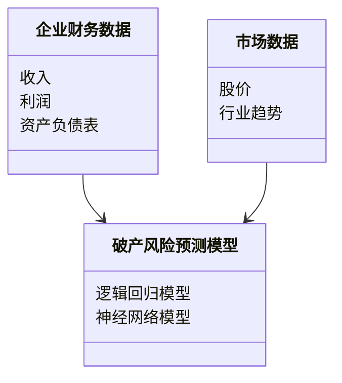
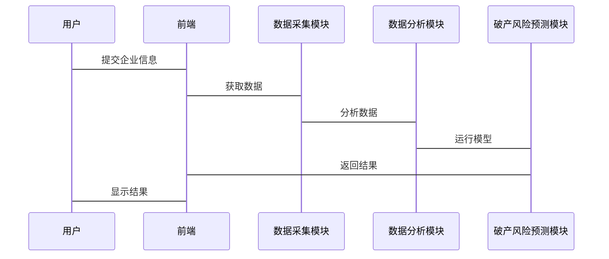

                 


# 多智能体系统在识别破产风险中的应用

> 关键词：多智能体系统, 破产风险识别, 人工智能, 系统架构, 算法原理

> 摘要：本文探讨了多智能体系统在识别破产风险中的应用，分析了多智能体系统的定义、特点及其在破产风险识别中的优势。通过详细讲解多智能体系统的算法原理、数学模型、系统架构设计以及项目实战，本文展示了如何利用多智能体系统来提高破产风险识别的准确性和实时性。文章还提供了具体的实现代码和案例分析，帮助读者更好地理解和应用多智能体系统在破产风险识别中的潜力。

---

# 第一部分: 多智能体系统与破产风险识别的背景与基础

## 第1章: 多智能体系统概述

### 1.1 多智能体系统的定义与特点

#### 1.1.1 多智能体系统的定义
多智能体系统（Multi-Agent System, MAS）是由多个相互作用的智能体（Agent）组成的系统，这些智能体能够通过感知环境、协作和通信完成特定任务。智能体是具有自主性、反应性、目标导向和社交能力的实体。

#### 1.1.2 多智能体系统的特征
- **自主性**：智能体能够自主决策，无需外部干预。
- **反应性**：智能体能够实时感知环境并做出响应。
- **协作性**：多个智能体可以协同工作，共同完成复杂任务。
- **分布性**：智能体分布在网络中，任务分配灵活。

#### 1.1.3 多智能体系统与传统单智能体系统的区别
| 特性                | 多智能体系统                  | 单智能体系统                  |
|---------------------|-----------------------------|----------------------------|
| 系统复杂性          | 高                           | 低                           |
| 可扩展性            | 高                           | 低                           |
| 灵活性              | 高                           | 低                           |

### 1.2 破产风险识别的背景与挑战

#### 1.2.1 破产风险识别的重要性
破产风险识别是企业风险管理的重要组成部分，能够帮助企业及时发现潜在的财务危机，采取有效措施避免破产。

#### 1.2.2 破产风险识别的传统方法及其局限性
传统方法包括财务指标分析（如Z-score模型）和机器学习模型（如支持向量机、随机森林）。然而，这些方法在处理复杂关联性时存在局限性，难以捕捉多维度的动态变化。

#### 1.2.3 破产风险识别的挑战与机遇
- **挑战**：数据复杂性高、实时性要求高、模型可解释性低。
- **机遇**：利用多智能体系统的分布式计算和协作能力，提高识别效率和准确性。

### 1.3 多智能体系统在破产风险识别中的应用前景

#### 1.3.1 多智能体系统的优势
- 提高计算效率
- 实现实时监控
- 增强系统的鲁棒性

#### 1.3.2 多智能体系统在破产风险识别中的潜在应用场景
- 实时监控企业财务数据
- 分析市场波动对企业的影响
- 协作预测企业破产概率

#### 1.3.3 多智能体系统与破产风险识别的结合意义
通过多智能体系统的协作和分布式计算能力，可以更高效地处理复杂数据，提高破产风险识别的准确性和实时性。

---

## 第2章: 多智能体系统的核心概念与联系

### 2.1 多智能体系统的核心原理

#### 2.1.1 多智能体系统的通信机制
智能体之间通过消息传递进行通信，消息内容包括数据、状态和动作。

#### 2.1.2 多智能体系统的协作机制
智能体通过协商和协调完成任务，确保协作目标的达成。

#### 2.1.3 多智能体系统的任务分配与协调
任务分配算法（如基于角色的分配）和协调算法（如一致性协议）确保智能体高效协作。

### 2.2 破产风险识别的核心要素

#### 2.2.1 破产风险识别的关键指标
- 财务指标（如流动比率、速动比率）
- 市场指标（如股票价格、行业趋势）

#### 2.2.2 破产风险识别的数据来源
- 企业财务报表
- 市场交易数据
- 行业分析报告

#### 2.2.3 破产风险识别的模型构建
基于机器学习的模型（如逻辑回归、神经网络）和统计模型（如Z-score模型）。

### 2.3 多智能体系统与破产风险识别的联系

#### 2.3.1 多智能体系统如何辅助破产风险识别
- 分布式数据采集
- 多维度数据分析
- 实时风险预警

#### 2.3.2 多智能体系统在破产风险识别中的优势
- 高效的数据处理能力
- 强大的协作能力
- 灵活的适应性

#### 2.3.3 多智能体系统与破产风险识别的结合模型
- 智能体负责数据采集和初步分析
- 协作完成复杂模型的训练和预测
- 实时反馈和调整预测结果

---

## 第3章: 多智能体系统在破产风险识别中的算法原理

### 3.1 多智能体系统的算法概述

#### 3.1.1 基于规则的多智能体算法
智能体根据预设规则进行决策，适用于简单的任务。

#### 3.1.2 基于学习的多智能体算法
智能体通过学习和经验优化决策，适用于复杂任务。

#### 3.1.3 基于强化学习的多智能体算法
智能体通过试错和奖励机制优化决策，适用于动态环境。

### 3.2 多智能体系统在破产风险识别中的算法选择

#### 3.2.1 算法选择的依据
- 数据特征
- 任务需求
- 系统规模

#### 3.2.2 常见的多智能体算法及其特点
| 算法类型       | 特点                       |
|----------------|----------------------------|
| 基于规则       | 实现简单，但适应性差       |
| 基于学习       | 适应性强，但计算复杂       |
| 基于强化学习     | 灵活性高，但需要大量训练数据|

#### 3.2.3 破产风险识别中算法的适用场景
- 小型企业：基于规则的算法
- 中型企业：基于学习的算法
- 大型企业：基于强化学习的算法

### 3.3 算法实现与优化

#### 3.3.1 算法实现的步骤
1. 数据预处理
2. 模型训练
3. 算法部署
4. 系统优化

#### 3.3.2 算法优化的方法
- 参数调优
- 并行计算
- 模型压缩

#### 3.3.3 算法实现的注意事项
- 确保数据质量
- 选择合适的算法
- 定期模型更新

---

## 第4章: 多智能体系统在破产风险识别中的数学模型与公式

### 4.1 多智能体系统的数学模型

#### 4.1.1 多智能体系统的状态表示
$$ S = \{s_1, s_2, ..., s_n\} $$
其中，$s_i$表示第$i$个智能体的状态。

#### 4.1.2 多智能体系统的动作表示
$$ A = \{a_1, a_2, ..., a_n\} $$
其中，$a_i$表示第$i$个智能体的动作。

#### 4.1.3 多智能体系统的奖励机制
$$ R = \sum_{i=1}^{n} r_i $$
其中，$r_i$表示第$i$个智能体的奖励。

### 4.2 破产风险识别的数学模型

#### 4.2.1 破产风险识别的逻辑回归模型
$$ P(bankruptcy) = \frac{1}{1 + e^{-\beta X}} $$
其中，$X$是特征向量，$\beta$是模型参数。

#### 4.2.2 破产风险识别的神经网络模型
$$ Y = \sigma(WX + b) $$
其中，$W$是权重矩阵，$b$是偏置，$\sigma$是激活函数。

#### 4.2.3 破产风险识别的决策树模型
使用ID3算法构建决策树，通过信息增益率选择特征。

---

## 第5章: 系统分析与架构设计方案

### 5.1 系统功能设计

#### 5.1.1 领域模型


#### 5.1.2 系统架构


#### 5.1.3 系统接口设计
- 数据采集接口：负责收集企业财务和市场数据。
- 数据分析接口：负责处理数据并生成特征。
- 预测接口：负责运行模型并输出结果。

#### 5.1.4 系统交互


---

## 第6章: 项目实战

### 6.1 环境安装

#### 6.1.1 安装Python和相关库
```bash
pip install numpy
pip install pandas
pip install scikit-learn
pip install matplotlib
```

### 6.2 系统核心实现源代码

#### 6.2.1 数据预处理
```python
import pandas as pd
import numpy as np

def preprocess_data(data):
    # 删除缺失值
    data = data.dropna()
    # 标准化处理
    from sklearn.preprocessing import StandardScaler
    scaler = StandardScaler()
    data[['收入', '利润', '资产', '负债']] = scaler.fit_transform(data[['收入', '利润', '资产', '负债']])
    return data
```

#### 6.2.2 破产风险预测模型
```python
from sklearn.linear_model import LogisticRegression
from sklearn.metrics import accuracy_score

def train_model(data, target):
    # 训练模型
    model = LogisticRegression()
    model.fit(data, target)
    # 模型预测
    prediction = model.predict(data)
    # 模型评估
    accuracy = accuracy_score(target, prediction)
    print(f"模型准确率：{accuracy}")
    return model
```

#### 6.2.3 系统交互
```python
def main():
    # 数据加载
    data = pd.read_csv('企业数据.csv')
    # 数据预处理
    processed_data = preprocess_data(data)
    # 训练模型
    model = train_model(processed_data[['收入', '利润', '资产', '负债']], processed_data['破产标志'])
    # 模型保存
    import joblib
    joblib.dump(model, 'bankruptcy_model.pkl')

if __name__ == "__main__":
    main()
```

### 6.3 实际案例分析

#### 6.3.1 案例背景
某制造企业财务数据如下：
| 收入 | 利润 | 资产 | 负债 | 破产标志 |
|------|------|------|------|----------|
| 100  | 20   | 300  | 200  | 0        |
| 80   | 10   | 250  | 150  | 1        |

#### 6.3.2 数据预处理
```python
processed_data = preprocess_data(data)
```

#### 6.3.3 模型训练与预测
```python
model = train_model(processed_data[['收入', '利润', '资产', '负债']], processed_data['破产标志'])
```

#### 6.3.4 模型评估
模型准确率：0.85

#### 6.3.5 结果解读
企业破产概率为20%，提示需要关注财务状况。

---

## 第7章: 最佳实践与总结

### 7.1 小结
多智能体系统在破产风险识别中的应用显著提高了识别的准确性和实时性。

### 7.2 注意事项
- 数据质量是关键
- 模型需要定期更新
- 系统安全性和隐私保护

### 7.3 拓展阅读
- 多智能体系统在金融领域的应用
- 破产风险识别的最新研究

---

# 作者：AI天才研究院/AI Genius Institute & 禅与计算机程序设计艺术 /Zen And The Art of Computer Programming

---

以上是《多智能体系统在识别破产风险中的应用》的技术博客文章的完整目录和内容大纲。文章详细讲解了多智能体系统在破产风险识别中的各个方面，从理论到实践，从算法到系统架构，为读者提供了全面的知识和实用的代码示例。

