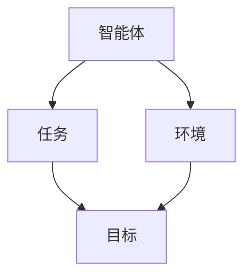
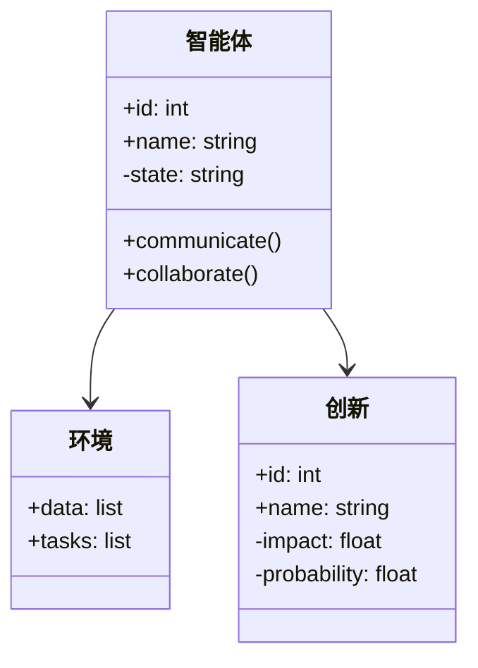
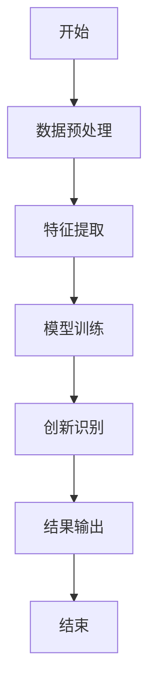
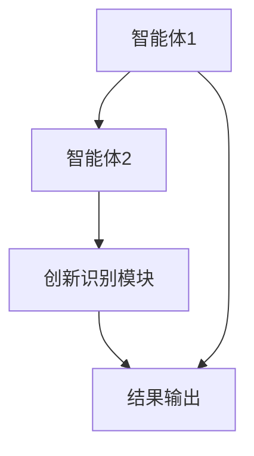
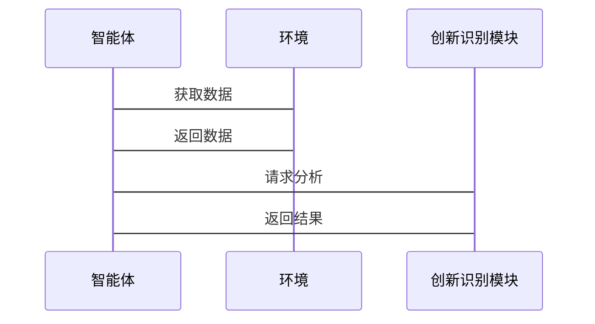

                 


# 多智能体系统在识别行业颠覆性创新中的应用

> 关键词：多智能体系统、颠覆性创新、创新识别、协作算法、系统架构

> 摘要：本文探讨了多智能体系统（MAS）在识别行业颠覆性创新中的应用。通过分析MAS的核心概念、算法原理和系统架构，本文展示了如何利用MAS来预测和识别潜在的颠覆性创新，并通过实际案例和项目实战，为读者提供了深入的理解和实践经验。

---

## 第一部分：多智能体系统与颠覆性创新的背景

### 第1章：多智能体系统与颠覆性创新概述

#### 1.1 多智能体系统的基本概念
##### 1.1.1 多智能体系统的定义
多智能体系统（Multi-Agent System, MAS）是由多个智能体（Agent）组成的分布式系统，这些智能体能够自主决策、协作和竞争，共同完成复杂任务。

##### 1.1.2 多智能体系统的特征
- **自主性**：每个智能体能够独立决策。
- **反应性**：智能体能够感知环境并实时响应。
- **协作性**：智能体之间通过通信和协作完成共同目标。
- **分布式性**：系统由多个分散的智能体组成，没有集中控制中心。

##### 1.1.3 多智能体系统的应用场景
- 智能交通管理
- 智能电网
- 智能制造
- 金融风险预警

#### 1.2 颠覆性创新的定义与特征
##### 1.2.1 颠覆性创新的定义
颠覆性创新是指通过引入新技术或新的商业模式，从根本上改变行业现状的创新。

##### 1.2.2 颠覆性创新的核心特征
- **破坏性**：颠覆现有市场规则或技术路径。
- **创新性**：引入新的技术和方法。
- **扩散性**：快速被市场接受并广泛应用。

##### 1.2.3 颠覆性创新的识别方法
- 市场数据分析
- 技术趋势预测
- 用户行为分析

#### 1.3 多智能体系统在创新识别中的作用
##### 1.3.1 多智能体系统在创新识别中的优势
- **分布式感知**：多个智能体能够从不同角度感知市场动态。
- **协作分析**：智能体之间可以协作分析数据，提高识别精度。
- **实时响应**：能够快速响应市场变化。

##### 1.3.2 多智能体系统与颠覆性创新的关系
多智能体系统通过协作和分布式感知，能够更早地发现潜在的颠覆性创新。

##### 1.3.3 多智能体系统在行业中的应用案例
- 移动支付的普及改变了传统银行业。
- 共享经济模式的兴起。

#### 1.4 本章小结
本章介绍了多智能体系统的基本概念和颠覆性创新的定义，分析了MAS在创新识别中的作用，并通过案例展示了其实际应用。

---

## 第2章：多智能体系统的核心概念与联系

### 2.1 多智能体系统的核心概念
#### 2.1.1 智能体的定义与属性
- **智能体**：能够感知环境并采取行动的实体。
- **属性**：自主性、反应性、目标导向性。

#### 2.1.2 多智能体系统的结构与层次
- **底层**：感知与决策层。
- **中层**：协作与通信层。
- **顶层**：目标与规划层。

#### 2.1.3 多智能体系统的通信与协作机制
- **直接通信**：智能体之间直接交换信息。
- **间接协作**：通过中间媒介进行协作。
- **分布式协作**：多个智能体共同完成任务。

### 2.2 颠覆性创新的识别模型
#### 2.2.1 颠覆性创新的识别模型构建
- **数据输入**：市场数据、技术趋势。
- **特征提取**：提取关键创新特征。
- **模型训练**：基于机器学习的模型。

#### 2.2.2 多智能体系统在识别模型中的应用
- **数据采集**：多个智能体从不同来源采集数据。
- **特征分析**：智能体协作分析数据特征。
- **预测输出**：模型输出颠覆性创新的概率。

#### 2.2.3 模型的验证与优化
- **验证方法**：对比历史数据。
- **优化策略**：调整模型参数。

### 2.3 实体关系图与领域模型
#### 实体关系图


#### 领域模型图


### 2.4 本章小结
本章详细讲解了多智能体系统的核心概念，并通过实体关系图和领域模型图展示了其在颠覆性创新识别中的应用。

---

## 第3章：多智能体系统识别颠覆性创新的算法原理

### 3.1 多智能体协作算法
#### 3.1.1 分布式协作算法
- **分布式协作**：智能体之间通过通信协作完成任务。
- **算法流程**：
  1. 每个智能体感知环境并生成数据。
  2. 智能体之间通信并交换数据。
  3. 根据数据协作完成任务。

#### 3.1.2 基于博弈论的协作机制
- **纳什均衡**：智能体在博弈中达到均衡状态。
- **算法步骤**：
  1. 确定博弈规则。
  2. 计算纳什均衡。
  3. 确定协作策略。

#### 3.1.3 聚类与分类算法
- **聚类分析**：将创新分为不同的类别。
- **分类算法**：基于机器学习的分类模型。

### 3.2 创新识别算法
#### 3.2.1 基于机器学习的创新识别
- **数据预处理**：清洗和特征提取。
- **模型训练**：使用支持向量机（SVM）或神经网络。
- **模型预测**：输出创新识别结果。

#### 3.2.2 基于知识图谱的创新预测
- **知识图谱构建**：构建行业知识图谱。
- **图谱推理**：通过推理发现潜在创新。

#### 3.2.3 基于时间序列的创新趋势分析
- **时间序列分析**：使用ARIMA模型预测创新趋势。
- **算法步骤**：
  1. 数据预处理。
  2. 模型训练。
  3. 预测与分析。

### 3.3 算法流程图


### 3.4 本章小结
本章详细讲解了多智能体系统识别颠覆性创新的算法原理，并通过流程图展示了算法的整体流程。

---

## 第4章：数学模型与公式

### 4.1 多智能体系统的数学模型
#### 4.1.1 智能体行为模型
$$ P(a|o) = \frac{P(o|a)P(a)}{P(o)} $$

#### 4.1.2 多智能体协作模型
$$ C = \sum_{i=1}^{n} w_i x_i $$

### 4.2 颠覆性创新识别的数学模型
#### 4.2.1 创新概率模型
$$ P(I) = \prod_{j=1}^{m} P(f_j | I) $$

#### 4.2.2 创新影响模型
$$ I = \sum_{k=1}^{p} w_k \cdot f_k $$

---

## 第5章：系统架构设计与实现

### 5.1 问题场景介绍
- **场景描述**：识别潜在的颠覆性创新。
- **目标**：构建一个多智能体系统，能够实时监测市场动态并识别颠覆性创新。

### 5.2 系统功能设计
#### 5.2.1 领域模型


#### 5.2.2 系统架构设计


#### 5.2.3 接口设计
- **输入接口**：接收市场数据。
- **输出接口**：输出创新识别结果。

#### 5.2.4 交互流程


### 5.3 本章小结
本章详细设计了多智能体系统的架构，并展示了其在颠覆性创新识别中的应用。

---

## 第6章：项目实战与案例分析

### 6.1 环境安装与配置
- **工具安装**：安装Python、TensorFlow、Keras。
- **依赖管理**：使用pip管理依赖。

### 6.2 核心代码实现
#### 6.2.1 数据预处理
```python
import pandas as pd

# 读取数据
data = pd.read_csv('market_data.csv')

# 数据清洗
data.dropna(inplace=True)
data = pd.get_dummies(data)
```

#### 6.2.2 模型训练
```python
from sklearn.model import SVC

model = SVC()
model.fit(X_train, y_train)
```

#### 6.2.3 创新识别
```python
# 预测创新
predictions = model.predict(X_test)
```

### 6.3 案例分析与解读
- **案例背景**：某行业面临颠覆性创新。
- **数据分析**：通过模型识别潜在创新。
- **结果解读**：模型输出创新识别结果。

### 6.4 项目小结
本章通过实际项目展示了多智能体系统在颠覆性创新识别中的应用，并详细讲解了代码实现。

---

## 第7章：总结与展望

### 7.1 最佳实践 tips
- **数据质量**：数据预处理是关键。
- **模型优化**：定期更新模型参数。
- **协作机制**：优化智能体协作策略。

### 7.2 本章小结
本文详细讲解了多智能体系统在识别行业颠覆性创新中的应用，并通过实际案例展示了其实际价值。

### 7.3 未来展望
- **技术进步**：进一步优化模型算法。
- **应用扩展**：探索更多行业的应用。

---

## 作者：AI天才研究院/AI Genius Institute & 禅与计算机程序设计艺术 /Zen And The Art of Computer Programming

---

**注**：本文为技术博客文章，内容基于多智能体系统（MAS）在识别行业颠覆性创新中的应用，详细讲解了MAS的核心概念、算法原理、系统架构和项目实战。

