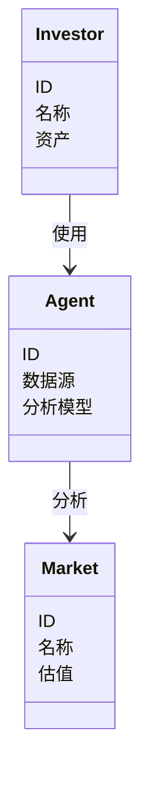
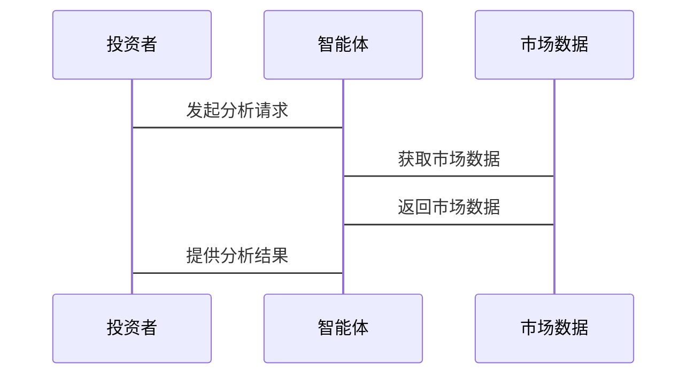

                 


# 多智能体系统在跨境价值比较中的应用：发现全球投资机会

> 关键词：多智能体系统, 跨境价值比较, 投资机会, 全球投资, 智能体协作

> 摘要：本文深入探讨了多智能体系统在跨境价值比较中的应用，通过分析多智能体系统的原理、算法和架构，结合实际案例，展示了如何利用多智能体系统发现全球投资机会。文章从背景介绍、核心概念、算法原理、系统设计到项目实战，全面解析了多智能体系统在跨境投资中的潜力与实现方案。

---

# 第一部分: 多智能体系统与跨境价值比较的背景与概念

# 第1章: 多智能体系统与跨境价值比较的背景

## 1.1 多智能体系统的基本概念
### 1.1.1 多智能体系统的定义
多智能体系统（Multi-Agent System, 简称 MAS）是由多个智能体组成的分布式系统，这些智能体能够通过协作完成复杂的任务。每个智能体都是一个独立的实体，具备感知环境、自主决策和执行任务的能力。

### 1.1.2 多智能体系统的特征
- **自主性**：智能体能够自主决策，无需外部干预。
- **反应性**：智能体能够实时感知环境并做出反应。
- **协作性**：多个智能体能够通过通信和协作完成共同目标。
- **分布式性**：智能体分布在不同的地理位置或计算节点上。

### 1.1.3 多智能体系统的应用场景
- 金融投资
- 智慧城市
- 游戏AI
- 机器人协作

## 1.2 跨境价值比较的背景与意义
### 1.2.1 跨境投资的定义与现状
跨境投资是指投资者在不同国家或地区之间进行资产配置，以实现更高的收益或风险分散。随着全球化的深入，跨境投资已成为投资者的重要选择。

### 1.2.2 跨境价值比较的重要性
在跨境投资中，投资者需要比较不同国家或地区的市场价值、风险、政策等因素，以做出最优的投资决策。传统的单点分析方法难以应对复杂多变的全球市场，因此需要更高效的工具。

### 1.2.3 跨境投资中的挑战与机遇
- **挑战**：市场波动、政策风险、汇率波动、信息不对称。
- **机遇**：全球化带来的多样化投资机会。

## 1.3 多智能体系统在跨境投资中的应用前景
### 1.3.1 多智能体系统的优势
- **分布式计算**：能够同时处理多个市场的数据。
- **协作能力**：智能体之间可以协同分析不同市场的价值。
- **实时性**：能够快速响应市场变化。

### 1.3.2 跨境投资中的信息不对称问题
信息不对称是跨境投资中的主要障碍，投资者需要依赖可靠的市场数据和分析工具来做出决策。

### 1.3.3 多智能体系统如何解决跨境投资问题
通过多智能体系统的协作，投资者可以实时获取多市场的数据，并通过智能体之间的协作进行价值比较，从而发现投资机会。

## 1.4 本章小结
本章介绍了多智能体系统的定义、特征及其应用场景，并分析了跨境投资的背景、挑战与机遇。最后，探讨了多智能体系统在跨境投资中的应用前景。

---

# 第2章: 多智能体系统与跨境价值比较的核心概念

## 2.1 多智能体系统的原理
### 2.1.1 多智能体系统的组成
多智能体系统由多个智能体、通信机制、协作机制和环境组成。智能体之间通过通信机制进行信息交换，并通过协作机制完成共同目标。

### 2.1.2 多智能体系统的通信机制
智能体之间的通信可以通过消息传递、发布-订阅模式等方式实现。

### 2.1.3 多智能体系统的协作机制
协作机制包括任务分配、协调和冲突解决。智能体通过协作机制实现任务的分工与合作。

## 2.2 跨境价值比较的原理
### 2.2.1 跨境价值比较的定义
跨境价值比较是指对不同国家或地区的市场价值进行比较，以发现投资机会。

### 2.2.2 跨境价值比较的指标体系
- 市场估值（如市盈率、市净率）
- 经济指标（如GDP增长率、通货膨胀率）
- 风险指标（如波动率、VaR）

### 2.2.3 跨境价值比较的算法选择
常用的算法包括聚类分析、回归分析和时间序列分析。

## 2.3 多智能体系统与跨境价值比较的结合
### 2.3.1 多智能体系统在跨境价值比较中的角色
智能体可以分别负责数据采集、分析和决策支持。

### 2.3.2 跨境价值比较对多智能体系统的挑战
- 数据异构性
- 智能体间的协调与同步
- 安全与隐私问题

### 2.3.3 多智能体系统与跨境价值比较的协同优化
通过智能体的协作，实现数据的高效采集、分析和决策支持。

## 2.4 本章小结
本章分析了多智能体系统的原理和组成，并探讨了跨境价值比较的指标体系和算法选择。最后，结合多智能体系统与跨境价值比较的特点，提出了协同优化的思路。

---

# 第3章: 多智能体系统与跨境价值比较的核心概念联系

## 3.1 多智能体系统与跨境价值比较的原理对比
### 3.1.1 多智能体系统的原理
通过智能体的协作实现任务的完成。

### 3.1.2 跨境价值比较的原理
通过对不同市场的价值进行比较，发现投资机会。

### 3.1.3 两者的异同点分析
- **相同点**：都需要数据的采集与分析。
- **不同点**：多智能体系统注重协作，跨境价值比较注重比较。

## 3.2 多智能体系统与跨境价值比较的特征对比
| 特征         | 多智能体系统                              | 跨境价值比较                              |
|--------------|------------------------------------------|------------------------------------------|
| 系统目标     | 协作完成任务                              | 比较不同市场的价值                        |
| 数据来源     | 分散在不同智能体                          | 多市场数据                                |
| 处理方式     | 分布式计算                                | 集中分析                                  |

## 3.3 多智能体系统与跨境价值比较的ER实体关系图
```mermaid
erDiagram
    investor --> market : 进行投资
    market --> asset : 包含资产
    asset --> value : 具有估值
    investor --> agent : 使用智能体
    agent --> market : 分析市场
```

## 3.4 本章小结
本章通过对比多智能体系统与跨境价值比较的原理和特征，构建了实体关系图，为后续的系统设计提供了基础。

---

# 第4章: 多智能体系统与跨境价值比较的算法原理

## 4.1 多智能体系统的算法原理
### 4.1.1 多智能体系统的分布式计算
通过分布式计算实现智能体之间的协作。

### 4.1.2 多智能体系统的通信算法
使用消息传递机制实现智能体之间的通信。

## 4.2 跨境价值比较的算法原理
### 4.2.1 聚类分析算法
通过聚类分析，将相似的市场进行分组。

### 4.2.2 回归分析算法
通过回归分析，预测市场的未来走势。

## 4.3 多智能体系统与跨境价值比较的协同算法
### 4.3.1 协同算法的流程
1. 数据采集：智能体分别采集不同市场的数据。
2. 数据分析：智能体对数据进行分析并生成报告。
3. 投资决策：投资者根据分析结果做出决策。

## 4.4 本章小结
本章分析了多智能体系统和跨境价值比较的算法原理，并提出了协同算法的流程。

---

# 第5章: 多智能体系统与跨境价值比较的系统分析与设计

## 5.1 项目背景与需求分析
### 5.1.1 项目背景
跨境投资的全球化趋势。

### 5.1.2 需求分析
投资者需要实时的市场分析和投资建议。

## 5.2 系统功能设计
### 5.2.1 领域模型


### 5.2.2 系统架构设计


## 5.3 系统接口设计
### 5.3.1 智能体接口
- 数据采集接口
- 数据分析接口

### 5.3.2 投资者接口
- 查询市场估值
- 获取投资建议

## 5.4 系统交互流程
### 5.4.1 系统交互流程图


## 5.5 本章小结
本章从项目背景出发，设计了系统的功能模块和架构，并给出了系统的接口设计和交互流程。

---

# 第6章: 多智能体系统与跨境价值比较的项目实战

## 6.1 环境安装
### 6.1.1 系统环境
- 操作系统：Linux/Windows/Mac
- 开发工具：Python、Jupyter Notebook
- 第三方库：numpy、pandas、scikit-learn、matplotlib

## 6.2 核心代码实现
### 6.2.1 智能体的实现
```python
class Agent:
    def __init__(self, market):
        self.market = market
        self.data = None
```

### 6.2.2 数据分析模块的实现
```python
def analyze_data(data):
    # 具体分析逻辑
    return result
```

### 6.2.3 通信机制的实现
```python
import zmq

context = zmq.Context()
socket = context.socket(zmq.PUBLISHER)
socket.bind("tcp://*:5555")
```

## 6.3 案例分析
### 6.3.1 数据采集
从多个市场中采集股票数据。

### 6.3.2 数据分析
通过聚类分析，发现具有投资价值的市场。

### 6.3.3 投资建议
根据分析结果，为投资者提供投资建议。

## 6.4 本章小结
本章通过实际案例，展示了多智能体系统在跨境价值比较中的应用，并给出了核心代码的实现。

---

# 第7章: 多智能体系统与跨境价值比较的最佳实践与小结

## 7.1 最佳实践
### 7.1.1 系统设计
- 采用分布式架构
- 确保智能体之间的通信效率
- 处理好数据的安全与隐私问题

### 7.1.2 代码实现
- 使用高效的算法
- 确保代码的可扩展性
- 注重代码的可维护性

## 7.2 小结
本文从多智能体系统的原理出发，结合跨境价值比较的需求，提出了系统的实现方案，并通过实际案例展示了系统的应用。未来的研究可以进一步优化系统的性能和扩展性。

## 7.3 注意事项
- 数据的准确性和实时性
- 系统的安全与隐私保护
- 智能体之间的协作效率

## 7.4 拓展阅读
推荐读者阅读《多智能体系统与分布式计算》和《投资学原理》等书籍，以进一步深入理解相关内容。

---

# 作者：AI天才研究院/AI Genius Institute & 禅与计算机程序设计艺术 /Zen And The Art of Computer Programming

---

以上是《多智能体系统在跨境价值比较中的应用：发现全球投资机会》的技术博客文章的目录大纲。接下来，我可以根据这个大纲，逐步展开每一部分的内容，撰写一篇详细的、逻辑清晰的技术博客文章。

