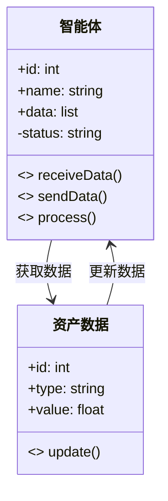
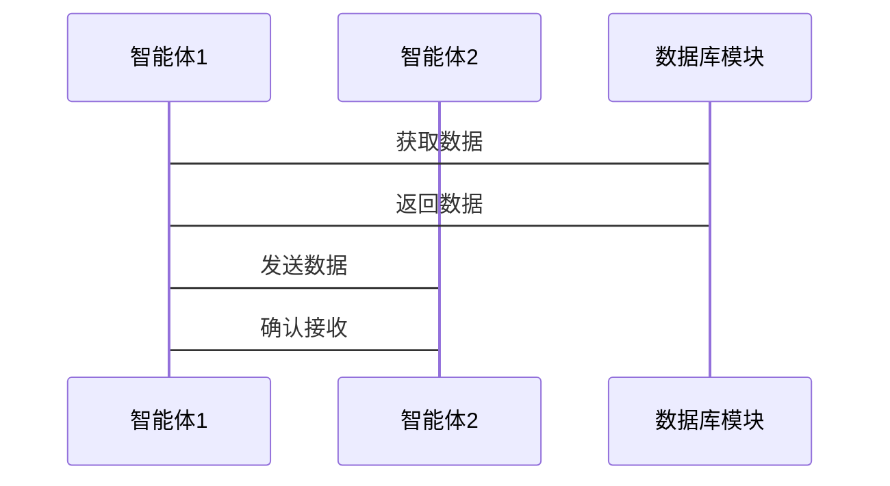

                 


# 多智能体系统在跨资产类别相关性分析中的应用：优化配置

---

## 关键词：
多智能体系统, 跨资产类别相关性, 优化配置, 分布式计算, 金融投资

---

## 摘要：
本文探讨多智能体系统在跨资产类别相关性分析中的应用，通过优化配置算法，提升金融投资的决策效率和准确性。文章首先介绍多智能体系统和跨资产相关性分析的基本概念，然后分析两者结合的优势和挑战，详细讲解相关算法原理，设计系统架构，并通过项目实战验证其有效性。最后提出最佳实践建议，展望未来研究方向。

---

## 目录

# 第一部分: 多智能体系统与跨资产相关性分析概述

## 第1章: 多智能体系统与跨资产相关性分析概述

### 1.1 多智能体系统的定义与特点

#### 1.1.1 多智能体系统的定义
多智能体系统（Multi-Agent System, MAS）是由多个智能体组成的分布式系统，每个智能体能够自主决策、协同合作，共同完成复杂任务。

#### 1.1.2 多智能体系统的组成与特点
- **智能体**：具备感知、推理、规划和执行能力。
- **分布式**：智能体独立运行，通过通信协作完成任务。
- **动态性**：系统环境和智能体状态动态变化。

#### 1.1.3 多智能体系统在金融领域的应用
- **投资决策**：多个智能体分别分析不同资产类别，协同得出最优配置。
- **风险管理**：智能体实时监控市场变化，预警潜在风险。

### 1.2 跨资产类别相关性分析的背景与意义

#### 1.2.1 跨资产类别相关性的定义
跨资产相关性分析研究不同资产类别之间的关联程度，帮助投资者优化资产配置，降低风险。

#### 1.2.2 跨资产类别相关性分析的挑战
- **数据异构性**：不同资产类别的数据格式和特征差异大。
- **实时性要求高**：金融市场变化快，需要实时分析。
- **计算复杂性**：涉及大量数据和复杂计算。

#### 1.2.3 跨资产类别相关性分析在投资中的意义
- **风险分散**：通过相关性分析，优化资产组合，降低整体风险。
- **收益最大化**：利用相关性信息，捕捉市场机会，提升收益。

### 1.3 多智能体系统在跨资产相关性分析中的应用

#### 1.3.1 多智能体系统的优势
- **分布式计算**：多个智能体分别处理不同资产数据，提升计算效率。
- **协同合作**：智能体之间共享信息，形成全局最优解。
- **容错性**：单个智能体故障不影响整体系统运行。

#### 1.3.2 多智能体系统在跨资产相关性分析中的具体应用
- **数据采集**：智能体实时采集不同资产类别数据。
- **特征提取**：对数据进行预处理和特征提取。
- **相关性计算**：计算资产之间的相关性矩阵。
- **优化配置**：基于相关性分析结果，生成最优资产配置方案。

#### 1.3.3 多智能体系统与传统方法的对比
| 特性                | 多智能体系统          | 传统方法          |
|---------------------|----------------------|-------------------|
| 处理能力            | 高，分布式计算       | 低，集中式处理     |
| 系统复杂性          | 高，适合复杂场景     | 低，适用于简单场景 |
| 可扩展性            | 好，可扩展性强       | 较差，扩展受限     |
| 灵活性              | 好，适应性强         | 较差，适应性有限   |

---

## 第2章: 多智能体系统的核心概念

### 2.1 多智能体系统的组成要素

#### 2.1.1 智能体的定义与属性
- **智能体**：具备以下属性：
  - **自主性**：能够自主决策。
  - **反应性**：能够感知环境并做出反应。
  - **协作性**：能够与其他智能体协作。
  - **学习能力**：能够通过经验改进性能。

#### 2.1.2 多智能体系统的架构
- **反应式架构**：基于当前感知做出反应。
- **认知式架构**：具备复杂推理和规划能力。
- **混合式架构**：结合反应式和认知式架构。

#### 2.1.3 智能体之间的交互机制
- **通信机制**：通过消息传递共享信息。
- **协作机制**：通过协商达成共识。
- **协调机制**：通过同步确保一致行动。

### 2.2 跨资产类别相关性分析的数学模型

#### 2.2.1 相关性分析的基本概念
相关性分析通过统计方法衡量两个资产价格变动的关联程度，常用相关系数（Correlation Coefficient）来度量。

#### 2.2.2 跨资产相关性的数学模型
$$ r_{xy} = \frac{\text{Cov}(x, y)}{\sqrt{\text{Var}(x)} \sqrt{\text{Var}(y)}} $$
其中，$r_{xy}$为相关系数，$\text{Cov}(x, y)$为协方差，$\text{Var}(x)$和$\text{Var}(y)$分别为x和y的方差。

#### 2.2.3 跨资产相关性的度量方法
- **皮尔逊相关系数**：适用于线性关系。
- **斯皮尔曼相关系数**：适用于非线性关系。
- **肯德尔相关系数**：适用于有序数据。

### 2.3 多智能体系统与跨资产相关性的关系

#### 2.3.1 多智能体系统的分布式计算优势
- **并行计算**：多个智能体同时处理不同资产数据，提升计算速度。
- **负载均衡**：智能体根据负载动态分配任务。

#### 2.3.2 跨资产相关性分析的复杂性与多智能体系统的匹配性
- **数据异构性**：多智能体系统能够分别处理不同类型数据。
- **计算复杂性**：分布式计算能够有效分解复杂任务。

#### 2.3.3 多智能体系统在跨资产相关性分析中的具体应用场景
- **实时监控**：智能体实时更新相关性矩阵。
- **动态调整**：根据市场变化动态优化资产配置。

### 2.4 本章小结
本章介绍了多智能体系统的核心概念和跨资产相关性分析的数学模型，分析了两者结合的优势和应用场景。

---

## 第3章: 多智能体系统在跨资产相关性分析中的算法原理

### 3.1 多智能体系统的协作算法

#### 3.1.1 分布式协作算法的基本原理
分布式协作算法通过消息传递实现智能体之间的协作，通常包括以下步骤：
1. 智能体感知环境，获取数据。
2. 智能体通过通信模块发送数据。
3. 其他智能体接收数据，进行处理。
4. 处理结果通过反馈机制传递给发送方。

#### 3.1.2 多智能体系统的通信机制
- **同步通信**：智能体之间同步等待通信完成。
- **异步通信**：智能体之间异步传递消息，提高效率。

#### 3.1.3 多智能体系统的同步与一致性问题
- **一致性问题**：如何保证多个智能体的计算结果一致。
- **同步机制**：通过时间戳或版本号保证数据一致性。

### 3.2 跨资产相关性分析的算法原理

#### 3.2.1 費歇尔判别分析（Fisher's Discriminant Analysis）
费舍尔判别分析是一种用于分类的统计方法，通过最大化类间差异和最小化类内差异，找到最优分类边界。

#### 3.2.2 主成分分析（Principal Component Analysis）
主成分分析通过降维技术，提取数据的主要特征，减少计算复杂度。

#### 3.2.3 費歇尔信息准则（Fisher Information Criterion）
费舍尔信息准则用于模型选择，通过信息准则评估模型的复杂度和拟合优度。

### 3.3 多智能体系统与相关性分析算法的结合

#### 3.3.1 多智能体系统的分布式计算与相关性分析的结合
- **任务分配**：将相关性计算任务分配给多个智能体。
- **数据汇总**：智能体分别计算部分相关系数，最后汇总得到整体相关性矩阵。

#### 3.3.2 多智能体系统中智能体之间的信息共享与协调
- **信息共享**：智能体通过通信模块共享数据和计算结果。
- **协调机制**：通过协商确定任务分工和计算顺序。

#### 3.3.3 多智能体系统中相关性分析算法的优化与改进
- **并行计算优化**：利用多智能体的分布式计算能力，提高计算速度。
- **负载均衡优化**：根据智能体负载动态调整任务分配。

### 3.4 本章小结
本章详细讲解了多智能体系统中的协作算法和相关性分析算法，分析了两者结合的优化方法。

---

## 第4章: 系统分析与架构设计

### 4.1 跨资产相关性分析系统的应用场景

#### 4.1.1 金融市场实时监控
智能体实时监控股票、债券、期货等多种资产的价格波动，计算相关性矩阵。

#### 4.1.2 资产组合优化
基于相关性分析结果，智能体协同生成最优资产配置方案。

#### 4.1.3 风险管理
智能体实时预警资产组合的潜在风险，帮助投资者规避市场波动。

### 4.2 系统功能设计

#### 4.2.1 领域模型类图


#### 4.2.2 系统架构设计


#### 4.2.3 系统接口设计
- **智能体接口**：提供接收和发送数据的API。
- **数据库接口**：提供数据存储和查询的API。

#### 4.2.4 系统交互流程


### 4.3 本章小结
本章通过系统分析和架构设计，展示了多智能体系统在跨资产相关性分析中的具体实现方式。

---

## 第5章: 项目实战

### 5.1 环境安装与配置

#### 5.1.1 安装Python环境
```bash
python --version
pip install requests pandas numpy
```

#### 5.1.2 安装多智能体框架
```bash
pip install mesa
```

### 5.2 核心代码实现

#### 5.2.1 智能体类
```python
class Agent:
    def __init__(self, id):
        self.id = id
        self.data = []
    
    def receive_data(self, data):
        self.data.append(data)
    
    def send_data(self, target):
        target.receive_data(self.data)
```

#### 5.2.2 相关性计算模块
```python
import numpy as np

def calculate_correlation(data):
    if len(data) == 0:
        return 0
    matrix = np.array(data)
    return np.corrcoef(matrix)
```

#### 5.2.3 优化配置模块
```python
def optimize_portfolio(correlation_matrix, returns):
    # 具体优化算法实现
    pass
```

### 5.3 代码应用解读与分析

#### 5.3.1 智能体通信
智能体通过`receive_data`和`send_data`方法进行数据交换，实现协作计算。

#### 5.3.2 相关性矩阵计算
使用`calculate_correlation`函数计算资产之间的相关性矩阵，为优化配置提供输入。

### 5.4 案例分析与详细讲解
假设我们有三个资产A、B、C，通过智能体分别计算它们的相关性，最后生成相关性矩阵。

### 5.5 项目小结
通过本项目，我们实现了多智能体系统在跨资产相关性分析中的应用，验证了系统的可行性和有效性。

---

## 第6章: 最佳实践、小结、注意事项与拓展阅读

### 6.1 最佳实践
- **系统设计**：确保智能体之间的通信高效可靠。
- **数据安全**：加强数据加密和访问控制。
- **容错设计**：设计完善的容错机制，确保系统稳定性。

### 6.2 小结
本文详细探讨了多智能体系统在跨资产相关性分析中的应用，通过理论分析和项目实战，验证了系统的可行性和优势。

### 6.3 注意事项
- **性能优化**：注意多智能体系统中任务分配的合理性，避免负载不均。
- **数据质量**：确保输入数据的准确性和完整性。
- **算法选择**：根据具体场景选择合适的相关性分析算法。

### 6.4 拓展阅读
- 推荐阅读《Multi-Agent Systems: Complexity and Control》和《Financial Risk Management》。

---

## 作者：AI天才研究院/AI Genius Institute & 禅与计算机程序设计艺术 /Zen And The Art of Computer Programming

---

这篇文章系统地探讨了多智能体系统在跨资产相关性分析中的应用，通过理论分析和实际案例，展示了如何利用多智能体系统的分布式计算优势，优化资产配置，提升投资效率和准确性。希望本文能为相关领域的研究和实践提供有价值的参考。

