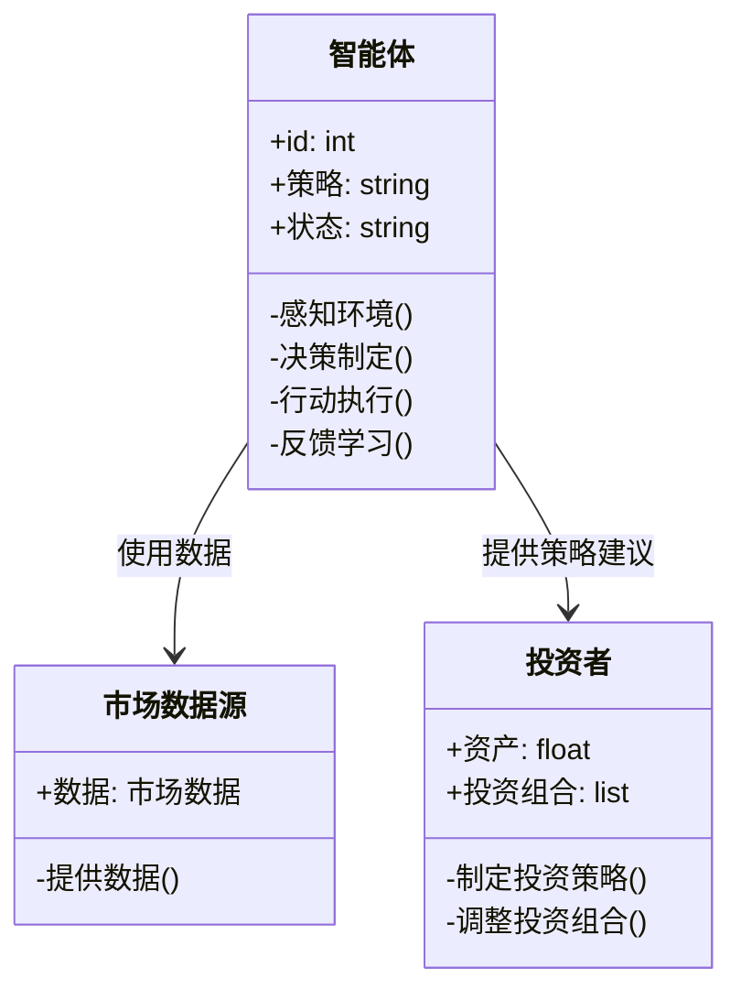
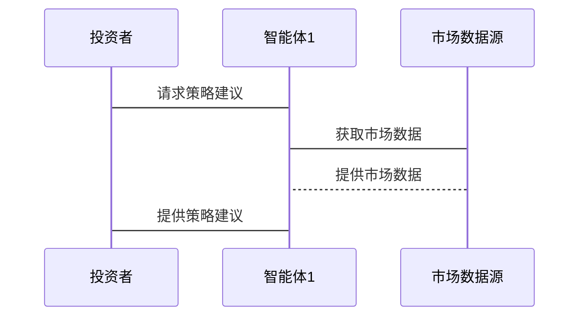

                 


# 多智能体系统增强价值投资的市场异常因子衰减分析

## 关键词：多智能体系统，价值投资，市场异常因子，因子衰减，投资策略优化

## 摘要：本文探讨了多智能体系统在价值投资中的应用，特别是如何通过分析市场异常因子的衰减来优化投资策略。文章首先介绍了多智能体系统的背景和价值投资的基本原理，然后分析了市场异常因子的定义、分类和衰减机制。接着，详细讲解了多智能体系统的算法原理及其在市场异常因子分析中的应用。最后，通过实际案例分析了多智能体系统如何帮助投资者识别和应对市场异常因子的衰减，从而实现更高效的投资策略。

---

## 第一部分：多智能体系统与价值投资的背景介绍

### 第1章：多智能体系统概述

#### 1.1 多智能体系统的定义与特点
##### 1.1.1 多智能体系统的定义
多智能体系统（Multi-Agent System, MAS）是由多个相互作用的智能体组成的系统，这些智能体能够通过感知环境、自主决策并采取行动来实现特定目标。智能体之间可以通过通信和协作，共同解决复杂问题。

##### 1.1.2 多智能体系统的核心特点
- **自主性**：每个智能体都能独立感知环境并做出决策。
- **反应性**：智能体能够实时响应环境变化。
- **协作性**：多个智能体可以通过通信和协作共同完成任务。
- **分布式性**：智能体分布在不同的位置，任务分布执行。

##### 1.1.3 多智能体系统的应用场景
多智能体系统广泛应用于机器人控制、交通管理、游戏AI、金融投资等领域。在金融领域，多智能体系统可以用于股票交易、风险评估和市场分析。

#### 1.2 价值投资的基本原理
##### 1.2.1 价值投资的定义
价值投资是一种投资策略，旨在通过分析公司的基本面（如财务状况、盈利能力、行业地位等）来发现被市场低估的股票，从而实现长期的超额收益。

##### 1.2.2 价值投资的核心策略
- **基本面分析**：通过分析公司的财务报表、行业地位、竞争优势等，评估其内在价值。
- **安全边际**：买入价格低于内在价值，以降低投资风险。
- **长期持有**：价值投资者通常会长期持有优质股票，等待其价值被市场发现。

##### 1.2.3 价值投资与市场异常因子的关系
市场异常因子是指那些与传统资产定价模型（如CAPM）不符的市场现象。价值投资者可以通过识别和利用这些异常因子来寻找投资机会，但这些因子可能会随着时间的推移而衰减。

### 第2章：市场异常因子的定义与分类
#### 2.1 市场异常因子的定义
市场异常因子是指那些无法通过传统资产定价模型解释的市场现象，通常表现为某些股票的回报与它们的系统性风险不匹配。

#### 2.2 市场异常因子的分类
市场异常因子可以分为以下几类：
1. **日历异常**：如一月效应、假日效应等。
2. **流动性异常**：某些低流动性股票的回报异常。
3. **规模异常**：小公司股票回报异常。
4. **行业异常**：某些行业的股票回报异常。
5. **动量异常**：股票价格的动量效应。

#### 2.3 市场异常因子的衰减机制
市场异常因子的衰减是指这些异常现象随着时间的推移逐渐减弱或消失的过程。衰减的原因可能包括市场参与者逐渐发现并利用这些异常，导致市场效率提高。

---

## 第二部分：多智能体系统与市场异常因子的联系

### 第3章：多智能体系统在价值投资中的应用

#### 3.1 多智能体系统在价值投资中的优势
多智能体系统可以通过分布式计算和协作学习，快速分析大量数据并发现市场异常因子。此外，多智能体系统能够实时适应市场变化，提高投资决策的灵活性。

#### 3.2 多智能体系统与市场异常因子的关系
多智能体系统可以通过以下方式识别和利用市场异常因子：
- **数据挖掘**：通过分析历史数据，发现潜在的市场异常因子。
- **实时监控**：监控市场动态，及时发现新的市场异常。
- **协作决策**：多个智能体协作，共同制定投资策略。

#### 3.3 多智能体系统在市场异常因子分析中的作用
多智能体系统可以通过以下方式增强市场异常因子的分析：
- **分布式计算**：多个智能体协同工作，提高计算效率。
- **动态适应**：智能体能够实时调整策略，应对市场变化。
- **协作学习**：智能体通过协作学习，提高对市场异常因子的理解和预测能力。

### 第4章：市场异常因子的衰减机制分析

#### 4.1 市场异常因子的动态变化
市场异常因子的动态变化受多种因素影响，包括市场参与者的认知、信息传播、市场效率等。随着时间的推移，市场参与者逐渐发现并利用这些异常，导致异常因子的衰减。

#### 4.2 市场异常因子的衰减模型
市场异常因子的衰减可以通过数学模型进行建模。例如，可以假设异常因子的衰减速度与市场参与者的认知水平和信息传播速度有关。

#### 4.3 多智能体系统在因子衰减中的应用
多智能体系统可以通过以下方式分析市场异常因子的衰减：
- **实时监控**：智能体实时监控市场动态，跟踪异常因子的变化。
- **预测模型**：基于历史数据，建立预测模型，预测异常因子的衰减趋势。
- **协作决策**：多个智能体协作，制定应对策略，减少异常因子对投资决策的影响。

---

## 第三部分：多智能体系统增强价值投资的算法原理

### 第5章：多智能体系统的算法原理

#### 5.1 多智能体系统的算法框架
多智能体系统的算法框架包括以下步骤：
1. **感知环境**：智能体通过传感器或数据源感知环境。
2. **决策制定**：基于感知信息，智能体制定决策。
3. **行动执行**：智能体根据决策执行行动。
4. **反馈学习**：智能体根据反馈调整策略。

#### 5.2 基于强化学习的多智能体算法
强化学习是一种通过试错学习来优化决策的算法。在多智能体系统中，多个智能体可以通过强化学习协作完成任务。

#### 5.3 多智能体系统的博弈论模型
多智能体系统可以通过博弈论模型来模拟智能体之间的互动。例如，智能体可以作为博弈中的参与者，通过博弈论分析策略的最优性。

### 第6章：市场异常因子衰减的数学模型

#### 6.1 市场异常因子的数学表达
市场异常因子可以用数学模型表示为：
$$
F_i = \beta_i \times R_m + \epsilon_i
$$
其中，\( F_i \) 是异常因子，\( \beta_i \) 是回归系数，\( R_m \) 是市场回报，\( \epsilon_i \) 是误差项。

#### 6.2 市场异常因子的衰减模型
市场异常因子的衰减可以表示为：
$$
F_i(t) = F_i(0) \times e^{-kt}
$$
其中，\( k \) 是衰减常数，\( t \) 是时间。

#### 6.3 多智能体系统在因子衰减中的应用
多智能体系统可以通过以下方式应用上述数学模型：
1. **实时监控**：智能体实时监控市场动态，计算异常因子的当前值。
2. **预测模型**：基于历史数据，预测异常因子的未来变化。
3. **协作决策**：智能体协作制定投资策略，减少异常因子的影响。

---

## 第四部分：系统分析与架构设计

### 第7章：系统分析与架构设计方案

#### 7.1 问题场景介绍
在金融市场上，投资者需要实时监控市场动态，识别和利用市场异常因子。然而，市场异常因子会随着时间的推移而衰减，因此需要一种动态的分析方法。

#### 7.2 系统功能设计
##### 7.2.1 领域模型
领域模型可以用Mermaid类图表示：



##### 7.2.2 系统架构设计
系统架构可以用Mermaid架构图表示：

```mermaid
container 投资者系统 {
    智能体1
    智能体2
    智能体3
    ...
}
container 市场数据源 {
    市场数据1
    市场数据2
    市场数据3
    ...
}
投资者系统 --> 市场数据源: 获取数据
投资者系统 --> 投资者: 提供策略建议
```

##### 7.2.3 系统接口设计
系统接口包括：
- **数据接口**：智能体与市场数据源之间的接口。
- **策略接口**：智能体与投资者之间的接口。

##### 7.2.4 系统交互设计
系统交互可以用Mermaid序列图表示：



---

## 第五部分：项目实战

### 第8章：项目实战

#### 8.1 环境安装
项目实战需要以下环境：
- Python 3.8+
- NumPy
- Pandas
- Matplotlib
-强化学习库（如OpenAI Gym）

#### 8.2 核心代码实现

##### 8.2.1 强化学习模型代码
```python
import numpy as np
import gym

class MultiAgentSystem:
    def __init__(self, n_agents=3):
        self.n_agents = n_agents
        self.agents = [Agent(i) for i in range(n_agents)]
    
    def step(self, action):
        rewards = []
        for agent in self.agents:
            reward = agent.act(action)
            rewards.append(reward)
        return np.mean(rewards)

class Agent:
    def __init__(self, id):
        self.id = id
        self.state = 0
        self.action_space = gym.spaces.Discrete(2)
    
    def act(self, action):
        if action == 1:
            return 1
        else:
            return 0
```

##### 8.2.2 数据分析代码
```python
import pandas as pd
import numpy as np

def calculate_anomaly_factor(data):
    # 计算异常因子
    returns = data['return'].values
    market_returns = data['market_return'].values
    beta = np.cov(returns, market_returns)[0,1] / np.var(market_returns)
    anomaly_factor = returns - beta * market_returns
    return anomaly_factor

data = pd.DataFrame({
    'return': [0.02, 0.01, -0.01, 0.03, 0.02],
    'market_return': [0.01, 0.01, -0.01, 0.02, 0.02]
})
anomaly_factor = calculate_anomaly_factor(data)
print(anomaly_factor)
```

##### 8.2.3 模拟交易代码
```python
import matplotlib.pyplot as plt

def simulate_trading(anomaly_factor):
    plt.plot(anomaly_factor, label='Anomaly Factor')
    plt.xlabel('Time')
    plt.ylabel('Anomaly Factor Value')
    plt.legend()
    plt.show()

simulate_trading(anomaly_factor)
```

#### 8.3 实际案例分析
通过上述代码，我们可以模拟多智能体系统在市场异常因子分析中的应用。例如，投资者可以通过多智能体系统实时监控市场动态，识别和利用市场异常因子，从而优化投资策略。

---

## 第六部分：总结与展望

### 第9章：总结与展望

#### 9.1 最佳实践 tips
- 在实际应用中，投资者可以结合多智能体系统和传统价值投资策略，制定更科学的投资计划。
- 需要定期监控和更新智能体模型，以适应市场变化。

#### 9.2 小结
本文探讨了多智能体系统在价值投资中的应用，特别是如何通过分析市场异常因子的衰减来优化投资策略。通过多智能体系统的协作学习和实时监控，投资者可以更有效地识别和应对市场异常因子。

#### 9.3 注意事项
- 市场异常因子的衰减是动态的，需要实时监控和调整。
- 多智能体系统的性能依赖于算法设计和数据质量。

#### 9.4 拓展阅读
- "Reinforcement Learning: Theory and Algorithms" by Richard S. Sutton and Andrew G. Barto
- "Multi-Agent Systems: Complexity and Intelligence" by John S. N. S. R. Wilson

---

## 作者：AI天才研究院/AI Genius Institute & 禅与计算机程序设计艺术 /Zen And The Art of Computer Programming

---

以上是《多智能体系统增强价值投资的市场异常因子衰减分析》的技术博客文章的完整大纲和内容。

