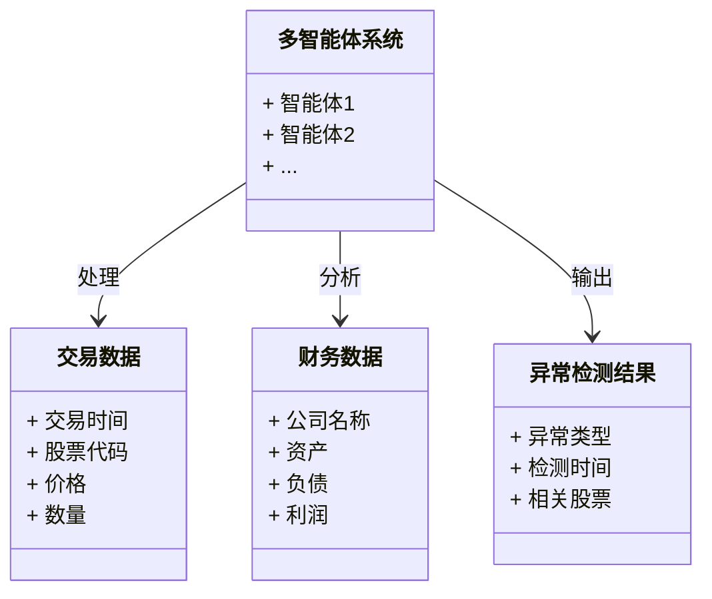

                 


```markdown
# 多智能体系统增强价值投资的市场微观结构异常检测

> 关键词：多智能体系统，价值投资，市场微观结构，异常检测，算法原理，系统架构

> 摘要：本文探讨了多智能体系统在增强价值投资中的应用，特别是如何通过市场微观结构异常检测来提升投资决策的准确性和效率。文章详细分析了多智能体系统的背景、核心概念、算法原理、系统架构设计以及实际案例，结合丰富的图表和代码示例，深入剖析了多智能体系统在金融领域中的应用潜力。

---

## 第一部分：多智能体系统与价值投资概述

### 第1章：多智能体系统与价值投资的背景介绍

#### 1.1 多智能体系统的基本概念
多智能体系统（Multi-Agent System, MAS）是由多个智能体组成的系统，这些智能体能够通过交互和协作完成复杂任务。智能体具有自主性、反应性、目标导向和社交能力等特征。与传统的单智能体系统相比，MAS能够更好地应对复杂环境中的动态变化。

#### 1.2 价值投资的基本原理
价值投资是一种以基本面分析为基础的投资策略，旨在通过分析企业的财务状况、行业地位和竞争优势，找到被市场低估的投资标的。其核心思想是“以合理的价格买入优秀的公司”。

#### 1.3 市场微观结构异常检测的重要性
市场微观结构异常检测是指识别金融市场中的异常交易行为或市场操纵行为。通过检测这些异常，投资者可以更好地理解市场动态，避免潜在风险。

---

## 第二部分：多智能体系统与价值投资的核心概念与联系

### 第2章：多智能体系统与价值投资的核心概念

#### 2.1 多智能体系统的数学模型
多智能体系统的状态可以通过一系列变量表示，例如每个智能体的目标、当前状态和与其他智能体的交互。决策过程则基于这些状态变量和环境信息。

#### 2.2 价值投资的数学模型
价值投资的核心是通过对企业基本面的分析，评估其内在价值。这包括对企业财务状况、行业地位和竞争优势的定量和定性分析。

#### 2.3 多智能体系统与价值投资的联系
多智能体系统可以通过分布式计算和协作学习，增强价值投资的决策能力。例如，多个智能体可以分别负责不同的分析任务，如财务分析、市场趋势分析等，最终通过协作得出综合的投资决策。

#### 2.4 核心概念对比表格
以下是多智能体系统与价值投资的核心概念对比：

| **概念**            | **多智能体系统**                  | **价值投资**                   |
|---------------------|---------------------------------|-------------------------------|
| 核心目标            | 分布式协作与问题求解             | 寻找被低估的投资标的           |
| 特征                | 自主性、反应性、目标导向         | 基于基本面分析                 |
| 应用场景            | 金融市场中的复杂决策             | 投资决策                      |

#### 2.5 ER实体关系图
以下是多智能体系统与价值投资的实体关系图：

```mermaid
erDiagram
    actor 投资者 {
        string 姓名
        string 账户
    }
    actor 市场监管机构 {
        string 名称
        string 职能
    }
    entity 交易数据 {
        string 交易时间
        string 股票代码
        float 价格
        int 数量
    }
    entity 财务数据 {
        string 公司名称
        float 资产
        float 负债
        float 利润
    }
    entity 异常检测结果 {
        string 异常类型
        datetime 检测时间
        string 相关股票
    }
    投资者 --> 交易数据 : 下单
    交易数据 --> 异常检测结果 : 引发
    财务数据 --> 异常检测结果 : 关联
    市场监管机构 --> 异常检测结果 : 监测
```

---

## 第三部分：算法原理与数学模型

### 第3章：多智能体系统增强价值投资的算法原理

#### 3.1 异常检测算法概述
异常检测算法分为基于统计的方法（如Z-score）、基于机器学习的方法（如Isolation Forest）和基于深度学习的方法（如VAE）。本文重点介绍基于机器学习的异常检测算法。

#### 3.2 异常检测算法实现
以下是基于Isolation Forest算法的异常检测实现：

```python
import numpy as np
from sklearn.ensemble import IsolationForest

# 示例数据集
X = np.random.randn(100, 2)
outliers_fraction = 0.1

# 训练模型
clf = IsolationForest(contamination=outliers_fraction)
clf.fit(X)

# 预测异常点
y_pred = clf.predict(X)
outliers = X[y_pred == -1]

# 可视化结果
import matplotlib.pyplot as plt
plt.scatter(X[:, 0], X[:, 1], c='blue', marker='.')
plt.scatter(outliers[:, 0], outliers[:, 1], c='red', marker='x')
plt.title('Anomaly Detection using Isolation Forest')
plt.show()
```

#### 3.3 数学模型与公式
Isolation Forest算法的核心思想是通过构建随机树来隔离异常点。其数学模型如下：

$$
\text{异常概率} = \frac{1}{(2^{h})} \times \frac{N}{N - h}
$$

其中，$h$ 表示树的高度，$N$ 表示训练样本数量。

---

## 第四部分：系统分析与架构设计方案

### 第4章：系统架构设计

#### 4.1 问题场景介绍
本文设计的系统旨在通过多智能体协作，实时检测金融市场中的微观结构异常。系统需要处理海量的交易数据和复杂的市场动态。

#### 4.2 系统功能设计
以下是系统的功能模块图：



#### 4.3 系统架构设计
以下是系统的架构图：


---

## 第五部分：项目实战

### 第5章：项目实战

#### 5.1 环境安装
需要安装以下Python库：

```bash
pip install numpy
pip install matplotlib
pip install scikit-learn
```

#### 5.2 核心实现代码
以下是异常检测的实现代码：

```python
import numpy as np
from sklearn.ensemble import IsolationForest
import matplotlib.pyplot as plt

# 生成示例数据
np.random.seed(42)
X = np.random.randn(100, 2)
outliers_fraction = 0.1

# 训练模型
clf = IsolationForest(contamination=outliers_fraction, random_state=42)
clf.fit(X)

# 预测异常点
y_pred = clf.predict(X)
outliers = X[y_pred == -1]

# 可视化
plt.scatter(X[:, 0], X[:, 1], c='blue', marker='.')
plt.scatter(outliers[:, 0], outliers[:, 1], c='red', marker='x')
plt.title('Anomaly Detection using Isolation Forest')
plt.show()
```

#### 5.3 实际案例分析
以某股票交易数据为例，通过上述算法检测市场中的异常交易行为。

---

## 第六部分：最佳实践与总结

### 第6章：最佳实践

#### 6.1 小结
本文通过多智能体系统增强了价值投资的决策能力，通过异常检测算法识别市场微观结构中的异常行为，为投资者提供了有力的决策支持。

#### 6.2 注意事项
在实际应用中，需要考虑数据质量和模型的可解释性。此外，还需要定期更新模型以适应市场变化。

#### 6.3 拓展阅读
建议读者进一步学习多智能体系统的协作机制和深度学习在金融中的应用。

---

作者：AI天才研究院 & 禅与计算机程序设计艺术
```

