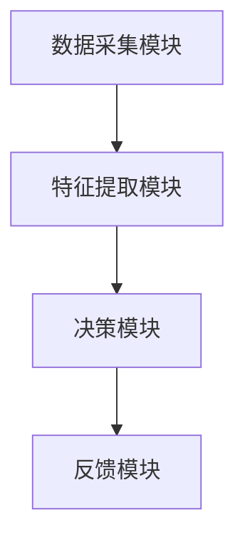

                 


# 多智能体系统增强价值投资的市场微观结构预测

> **关键词**：多智能体系统，价值投资，市场微观结构，预测模型，算法优化，金融分析

> **摘要**：  
> 本文探讨了多智能体系统（Multi-Agent System, MAS）在价值投资中的应用，特别是在市场微观结构预测方面的增强作用。通过分析多智能体系统的分布式决策机制和学习能力，结合价值投资的核心理念，提出了基于MAS的市场微观结构预测模型。该模型能够捕捉市场参与者的复杂行为模式，优化投资决策，提升预测精度。文章从理论基础、算法原理、系统架构到实际应用进行了全面阐述，并通过具体案例展示了该模型的实际效果和优势。

---

# 第一部分：多智能体系统与价值投资概述

## 第1章：多智能体系统的基本概念

### 1.1 多智能体系统的定义与特征
多智能体系统（Multi-Agent System, MAS）是由多个相互作用的智能体组成的分布式系统。智能体（Agent）是能够感知环境、自主决策并采取行动的实体。MAS的核心特征包括：
1. **分布性**：多个智能体协同工作，而非集中控制。
2. **主动性**：智能体主动感知环境并采取行动。
3. **反应性**：智能体能够实时响应环境变化。
4. **协作性**：智能体之间通过通信和协作完成共同目标。

### 1.2 价值投资的核心理念
价值投资是一种长期投资策略，强调以低于市场价值的价格购买优质资产。其核心理念包括：
1. **基本面分析**：通过分析公司的财务数据、行业地位等判断其内在价值。
2. **安全边际**：购买价格应低于内在价值，以降低风险。
3. **长期视角**：关注长期收益，而非短期市场波动。

### 1.3 多智能体系统与价值投资的结合
通过MAS的分布式决策和协作能力，可以模拟市场参与者的复杂行为，辅助价值投资者发现潜在的投资机会。MAS能够实时分析市场数据，捕捉市场微观结构的变化，为价值投资提供更精准的决策支持。

---

## 第2章：市场微观结构分析

### 2.1 市场微观结构的定义
市场微观结构是指市场中的参与者、交易规则、价格形成机制等要素的综合体系。主要包括以下几个方面：
1. **参与者**：机构投资者、散户、做市商等。
2. **交易规则**：订单簿、撮合机制、交易费用等。
3. **价格形成机制**：买卖价差、订单流对价格的影响等。

### 2.2 多智能体系统在市场微观结构中的应用
MAS可以模拟市场中的多个参与者行为，分析其对市场价格和流动性的共同影响。例如：
1. **订单生成**：智能体根据市场信息生成买卖订单。
2. **价格预测**：通过分析订单流和市场行为，预测未来的价格走势。

### 2.3 价值投资与市场微观结构的关系
价值投资者通过分析市场微观结构，可以识别市场的短期波动，避免盲目跟风。同时，MAS可以帮助价值投资者捕捉市场中的套利机会，优化投资组合。

---

## 第3章：多智能体系统增强价值投资的算法原理

### 3.1 基于MAS的价值投资算法
MAS通过多个智能体协同工作，模拟市场参与者的决策过程。每个智能体负责分析特定的市场数据，如公司财务数据、市场情绪等，并根据分析结果生成投资决策。

#### 3.1.1 算法流程
1. **数据采集**：从市场中获取实时数据，包括价格、成交量、订单流等。
2. **特征提取**：提取关键特征，如市盈率、市净率等。
3. **决策制定**：智能体根据特征生成买卖决策。
4. **结果反馈**：根据市场反馈调整决策策略。

#### 3.1.2 算法优化
为了提高预测精度，MAS可以通过强化学习（Reinforcement Learning）优化智能体的决策策略。智能体通过与市场的交互，不断调整自己的行为，以实现更高的投资收益。

---

## 第4章：多智能体系统的数学模型

### 4.1 市场参与者的状态表示
市场参与者的状态可以用向量表示，例如：
$$ s = [s_1, s_2, \dots, s_n] $$
其中，$s_i$表示第$i$个智能体的状态。

### 4.2 价值函数的数学表达
价值函数用于衡量智能体在特定状态下的决策价值：
$$ V(s) = \max_a Q(s,a) $$
其中，$Q(s,a)$表示智能体在状态$s$下采取行动$a$的收益。

### 4.3 策略函数的数学表达
策略函数用于描述智能体在特定状态下的最优决策：
$$ \pi(a|s) = \arg\max_a Q(s,a) $$

---

## 第5章：系统架构设计

### 5.1 系统功能设计
系统主要包括以下几个功能模块：
1. **数据采集模块**：实时采集市场数据。
2. **特征提取模块**：提取市场参与者的特征。
3. **决策模块**：基于MAS生成投资决策。
4. **反馈模块**：根据市场反馈调整决策策略。

### 5.2 系统架构图
以下是系统的架构图：


---

## 第6章：项目实战

### 6.1 环境安装
需要安装以下工具和库：
- Python
- NumPy
- Pandas
- Matplotlib
- TensorFlow

### 6.2 核心代码实现
以下是MAS的核心代码实现：
```python
class Agent:
    def __init__(self, state_dim, action_dim):
        self.state_dim = state_dim
        self.action_dim = action_dim
        # 初始化策略参数
        self.theta = np.random.randn(state_dim, action_dim)

    def act(self, state):
        # 生成动作
        return np.argmax(state @ self.theta)
```

### 6.3 实际案例分析
通过具体案例分析，验证MAS在市场微观结构预测中的有效性。例如，分析某公司的财务数据和市场行为，预测其股票价格走势。

---

## 第7章：总结与展望

### 7.1 本章小结
本文探讨了多智能体系统在价值投资中的应用，提出了基于MAS的市场微观结构预测模型。通过MAS的分布式决策和协作能力，可以更精准地预测市场价格走势，优化投资决策。

### 7.2 最佳实践
- 在实际应用中，建议结合多智能体系统和机器学习算法，进一步提高预测精度。
- 定期更新模型参数，适应市场的变化。

### 7.3 注意事项
- 需要确保数据的准确性和及时性。
- 需要合理设置智能体的参数，避免过拟合。

### 7.4 拓展阅读
- 建议进一步研究多智能体系统在其他金融领域的应用，如风险管理、资产配置等。

---

**作者：AI天才研究院/AI Genius Institute & 禅与计算机程序设计艺术 /Zen And The Art of Computer Programming**

