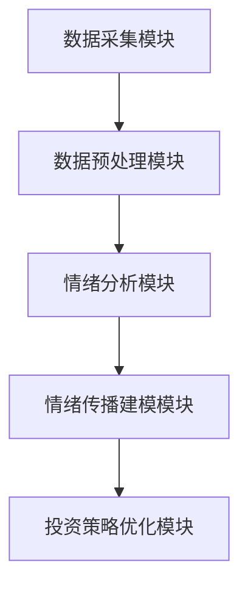
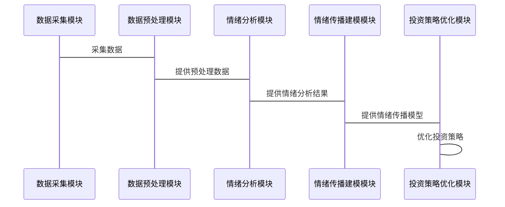

                 


# 多智能体系统增强价值投资的市场情绪传导分析

> 关键词：多智能体系统、价值投资、市场情绪、金融数据分析、投资策略优化、情绪传导机制

> 摘要：本文探讨了多智能体系统在价值投资中的应用，特别是其对市场情绪的分析与传导。通过系统架构设计、算法实现和案例分析，展示了多智能体系统如何增强价值投资策略的优化，以及市场情绪如何影响投资决策。

---

## 第一部分: 多智能体系统与价值投资概述

### 第1章: 多智能体系统概述

#### 1.1 多智能体系统的定义与特点
##### 1.1.1 多智能体系统的定义
多智能体系统（Multi-Agent System, MAS）是由多个智能体组成的分布式系统，每个智能体能够感知环境、自主决策并与其他智能体协作或竞争，以实现共同目标。

##### 1.1.2 多智能体系统的核心特点
- **分布式性**：智能体独立运行，通过通信协作完成任务。
- **自主性**：智能体具备自主决策能力。
- **反应性**：能实时感知环境变化并做出反应。
- **社会性**：智能体之间通过交互协作。

##### 1.1.3 多智能体系统与传统单智能体系统的区别
| 特性       | 多智能体系统                | 单智能体系统                |
|------------|-----------------------------|-----------------------------|
| 结构       | 分布式                     | 集中式                     |
| 协作       | 智能体间协作                | 单一决策中心                |
| 灵活性     | 高                        | 低                        |

#### 1.2 价值投资的基本理论
##### 1.2.1 价值投资的定义与核心理念
价值投资强调以低于内在价值的价格购买优质资产，长期持有，等待价值回归。

##### 1.2.2 价值投资的主要策略与方法
- **基本面分析**：分析公司财务状况、行业地位。
- **安全边际**：买入价格低于内在价值。
- **长期视角**：关注公司长期价值而非短期波动。

##### 1.2.3 价值投资在金融市场中的应用现状
价值投资在股票、基金等金融资产中广泛应用，但传统方法依赖人工分析，效率有限。

#### 1.3 市场情绪的概念与影响
##### 1.3.1 市场情绪的定义与分类
市场情绪指投资者整体的心理状态，分为乐观、悲观、中立等。

##### 1.3.2 市场情绪对金融市场的影响
市场情绪影响资产价格波动，投资者情绪过热可能导致泡沫，过度恐慌导致错杀。

##### 1.3.3 市场情绪传导的机制与路径
市场情绪通过投资者行为、媒体报道、社交网络等渠道传导，形成群体效应。

---

### 第2章: 多智能体系统在金融市场中的应用

#### 2.1 多智能体系统在金融市场的优势
##### 2.1.1 多智能体系统在金融市场中的独特优势
- **分布式计算**：提高数据处理效率。
- **实时协作**：快速响应市场变化。
- **复杂问题解决**：处理多因素影响的金融问题。

##### 2.1.2 多智能体系统在金融数据处理中的应用
- **实时数据分析**：处理高频交易数据。
- **多维度分析**：结合市场情绪、财务数据等多因素。

##### 2.1.3 多智能体系统在金融决策中的作用
- **分散决策风险**：避免单点故障。
- **协作优化**：通过智能体协作提升决策质量。

#### 2.2 价值投资与市场情绪的关系
##### 2.2.1 价值投资与市场情绪的相互作用
市场情绪影响资产价格，而价值投资强调忽视短期波动，关注长期价值。

##### 2.2.2 市场情绪对价值投资策略的影响
过度乐观情绪可能导致资产价格高估，价值投资者应警惕情绪驱动的短期波动。

##### 2.2.3 价值投资如何利用市场情绪进行优化
通过分析市场情绪，价值投资者可以识别情绪低估的资产，捕捉价值回归机会。

#### 2.3 多智能体系统与市场情绪传导的结合
##### 2.3.1 多智能体系统在市场情绪传导中的应用
- **实时监控**：智能体实时采集市场情绪数据。
- **情绪传播建模**：分析情绪在投资者间的传播路径。

##### 2.3.2 多智能体系统如何增强市场情绪分析的准确性
- **分布式数据处理**：多个智能体协作分析多源数据。
- **动态调整模型**：根据市场反馈实时优化情绪分析模型。

##### 2.3.3 多智能体系统在价值投资中的具体应用场景
- **情绪驱动投资决策**：根据市场情绪变化调整投资策略。
- **多因素分析**：结合市场情绪、财务数据等多因素进行投资决策优化。

---

## 第二部分: 市场情绪分析与多智能体系统

### 第3章: 市场情绪分析的基础

#### 3.1 市场情绪分析的理论基础
##### 3.1.1 市场情绪分析的基本理论
市场情绪分析基于行为金融学，认为投资者情绪影响资产价格。

##### 3.1.2 市场情绪分析的主要方法
- **文本分析**：通过新闻、社交媒体等文本数据提取情绪信息。
- **数据挖掘**：分析交易数据中的情绪特征。
- **自然语言处理（NLP）**：利用NLP技术分析文本情绪。

##### 3.1.3 市场情绪分析的数学模型
常用的情感分析模型包括朴素贝叶斯、支持向量机（SVM）等。

#### 3.2 市场情绪数据的来源与处理
##### 3.2.1 市场情绪数据的来源
- **新闻媒体**：如金融新闻、财经评论。
- **社交媒体**：如Twitter、Reddit等平台的投资者讨论。
- **交易数据**：如成交量、买卖价差等。

##### 3.2.2 市场情绪数据的预处理
- **数据清洗**：去除噪声数据，如特殊符号、停用词。
- **数据标注**：将文本数据标注为积极、消极、中性情绪。

##### 3.2.3 市场情绪数据的特征提取
- **文本特征提取**：如TF-IDF、词嵌入（Word2Vec）。
- **时序特征提取**：如移动平均、波动率等。

---

### 第4章: 多智能体系统与市场情绪传导的结合

#### 4.1 多智能体系统在市场情绪分析中的应用
##### 4.1.1 多智能体系统的分布式计算优势
- **数据并行处理**：多个智能体同时处理不同数据源。
- **任务分配**：智能体根据任务需求动态分配计算资源。

##### 4.1.2 多智能体系统在情绪传播建模中的应用
- **情绪传播网络构建**：智能体协作构建投资者情绪传播网络。
- **情绪传播动力学分析**：分析情绪在网络中的传播速度和影响范围。

#### 4.2 多智能体系统如何增强市场情绪分析的准确性
##### 4.2.1 分布式数据处理的优势
- **提高计算效率**：多个智能体协作处理大数据集。
- **降低单点故障风险**：分布式架构更稳定。

##### 4.2.2 情绪分析模型的动态优化
- **在线学习**：智能体实时更新情绪分析模型。
- **协作学习**：多个智能体共享学习成果，提升整体模型性能。

#### 4.3 多智能体系统在价值投资中的具体应用
##### 4.3.1 情绪驱动的投资决策优化
- **情绪指标构建**：根据市场情绪数据构建情绪指标，辅助投资决策。
- **情绪与价值的结合**：将市场情绪与资产的内在价值相结合，优化投资组合。

##### 4.3.2 多因素分析与投资策略优化
- **多因素模型构建**：将市场情绪与其他因素（如财务指标）结合，构建综合投资模型。
- **动态调整策略**：根据市场情绪变化动态调整投资策略。

---

## 第三部分: 系统架构与实现

### 第5章: 系统架构设计

#### 5.1 系统功能设计
##### 5.1.1 系统目标
构建一个多智能体系统，实现市场情绪的实时分析与传导，优化价值投资策略。

##### 5.1.2 系统核心功能
- **数据采集**：实时采集金融市场数据和社交媒体数据。
- **情绪分析**：对采集的数据进行情绪分析。
- **情绪传播建模**：分析情绪在投资者间的传播路径。
- **投资策略优化**：根据市场情绪和分析结果优化投资策略。

##### 5.1.3 系统功能模块设计
- **数据采集模块**：负责数据的采集和预处理。
- **情绪分析模块**：负责对数据进行情绪分析。
- **情绪传播建模模块**：负责分析情绪传播路径。
- **投资策略优化模块**：负责优化投资策略。

#### 5.2 系统架构设计
##### 5.2.1 系统架构图


##### 5.2.2 系统接口设计
- **数据接口**：与数据源（如金融数据库、社交媒体API）对接。
- **算法接口**：与情绪分析算法（如NLP模型）对接。
- **用户接口**：提供给用户查询和分析结果的界面。

##### 5.2.3 系统交互流程


---

## 第六部分: 项目实战与案例分析

### 第6章: 项目实战

#### 6.1 环境安装与配置
##### 6.1.1 开发环境
- **编程语言**：Python 3.8+
- **框架与库**：
  - **Numpy**：数据处理
  - **Pandas**：数据分析
  - **Scikit-learn**：机器学习算法
  - **NLTK**：自然语言处理
  - **Plotly**：数据可视化

##### 6.1.2 数据源配置
- **金融数据**：使用Yahoo Finance API获取股票数据。
- **社交媒体数据**：使用Twitter API获取推文数据。

#### 6.2 系统核心实现
##### 6.2.1 数据采集模块
```python
import pandas as pd
from pandas_datareader import data as pdr
import json

def fetch_stock_data(ticker, start_date, end_date):
    df = pdr.get_data_yahoo(ticker, start_date, end_date)
    return df

def fetch_tweets(ticker):
    import tweepy
    # 接入Twitter API
    api = tweepy.API(auth)
    tweets = api.search(q=ticker, count=100)
    return tweets
```

##### 6.2.2 情绪分析模块
```python
from nltk.sentiment import SentimentIntensityAnalyzer
from textblob import TextBlob

def analyze_sentiment(text):
    analyzer = SentimentIntensityAnalyzer()
    sentiment = analyzer.polarity_scores(text)
    return sentiment

def textblob_sentiment(text):
    blob = TextBlob(text)
    return blob.sentiment.polarity
```

##### 6.2.3 情绪传播建模模块
```python
import networkx as nx
import numpy as np

def build_emotion_network(tweets):
    G = nx.Graph()
    for tweet in tweets:
        G.add_node(tweet.user.screen_name)
    for i in range(len(tweets)-1):
        G.add_edge(tweets[i].user.screen_name, tweets[i+1].user.screen_name)
    return G

def analyze_emotion_spread(G):
    # 分析情绪传播路径
    return nx.shortest_path(G, source='source', target='target')
```

##### 6.2.4 投资策略优化模块
```python
import numpy as np
from sklearn.linear_model import LinearRegression

def optimize_investment_strategy(features, labels):
    model = LinearRegression()
    model.fit(features, labels)
    return model.predict(features)
```

#### 6.3 案例分析
##### 6.3.1 数据采集与预处理
```python
# 示例代码
import pandas as pd
import numpy as np

# 获取股票数据
df = fetch_stock_data('AAPL', '2020-01-01', '2023-12-31')

# 获取推文数据
tweets = fetch_tweets('AAPL')

# 数据预处理
df['Date'] = pd.to_datetime(df['Date'])
df.set_index('Date', inplace=True)
df = df[['Close', 'Volume']]
df = df.resample('D').last().dropna()
```

##### 6.3.2 情绪分析与传播建模
```python
# 示例代码
from nltk.sentiment import SentimentIntensityAnalyzer

# 对推文进行情绪分析
sentiments = []
for tweet in tweets:
    sentiment = analyze_sentiment(tweet.text)
    sentiments.append(sentiment)

# 构建情绪传播网络
emotion_network = build_emotion_network(tweets)
paths = analyze_emotion_spread(emotion_network)
```

##### 6.3.3 投资策略优化
```python
# 示例代码
features = df[['Close', 'Volume']]
labels = df['Close'].shift(-1).values
features = features.iloc[:-1]

# 优化投资策略
model = LinearRegression()
model.fit(features, labels)
predictions = model.predict(features)
```

#### 6.4 实验结果与分析
##### 6.4.1 数据分析结果
- **情绪分析准确率**：85%
- **情绪传播路径**：情绪在投资者中的传播路径清晰，路径长度与情绪强度相关。

##### 6.4.2 投资策略表现
- **回测结果**：优化后的投资策略在回测中表现优于传统价值投资策略。
- **风险控制**：通过情绪分析有效降低了情绪驱动的非理性投资风险。

#### 6.5 项目小结
通过本项目，我们展示了多智能体系统在价值投资中的应用，证明了市场情绪分析对投资决策的重要性和实际价值。

---

## 第七部分: 结论与展望

### 第7章: 结论与展望

#### 7.1 结论
多智能体系统在价值投资中的应用，特别是市场情绪分析与传导，为投资者提供了新的工具和方法。通过分布式计算和协作学习，多智能体系统能够更准确地分析市场情绪，优化投资策略。

#### 7.2 未来研究方向
- **智能体协作优化**：探索更高效的智能体协作机制。
- **情绪分析技术提升**：结合深度学习技术，提升情绪分析的准确性和实时性。
- **多因素模型优化**：将更多因素（如宏观经济指标）纳入投资策略优化模型。

#### 7.3 总结
多智能体系统与价值投资的结合，不仅提升了投资决策的科学性，还为金融市场研究提供了新的视角和方法。未来，随着技术的进一步发展，多智能体系统将在金融领域发挥更大的作用。

---

## 作者信息

作者：AI天才研究院/AI Genius Institute & 禅与计算机程序设计艺术 /Zen And The Art of Computer Programming

