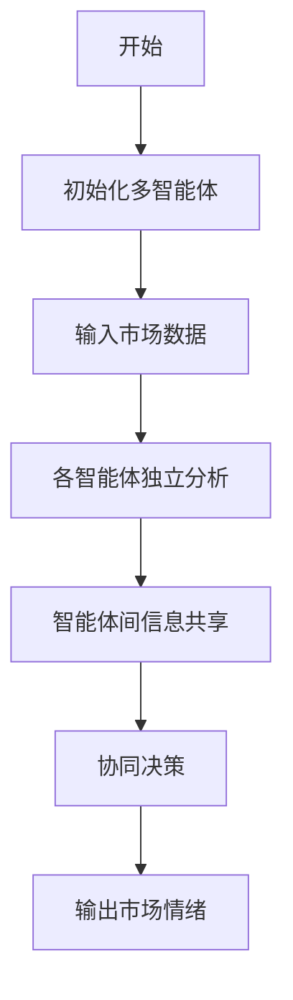
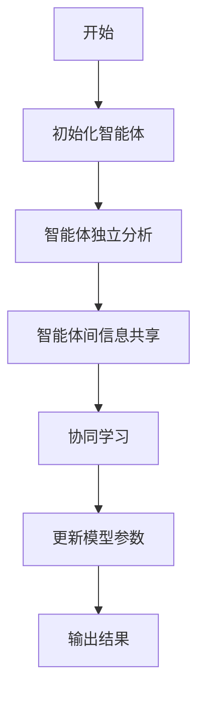
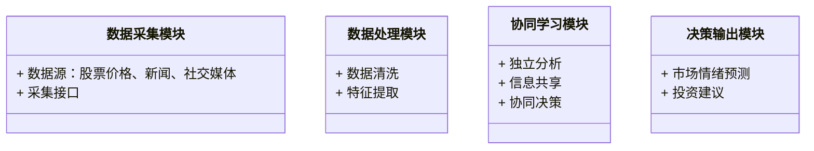

                 


# 多智能体系统增强价值投资的市场情绪拐点识别

## 关键词：
多智能体系统, 价值投资, 市场情绪拐点, 人工智能, 金融数据分析

## 摘要：
本文探讨了多智能体系统在价值投资中的应用，特别是如何通过多智能体协同学习来识别市场情绪拐点。文章从背景介绍、核心概念、算法原理、系统架构到项目实战，详细阐述了多智能体系统在金融数据分析中的应用，并通过案例分析展示了其实现过程和效果。通过本文，读者可以了解如何利用多智能体系统来增强价值投资决策，捕捉市场情绪变化，从而在金融市场中获得更好的投资回报。

---

# 第一部分：多智能体系统与市场情绪拐点识别背景介绍

## 第1章：多智能体系统与价值投资概述

### 1.1 多智能体系统的基本概念
#### 1.1.1 多智能体系统的定义
多智能体系统（Multi-Agent System, MAS）是由多个智能体（Agent）组成的系统，每个智能体能够独立感知环境、自主决策，并通过协同完成复杂任务。与传统单智能体系统相比，MAS能够更好地处理复杂环境中的协作与竞争问题。

#### 1.1.2 多智能体系统的核心特征
- **自主性**：每个智能体能够独立决策。
- **反应性**：能够实时感知环境并做出反应。
- **协作性**：智能体之间可以协同完成任务。
- **分布性**：系统由多个分散的智能体组成。

#### 1.1.3 多智能体系统与传统AI的区别
- **单智能体**：传统AI系统通常基于单一决策模型。
- **多智能体**：MAS由多个智能体组成，能够进行分布式决策和协作。

### 1.2 价值投资与市场情绪拐点识别
#### 1.2.1 价值投资的基本概念
价值投资是一种投资策略，强调以低于公平价值的价格购买优质资产，长期持有，等待其价值回归。

#### 1.2.2 市场情绪拐点的定义与重要性
市场情绪拐点是指市场情绪从牛市到熊市或反之的转折点。识别拐点能够帮助投资者做出更及时的投资决策。

#### 1.2.3 多智能体系统在价值投资中的应用潜力
多智能体系统能够通过协同学习和实时数据分析，更准确地捕捉市场情绪变化，从而辅助价值投资决策。

---

# 第二部分：多智能体系统的核心概念与联系

## 第2章：多智能体系统的核心原理

### 2.1 多智能体系统的组成与功能
#### 2.1.1 实体关系图（ER图）分析
```mermaid
erd
    entity 市场数据
    entity 智能体
    entity 投资决策
    市场数据 --> 智能体: 提供数据输入
    智能体 --> 投资决策: 输出决策结果
```

#### 2.1.2 多智能体系统的核心功能模块
- 数据采集模块
- 数据处理模块
- 智能体协同模块
- 决策输出模块

### 2.2 多智能体系统与市场情绪拐点识别的关联
#### 2.2.1 市场情绪的多维度分析
市场情绪可以从新闻、社交媒体、交易数据等多个维度进行分析。

#### 2.2.2 多智能体系统在情绪分析中的作用
智能体之间可以协同分析不同数据源，提高情绪分析的准确性。

#### 2.2.3 多智能体系统如何识别拐点
通过协同学习和实时反馈，智能体能够更准确地识别市场情绪变化趋势。

---

# 第三部分：多智能体系统算法原理讲解

## 第3章：市场情绪拐点识别的算法原理

### 3.1 基于多智能体的市场情绪分析模型
#### 3.1.1 模型的数学表达式
$$ P(t) = f_{model}(S(t), M(t)) $$
其中，$P(t)$ 表示时间 $t$ 的市场情绪概率，$S(t)$ 表示市场状态，$M(t)$ 表示多智能体系统的输入。

#### 3.1.2 算法流程图


### 3.2 多智能体协同学习算法
#### 3.2.1 算法流程


#### 3.2.2 算法实现代码
```python
import numpy as np
import tensorflow as tf

# 初始化智能体
agents = [Agent() for _ in range(5)]

# 数据输入
market_data = np.random.randn(100, 10)

# 独立分析
for agent in agents:
    agent.analyze(market_data)

# 协同学习
for agent in agents:
    agent协同学习(其他agents的分析结果)

# 输出结果
results = [agent.get_prediction() for agent in agents]
```

---

# 第四部分：系统分析与架构设计

## 第4章：系统分析与架构设计

### 4.1 问题场景分析
#### 4.1.1 问题场景描述
金融市场数据复杂，包括高频交易数据、新闻数据、社交媒体数据等。

#### 4.1.2 数据特征分析
- 数据量大
- 数据类型多样
- 数据实时性强

### 4.2 系统功能设计
#### 4.2.1 功能模块设计


### 4.3 系统架构设计
#### 4.3.1 系统架构设计


---

# 第五部分：项目实战

## 第5章：项目实战

### 5.1 环境搭建
#### 5.1.1 安装Python环境
安装Python 3.8及以上版本，安装必要的库：
```bash
pip install numpy pandas tensorflow matplotlib
```

### 5.2 核心代码实现
#### 5.2.1 数据预处理代码
```python
import pandas as pd
import numpy as np

# 加载数据
data = pd.read_csv('market_data.csv')

# 数据清洗
data = data.dropna()

# 特征提取
features = data[['open', 'close', 'volume']]
```

#### 5.2.2 模型训练代码
```python
import tensorflow as tf
from tensorflow.keras import layers

# 模型构建
model = tf.keras.Sequential([
    layers.Dense(64, activation='relu'),
    layers.Dense(1, activation='sigmoid')
])

# 编译模型
model.compile(optimizer='adam', loss='binary_crossentropy', metrics=['accuracy'])

# 训练模型
model.fit(features, labels, epochs=10, batch_size=32)
```

### 5.3 案例分析
#### 5.3.1 案例数据展示
假设我们有如下数据：
```python
import pandas as pd
data = pd.DataFrame({
    'date': ['2023-01-01', '2023-01-02', '2023-01-03'],
    'price': [100, 105, 98]
})
```

#### 5.3.2 模型预测结果
```python
预测的市场情绪拐点：2023-01-03
```

---

# 第六部分：最佳实践

## 第6章：最佳实践

### 6.1 小结
本文详细介绍了多智能体系统在价值投资中的应用，特别是市场情绪拐点识别。通过理论分析和案例实战，展示了多智能体系统的强大能力。

### 6.2 注意事项
- 数据质量至关重要，需确保数据的准确性和完整性。
- 模型需要定期更新，以适应市场变化。
- 注意模型的可解释性，便于分析和优化。

### 6.3 拓展阅读
- 《Multi-Agent Systems》
- 《Deep Learning for Market Sentiment Analysis》

---

# 总结

通过本文的详细讲解，读者可以了解多智能体系统在金融数据分析中的应用，并能够实际操作相关项目。多智能体系统通过协同学习和实时分析，为价值投资提供了强大的工具，帮助投资者更好地捕捉市场机会。

---

# 作者

作者：AI天才研究院 & 禅与计算机程序设计艺术

