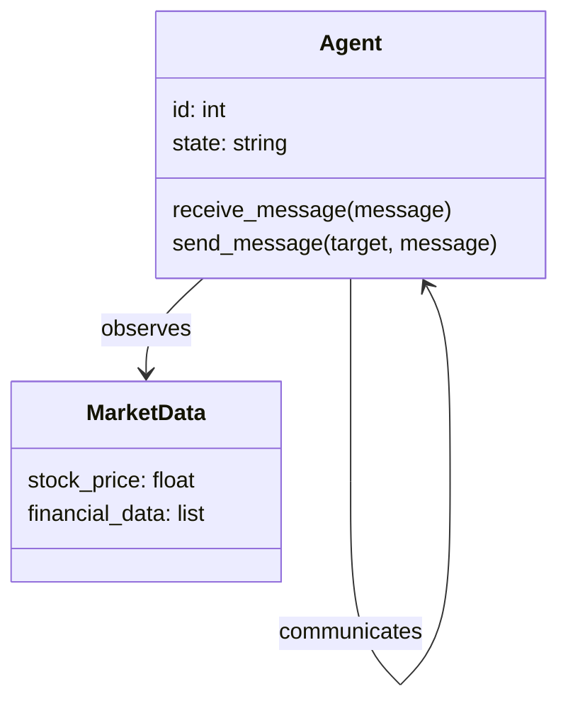

                 


# 多智能体系统增强价值投资的行业生命周期分析

> 关键词：多智能体系统、价值投资、行业生命周期、算法原理、数学模型、系统架构、项目实战

> 摘要：本文探讨了多智能体系统如何增强价值投资，并结合行业生命周期分析，从背景介绍、核心概念、算法原理、数学模型、系统架构到项目实战，逐步分析其在价值投资中的应用。文章深入浅出，结合理论与实践，提供详细的实现步骤和案例分析，帮助读者理解多智能体系统在金融领域的潜力。

---

## 第一部分: 多智能体系统与价值投资的背景介绍

### 第1章: 多智能体系统概述

#### 1.1 多智能体系统的定义与特点
##### 1.1.1 多智能体系统的定义
多智能体系统（Multi-Agent System, MAS）是由多个智能体组成的系统，这些智能体能够自主决策、协作和通信。与单智能体系统相比，MAS能够处理更复杂的任务，通过协作提高整体性能。

##### 1.1.2 多智能体系统的核心特点
- **自主性**：每个智能体能够独立决策。
- **协作性**：智能体之间通过通信和协作完成共同目标。
- **分布式性**：任务分布在多个智能体中，避免单点故障。
- **反应性**：智能体能够实时感知环境并做出反应。

##### 1.1.3 多智能体系统与传统单智能体系统的区别
| 特性 | 单智能体系统 | 多智能体系统 |
|------|--------------|--------------|
| 决策中心化 | 是          | 否          |
| 协作性 | 低          | 高          |
| 灵活性 | 低          | 高          |

#### 1.2 价值投资的基本概念
##### 1.2.1 价值投资的定义
价值投资是一种投资策略，旨在通过分析企业的基本面，寻找被市场低估的投资标的。

##### 1.2.2 价值投资的核心原则
- **安全边际**：买入价格低于内在价值。
- **长期视角**：关注企业的长期盈利能力。
- **分散投资**：降低风险。

##### 1.2.3 价值投资在金融领域的应用
价值投资广泛应用于股票、基金等金融资产的投资中，尤其适合长期投资者。

---

### 第2章: 行业生命周期分析

#### 2.1 行业生命周期的定义
行业生命周期分为四个阶段：导入期、成长期、成熟期和衰退期。每个阶段的特点不同，对投资策略的影响也不同。

#### 2.2 多智能体系统在行业生命周期中的作用
多智能体系统能够通过数据分析和预测，帮助投资者更好地理解行业生命周期，优化投资策略。

---

## 第二部分: 多智能体系统与价值投资的核心概念与联系

### 第3章: 多智能体系统与价值投资的核心概念

#### 3.1 多智能体系统的原理
##### 3.1.1 多智能体系统的协同机制
智能体之间通过通信和协作完成任务，例如任务分配、信息共享。

##### 3.1.2 多智能体系统的通信与协作
使用消息传递、分布式计算等技术实现协作。

#### 3.2 价值投资的数学模型
##### 3.2.1 价值评估的基本公式
$$ V = \frac{E}{P} $$
其中，\( V \) 是内在价值，\( E \) 是企业盈利，\( P \) 是市盈率。

##### 3.2.2 价值投资中的关键指标
- 市盈率（P/E）
- 市净率（P/B）
- 净利润增长率

### 第4章: 多智能体系统与价值投资的关系

#### 4.1 多智能体系统在价值投资中的应用
##### 4.1.1 多智能体系统如何辅助价值评估
通过分析大量数据，识别潜在的投资机会。

##### 4.1.2 多智能体系统在风险控制中的作用
实时监控市场变化，优化投资组合。

#### 4.2 多智能体系统与行业生命周期的结合
##### 4.2.1 多智能体系统如何分析行业生命周期
通过数据挖掘和预测模型，判断行业所处阶段。

##### 4.2.2 多智能体系统在不同行业阶段的价值投资策略
- **导入期**：寻找高增长潜力的企业。
- **成长期**：投资快速扩张的企业。
- **成熟期**：选择稳定收益的企业。
- **衰退期**：规避风险。

---

## 第三部分: 多智能体系统与价值投资的算法原理

### 第5章: 多智能体系统的算法实现

#### 5.1 多智能体协同算法
##### 5.1.1 协同算法的步骤
1. 信息收集与处理。
2. 任务分配与协作。
3. 决策与执行。
4. 反馈与优化。

##### 5.1.2 协同算法的实现代码
```python
class Agent:
    def __init__(self, id):
        self.id = id
        self.state = 'idle'
    
    def receive_message(self, message):
        self.state = 'busy'
        # 处理消息
        pass

    def send_message(self, target, message):
        # 发送消息
        pass
```

#### 5.2 价值评估算法
##### 5.2.1 价值评估算法的步骤
1. 数据收集。
2. 模型训练。
3. 评估与优化。

##### 5.2.2 价值评估算法的代码实现
```python
def calculate_intrinsic_value(financial_data):
    # 计算内在价值
    return sum(financial_data) / len(financial_data)
```

---

## 第四部分: 数学模型与公式推导

### 第6章: 数学模型与公式

#### 6.1 多智能体系统的协同模型
$$ C = \sum_{i=1}^{n} c_i $$
其中，\( C \) 是协同成本，\( c_i \) 是第 \( i \) 个智能体的协同成本。

#### 6.2 价值投资的数学模型
$$ V = \frac{E}{P} $$
其中，\( V \) 是内在价值，\( E \) 是企业盈利，\( P \) 是市盈率。

---

## 第五部分: 系统分析与架构设计

### 第7章: 系统分析与架构设计

#### 7.1 问题场景介绍
分析行业生命周期，辅助价值投资决策。

#### 7.2 系统功能设计
##### 7.2.1 领域模型（Mermaid 类图）


#### 7.3 系统架构设计
##### 7.3.1 系统架构图（Mermaid 架构图）


---

## 第六部分: 项目实战

### 第8章: 项目实战

#### 8.1 环境安装
- 安装Python和必要的库（如NumPy、Pandas、Matplotlib）。

#### 8.2 系统核心实现源代码
##### 8.2.1 多智能体系统的实现
```python
class Agent:
    def __init__(self, id):
        self.id = id
        self.state = 'idle'

    def receive_message(self, message):
        self.state = 'busy'
        # 处理消息
        print(f"Agent {self.id} received message: {message}")

    def send_message(self, target, message):
        # 发送消息
        print(f"Agent {self.id} sent message to {target}: {message}")
```

##### 8.2.2 价值评估系统的实现
```python
def calculate_intrinsic_value(financial_data):
    # 计算内在价值
    return sum(financial_data) / len(financial_data)
```

#### 8.3 案例分析与详细讲解
分析某行业的数据，使用多智能体系统进行价值评估，得出投资建议。

---

## 第七部分: 最佳实践与总结

### 第9章: 最佳实践

#### 9.1 小结
多智能体系统在价值投资中的应用潜力巨大，能够显著提高投资效率和准确性。

#### 9.2 注意事项
- 数据质量影响结果。
- 算法选择需结合具体场景。
- 系统维护和更新不可忽视。

#### 9.3 拓展阅读
推荐相关书籍和论文，进一步深入学习。

---

# 作者：AI天才研究院/AI Genius Institute & 禅与计算机程序设计艺术 /Zen And The Art of Computer Programming

---

**注**：以上内容为《多智能体系统增强价值投资的行业生命周期分析》的详细目录和部分章节内容示例。完整文章将按照上述结构，详细展开每个部分的内容，结合理论与实践，提供丰富的案例分析和代码实现，帮助读者深入理解多智能体系统在价值投资中的应用。

