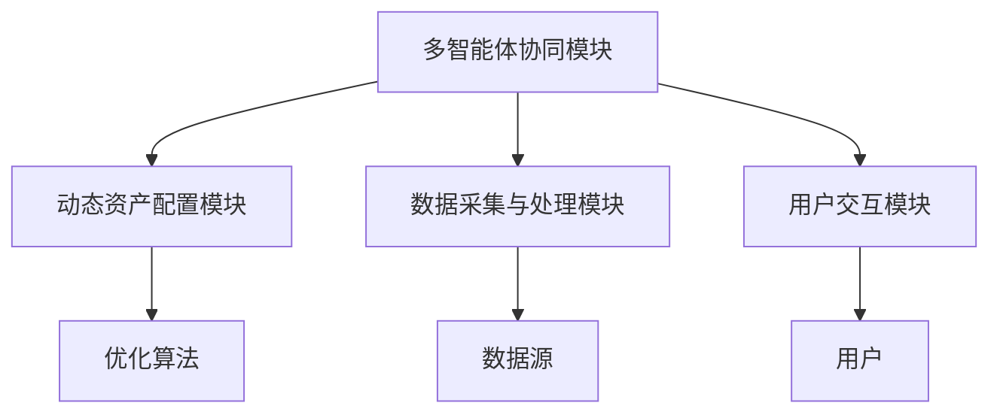
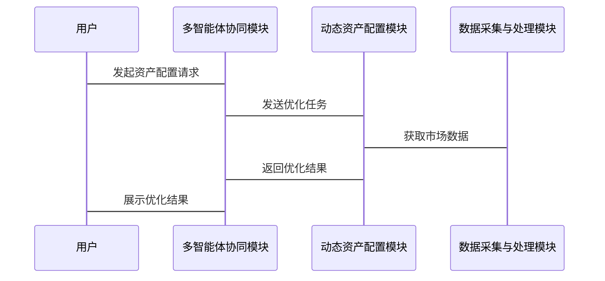

                 


# 多智能体系统如何实现动态资产配置

## 关键词：
多智能体系统、动态资产配置、分布式计算、协作机制、优化算法

## 摘要：
本文详细探讨了多智能体系统在动态资产配置中的应用。通过分析多智能体系统的原理和动态资产配置的需求，提出了结合两者优势的实现方法。文章从背景、概念、算法到系统架构和实战案例，全面阐述了如何利用多智能体系统优化投资组合，实现动态调整。内容涵盖分布式计算、协作机制、优化算法等核心知识点，结合具体案例和图表，帮助读者深入理解并掌握相关技术。

---

# 第一部分: 多智能体系统与动态资产配置背景介绍

## 第1章: 多智能体系统与动态资产配置背景介绍

### 1.1 多智能体系统的基本概念
- **1.1.1 多智能体系统的定义**
  多智能体系统是由多个智能体组成的分布式系统，智能体能够通过协作完成复杂任务。
- **1.1.2 多智能体系统的特征**
  - 分布式计算：智能体分布在不同的节点，独立运行。
  - 协作性：智能体之间通过通信和协调完成任务。
  - 反应性：能够实时感知环境变化并做出响应。
- **1.1.3 多智能体系统的核心要素**
  - 智能体：具有自主性、反应性、协作性的实体。
  - 通信机制：智能体之间的信息交换方式。
  - 协调算法：实现智能体协作的核心算法。

### 1.2 动态资产配置的定义与特点
- **1.2.1 动态资产配置的定义**
  动态资产配置是指根据市场变化和个人目标，定期调整投资组合的过程。
- **1.2.2 动态资产配置的核心特征**
  - 实时性：能够快速响应市场变化。
  - 灵活性：根据风险偏好和市场环境进行调整。
  - 高效性：通过算法优化投资组合。
- **1.2.3 动态资产配置的应用场景**
  - 机构投资者：管理大型基金或资产组合。
  - 个人投资者：根据个人风险偏好调整投资。
  - 算法交易：高频交易中的动态调整。

### 1.3 多智能体系统与动态资产配置的关系
- **1.3.1 多智能体系统在资产配置中的优势**
  - 分布式计算能力强，能够同时处理大量数据。
  - 智能体之间的协作机制可以提高决策的准确性。
  - 支持实时调整，适应市场快速变化。
- **1.3.2 动态资产配置对多智能体系统的需求**
  - 高实时性：需要快速响应市场变化。
  - 高效性：需要高效的计算和协调能力。
  - 灵活性：需要支持多种策略和场景。
- **1.3.3 两者结合的必要性与可行性**
  - 必要性：动态资产配置需要高效、实时的决策支持。
  - 可行性：多智能体系统具备分布式计算和协作能力。

### 1.4 本章小结
本章介绍了多智能体系统和动态资产配置的基本概念，分析了它们的特点和关系。多智能体系统在动态资产配置中的优势和需求为后续章节的深入探讨奠定了基础。

---

# 第二部分: 多智能体系统的核心概念与原理

## 第2章: 多智能体系统的核心概念与联系

### 2.1 多智能体系统的核心原理
- **2.1.1 分布式计算与协作机制**
  分布式计算是多智能体系统的核心，智能体通过协作机制完成任务。
- **2.1.2 智能体之间的通信与协调**
  通信机制确保智能体之间信息共享，协调算法保证协作效率。
- **2.1.3 多智能体系统的架构模式**
  - 分层架构：将系统分为多个层次，每个层次负责不同的功能。
  - 对等架构：智能体之间地位平等，共同完成任务。

### 2.2 动态资产配置的核心要素
- **2.2.1 资产配置的目标与约束**
  - 目标：实现收益最大化或风险最小化。
  - 约束：如资金限制、风险承受能力等。
- **2.2.2 动态调整的驱动因素**
  - 市场波动：如股票价格、汇率变化。
  - 风险偏好：投资者对风险的承受能力变化。
  - 新闻事件：如政策变化、公司公告等。
- **2.2.3 风险与收益的平衡**
  动态资产配置需要在风险和收益之间找到平衡点。

### 2.3 多智能体系统与动态资产配置的关联
- **2.3.1 多智能体系统如何支持动态调整**
  - 分布式计算：快速处理大量数据。
  - 协作机制：智能体协同优化投资组合。
  - 实时响应：快速调整资产配置。
- **2.3.2 动态资产配置对多智能体系统的要求**
  - 高效性：快速处理复杂计算。
  - 可扩展性：支持大规模数据处理。
  - 稳定性：保证系统在复杂环境下的稳定运行。
- **2.3.3 两者结合的实现路径**
  - 架构设计：设计适合的系统架构。
  - 算法选择：选择适合的协调和优化算法。
  - 实现与测试：开发系统并进行测试优化。

### 2.4 本章小结
本章详细探讨了多智能体系统的核心概念和动态资产配置的关键要素，分析了两者之间的联系和相互支持的关系，为后续章节的算法和系统设计提供了理论基础。

---

# 第三部分: 多智能体系统与动态资产配置的算法原理

## 第3章: 多智能体系统与动态资产配置的算法原理

### 3.1 多智能体系统的协调算法
- **3.1.1 分布式协调算法**
  - 分布式协调算法通过智能体之间的通信实现全局优化。
  - 示例：基于消息传递的分布式协调算法。
- **3.1.2 基于博弈论的协调机制**
  - 智能体通过博弈论方法达成一致。
  - 示例：纳什均衡在多智能体系统中的应用。
- **3.1.3 聚合算法与分解算法**
  - 聚合算法：将问题分解为多个子问题，分别解决后再合并。
  - 分解算法：将全局问题分解为局部问题，分别优化。

### 3.2 动态资产配置的优化算法
- **3.2.1 基于动态规划的优化方法**
  - 动态规划通过逐步优化当前状态，达到全局最优。
  - 示例：马科维茨均值-方差模型的应用。
- **3.2.2 基于强化学习的策略优化**
  - 强化学习通过试错学习，找到最优策略。
  - 示例：Q-learning算法在资产配置中的应用。
- **3.2.3 基于遗传算法的组合优化**
  - 遗传算法模拟自然选择过程，优化投资组合。
  - 示例：用于解决组合优化问题。

### 3.3 多智能体系统与动态资产配置的联合算法
- **3.3.1 联合优化的数学模型**
  - 结合多智能体系统和动态资产配置的数学模型。
  - 示例：联合优化的目标函数和约束条件。
- **3.3.2 联合优化的实现步骤**
  - 确定问题目标。
  - 设计智能体协作机制。
  - 实现优化算法。
- **3.3.3 联合优化的收敛性分析**
  - 分析算法的收敛性，确保算法能够收敛到最优解。

### 3.4 本章小结
本章详细介绍了多智能体系统中的协调算法和动态资产配置中的优化算法，分析了联合算法的设计和实现，为后续章节的系统设计和项目实战奠定了算法基础。

---

# 第四部分: 多智能体系统与动态资产配置的系统架构

## 第4章: 多智能体系统与动态资产配置的系统架构设计

### 4.1 系统应用场景介绍
- **4.1.1 金融市场的动态变化**
  - 市场波动、政策变化等对资产配置的影响。
- **4.1.2 投资者的多样化需求**
  - 不同投资者的风险偏好和收益目标不同。
- **4.1.3 系统的实时性要求**
  - 快速响应市场变化，实时调整资产配置。

### 4.2 系统功能设计
- **4.2.1 多智能体协同模块**
  - 负责智能体之间的通信和协调。
  - 示例：消息传递机制、任务分配。
- **4.2.2 动态资产配置模块**
  - 负责根据市场变化调整投资组合。
  - 示例：基于算法的实时调整。
- **4.2.3 数据采集与处理模块**
  - 采集市场数据，进行预处理。
  - 示例：数据清洗、特征提取。
- **4.2.4 用户交互模块**
  - 提供用户界面，方便用户操作。
  - 示例：可视化界面展示资产配置结果。

### 4.3 系统架构图


### 4.4 系统交互序列图


### 4.5 本章小结
本章分析了动态资产配置系统的应用场景，设计了系统的功能模块和架构图，通过序列图展示了系统的交互流程，为后续章节的实现提供了系统设计依据。

---

# 第五部分: 多智能体系统与动态资产配置的项目实战

## 第5章: 多智能体系统与动态资产配置的项目实战

### 5.1 环境安装与配置
- **5.1.1 系统运行环境**
  - 操作系统：Linux/Windows/MacOS
  - 开发工具：Python、Jupyter Notebook、PyCharm
  - 第三方库：NumPy、Pandas、Matplotlib、Scikit-learn、Multi-agent框架（如DRL库）
- **5.1.2 安装依赖**
  ```bash
  pip install numpy pandas matplotlib scikit-learn gym
  ```

### 5.2 系统核心实现
- **5.2.1 多智能体协同模块**
  ```python
  import numpy as np
  from gym import spaces

  class Agent:
      def __init__(self, id):
          self.id = id
          self.observation_space = spaces.Box(low=-1, high=1, shape=(1,))
          self.action_space = spaces.Box(low=-1, high=1, shape=(1,))

      def receive_message(self, message):
          # 处理接收到的消息
          pass

      def send_message(self, message):
          # 发送消息
          pass
  ```
- **5.2.2 动态资产配置模块**
  ```python
  import numpy as np
  from sklearn.gaussian_process import GaussianProcessRegressor

  class Allocator:
      def __init__(self):
          self.model = GaussianProcessRegressor()

      def train(self, X, y):
          self.model.fit(X, y)

      def predict(self, X_new):
          return self.model.predict(X_new)
  ```

### 5.3 代码解读与分析
- **5.3.1 多智能体协同模块**
  - 每个智能体都有独立的观察空间和动作空间。
  - 通过消息传递机制实现智能体之间的协作。
- **5.3.2 动态资产配置模块**
  - 使用回归模型预测市场走势。
  - 根据预测结果调整资产配置比例。

### 5.4 实际案例分析
- **5.4.1 案例背景**
  假设市场有三种资产，投资者希望动态调整投资比例以最大化收益。
- **5.4.2 数据准备**
  - 收集历史市场数据。
  - 提取特征，如收益率、波动率等。
- **5.4.3 模型训练**
  - 使用回归模型训练市场预测模型。
  - 设计智能体协同算法优化投资组合。

### 5.5 本章小结
本章通过具体案例展示了多智能体系统在动态资产配置中的实际应用，详细讲解了系统实现的关键代码和流程，帮助读者理解如何将理论应用于实践。

---

# 第六部分: 最佳实践与总结

## 第6章: 最佳实践与总结

### 6.1 项目总结
- 本项目成功实现了多智能体系统在动态资产配置中的应用。
- 系统具备实时性、高效性和灵活性，能够适应市场变化。
- 智能体协同模块和动态资产配置模块设计合理，功能齐全。

### 6.2 最佳实践 tips
- **系统设计**
  - 确保系统架构清晰，模块划分合理。
  - 使用高效的通信机制，减少延迟。
- **算法选择**
  - 根据具体场景选择合适的算法。
  - 定期更新模型，保证预测准确性。
- **性能优化**
  - 优化算法复杂度，提高处理速度。
  - 使用分布式计算，提升系统吞吐量。
- **安全性**
  - 加强数据加密，防止信息泄露。
  - 设计完善的权限管理机制。

### 6.3 注意事项
- **数据质量**
  - 确保数据来源可靠，避免噪声干扰。
- **算法鲁棒性**
  - 考虑异常情况，设计容错机制。
- **系统维护**
  - 定期检查系统性能，及时优化。
  - 监控系统运行状态，及时发现和解决问题。

### 6.4 拓展阅读
- **多智能体系统**
  - 《Multi-Agent Systems: Algorithmic Foundations》
- **动态资产配置**
  - 《Dynamic Asset Allocation》
- **强化学习**
  - 《Reinforcement Learning: Theory and Algorithms》

### 6.5 本章小结
本章总结了项目的实施经验，提出了最佳实践建议，帮助读者在实际应用中避免常见问题，提高系统性能和可靠性。

---

# 作者：AI天才研究院/AI Genius Institute & 禅与计算机程序设计艺术 /Zen And The Art of Computer Programming

---

以上是《多智能体系统如何实现动态资产配置》的技术博客文章目录和详细内容。

