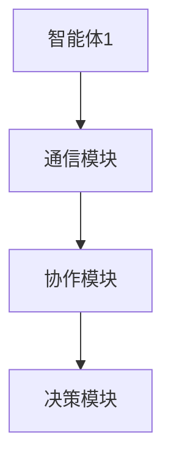

                 


# 多智能体系统如何实现智能化公司比较分析

> 关键词：多智能体系统, 智能化公司, 通信机制, 协作机制, 决策机制, 学习机制, 系统架构

> 摘要：本文深入探讨了多智能体系统（MAS）在企业智能化中的应用，分析了其核心概念、算法原理、系统架构以及实际案例。通过详细讲解多智能体系统的通信、协作、决策和学习机制，结合项目实战和最佳实践，帮助读者理解如何利用MAS实现企业的智能化转型。

---

# 第一部分: 多智能体系统概述

## 第1章: 多智能体系统的基本概念

### 1.1 多智能体系统的定义与特点

#### 1.1.1 多智能体系统的定义
多智能体系统（Multi-Agent System, MAS）由多个智能体（Agent）组成，这些智能体通过交互协作完成复杂任务。智能体是能够感知环境、自主决策、主动行动的实体。

#### 1.1.2 多智能体系统的核心特点
- **自主性**：智能体能够自主决策。
- **反应性**：能够实时感知环境变化并做出反应。
- **协作性**：多个智能体协同工作，完成复杂任务。
- **分布性**：智能体分布在不同位置，独立运行。

#### 1.1.3 多智能体系统与单智能体系统的区别
| 特性           | 单智能体系统                | 多智能体系统                |
|----------------|-----------------------------|-----------------------------|
| 系统结构       | 单个智能体                  | 多个智能体                  |
| 决策方式       | 中央决策                    | 分布式决策                  |
| 任务处理       | 单一任务                    | 多任务协作                  |

### 1.2 多智能体系统的组成与结构

#### 1.2.1 智能体的定义与分类
- **定义**：智能体是能够感知环境、自主决策、执行任务的实体。
- **分类**：可分类为简单反射型、基于模型的反射型、目标驱动型和效用驱动型智能体。

#### 1.2.2 多智能体系统的组成结构
- **智能体**：系统的核心单元。
- **通信层**：负责智能体之间的信息传递。
- **协作层**：实现智能体之间的协作与协调。

#### 1.2.3 智能体之间的通信机制
- **通信协议**：定义智能体间信息传递的规则和格式。
- **通信方式**：可采用同步或异步通信，基于消息传递或服务调用。

### 1.3 多智能体系统的发展历程

#### 1.3.1 多智能体系统的起源
20世纪80年代，分布式人工智能（DAI）领域的研究推动了MAS的发展。

#### 1.3.2 多智能体系统的演进与现状
随着人工智能和分布式计算技术的进步，MAS在各个领域得到广泛应用。

#### 1.3.3 多智能体系统的未来趋势
 MAS将更加智能化、自适应，支持更复杂的协作任务。

---

## 第2章: 多智能体系统在企业智能化中的应用背景

### 2.1 企业智能化的定义与目标

#### 2.1.1 企业智能化的定义
企业智能化是通过技术手段，使企业运营更加高效、灵活和智能。

#### 2.1.2 企业智能化的核心目标
- 提高企业决策效率。
- 优化企业资源配置。
- 提升企业竞争力。

#### 2.1.3 企业智能化与数字化转型的关系
企业智能化是数字化转型的高级阶段，依赖于数据、技术和智能系统的整合。

### 2.2 多智能体系统在企业智能化中的作用

#### 2.2.1 多智能体系统在企业决策中的作用
通过分布式决策和协作，提高决策的准确性和效率。

#### 2.2.2 多智能体系统在企业协作中的作用
实现部门间高效协作，优化企业运营流程。

#### 2.2.3 多智能体系统在企业创新中的作用
支持创新思维和灵活应对市场变化。

### 2.3 企业智能化的挑战与机遇

#### 2.3.1 企业智能化面临的挑战
- 数据孤岛问题。
- 系统集成复杂性。
- 安全与隐私风险。

#### 2.3.2 多智能体系统带来的机遇
- 提高企业运营效率。
- 促进跨部门协作。
- 支持智能化创新。

#### 2.3.3 未来企业智能化的发展方向
- 智能化决策支持。
- 自动化业务流程。
- 智慧型组织架构。

---

## 第3章: 多智能体系统的通信与协作机制

### 3.1 智能体之间的通信机制

#### 3.1.1 通信协议的定义与分类
- **定义**：定义智能体间信息传递的规则。
- **分类**：可分同步和异步通信，基于消息传递或服务调用。

#### 3.1.2 通信协议的设计原则
- **简洁性**：协议设计应简单明了。
- **可靠性**：确保信息准确传递。
- **安全性**：防止信息泄露和篡改。

#### 3.1.3 常见的通信协议实现方式
- **HTTP/HTTPS**：适用于Web服务间通信。
- **WebSocket**：适用于实时通信。
- **消息队列（如Kafka、RabbitMQ）**：适用于异步通信。

### 3.2 多智能体系统的协作机制

#### 3.2.1 协作机制的定义与分类
- **定义**：智能体间协作的方式和规则。
- **分类**：可分基于规则、基于任务和基于角色的协作机制。

#### 3.2.2 基于角色的协作机制
- **角色分配**：根据任务分配智能体角色。
- **责任划分**：明确各角色的职责。

#### 3.2.3 基于任务的协作机制
- **任务分解**：将整体任务分解为子任务。
- **任务分配**：根据智能体的能力分配任务。

### 3.3 多智能体系统的协调算法

#### 3.3.1 分布式协调算法
- **定义**：在分布式系统中协调智能体的算法。
- **实现方式**：可采用一致性算法（如Paxos、Raft）。

#### 3.3.2 基于规则的协调算法
- **规则定义**：设定协作规则。
- **规则执行**：智能体根据规则进行协作。

#### 3.3.3 基于博弈论的协调算法
- **博弈模型**：建立智能体间的博弈模型。
- **纳什均衡**：找到最优策略。

---

## 第4章: 多智能体系统的决策与学习机制

### 4.1 智能体的决策机制

#### 4.1.1 基于规则的决策机制
- **规则定义**：设定决策规则。
- **规则执行**：根据输入情况匹配规则，输出决策。

#### 4.1.2 基于逻辑推理的决策机制
- **逻辑推理**：通过逻辑推理得出结论。
- **推理引擎**：使用推理引擎进行推理。

#### 4.1.3 基于机器学习的决策机制
- **机器学习模型**：训练模型进行决策。
- **监督学习**：使用标记数据训练模型。

### 4.2 多智能体系统的学习机制

#### 4.2.1 基于强化学习的学习机制
- **强化学习**：通过奖励机制优化策略。
- **策略网络**：学习策略以最大化累积奖励。

#### 4.2.2 基于监督学习的学习机制
- **监督学习**：使用标记数据训练模型。
- **训练数据**：提供输入和期望输出，训练模型。

#### 4.2.3 基于模仿学习的学习机制
- **模仿学习**：通过模仿专家行为进行学习。
- **行为复制**：复制专家行为以实现类似决策。

---

## 第5章: 多智能体系统的算法原理

### 5.1 多智能体系统的算法实现

#### 5.1.1 分布式计算与一致性算法
- **一致性算法**：确保分布式系统中数据一致性。
- **Paxos算法**：用于达成共识。
- **Raft算法**：用于选举领导人。

#### 5.1.2 协作算法与任务分配
- **任务分配算法**：根据智能体能力分配任务。
- **负载均衡**：确保任务均匀分配。

#### 5.1.3 通信协议实现
- **通信协议**：定义智能体间信息传递规则。
- **协议实现**：通过代码实现协议逻辑。

---

## 第6章: 多智能体系统的数学模型与公式

### 6.1 多智能体系统的数学模型

#### 6.1.1 协作模型
- **协作模型**：定义智能体间的协作关系。
- **数学表达**：使用公式描述协作过程。

#### 6.1.2 决策模型
- **决策模型**：定义决策过程。
- **数学表达**：使用公式描述决策逻辑。

### 6.2 多智能体系统的公式推导

#### 6.2.1 协作过程公式
$$ P(i) = \sum_{j=1}^{n} w_{ij} x_j $$
其中，$P(i)$ 表示智能体i的决策概率，$w_{ij}$ 是权重，$x_j$ 是输入特征。

#### 6.2.2 决策过程公式
$$ D = \argmax_{i} P(i) $$
其中，$D$ 表示最终决策，$P(i)$ 是智能体i的决策概率。

---

## 第7章: 多智能体系统的系统分析与架构设计

### 7.1 系统分析

#### 7.1.1 项目场景介绍
- **项目目标**：实现多智能体系统的智能化公司比较分析。
- **项目范围**：涵盖通信、协作、决策等多个方面。

#### 7.1.2 系统功能设计
- **功能模块**：通信模块、协作模块、决策模块。
- **功能流程**：智能体接收任务，通过通信模块传递信息，协作模块分配任务，决策模块做出决策。

### 7.2 系统架构设计

#### 7.2.1 系统架构图


#### 7.2.2 系统接口设计
- **通信接口**：定义智能体间通信的接口。
- **协作接口**：定义协作模块的接口。
- **决策接口**：定义决策模块的接口。

---

## 第8章: 多智能体系统的项目实战

### 8.1 环境安装

#### 8.1.1 开发环境
- **编程语言**：Python、Java。
- **开发工具**：PyCharm、IntelliJ IDEA。
- **框架支持**：使用Django或Spring框架。

#### 8.1.2 依赖安装
- **Python依赖**：`pip install requests、pymqtt、flask`。
- **Java依赖**：`mvn clean install`。

### 8.2 核心代码实现

#### 8.2.1 通信模块实现
```python
import requests

def send_message(url, message):
    try:
        response = requests.post(url, json=message)
        return response.status_code
    except Exception as e:
        print(f"Error sending message: {e}")
        return 500
```

#### 8.2.2 协作模块实现
```python
from flask import Flask, request, jsonify

app = Flask(__name__)

@app.route('/assign_task', methods=['POST'])
def assign_task():
    data = request.json
    # 分配任务逻辑
    return jsonify({'status': 'success', 'message': 'Task assigned successfully'})

if __name__ == '__main__':
    app.run(debug=True)
```

### 8.3 代码解读与分析

#### 8.3.1 通信模块解读
- **功能**：实现智能体间的通信。
- **实现方式**：使用requests库发送HTTP请求。

#### 8.3.2 协作模块解读
- **功能**：分配任务给智能体。
- **实现方式**：使用Flask框架创建Web服务。

### 8.4 案例分析与实现

#### 8.4.1 案例分析
- **案例背景**：某公司需要优化供应链管理。
- **实现步骤**：
  1. 需求分析：识别供应链中的问题。
  2. 系统设计：设计多智能体系统架构。
  3. 代码实现：开发通信、协作和决策模块。
  4. 测试与优化：测试系统性能并优化。

### 8.5 项目小结

#### 8.5.1 项目总结
- **项目成果**：实现了多智能体系统的智能化公司比较分析。
- **经验总结**：通信和协作模块是系统的核心，需要精心设计。

---

## 第9章: 多智能体系统的最佳实践与未来展望

### 9.1 最佳实践

#### 9.1.1 系统设计小结
- **模块化设计**：确保系统结构清晰。
- **高可用性**：确保系统稳定运行。
- **可扩展性**：确保系统易于扩展。

#### 9.1.2 注意事项
- **安全性**：确保系统安全，防止数据泄露。
- **性能优化**：优化系统性能，提高响应速度。
- **容错能力**：增强系统的容错能力，确保系统健壮性。

### 9.2 未来展望

#### 9.2.1 技术发展趋势
- **智能化增强**：进一步提升智能体的智能水平。
- **分布式计算**：推动分布式计算技术的发展。
- **边缘计算**：结合边缘计算，提升系统实时性。

#### 9.2.2 应用场景扩展
- **智能制造**：在智能制造中应用多智能体系统。
- **智慧城市**：在智慧城市中应用多智能体系统。
- **智能交通**：在智能交通系统中应用多智能体系统。

---

# 结语

多智能体系统作为企业智能化的重要技术手段，正在发挥越来越重要的作用。通过本文的详细分析，读者可以全面了解多智能体系统的核心概念、算法原理、系统架构以及实际应用。未来，随着技术的不断发展，多智能体系统将在更多领域展现出其独特的优势。

---

# 作者：AI天才研究院/AI Genius Institute & 禅与计算机程序设计艺术 /Zen And The Art of Computer Programming

