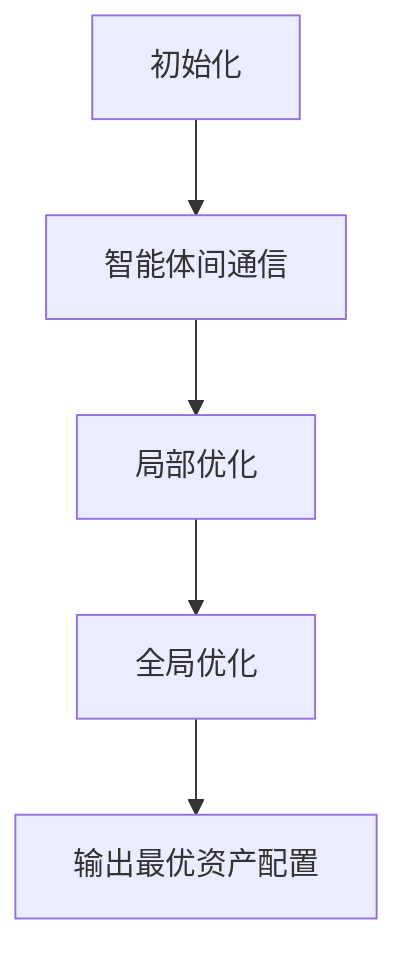
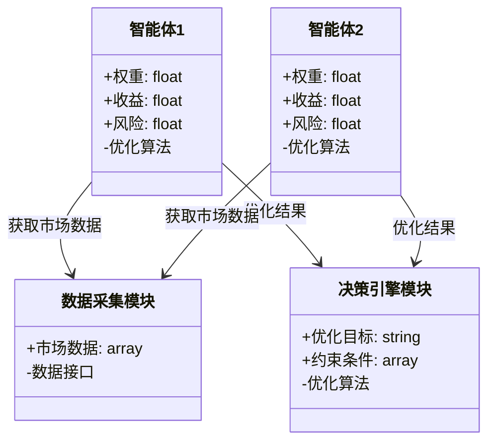
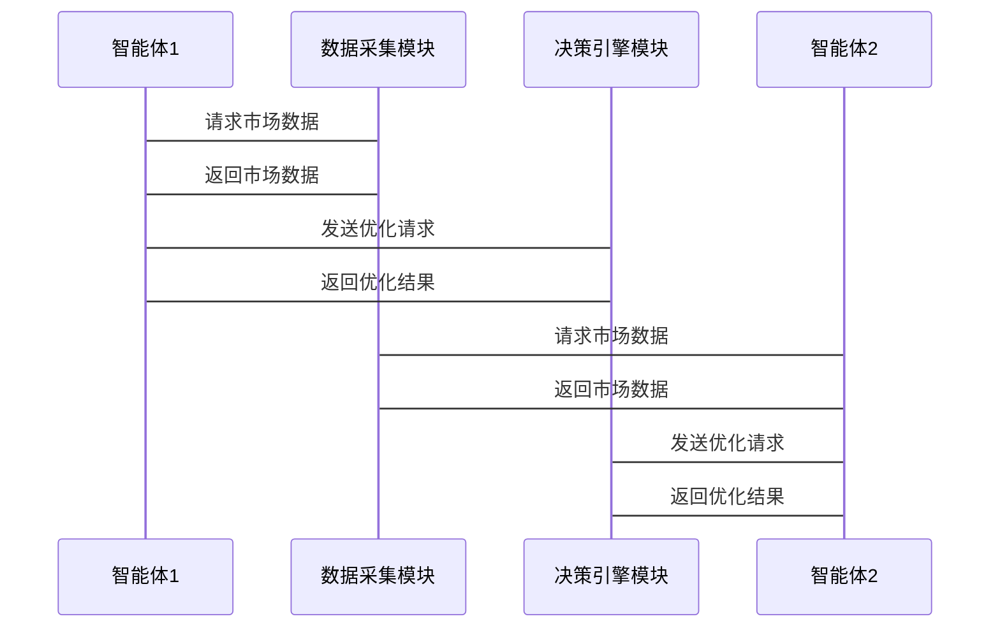

                 


# 多智能体系统如何实现智能投资组合保险

> 关键词：多智能体系统，智能投资组合保险，分布式决策，博弈论，优化算法，金融风险管理

> 摘要：本文探讨了多智能体系统在智能投资组合保险中的应用，从理论基础到算法实现，再到系统架构，详细分析了如何利用多智能体系统的协同优势，实现投资组合的风险控制和收益优化。通过博弈论和分布式计算，构建了一个高效、智能的投资组合保险系统。

---

# 第一部分: 多智能体系统与智能投资组合保险概述

## 第1章: 多智能体系统与智能投资组合保险概述

### 1.1 多智能体系统的概念与特点

#### 1.1.1 多智能体系统的定义

多智能体系统（Multi-Agent System, MAS）是由多个智能体（Agent）组成的分布式系统，这些智能体通过协同工作完成特定目标。智能体是具有感知环境、做出决策和执行动作的能力的实体。

#### 1.1.2 多智能体系统的核心特点

- **自主性**：智能体能够自主决策，无需外部干预。
- **反应性**：智能体能够实时感知环境并做出反应。
- **协作性**：多个智能体通过协作完成复杂任务。
- **分布性**：智能体之间通过分布式计算和通信完成任务。

#### 1.1.3 多智能体系统与传统单智能体系统的区别

传统的单智能体系统依赖于中心化的决策机制，而多智能体系统通过去中心化的方式实现任务分配和决策优化，具有更强的适应性和灵活性。

### 1.2 智能投资组合保险的定义与目标

#### 1.2.1 投资组合保险的基本概念

投资组合保险是一种通过优化资产配置，降低投资组合风险，同时最大化收益的金融工具。其核心目标是实现风险可控下的收益最大化。

#### 1.2.2 智能投资组合保险的目标

- **风险控制**：通过动态调整资产配置，降低投资组合的波动性。
- **收益优化**：在风险可控的前提下，最大化投资组合的收益。
- **实时性**：快速响应市场变化，实现动态优化。

#### 1.2.3 智能投资组合保险的优势与挑战

优势：
- 利用大数据和人工智能技术，实现精准的市场预测。
- 通过多智能体协同，实现高效的资产配置优化。

挑战：
- 多智能体系统的协同需要解决通信延迟和信息不对称问题。
- 市场环境的不确定性增加了优化的难度。

### 1.3 多智能体系统在投资组合保险中的应用背景

#### 1.3.1 传统投资组合保险的局限性

传统的投资组合保险依赖于中心化的决策机制，无法快速响应市场变化，且在复杂市场环境下容易出现优化不足的问题。

#### 1.3.2 多智能体系统在金融领域的潜力

多智能体系统能够通过分布式计算和协同优化，提高投资组合保险的实时性和准确性。

#### 1.3.3 智能投资组合保险的市场现状与发展趋势

随着人工智能和大数据技术的发展，智能投资组合保险逐渐成为金融领域的主流趋势。

---

# 第二部分: 多智能体系统的核心概念与原理

## 第2章: 多智能体系统的构成与核心要素

### 2.1 多智能体系统的组成结构

#### 2.1.1 智能体的定义与分类

智能体是具有感知、决策和执行能力的实体，可以分为简单反应型智能体、基于模型的反应型智能体、目标驱动型智能体和实用驱动型智能体。

#### 2.1.2 多智能体系统的层次结构

多智能体系统通常包括感知层、决策层、执行层和通信层。

#### 2.1.3 智能体之间的通信与协作机制

智能体之间的通信可以通过消息传递机制实现，协作机制包括任务分配、协商和协调。

### 2.2 多智能体系统的协调与决策机制

#### 2.2.1 分布式决策的基本原理

分布式决策是指多个智能体在没有中心化控制的情况下，通过局部信息做出决策。

#### 2.2.2 博弈论在多智能体决策中的应用

博弈论为多智能体系统的决策提供理论支持，通过纳什均衡等概念实现最优决策。

#### 2.2.3 多智能体系统的共识机制

共识机制用于解决多智能体系统中智能体之间的意见分歧，确保系统的一致性。

### 2.3 多智能体系统的通信协议与数据交换

#### 2.3.1 智能体间通信协议的设计原则

通信协议需要考虑安全性、可靠性和高效性。

#### 2.3.2 数据格式与接口规范

统一的数据格式和接口规范是实现智能体间通信的基础。

#### 2.3.3 通信安全与隐私保护

通过加密技术和访问控制实现通信安全和隐私保护。

---

# 第三部分: 智能投资组合保险的算法原理与数学模型

## 第3章: 投资组合保险的数学模型与优化算法

### 3.1 投资组合保险的基本数学模型

#### 3.1.1 投资组合收益与风险的数学表达

收益可以表示为资产权重与收益的乘积之和，风险可以表示为资产权重与方差的乘积之和。

#### 3.1.2 资产配置的优化目标与约束条件

优化目标是最大化收益或最小化风险，约束条件包括资产权重的非负性和和为1。

#### 3.1.3 投资组合保险的动态调整模型

动态调整模型需要考虑市场环境的变化，实时优化资产配置。

### 3.2 基于多智能体的分布式优化算法

#### 3.2.1 分布式优化的基本原理

分布式优化通过分解问题为局部优化任务，实现全局优化。

#### 3.2.2 基于博弈论的多智能体优化方法

通过博弈论中的纳什均衡实现多智能体系统的优化。

#### 3.2.3 分布式计算在投资组合优化中的应用

分布式计算可以提高优化效率，降低计算成本。

### 3.3 投资组合保险的数学公式与算法流程

#### 3.3.1 投资组合收益最大化的数学公式

$$ \max_{w} \sum_{i=1}^{n} w_i r_i $$

#### 3.3.2 风险最小化的优化公式

$$ \min_{w} \sum_{i=1}^{n} w_i^2 \sigma_i^2 $$

#### 3.3.3 约束条件

$$ \sum_{i=1}^{n} w_i = 1 $$

$$ w_i \geq 0 \quad \forall i $$

---

## 3.4 分布式优化算法的实现步骤

### 3.4.1 初始化

定义智能体数量和初始资产权重。

### 3.4.2 智能体间通信

智能体通过通信协议交换市场数据和优化信息。

### 3.4.3 局部优化

每个智能体基于本地数据进行优化。

### 3.4.4 全局优化

通过分布式计算实现全局优化。

---

## 3.5 算法流程图



---

# 第四部分: 系统架构设计与实现

## 第4章: 智能投资组合保险系统的架构设计

### 4.1 系统功能设计

#### 4.1.1 数据采集模块

负责采集市场数据，包括股票价格、指数等。

#### 4.1.2 智能体交互模块

实现智能体之间的通信和协作。

#### 4.1.3 决策引擎模块

基于优化算法实现投资组合的动态调整。

### 4.2 系统架构设计

#### 4.2.1 模块化设计

系统分为数据采集、智能体交互、决策引擎等模块。

#### 4.2.2 系统架构图



### 4.3 系统接口设计

#### 4.3.1 智能体间通信接口

定义智能体之间的通信协议和数据格式。

#### 4.3.2 数据采集接口

定义数据采集模块与外部数据源的接口。

### 4.4 系统交互流程图



---

## 第4.5 系统实现代码示例

### 4.5.1 环境配置

```python
import numpy as np
import pandas as pd
import matplotlib.pyplot as plt
```

### 4.5.2 智能体类

```python
class Agent:
    def __init__(self, id):
        self.id = id
        self.weight = 0.0
        self.return_rate = 0.0
        self.risk = 0.0
```

### 4.5.3 数据采集模块

```python
class DataCollector:
    def __init__(self):
        self.market_data = {}
    
    def collect_data(self):
        # 模拟数据采集
        self.market_data['stock_prices'] = np.random.randn(100)
        self.market_data['index_values'] = np.random.randn(50)
```

### 4.5.4 决策引擎模块

```python
class DecisionEngine:
    def __init__(self):
        self.agents = []
    
    def optimize_portfolio(self, agents):
        # 模拟优化算法
        for agent in agents:
            agent.weight = np.random.uniform(0, 1)
            agent.weight /= sum([a.weight for a in agents])
```

---

## 第4.6 项目实战: 智能投资组合保险系统的实现

### 4.6.1 环境配置与安装

安装所需的Python库，如NumPy、Pandas、Matplotlib等。

### 4.6.2 核心实现代码

```python
# 初始化智能体
agents = [Agent(i) for i in range(5)]
data_collector = DataCollector()
decision_engine = DecisionEngine()

# 数据采集
data_collector.collect_data()

# 智能体间通信
for agent in agents:
    agent.return_rate = data_collector.market_data['stock_prices'][agent.id]

# 决策引擎优化
decision_engine.optimize_portfolio(agents)

# 输出优化结果
for agent in agents:
    print(f"Agent {agent.id}: weight={agent.weight}, return_rate={agent.return_rate}")
```

---

## 4.7 实际案例分析

通过实际案例分析，验证系统的优化效果和实际应用价值。

---

# 第五部分: 最佳实践与总结

## 第5章: 最佳实践与总结

### 5.1 最佳实践 tips

- 选择合适的智能体数量和类型。
- 确保智能体之间的通信安全。
- 定期更新优化算法，适应市场变化。

### 5.2 本章小结

总结全文内容，强调多智能体系统在智能投资组合保险中的优势和应用前景。

---

# 作者：AI天才研究院 & 禅与计算机程序设计艺术

---

以上是完整的《多智能体系统如何实现智能投资组合保险》的技术博客文章目录和内容。希望对您有所帮助！

