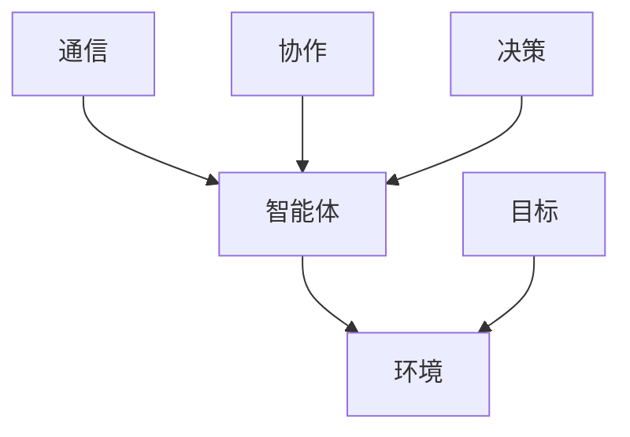
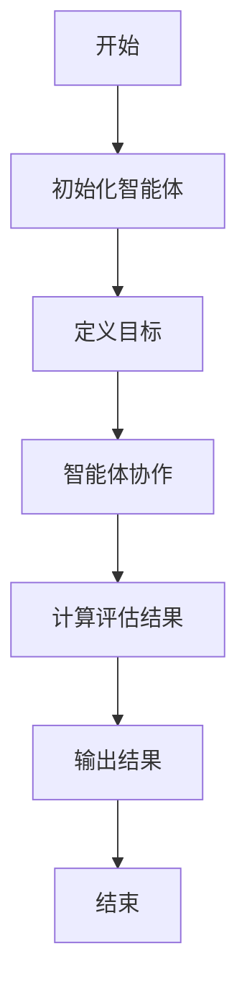
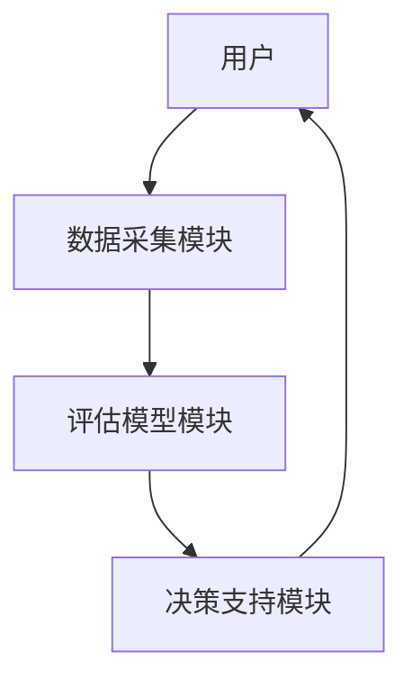
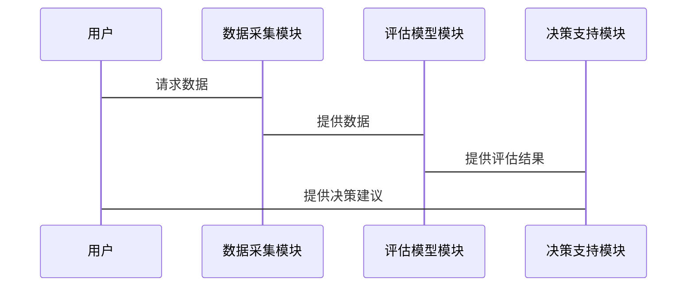

                 


# 多智能体系统如何评估公司的可持续发展能力

## 关键词：多智能体系统，可持续发展能力，企业评估，分布式计算，博弈论

## 摘要：  
多智能体系统（Multi-Agent System，MAS）是一种分布式计算范式，能够通过多个智能体之间的协作和交互来实现复杂的任务。本文探讨了多智能体系统在评估公司可持续发展能力中的应用。首先，我们介绍了多智能体系统的基本概念和其在企业评估中的潜在价值。接着，我们详细分析了多智能体系统的核心概念，包括系统的组成、协作机制以及与可持续发展评估的关联。然后，我们从算法原理、数学模型和系统架构等多个维度，详细阐述了多智能体系统如何支持企业可持续发展能力的评估。最后，我们通过实际案例展示了系统的实现过程，并总结了最佳实践和未来研究方向。

---

# 第1章: 多智能体系统与可持续发展概述

## 1.1 多智能体系统的基本概念  
### 1.1.1 多智能体系统的定义  
多智能体系统（MAS）是由多个智能体组成的分布式系统，每个智能体能够感知环境、自主决策并与其他智能体协作以完成共同目标。  

### 1.1.2 多智能体系统的特征  
- **自主性**：每个智能体能够独立决策。  
- **反应性**：智能体能够根据环境变化调整行为。  
- **协作性**：智能体之间通过通信和协作完成复杂任务。  
- **分布式性**：系统中的智能体分布在网络中，不存在单一的控制中心。  

### 1.1.3 多智能体系统的应用场景  
- **分布式计算**：如云服务、分布式任务调度。  
- **智能交通系统**：车辆、交通信号灯等智能体的协作。  
- **电子商务**：推荐系统、供应链管理中的智能体协作。  

---

## 1.2 可持续发展能力的定义  
### 1.2.1 可持续发展的核心概念  
可持续发展是指在满足当前需求的同时，不损害后代满足其需求的能力。  

### 1.2.2 企业可持续发展能力的评估维度  
- **经济维度**：盈利能力、成本控制、资源利用效率。  
- **社会维度**：社会责任履行、员工福利、社会影响。  
- **环境维度**：碳排放、资源消耗、环境合规性。  

### 1.2.3 可持续发展与企业价值的关系  
企业通过实现可持续发展目标，可以提升品牌形象、降低风险、增强长期竞争力。

---

## 1.3 多智能体系统在可持续发展评估中的作用  
### 1.3.1 多智能体系统的优势  
- **分布式计算能力**：能够处理大规模、复杂的评估任务。  
- **协作性**：智能体之间可以协同完成多维度的评估。  
- **动态适应性**：能够实时响应环境变化。  

### 1.3.2 多智能体系统在企业评估中的应用潜力  
- **实时监控与反馈**：智能体可以实时采集和分析企业数据，提供动态评估结果。  
- **多目标优化**：通过协作智能体实现经济、社会、环境等多目标的平衡优化。  
- **决策支持**：基于智能体的评估结果，为企业提供可持续发展的决策支持。  

### 1.3.3 本章小结  
本章介绍了多智能体系统的基本概念及其在可持续发展评估中的潜在价值，为后续内容奠定了基础。

---

# 第2章: 多智能体系统的核心概念与联系

## 2.1 多智能体系统的组成与结构  
### 2.1.1 实体与行为者  
在多智能体系统中，智能体可以是软件程序、设备或人类行为者。  

### 2.1.2 通信与协作机制  
智能体之间的通信方式包括基于消息的通信和基于共享数据库的通信。  

### 2.1.3 环境与目标设定  
智能体的环境包括物理环境和逻辑环境，目标设定是智能体协作的核心。  

---

## 2.2 可持续发展评估的核心要素  
### 2.2.1 企业绩效指标  
包括盈利能力、市场占有率、员工满意度等。  

### 2.2.2 社会责任与环境影响  
包括碳排放、资源消耗、员工权益保障等。  

### 2.2.3 经济效益与长期发展  
包括投资回报率、资产周转率、技术创新能力等。  

---

## 2.3 多智能体系统与可持续发展评估的关联  
### 2.3.1 系统模块化与评估维度的对应关系  
- 每个智能体负责一个评估维度，如经济、社会、环境。  

### 2.3.2 多智能体系统的动态性与可持续发展的动态评估  
智能体能够实时更新评估结果，适应企业的动态变化。  

### 2.3.3 本章小结  
本章分析了多智能体系统与可持续发展评估的核心关联，强调了系统模块化和动态性的重要性。

---

## 2.4 概念结构与核心要素组成  


---

# 第3章: 多智能体系统评估方法的数学模型

## 3.1 多智能体系统评估的基本原理  
### 3.1.1 多智能体系统的状态表示  
状态表示包括当前状态、目标状态和环境状态。  

### 3.1.2 多智能体系统的决策模型  
决策模型包括感知、推理、规划和执行四个阶段。  

### 3.1.3 多智能体系统的优化目标  
优化目标包括最大化收益、最小化成本、平衡多目标等。  

---

## 3.2 可持续发展评估的数学模型  
### 3.2.1 综合评估指标的构建  
综合评估指标可以表示为：  
$$ S = \alpha E + \beta S + \gamma Env $$  
其中，$E$ 表示经济指标，$S$ 表示社会指标，$Env$ 表示环境指标，$\alpha, \beta, \gamma$ 为权重系数。  

### 3.2.2 多目标优化模型  
多目标优化模型可以表示为：  
$$ \min f_1(x), f_2(x), \dots, f_n(x) $$  
其中，$x$ 是决策变量，$f_i(x)$ 是目标函数。  

### 3.2.3 模糊综合评价方法  
模糊综合评价方法可以表示为：  
$$ V = \sum_{i=1}^n w_i \cdot v_i $$  
其中，$w_i$ 是权重，$v_i$ 是评价值。  

---

## 3.3 算法原理与流程图  


---

## 3.4 算法实现  
```python
class Agent:
    def __init__(self, id):
        self.id = id
        self.state = None
        self.goal = None

    def perceive(self, environment):
        self.state = environment.get_state()

    def decide(self):
        pass

    def act(self):
        pass
```

---

# 第4章: 多智能体系统评估算法的实现

## 4.1 算法原理与流程  
### 4.1.1 分布式计算算法  
分布式计算算法包括分布式任务分配、分布式优化等。  

### 4.1.2 博弈论与利益协调  
博弈论用于解决智能体之间的利益冲突，确保协作的最优性。  

### 4.1.3 动态评估与反馈算法  
动态评估算法能够实时更新评估结果，反馈机制用于调整智能体行为。  

---

## 4.2 算法的数学模型  
### 4.2.1 博弈论模型  
纳什均衡模型：  
$$ x^* \text{ 是纳什均衡，当对于所有 } i, x_i \text{ 是最佳反应} $$  

### 4.2.2 分布式优化模型  
分布式优化模型可以表示为：  
$$ \min_{x_i} f_i(x_i, x_{-i}) $$  

---

## 4.3 算法的实现  
```python
def distributed_algorithm(agents):
    for agent in agents:
        agent.perceive(environment)
        agent.decide()
        agent.act()
    return evaluate(environment)
```

---

# 第5章: 系统分析与架构设计

## 5.1 项目背景介绍  
本项目旨在通过多智能体系统评估企业的可持续发展能力，为企业提供动态、全面的评估结果。  

## 5.2 系统功能设计  
### 5.2.1 数据采集模块  
负责采集企业的经济、社会、环境数据。  

### 5.2.2 评估模型模块  
基于多智能体系统的算法，构建评估模型。  

### 5.2.3 决策支持模块  
提供基于评估结果的决策支持。  

---

## 5.3 系统架构设计  


---

## 5.4 系统接口设计  
### 5.4.1 数据接口  
数据接口用于与企业数据库对接，获取实时数据。  

### 5.4.2 用户接口  
用户可以通过Web界面查看评估结果和决策建议。  

---

## 5.5 系统交互流程  


---

# 第6章: 项目实战

## 6.1 环境安装与配置  
### 6.1.1 安装Python和相关库  
安装Python和numpy、pandas、matplotlib等库。  

### 6.1.2 安装多智能体系统框架  
安装如Mason、Repast等多智能体模拟框架。  

---

## 6.2 系统核心实现  
```python
import numpy as np
import pandas as pd

class Agent:
    def __init__(self, id, environment):
        self.id = id
        self.environment = environment
        self.data = None

    def perceive(self):
        self.data = self.environment.get_data()

    def decide(self):
        pass

    def act(self):
        pass

class Environment:
    def __init__(self, data):
        self.data = data

    def get_data(self):
        return self.data
```

---

## 6.3 代码应用解读与分析  
### 6.3.1 代码功能  
上述代码定义了一个智能体类和环境类，智能体可以感知环境并做出决策。  

### 6.3.2 代码实现  
具体实现可以根据企业的具体需求进行扩展。  

---

## 6.4 实际案例分析  
以某制造企业为例，通过多智能体系统评估其经济、社会、环境表现，提供可持续发展能力的评估结果。  

---

## 6.5 项目小结  
本项目通过多智能体系统的实现，展示了其在企业可持续发展能力评估中的应用价值。

---

# 第7章: 最佳实践与未来展望

## 7.1 本章小结  
多智能体系统通过分布式计算和协作机制，能够高效、全面地评估企业的可持续发展能力。  

## 7.2 最佳实践 tips  
- **数据质量**：确保数据的准确性和实时性。  
- **系统设计**：合理设计智能体的协作机制和通信方式。  
- **模型优化**：根据实际需求调整评估模型的参数和权重。  

## 7.3 注意事项  
- **隐私保护**：注意企业的数据隐私问题。  
- **系统维护**：定期更新和维护系统，确保其稳定运行。  

## 7.4 拓展阅读  
- 推荐阅读相关领域的学术论文和行业报告。  

---

# 作者：AI天才研究院 & 禅与计算机程序设计艺术

---

通过以上内容，我们详细阐述了多智能体系统如何评估公司的可持续发展能力，从理论到实践，从算法到系统设计，为读者提供了全面的视角和深入的分析。希望本文能够为相关领域的研究和实践提供有价值的参考。

