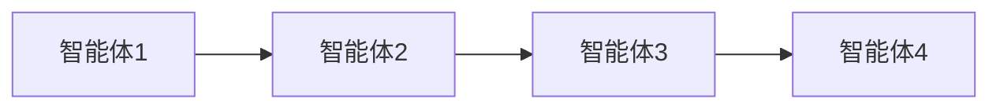
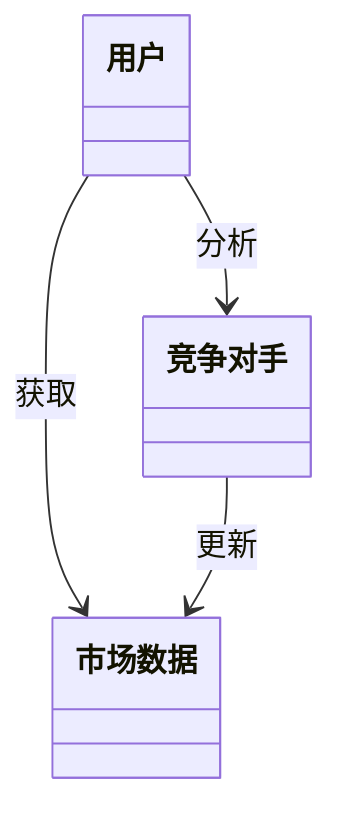
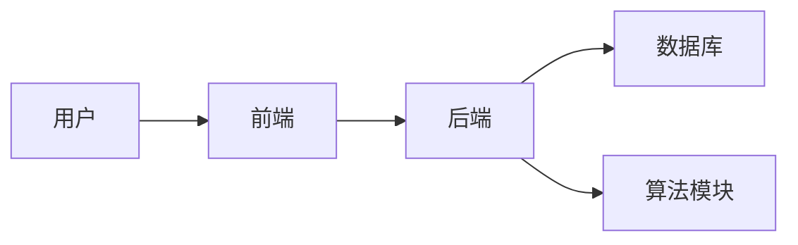
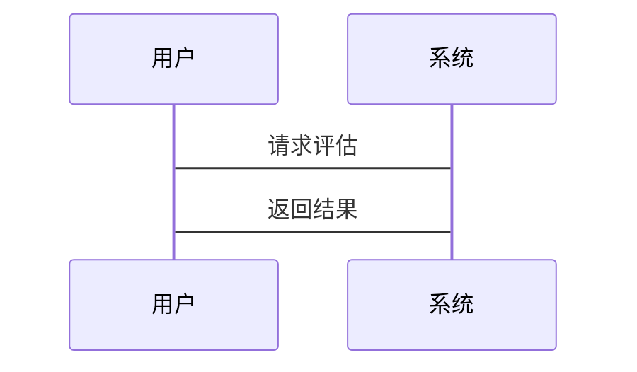

                 


# 多智能体系统如何评估公司的护城河

## 关键词：多智能体系统, 护城河评估, 协同过滤, 博弈论, 系统架构

## 摘要：  
本文探讨了如何利用多智能体系统（MAS）来评估公司的护城河。通过分析多智能体系统的原理、算法和架构，结合实际案例，展示了如何运用协同过滤、博弈论模型和系统设计来评估公司的竞争优势。文章从背景介绍到数学模型，再到系统实现，详细阐述了多智能体系统在护城河评估中的应用，为读者提供了一套完整的解决方案。

---

## 第一章：多智能体系统与护城河评估的背景

### 1.1 多智能体系统的概念与特点  
多智能体系统（Multi-Agent System, MAS）由多个智能体组成，每个智能体能够独立决策并协同工作。其特点包括：  
1. **独立性**：每个智能体都有自己的目标和决策机制。  
2. **协作性**：智能体之间通过通信和协作完成复杂任务。  
3. **反应性**：能够感知环境并实时调整行为。  
4. **分布性**：计算资源分布在多个智能体中，避免单点故障。  

### 1.2 护城河的定义与分类  
护城河是公司在市场中的独特优势，通常分为以下几类：  
1. **技术壁垒**：如专利技术、难以复制的核心算法。  
2. **市场占有率**：强大的品牌影响力和客户基础。  
3. **资源壁垒**：如Exclusive资源、数据优势。  

### 1.3 多智能体系统在护城河评估中的作用  
多智能体系统能够处理复杂性和多维度分析，帮助公司识别和评估其竞争优势。例如，通过协同过滤算法，可以分析竞争对手的市场策略，并制定针对性的应对措施。

---

## 第二章：多智能体系统的核心概念与联系

### 2.1 多智能体系统的原理  
多智能体系统的核心原理包括：  
- **智能体通信**：通过消息传递机制进行协作。  
- **协作与竞争**：智能体之间可以协同完成任务，也可以竞争资源。  

**Mermaid图：多智能体系统通信流程**  


### 2.2 护城河评估的核心要素  
护城河评估的核心要素包括：  
1. **技术优势**：如专利数量、研发能力。  
2. **市场地位**：市场份额、品牌影响力。  
3. **资源壁垒**：如数据、人才储备。  

**对比表格：护城河与非护城河企业的对比**  
| 属性      | 护城河企业        | 非护城河企业      |  
|-----------|------------------|------------------|  
| 技术优势  | 显著              | 缺乏或较低        |  
| 市场地位   | 高               | 低               |  
| 资源壁垒  | 强               | 弱               |  

### 2.3 多智能体系统与护城河评估的关系  
多智能体系统能够通过协同过滤和博弈论模型，量化公司的竞争优势，并动态调整评估策略。

---

## 第三章：多智能体系统的算法原理

### 3.1 协同过滤算法  
协同过滤是一种基于用户行为的推荐算法，常用于分析市场策略。  

**基于用户的协同过滤**：  
- 找出与目标用户行为相似的用户群体。  
- 根据这些用户的偏好，推荐目标用户可能感兴趣的产品。  

**基于物品的协同过滤**：  
- 找出与目标产品相似的产品。  
- 根据目标用户的购买记录，推荐相似产品。  

**Python代码示例：协同过滤实现**  
```python
from sklearn.metrics.pairwise import cosine_similarity

# 用户-物品评分矩阵
rating_matrix = ...  # 输入矩阵
similarity = cosine_similarity(rating_matrix)

# 推荐目标用户可能喜欢的物品
def recommend_user(user_id, similarity_matrix, rating_matrix):
    similar_users = similarity_matrix[user_id]
    recommended_items = []
    for i in range(len(similar_users)):
        if similar_users[i] > 0.5:
            recommended_items.append(i)
    return recommended_items
```

### 3.2 博弈论模型  
博弈论模型常用于分析市场中的竞争关系。  

**纳什均衡**：  
在纳什均衡状态下，每个参与者都无法通过单方面改变策略而获得更好的结果。  

**数学公式：收益函数**  
$$ \text{收益}(i) = \sum_{j} p_j \cdot x_{ij} $$  
其中，$p_j$ 是玩家 $j$ 的策略概率，$x_{ij}$ 是玩家 $i$ 的收益。  

**Python代码示例：纳什均衡计算**  
```python
import numpy as np

def nash_equilibrium(payoff_matrix):
    n = len(payoff_matrix)
    for i in range(n):
        for j in range(n):
            if payoff_matrix[i][j] > max(payoff_matrix[k][j] for k in range(n)):
                return (i, j)
    return None
```

### 3.3 聚类分析与分类算法  
聚类分析用于将市场中的竞争对手分为不同的类别，便于评估护城河。  

**K-means算法**：  
用于将数据点聚类成K个簇。  

**数学公式：K-means目标函数**  
$$ \text{目标函数} = \sum_{i=1}^{K} \sum_{x \in C_i} (x - \mu_i)^2 $$  
其中，$C_i$ 是第 $i$ 个簇，$\mu_i$ 是簇的中心点。  

---

## 第四章：护城河评估的数学模型与公式

### 4.1 收益函数与成本函数  
**收益函数**：  
$$ R = \sum_{i=1}^{n} p_i \cdot q_i $$  
其中，$p_i$ 是价格，$q_i$ 是销量。  

**成本函数**：  
$$ C = \sum_{i=1}^{m} c_i \cdot x_i $$  
其中，$c_i$ 是单位成本，$x_i$ 是生产量。  

### 4.2 纳什均衡与市场稳定  
纳什均衡是市场稳定状态的标志，当所有玩家的策略不再改变时，市场达到均衡。  

### 4.3 协同过滤的数学模型  
协同过滤通过计算用户之间的相似性，推荐相关产品。  

**数学公式：协同过滤相似性计算**  
$$ \text{相似性}(u, v) = \frac{\sum_{i=1}^{n} (r_{u,i} - \bar{r}_u)(r_{v,i} - \bar{r}_v)}{\sqrt{\sum_{i=1}^{n} (r_{u,i} - \bar{r}_u)^2} \cdot \sqrt{\sum_{i=1}^{n} (r_{v,i} - \bar{r}_v)^2}} $$  
其中，$\bar{r}_u$ 和 $\bar{r}_v$ 分别是用户 $u$ 和 $v$ 的平均评分。

---

## 第五章：系统分析与架构设计

### 5.1 问题场景与项目介绍  
以评估电商公司的护城河为例，分析其市场地位和技术优势。  

### 5.2 系统功能设计  
- **领域模型**：展示系统各模块之间的关系。  
- **架构设计**：使用分层架构，包括前端、后端和数据库。  

**Mermaid图：领域模型**  


### 5.3 系统架构设计  
- **前端**：展示分析结果。  
- **后端**：处理数据和算法计算。  
- **数据库**：存储市场数据和评估结果。  

**Mermaid图：系统架构图**  


### 5.4 接口设计与交互流程  
- **接口设计**：RESTful API，如`/api/ratings`。  
- **交互流程**：用户提交请求，系统返回评估结果。  

**Mermaid图：交互流程**  


---

## 第六章：项目实战

### 6.1 环境安装  
- 安装Python、TensorFlow、Scikit-learn等工具。  

### 6.2 核心代码实现  
- 实现协同过滤和博弈论模型。  

**Python代码示例：协同过滤实现**  
```python
from sklearn.cluster import KMeans

# 假设rating_matrix是用户-物品评分矩阵
kmeans = KMeans(n_clusters=3).fit(rating_matrix)
clusters = kmeans.labels_
```

### 6.3 案例分析  
以电商公司为例，分析其护城河，展示如何应用多智能体系统进行评估。  

### 6.4 项目小结  
总结项目的实现过程，分析优缺点，并提出改进建议。

---

## 第七章：最佳实践与总结

### 7.1 总结  
多智能体系统通过协同过滤和博弈论模型，能够有效评估公司的护城河，为战略决策提供支持。

### 7.2 小结  
文章从背景、算法、系统架构到实际案例，详细阐述了多智能体系统在护城河评估中的应用。

### 7.3 注意事项  
- 数据隐私和安全问题需重视。  
- 算法选择需根据具体场景调整。  

### 7.4 拓展阅读  
推荐阅读《多智能体系统》、《博弈论与经济行为》等书籍。

---

## 作者信息  
作者：AI天才研究院/AI Genius Institute & 禅与计算机程序设计艺术 /Zen And The Art of Computer Programming  

---

通过以上步骤，文章详细探讨了多智能体系统如何评估公司的护城河，结合理论与实践，为读者提供了深入的分析和实用的解决方案。

