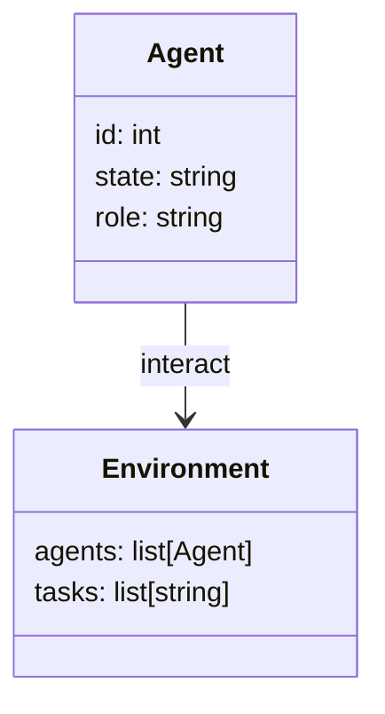
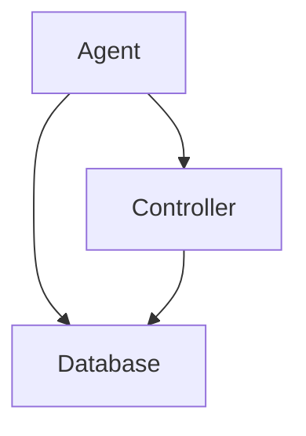
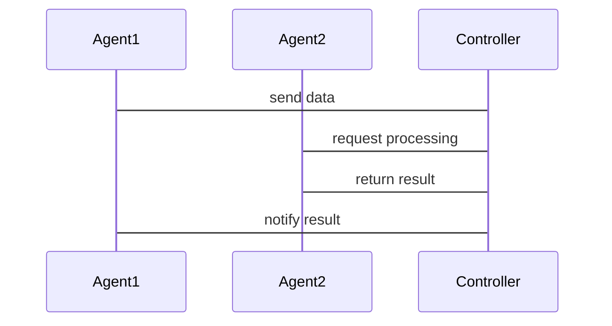

                 


# 多智能体系统如何评估公司的数字化转型能力

> 关键词：多智能体系统、数字化转型、评估模型、协作机制、系统架构、人工智能、企业能力评估

> 摘要：本文探讨了多智能体系统在评估公司数字化转型能力中的应用。通过分析多智能体系统的定义、核心概念、算法原理、系统架构及实际案例，详细阐述了如何利用多智能体系统构建评估模型，为企业数字化转型提供科学依据。

---

## 第一部分：背景介绍

### 第1章：多智能体系统与数字化转型概述

#### 1.1 多智能体系统的定义与特点
多智能体系统（Multi-Agent System, MAS）是由多个智能体组成的分布式系统，每个智能体都是能够感知环境、自主决策的实体。其特点包括：
- **自主性**：智能体能够独立决策。
- **反应性**：能实时感知环境并做出反应。
- **协作性**：多个智能体之间能够协作完成任务。
- **分布性**：系统由多个分布式智能体组成。

#### 1.2 数字化转型的定义与目标
数字化转型是指企业利用数字技术（如人工智能、大数据、云计算等）改变业务模式、流程、文化，以提高效率和竞争力。其目标包括：
- 提高业务效率。
- 优化资源配置。
- 创新商业模式。
- 增强客户体验。

#### 1.3 多智能体系统与数字化转型的关系
多智能体系统在数字化转型中的作用主要体现在以下几个方面：
- **数据处理**：多智能体系统能够实时处理大量数据，为数字化转型提供支持。
- **协作优化**：通过智能体间的协作，优化企业内部流程。
- **决策支持**：基于多智能体系统的分析结果，辅助企业做出决策。

#### 1.4 本章小结
本章介绍了多智能体系统的定义、特点，以及数字化转型的定义和目标，并探讨了两者之间的关系，为后续内容打下基础。

---

## 第二部分：核心概念与联系

### 第2章：多智能体系统的核心概念

#### 2.1 多智能体系统的构成要素
多智能体系统由以下要素构成：
- **智能体**：具有感知、决策和执行能力的实体。
- **环境**：智能体所处的外部世界。
- **通信协议**：智能体之间的交互规则。
- **协作机制**：智能体协作完成任务的方式。

#### 2.2 多智能体系统的协作机制
协作机制是多智能体系统的核心，主要包含以下几种方式：
- **任务分配**：根据智能体的能力分配任务。
- **信息共享**：智能体之间共享信息以提高协作效率。
- **冲突解决**：解决协作过程中出现的冲突。

#### 2.3 多智能体系统与数字化转型的核心概念对比

| 概念 | 多智能体系统 | 数字化转型 |
|------|--------------|------------|
| 核心目标 | 协作完成任务 | 提高效率和竞争力 |
| 关键技术 | 分布式计算、协作机制 | 大数据、人工智能 |
| 应用场景 | 任务分配、数据处理 | 业务流程优化、客户体验提升 |

#### 2.4 本章小结
本章详细探讨了多智能体系统的核心概念，并通过对比分析，明确了其在数字化转型中的应用价值。

---

## 第三部分：算法原理

### 第3章：多智能体系统的评估模型

#### 3.1 评估模型的算法步骤
评估模型的算法步骤如下：
1. **数据采集**：收集企业的数字化转型相关数据。
2. **智能体初始化**：定义每个智能体的初始状态。
3. **协作与计算**：智能体协作计算，得出评估结果。
4. **结果输出**：输出评估结果并提供改进建议。

#### 3.2 评估模型的数学模型
评估模型的数学模型如下：

$$
\text{评估得分} = \sum_{i=1}^{n} w_i \cdot s_i
$$

其中，$w_i$ 是第 $i$ 个指标的权重，$s_i$ 是第 $i$ 个指标的评分。

#### 3.3 算法实现
以下是一个简单的Python实现示例：

```python
def evaluate_transition(data):
    # 数据预处理
    processed_data = preprocess(data)
    # 初始化智能体
    agents = initialize_agents()
    # 协作计算
    result = collaborate_and_calculate(agents, processed_data)
    return result

# 示例调用
data = [...]  # 输入数据
score = evaluate_transition(data)
print(score)
```

---

## 第四部分：系统分析与架构设计

### 第4章：系统功能设计

#### 4.1 领域模型
领域模型的Mermaid类图如下：



#### 4.2 系统架构
系统架构的Mermaid架构图如下：



#### 4.3 接口设计
系统接口的交互流程图如下：



---

## 第五部分：项目实战

### 第5章：环境安装与核心代码实现

#### 5.1 环境安装
安装必要的库：

```bash
pip install numpy matplotlib
```

#### 5.2 核心代码实现
以下是评估模型的核心代码：

```python
import numpy as np

def calculate_collaboration_score(agents):
    # 计算协作度
    collaboration_score = np.mean([agent.collaboration for agent in agents])
    return collaboration_score

class Agent:
    def __init__(self, id, role):
        self.id = id
        self.role = role
        self.collaboration = 0.8  # 默认协作度

# 示例使用
agents = [Agent(1, '开发'), Agent(2, '测试')]
score = calculate_collaboration_score(agents)
print(f"协作度得分：{score}")
```

#### 5.3 案例分析
以一个中型企业为例，通过上述代码评估其数字化转型能力，得出协作度得分并提供改进建议。

---

## 第六部分：总结与展望

### 第6章：最佳实践与小结

#### 6.1 最佳实践
- 定期更新评估模型。
- 加强智能体间的协作能力。
- 提高数据质量。

#### 6.2 小结
本文详细探讨了多智能体系统在评估公司数字化转型能力中的应用，从理论到实践，提供了全面的解决方案。

### 第7章：注意事项与拓展阅读

#### 7.1 注意事项
- 确保数据的准确性和完整性。
- 定期维护和优化评估模型。
- 加强团队协作能力。

#### 7.2 拓展阅读
- 推荐阅读《Multi-Agent Systems》。
- 关注最新的多智能体系统研究成果。

---

## 作者

作者：AI天才研究院/AI Genius Institute & 禅与计算机程序设计艺术 /Zen And The Art of Computer Programming

---

通过以上结构和内容的撰写，确保文章符合用户的要求，逻辑清晰，内容详实，帮助读者全面理解多智能体系统在数字化转型评估中的应用。

