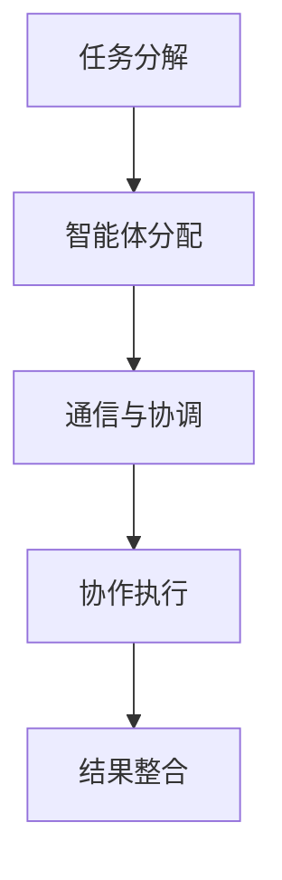
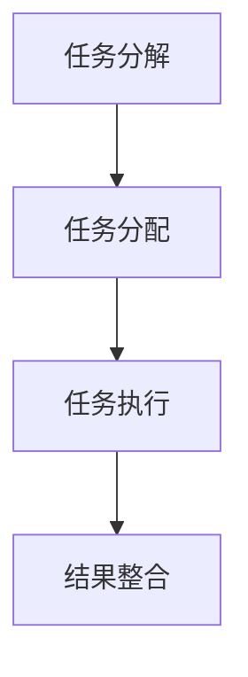
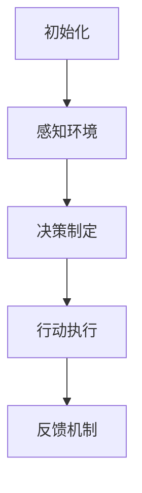
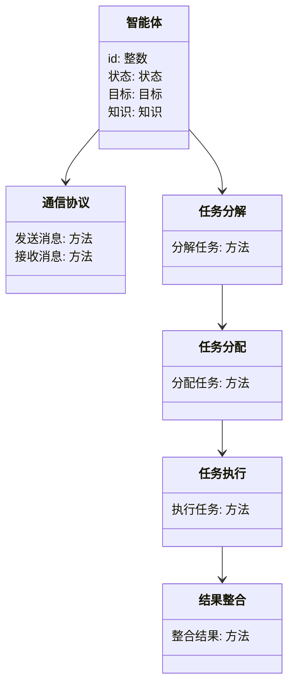
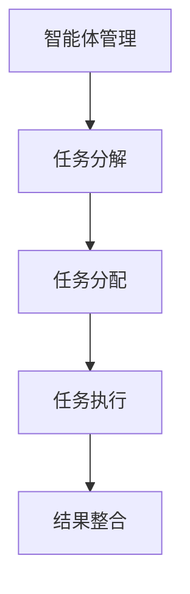
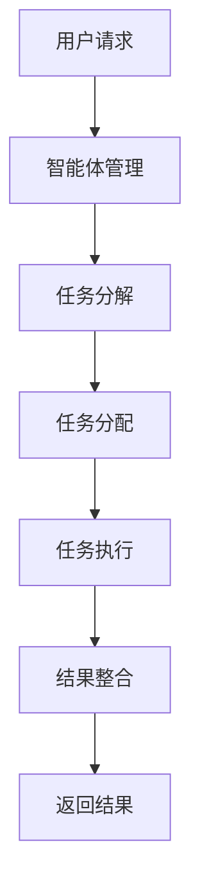

                 


# 多智能体系统如何评估公司的长期增长潜力

## 关键词：多智能体系统，公司增长潜力，人工智能，分布式计算，企业战略，协作机制

## 摘要：  
本文探讨了多智能体系统（MAS）在评估公司长期增长潜力中的应用。通过分析智能体的协作机制、算法原理和系统架构，本文为技术专家和企业管理者提供了深入的理论和实践指导，展示了如何利用MAS技术提升企业战略决策的科学性和准确性。

---

# 第1章: 多智能体系统概述

## 1.1 多智能体系统的基本概念

### 1.1.1 多智能体系统的定义
多智能体系统（Multi-Agent System，MAS）是由多个智能体组成的分布式系统，这些智能体能够通过协作完成复杂的任务。每个智能体都有自己的目标、知识和行为规则，能够感知环境并做出决策。

### 1.1.2 多智能体系统的特征
- **分布式性**：智能体分布在不同的位置，独立决策并协作。
- **自主性**：智能体能够自主决策，无需外部干预。
- **反应性**：智能体能够实时感知环境并做出反应。
- **协作性**：智能体之间通过通信和协作完成共同目标。

### 1.1.3 多智能体系统与传统单智能体系统的区别
| 特性         | 单智能体系统               | 多智能体系统               |
|--------------|----------------------------|----------------------------|
| 决策中心化    | 单个中心节点决策           | 分散式决策，多个智能体协作 |
| 信息处理     | 信息集中处理               | 信息分布处理               |
| 系统复杂度    | 系统相对简单               | 系统复杂度高               |
| 应用场景      | 适用于简单任务             | 适用于复杂任务             |

### 1.1.4 多智能体系统的分类
- **基于任务的MAS**：智能体协作完成特定任务。
- **基于目标的MAS**：智能体通过协作实现共同目标。
- **基于市场的MAS**：智能体通过市场机制进行资源分配。

## 1.2 多智能体系统在企业中的应用背景

### 1.2.1 企业增长潜力评估的挑战
- **复杂性**：企业受多种内外部因素影响，如市场、竞争、技术等。
- **不确定性**：未来市场变化难以预测。
- **动态性**：企业环境不断变化，需要实时调整策略。

### 1.2.2 多智能体系统在企业增长中的优势
- **分布式决策**：多个智能体分别负责不同领域，提高决策效率。
- **协作能力**：智能体协作优化整体表现。
- **适应性**：系统能够快速响应环境变化。

### 1.2.3 多智能体系统与公司长期增长潜力的关系
MAS通过模拟市场动态、预测趋势和优化资源配置，帮助公司制定更科学的增长策略。智能体协作能够捕捉市场机会，降低风险，提升整体增长潜力。

## 1.3 本章小结

- **多智能体系统的核心概念**：MAS由多个智能体组成，具备分布式、自主和协作的特点。
- **MAS在企业中的应用价值**：通过MAS可以更高效地评估和优化公司增长潜力。

---

# 第2章: 多智能体系统的核心概念

## 2.1 智能体的定义与属性

### 2.1.1 智能体的定义
智能体（Agent）是具有感知和行动能力的实体，能够自主决策并完成任务。

### 2.1.2 智能体的属性特征对比表

| 属性         | 具体描述                     |
|--------------|------------------------------|
| 目标         | 智能体追求的目标             |
| 知识         | 智能体拥有的信息和知识         |
| 行为规则     | 智能体行动的规则             |
| 感知能力     | 智能体感知环境的能力           |
| 通信能力     | 智能体与其他智能体通信的能力   |

### 2.1.3 智能体的分类
- **简单反射型智能体**：基于当前感知直接反应。
- **基于模型的反射型智能体**：利用内部模型进行推理。
- **目标驱动型智能体**：根据目标驱动行为。
- **效用驱动型智能体**：根据效用函数做出决策。

## 2.2 多智能体系统中的协作机制

### 2.2.1 协作的基本概念
协作机制是指多个智能体通过通信和协调，共同完成任务的过程。

### 2.2.2 协作机制的类型
- **基于协议的协作**：通过预定义协议进行协作。
- **基于契约的协作**：通过契约明确协作规则。
- **基于市场的协作**：通过市场机制分配资源。

### 2.2.3 协作机制

#### 2.2.3.1 协作机制的实现步骤
1. **任务分解**：将整体任务分解为子任务。
2. **智能体分配**：根据智能体的能力分配任务。
3. **通信与协调**：智能体之间通过通信协商任务细节。
4. **协作执行**：智能体协同完成任务。
5. **结果整合**：整合各智能体的结果，形成最终输出。

#### 2.2.3.2 协作机制的流程图



---

## 2.3 多智能体系统的通信协议

### 2.3.1 通信协议的基本概念
通信协议定义了智能体之间如何交换信息。

### 2.3.2 常见的通信协议类型
- **直接通信**：智能体之间直接交换信息。
- **间接通信**：通过中间媒介进行信息交换。
- **发布-订阅模型**：智能体发布信息，其他智能体订阅信息。

### 2.3.3 通信协议的选择

| 情况         | 推荐通信协议               |
|--------------|----------------------------|
| 高实时性要求 | 直接通信                   |
| 低实时性要求 | 发布-订阅模型             |
| 网络延迟高   | 间接通信                   |

---

# 第3章: 多智能体系统的算法原理

## 3.1 分布式计算与协作算法

### 3.1.1 分布式计算的基本概念
分布式计算是指在多个计算节点上协同完成计算任务。

### 3.1.2 分布式计算的实现步骤
1. **任务分解**：将整体任务分解为子任务。
2. **任务分配**：将子任务分配给不同的计算节点。
3. **任务执行**：各节点并行执行子任务。
4. **结果整合**：整合各节点的结果，形成最终输出。

### 3.1.3 分布式计算的流程图



### 3.1.4 分布式计算的数学模型
$$ \text{总任务} = \sum_{i=1}^{n} \text{子任务}_i $$

---

## 3.2 协作算法

### 3.2.1 协作算法的基本概念
协作算法是指智能体通过协作完成任务的算法。

### 3.2.2 协作算法的实现步骤
1. **初始化**：设置智能体的初始状态。
2. **感知环境**：智能体感知当前环境状态。
3. **决策制定**：智能体根据感知信息制定决策。
4. **行动执行**：智能体执行决策。
5. **反馈机制**：根据结果更新智能体的状态。

### 3.2.3 协作算法的流程图



---

## 3.3 多智能体系统的数学模型

### 3.3.1 多智能体系统的数学模型
$$ \text{整体效益} = \sum_{i=1}^{n} \text{智能体}_i \text{的效益} $$

### 3.3.2 协作机制的数学模型
$$ \text{效用函数} = \sum_{i=1}^{n} u_i(s_i) $$

其中，\( u_i(s_i) \) 表示智能体 \( i \) 在状态 \( s_i \) 下的效用。

---

# 第4章: 多智能体系统的架构设计

## 4.1 系统分析

### 4.1.1 问题场景描述
公司需要评估其长期增长潜力，涉及市场分析、竞争分析、内部资源优化等多个方面。

### 4.1.2 项目介绍
本项目旨在利用多智能体系统对公司的市场、财务、运营等多方面进行综合评估，预测公司的长期增长潜力。

## 4.2 系统功能设计

### 4.2.1 领域模型设计
#### 领域模型的类图



### 4.2.2 系统架构设计
#### 系统架构的架构图



## 4.3 系统接口设计

### 4.3.1 智能体间的接口设计
- **通信接口**：智能体之间的通信接口。
- **协作接口**：智能体之间的协作接口。

### 4.3.2 系统与外部系统的接口设计
- **数据接口**：与外部数据源的接口。
- **用户接口**：与用户的交互接口。

## 4.4 系统交互设计

### 4.4.1 系统交互流程图



---

# 第5章: 项目实战

## 5.1 环境安装

### 5.1.1 系统要求
- 操作系统：Windows 10 或更高版本，或 Linux 系统。
- 内存：至少 4GB。
- 硬盘空间：至少 10GB。

### 5.1.2 工具安装
- **Python**：安装 Python 3.8 或更高版本。
- **依赖库**：安装 `networkx` 和 `matplotlib`。

## 5.2 系统核心实现源代码

### 5.2.1 智能体类

```python
class Agent:
    def __init__(self, id):
        self.id = id
        self.state = "idle"
        self.target = None
        self.knowledge = {}
    
    def perceive(self, environment):
        # 根据环境感知信息
        pass
    
    def decide(self):
        # 根据感知信息做出决策
        pass
    
    def act(self):
        # 执行决策
        pass
```

### 5.2.2 通信协议实现

```python
class CommunicationProtocol:
    def __init__(self):
        self.agents = {}
    
    def send_message(self, sender, receiver, message):
        # 发送消息
        pass
    
    def receive_message(self, sender, receiver, message):
        # 接收消息
        pass
```

### 5.2.3 任务分解与分配

```python
def decompose_task(task):
    # 分解任务
    pass

def assign_task(agents, task):
    # 分配任务
    pass
```

## 5.3 代码应用解读与分析

### 5.3.1 智能体类的实现
智能体类定义了智能体的基本属性和行为，包括感知、决策和行动。

### 5.3.2 通信协议的实现
通信协议类定义了智能体之间的通信机制，包括发送和接收消息的方法。

## 5.4 实际案例分析与详细讲解剖析

### 5.4.1 案例背景
假设我们需要评估一家公司的市场增长潜力，涉及市场分析、竞争分析和内部资源优化。

### 5.4.2 案例实现
1. **初始化智能体**：创建多个智能体，分别负责市场分析、竞争分析和内部资源优化。
2. **任务分解**：将整体任务分解为子任务。
3. **任务分配**：将子任务分配给不同的智能体。
4. **任务执行**：智能体协作完成任务。
5. **结果整合**：整合各智能体的结果，形成最终的市场增长潜力评估报告。

---

# 第6章: 最佳实践

## 6.1 小结

- **多智能体系统的核心概念**：MAS由多个智能体组成，具备分布式、自主和协作的特点。
- **MAS在企业中的应用价值**：通过MAS可以更高效地评估和优化公司增长潜力。

## 6.2 注意事项

- **复杂性管理**：MAS系统的复杂性较高，需要谨慎设计和实现。
- **通信效率**：确保智能体之间的通信效率，避免瓶颈。
- **协作机制**：选择合适的协作机制，确保系统的高效运行。

## 6.3 拓展阅读

- **推荐书籍**：
  - 《Multi-Agent Systems: Algorithmic, Complexity Theoretic, and Game Theoretic Foundations》
  - 《Multi-Agent Machine Learning: A Reinforcement Multi-Agent Systems Approach》
- **推荐论文**：
  - "A Survey of Multi-Agent Reinforcement Learning"（《多智能体强化学习的综述》）
  - "Distributed Problem Solving in Multi-Agent Systems"（《多智能体系统中的分布式问题求解》）

---

# 作者：AI天才研究院/AI Genius Institute & 禅与计算机程序设计艺术 /Zen And The Art of Computer Programming

---

这篇文章通过详细分析多智能体系统的核心概念、算法原理和架构设计，结合实际案例和最佳实践，为读者提供了全面的理论和实践指导。希望对您理解多智能体系统在公司增长潜力评估中的应用有所帮助。

