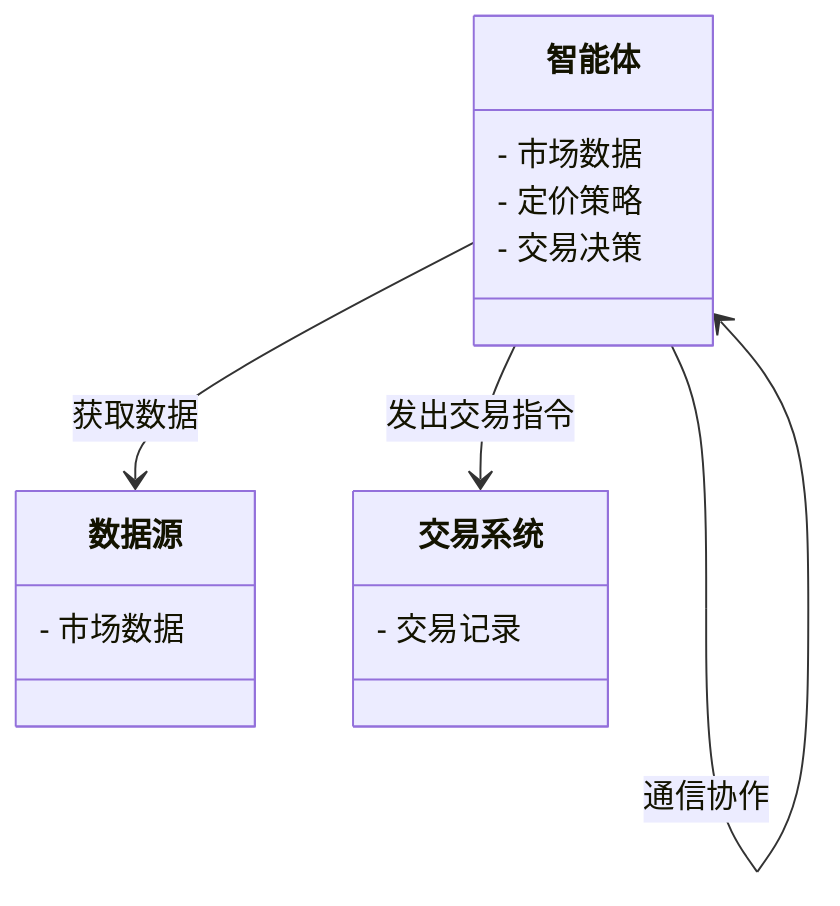
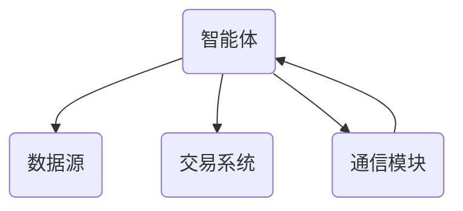
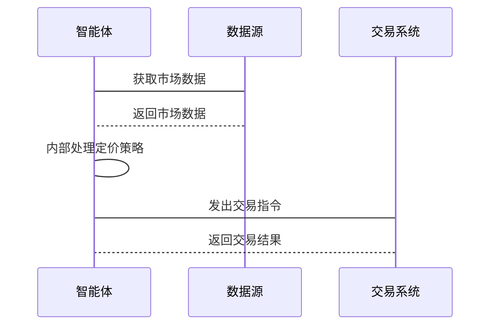

                 


# 多智能体系统实现全球资产定价

## 关键词：多智能体系统, 全球资产定价, 博弈论模型, 分布式计算, 高频交易

## 摘要：  
多智能体系统（Multi-Agent System, MAS）作为一种分布式计算范式，近年来在金融领域的应用越来越广泛。本文从多智能体系统的定义、核心原理出发，结合全球资产定价的背景与挑战，系统性地探讨多智能体系统如何通过分布式计算、博弈论模型和协作机制实现高效的全球资产定价。文章详细分析了多智能体系统在资产定价中的优势，介绍了多智能体系统的核心算法原理，包括通信协议、任务分配和协作机制，并通过实际案例展示了多智能体系统在资产定价中的应用。最后，文章总结了多智能体系统实现全球资产定价的关键点，并提出了未来的研究方向。

---

## 第一部分：多智能体系统与全球资产定价背景

### 第1章：多智能体系统概述

#### 1.1 多智能体系统的定义与特点
- **多智能体系统的定义**  
  多智能体系统是由多个自主智能体组成的分布式系统，这些智能体能够通过通信和协作完成复杂的任务。每个智能体都有自己的目标、知识和行为规则，能够在动态环境中自主决策。

- **多智能体系统的核心特点**  
  1. 分布式：智能体独立运行，通过通信协作解决问题。  
  2. 自主性：智能体能够自主决策，无需外部干预。  
  3. 社会性：智能体之间通过协作完成任务，形成社会行为。  
  4. 反应性：智能体能够感知环境并实时调整行为。  

- **多智能体系统与单智能体系统的区别**  
  单智能体系统依赖中心化决策，而多智能体系统通过去中心化的方式实现任务完成。多智能体系统在分布式环境中更具灵活性和容错性，但在复杂任务中也面临协调和通信的挑战。

#### 1.2 全球资产定价的背景与挑战
- **资产定价的基本概念**  
  资产定价是确定资产在市场上的公允价值的过程，通常基于资产的风险、收益和市场供需关系。传统的资产定价模型（如CAPM和APT）主要依赖中心化的数据和假设，难以应对全球市场的动态变化。

- **全球化市场中的资产定价问题**  
  全球化市场中，资产的价格受多种因素影响，包括宏观经济指标、市场情绪、政策变化等。传统的定价模型难以捕捉这些复杂因素，尤其是在高频交易和大数据环境下，中心化的方法效率低下且容易受到单点故障的影响。

- **当前资产定价模型的局限性**  
  传统的资产定价模型假设市场是完全理性的，且依赖于中心化的数据源。在实际市场中，这些假设往往不成立，导致定价结果的偏差。此外，中心化的方法在处理海量数据和实时交易时效率不足，难以满足现代金融市场的需求。

### 第2章：多智能体系统在资产定价中的应用

#### 2.1 多智能体系统在金融市场的优势
- **分布式计算的优势**  
  多智能体系统通过分布式计算能够高效处理海量数据，避免单点故障，提高系统的可靠性和容错性。在高频交易中，多智能体系统能够快速响应市场变化，实现毫秒级交易。

- **多智能体系统在高频交易中的应用**  
  高频交易需要快速决策和执行，多智能体系统通过分布式计算和协作机制，能够在极短时间内完成交易策略的制定和执行。智能体之间通过通信协议实时共享市场信息，优化交易决策。

- **多智能体系统的灵活性与扩展性**  
  多智能体系统能够根据市场变化动态调整智能体的数量和角色，适应不同场景的需求。与传统的中心化系统相比，多智能体系统具有更强的扩展性和灵活性。

#### 2.2 多智能体系统与资产定价的结合
- **多智能体系统如何影响资产定价**  
  多智能体系统通过智能体之间的协作和博弈，能够更准确地反映市场的真实情况。智能体可以基于实时市场数据和自身策略，动态调整对资产的定价，从而提高定价的准确性和效率。

- **多智能体系统在资产定价中的角色**  
  每个智能体可以代表不同的市场参与者（如买方、卖方、机构投资者等），通过博弈和协作，模拟市场的供需关系，实现资产的动态定价。智能体之间通过通信协议共享信息，优化定价模型。

- **多智能体系统与传统资产定价模型的对比**  
  传统的资产定价模型依赖中心化的数据源和假设，而多智能体系统通过分布式的计算和协作，能够更真实地反映市场的复杂性。多智能体系统能够处理非理性行为和市场情绪，提高定价的准确性。

---

## 第二部分：多智能体系统的核心原理

### 第3章：多智能体系统的核心概念与联系

#### 3.1 多智能体系统的实体关系图
- **实体关系图的定义**  
  实体关系图（ER图）用于描述系统中各实体之间的关系。在多智能体系统中，实体可以是智能体、市场参与者、交易数据等。

- **多智能体系统的ER图分析**  
  图中的智能体实体与其他实体（如市场数据、交易记录）通过关系连接，展示了系统中各个部分的交互和依赖关系。

```mermaid
er
  actor 市场参与者
  actor 智能体
  actor 交易系统
  actor 数据源
  class 智能体
  class 市场数据
  class 交易记录
  市场参与者 --> 智能体: 创建和控制
  智能体 --> 市场数据: 获取和分析
  智能体 --> 交易记录: 生成和存储
```

#### 3.2 多智能体系统的核心算法原理
- **多智能体系统的通信协议**  
  通信协议定义了智能体之间如何交换信息。常见的通信协议包括基于消息队列的通信和基于事件驱动的通信。智能体之间的通信需要确保高效性和可靠性。

- **多智能体系统中的任务分配**  
  任务分配是多智能体系统中的关键问题。智能体需要根据自身的能力和当前状态，动态分配任务。任务分配可以通过协商机制或中心化的仲裁机制实现。

- **多智能体系统中的协作机制**  
  协作机制定义了智能体如何共同完成任务。常见的协作机制包括基于规则的协作和基于目标的协作。智能体之间的协作需要确保任务的高效完成和系统的稳定性。

### 第4章：多智能体系统中的博弈论模型

#### 4.1 博弈论在多智能体系统中的应用
- **博弈论的基本概念**  
  博弈论研究的是多个决策者在竞争或合作环境下的策略选择。在多智能体系统中，博弈论模型可以用来描述智能体之间的交互和决策过程。

- **博弈论在多智能体系统中的作用**  
  博弈论模型可以帮助智能体预测其他智能体的行为，从而做出最优决策。博弈论模型在资产定价中的应用可以帮助智能体更好地反映市场的动态变化。

- **博弈论与资产定价的关系**  
  资产定价可以看作是一个博弈过程，智能体作为市场参与者，通过博弈和协作实现资产的动态定价。

#### 4.2 博弈论模型的数学表达
- **基本博弈论模型的数学公式**  
  常见的博弈论模型包括纳什均衡模型。纳什均衡是指在其他参与者策略不变的情况下，每个参与者选择最优策略的均衡状态。

- **多智能体系统中的博弈论模型**  
  在多智能体系统中，博弈论模型可以用来描述智能体之间的竞争和合作。例如，智能体可以通过博弈论模型预测其他智能体的定价策略，从而优化自身的定价决策。

- **博弈论模型的优化与应用**  
  博弈论模型需要根据具体的应用场景进行优化。例如，在资产定价中，可以引入动态博弈论模型，以反映市场的实时变化。

---

## 第三部分：多智能体系统实现全球资产定价的算法原理

### 第5章：多智能体系统中的定价模型

#### 5.1 多智能体系统中的定价算法
- **基于多智能体的定价算法**  
  多智能体系统中的定价算法通常基于博弈论模型和协作机制。智能体通过通信协议共享市场信息，动态调整定价策略。

- **多智能体系统中的定价模型**  
  多智能体系统的定价模型需要考虑多个因素，包括市场供需、参与者行为、宏观经济指标等。定价模型可以通过机器学习算法进行优化。

- **多智能体系统中的定价算法实现**  
  定价算法的实现需要结合多智能体系统的核心算法，如通信协议、任务分配和协作机制。定价算法需要实时更新，以反映市场的动态变化。

#### 5.2 多智能体系统中的定价模型数学表达
- **基于博弈论的定价模型**  
  纳什均衡模型可以用来描述智能体之间的定价博弈。每个智能体的目标是通过调整定价策略，最大化自身的收益。

- **多智能体系统中的定价模型优化**  
  定价模型需要根据实际市场数据进行优化。例如，可以通过机器学习算法对定价模型进行训练，提高定价的准确性。

- **定价模型的数学公式**  
  假设智能体i的定价策略为p_i，其他智能体的定价策略为p_{-i}。智能体i的目标是选择p_i，使得在p_{-i}不变的情况下，自身收益最大化。数学表达如下：

  $$ \max_{p_i} \pi_i(p_i, p_{-i}) $$

  其中，$\pi_i$是智能体i的收益函数。

### 第6章：多智能体系统中的通信与协作

#### 6.1 多智能体系统中的通信协议
- **通信协议的定义**  
  通信协议定义了智能体之间如何交换信息。常见的通信协议包括基于消息队列的通信和基于事件驱动的通信。

- **多智能体系统中的通信协议设计**  
  通信协议的设计需要考虑系统的实时性和可靠性。智能体之间的通信需要高效且安全。

- **通信协议的实现与优化**  
  通信协议的实现需要结合具体的系统架构。例如，在分布式系统中，可以使用消息队列中间件（如RabbitMQ）实现智能体之间的通信。

#### 6.2 多智能体系统中的协作机制
- **协作机制的定义**  
  协作机制定义了智能体如何共同完成任务。常见的协作机制包括基于规则的协作和基于目标的协作。

- **多智能体系统中的协作机制设计**  
  协作机制的设计需要考虑系统的动态性和复杂性。智能体之间的协作需要确保任务的高效完成和系统的稳定性。

- **协作机制的实现与优化**  
  协作机制的实现需要结合具体的系统需求。例如，在资产定价中，可以通过协商机制实现智能体之间的协作。

---

## 第四部分：系统架构与实现

### 第7章：多智能体系统实现全球资产定价的系统架构设计

#### 7.1 系统功能设计
- **领域模型分析**  
  系统的功能模块包括数据采集、定价计算、交易执行和结果分析。智能体作为核心模块，负责数据处理和定价决策。

- **领域模型类图**  
  使用mermaid绘制系统类图，展示系统中各模块之间的关系。



#### 7.2 系统架构设计
- **系统架构图**  
  使用mermaid绘制系统架构图，展示系统的整体结构和模块之间的关系。



#### 7.3 系统接口设计
- **智能体与数据源接口**  
  智能体通过数据接口从数据源获取市场数据。接口设计需要考虑数据的实时性和可靠性。

- **智能体与交易系统接口**  
  智能体通过交易接口向交易系统发出交易指令。接口设计需要考虑交易的实时性和安全性。

#### 7.4 系统交互设计
- **系统交互序列图**  
  使用mermaid绘制系统交互序列图，展示系统中各模块的交互过程。



---

## 第五部分：项目实战

### 第8章：多智能体系统实现全球资产定价的项目实战

#### 8.1 项目环境安装
- **Python环境安装**  
  需要安装Python 3.8及以上版本。安装命令：`python --version`。

- **依赖库安装**  
  安装必要的依赖库，如pandas、numpy、scikit-learn等。安装命令：`pip install pandas numpy scikit-learn`。

#### 8.2 系统核心实现源代码
- **智能体类实现**  
  智能体类负责获取市场数据、计算定价策略和执行交易指令。

```python
class Agent:
    def __init__(self, id):
        self.id = id
        self.market_data = None
        self pricing_strategy = "basic"
    
    def get_market_data(self, data_source):
        self.market_data = data_source.get_data()
    
    def compute_pricing(self):
        if self.pricing_strategy == "basic":
            return self.market_data['price'] * (1 + 0.05)
        else:
            return self.market_data['price'] * (1 + 0.1)
    
    def execute_trade(self, trade_system):
        price = self.compute_pricing()
        trade_system.execute(price)
```

- **数据源类实现**  
  数据源类负责提供市场数据。

```python
class DataSource:
    def __init__(self):
        self.data = None
    
    def get_data(self):
        # 模拟市场数据
        import random
        return {'price': random.uniform(100, 200), 'volume': random.randint(1000, 5000)}
```

- **交易系统类实现**  
  交易系统类负责接收交易指令并执行交易。

```python
class TradingSystem:
    def __init__(self):
        self.trades = []
    
    def execute(self, price):
        self.trades.append(price)
        print(f"交易价格：{price}")
```

#### 8.3 代码应用解读与分析
- **智能体类的解读**  
  每个智能体都有自己的ID和市场数据。智能体通过数据源获取市场数据，并根据定价策略计算交易价格。

- **定价策略的实现**  
  定价策略可以通过参数配置，选择不同的定价模型。基本策略（basic）和高级策略（advanced）分别对应不同的加成比例。

- **交易系统的实现**  
  交易系统接收智能体的交易指令，并记录交易价格。交易系统可以进一步扩展，加入风险管理模块。

#### 8.4 实际案例分析
- **案例分析**  
  假设有两个智能体，智能体1使用基本策略，智能体2使用高级策略。智能体1和智能体2分别从数据源获取市场数据，计算交易价格，并通过交易系统执行交易。

- **案例结果**  
  智能体1的交易价格为105（假设初始价格为100，加成5%），智能体2的交易价格为110（初始价格为100，加成10%）。

---

## 第六部分：最佳实践与小结

### 第9章：多智能体系统实现全球资产定价的总结与展望

#### 9.1 最佳实践 tips
- **系统设计建议**  
  在设计多智能体系统时，需要考虑系统的实时性、可靠性和扩展性。智能体之间的通信和协作需要高效且安全。

- **算法优化建议**  
  定价模型需要根据实际市场数据进行优化。可以引入机器学习算法，提高定价的准确性。

- **系统维护建议**  
  多智能体系统需要定期维护和更新。智能体之间的协作机制需要根据市场变化进行调整。

#### 9.2 总结
多智能体系统通过分布式计算和协作机制，能够高效实现全球资产定价。智能体之间的通信和协作是系统的核心，定价模型的优化是系统的关键。本文通过理论分析和实际案例，展示了多智能体系统在资产定价中的应用。

#### 9.3 展望
未来的研究方向可以包括多智能体系统的自适应优化、智能体之间的博弈优化以及多智能体系统的安全性研究。多智能体系统在金融领域的应用前景广阔，值得进一步深入研究。

---

## 作者信息

作者：AI天才研究院/AI Genius Institute & 禅与计算机程序设计艺术/Zen And The Art of Computer Programming

