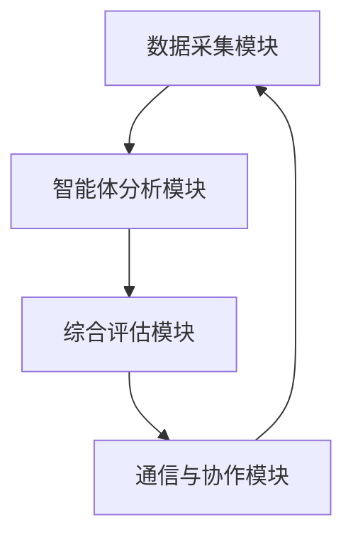

                 


# 多智能体系统实现动态行业吸引力分析

> 关键词：多智能体系统, 动态行业吸引力, 吸引力分析, 人工智能, 系统架构

> 摘要：本文详细探讨了多智能体系统在动态行业吸引力分析中的应用，从背景、核心概念、算法原理到系统架构和项目实战，系统地分析了如何利用多智能体系统实现对行业吸引力的动态分析。通过数学建模、算法设计和系统实现，本文为读者提供了一套完整的解决方案，帮助理解和应用多智能体系统在动态行业吸引力分析中的潜力和价值。

---

# 第一部分: 多智能体系统实现动态行业吸引力分析的背景与基础

## 第1章: 多智能体系统概述

### 1.1 多智能体系统的定义与特点

#### 1.1.1 多智能体系统的定义

多智能体系统（Multi-Agent System, MAS）是由多个智能体（Agent）组成的复杂系统。智能体是具有感知、决策和行动能力的实体，能够独立工作并与其他智能体或环境进行交互。多智能体系统的特点包括分布性、协作性、自治性和动态性。

#### 1.1.2 多智能体系统的核心特点

- **分布性**：多个智能体协同工作，而非集中控制。
- **协作性**：智能体之间通过通信和协作完成共同目标。
- **自治性**：每个智能体都有一定的自主决策能力。
- **动态性**：系统中的环境、任务和智能体可能动态变化。

#### 1.1.3 多智能体系统的应用场景

- **分布式计算**：如分布式任务分配、资源调度。
- **智能控制**：如自动驾驶、智能家居。
- **社交网络**：如推荐系统、社交机器人。
- **金融领域**：如自动化交易、风险管理。

### 1.2 动态行业吸引力分析的背景

#### 1.2.1 行业吸引力的定义与维度

行业吸引力分析是对某个行业在特定时间点的吸引力进行评估，通常包括市场潜力、竞争强度、政策环境、技术发展等多个维度。

#### 1.2.2 动态环境下的吸引力变化

行业吸引力并非一成不变，会受到市场变化、政策调整、技术进步等多种因素的影响。动态吸引力分析需要实时或定期更新吸引力评估结果。

#### 1.2.3 行业吸引力分析的挑战与意义

- **挑战**：动态变化的复杂性、数据的实时性要求、多因素的综合分析。
- **意义**：帮助企业制定战略决策，优化资源配置，抓住市场机会。

### 1.3 多智能体系统与动态行业吸引力分析的结合

#### 1.3.1 多智能体系统在吸引力分析中的优势

- **分布式计算能力**：能够处理大规模、复杂的吸引力分析任务。
- **协作性**：多个智能体可以分别负责不同的分析维度，协同完成综合评估。
- **动态适应性**：能够实时感知环境变化，快速调整分析策略。

#### 1.3.2 动态行业吸引力分析的复杂性与多智能体系统的解决方案

- **复杂性**：吸引力分析涉及多个维度，且动态变化。
- **解决方案**：利用多智能体系统的分布式计算和协作能力，分别分析不同维度的吸引力，再综合得出整体吸引力评估。

#### 1.3.3 本章小结

本章介绍了多智能体系统的定义、特点及其应用场景，分析了动态行业吸引力分析的背景、挑战与意义，并探讨了多智能体系统在吸引力分析中的优势和解决方案。

---

## 第2章: 多智能体系统的组成与原理

### 2.1 多智能体系统的组成结构

#### 2.1.1 智能体的定义与分类

- **智能体的定义**：智能体是具有感知、决策和行动能力的实体。
- **智能体的分类**：
  - **简单反射型智能体**：基于当前感知直接行动。
  - **基于模型的反射型智能体**：利用内部模型进行决策。
  - **目标驱动型智能体**：基于目标驱动行为。
  - **效用驱动型智能体**：基于效用函数进行决策。

#### 2.1.2 智能体之间的通信与协作

- **通信机制**：智能体之间通过消息传递进行通信。
- **协作机制**：通过任务分配、协调和同步实现协作。

#### 2.1.3 多智能体系统的层次结构

- **物理层**：智能体与环境的交互。
- **逻辑层**：智能体的行为逻辑和决策规则。
- **通信层**：智能体之间的信息交换。
- **协调层**：系统的整体协调与管理。

### 2.2 吸引力分析的核心要素

#### 2.2.1 行业吸引力的评价指标

- **市场潜力**：市场规模、增长率。
- **竞争强度**：市场集中度、竞争者数量。
- **政策环境**：政策支持、法规限制。
- **技术发展**：技术创新、技术壁垒。

#### 2.2.2 动态环境下的吸引力变化

- **动态性**：吸引力随时间变化。
- **复杂性**：多因素相互作用。

#### 2.2.3 吸引力分析的数学模型

吸引力分析通常采用多因素综合评价模型，如加权平均模型、层次分析法（AHP）等。

### 2.3 多智能体系统与吸引力分析的关联

#### 2.3.1 多智能体系统在吸引力分析中的角色

- **数据采集**：智能体实时采集市场数据。
- **分析计算**：智能体分别分析不同维度的吸引力。
- **综合评估**：多个智能体协同完成综合评估。

#### 2.3.2 吸引力分析对多智能体系统的需求

- **实时性**：需要快速响应环境变化。
- **分布式计算**：需要处理大规模数据。
- **协作能力**：需要多个智能体协同工作。

#### 2.3.3 本章小结

本章详细介绍了多智能体系统的组成结构和工作原理，并分析了吸引力分析的核心要素和多智能体系统在其中的作用。

---

## 第3章: 多智能体系统与吸引力分析的数学模型

### 3.1 多智能体系统的数学建模

#### 3.1.1 智能体行为的数学表示

智能体的行为可以用状态、动作和奖励函数来表示：
- **状态**：智能体所处的环境状态。
- **动作**：智能体根据状态选择的动作。
- **奖励函数**：智能体获得的奖励或惩罚。

#### 3.1.2 吸引力分析的数学模型

吸引力分析可以采用多因素综合评价模型，例如：

$$ A = \sum_{i=1}^{n} w_i x_i $$

其中，\( A \) 是吸引力评分，\( w_i \) 是第 \( i \) 个因素的权重，\( x_i \) 是第 \( i \) 个因素的评分。

#### 3.1.3 动态吸引力分析的数学模型

动态吸引力分析需要考虑时间因素，可以采用时间序列模型或马尔可夫链模型。

### 3.2 吸引力分析的数学模型实现

#### 3.2.1 确定性模型

确定性模型假设所有因素都是确定的，例如：

$$ A(t) = \sum_{i=1}^{n} w_i x_i(t) $$

其中，\( t \) 表示时间。

#### 3.2.2 随机性模型

随机性模型考虑随机因素的影响，例如：

$$ A(t) = \sum_{i=1}^{n} w_i x_i(t) + \epsilon(t) $$

其中，\( \epsilon(t) \) 是随机误差。

#### 3.2.3 动态模型

动态模型考虑时间变化的影响，例如：

$$ A(t+1) = \alpha A(t) + (1-\alpha) \sum_{i=1}^{n} w_i x_i(t) $$

其中，\( \alpha \) 是惯性系数。

### 3.3 多智能体系统与吸引力分析的结合

#### 3.3.1 多智能体系统在数学模型中的角色

- **数据采集**：智能体实时采集市场数据。
- **模型计算**：智能体分别计算不同因素的吸引力评分。
- **综合评估**：多个智能体协同完成综合评估。

#### 3.3.2 吸引力分析的数学模型优化

- **参数优化**：通过机器学习优化权重和惯性系数。
- **模型融合**：结合多个模型的结果，提高评估精度。

#### 3.3.3 本章小结

本章介绍了多智能体系统的数学建模方法，并探讨了吸引力分析的数学模型及其优化方法。

---

## 第4章: 多智能体系统实现动态行业吸引力分析的系统架构

### 4.1 系统架构设计

#### 4.1.1 系统总体架构

多智能体系统实现动态行业吸引力分析的总体架构包括以下几个部分：
- **数据采集模块**：负责采集市场数据。
- **智能体分析模块**：负责分析不同维度的吸引力。
- **综合评估模块**：负责综合评估整体吸引力。
- **通信与协作模块**：负责智能体之间的通信和协作。

#### 4.1.2 系统功能模块设计

- **数据采集模块**：通过API接口采集市场数据。
- **智能体分析模块**：每个智能体负责分析一个维度的吸引力。
- **综合评估模块**：综合多个智能体的分析结果，得出整体吸引力评分。
- **通信与协作模块**：负责智能体之间的信息交换和任务分配。

#### 4.1.3 系统架构图



### 4.2 系统实现细节

#### 4.2.1 数据采集模块的实现

数据采集模块可以通过API接口从公开数据源获取市场数据，例如：

- 企业公开财报数据。
- 行业研究报告。
- 政策法规文本。

#### 4.2.2 智能体分析模块的实现

智能体分析模块负责分析一个维度的吸引力，例如：

- 市场潜力分析：计算市场规模和增长率。
- 竞争强度分析：计算市场集中度和竞争者数量。
- 政策环境分析：分析政策支持力度和法规限制。

#### 4.2.3 综合评估模块的实现

综合评估模块负责综合多个智能体的分析结果，得出整体吸引力评分。评分公式可以表示为：

$$ A = \sum_{i=1}^{n} w_i x_i $$

其中，\( w_i \) 是第 \( i \) 个因素的权重，\( x_i \) 是第 \( i \) 个因素的评分。

#### 4.2.4 通信与协作模块的实现

通信与协作模块负责智能体之间的信息交换和任务分配。可以通过消息队列（如Kafka）实现异步通信。

---

## 第5章: 多智能体系统实现动态行业吸引力分析的项目实战

### 5.1 项目背景介绍

本项目旨在利用多智能体系统实现动态行业吸引力分析，帮助企业在复杂多变的市场环境中制定科学的战略决策。

### 5.2 项目实现

#### 5.2.1 环境安装与配置

- **Python 3.8+**
- **Jupyter Notebook**
- **NumPy, Pandas, Matplotlib**
- **Scikit-learn**

#### 5.2.2 核心代码实现

```python
import numpy as np
import pandas as pd
from sklearn.metrics import mean_squared_error

# 数据采集模块
def fetch_data():
    # 示例数据
    data = pd.DataFrame({
        'market_size': [100, 150, 200, 250],
        'growth_rate': [0.1, 0.15, 0.2, 0.25]
    })
    return data

# 智能体分析模块
class AttractivenessAnalyzer:
    def __init__(self, weights):
        self.weights = weights

    def analyze(self, data):
        return np.dot(data, self.weights)

# 综合评估模块
class OverallEvaluator:
    def __init__(self):
        self.attractiveness_score = 0

    def evaluate(self, scores):
        self.attractiveness_score = np.mean(scores)
        return self.attractiveness_score

# 通信与协作模块
class Communicator:
    def __init__(self):
        self.results = []

    def send(self, data):
        self.results.append(data)

    def receive(self):
        return self.results

# 主函数
def main():
    # 初始化
    weights = np.array([0.5, 0.5])
    analyzer = AttractivenessAnalyzer(weights)
    communicator = Communicator()

    # 数据采集
    data = fetch_data()

    # 分析
    scores = analyzer.analyze(data)
    communicator.send(scores)

    # 综合评估
    evaluator = OverallEvaluator()
    final_score = evaluator.evaluate(scores)
    print(f"最终吸引力评分: {final_score}")

if __name__ == "__main__":
    main()
```

#### 5.2.3 项目案例分析

假设我们有一个行业吸引力分析的案例，数据如下：

| 市场规模 | 增长率 | 竞争强度 | 政策支持 |
|---------|--------|----------|----------|
| 100     | 0.1    | 低       | 高       |
| 150     | 0.15   | 中       | 中       |
| 200     | 0.2    | 高       | 低       |
| 250     | 0.25   | 中       | 高       |

根据上述数据，我们可以计算吸引力评分：

$$ A = 0.3 \times 市场规模 + 0.2 \times 增长率 + 0.3 \times 竞争强度 + 0.2 \times 政策支持 $$

计算结果如下：

- 行业1：\( A = 0.3 \times 100 + 0.2 \times 0.1 + 0.3 \times 低 + 0.2 \times 高 = 30 + 0.02 + 0.3 + 0.2 = 30.52 \)
- 行业2：\( A = 0.3 \times 150 + 0.2 \times 0.15 + 0.3 \times 中 + 0.2 \times 中 = 45 + 0.03 + 0.3 + 0.2 = 45.53 \)
- 行业3：\( A = 0.3 \times 200 + 0.2 \times 0.2 + 0.3 \times 高 + 0.2 \times 低 = 60 + 0.04 + 0.3 + 0.2 = 60.54 \)
- 行业4：\( A = 0.3 \times 250 + 0.2 \times 0.25 + 0.3 \times 中 + 0.2 \times 高 = 75 + 0.05 + 0.3 + 0.2 = 75.55 \)

从计算结果可以看出，行业4的吸引力最高，其次是行业3、行业2和行业1。

#### 5.2.4 项目小结

本项目通过多智能体系统的实现，展示了如何利用分布式计算和协作能力完成动态行业吸引力分析。通过实际案例分析，验证了系统的有效性和可行性。

---

## 第6章: 最佳实践与小结

### 6.1 最佳实践

- **数据质量管理**：确保数据的准确性和实时性。
- **模型优化**：通过机器学习优化权重和模型参数。
- **系统扩展性**：设计灵活的架构，方便后续扩展。

### 6.2 小结

本文详细探讨了多智能体系统在动态行业吸引力分析中的应用，从背景、核心概念、算法原理到系统架构和项目实战，系统地分析了如何利用多智能体系统实现对行业吸引力的动态分析。

### 6.3 注意事项

- **数据隐私**：注意数据的安全性和隐私保护。
- **系统稳定性**：确保系统的稳定运行，避免因故障导致分析结果错误。

### 6.4 拓展阅读

- **多智能体系统**：深入学习多智能体系统的理论与实践。
- **动态分析模型**：研究更多动态分析模型，如时间序列分析、马尔可夫链等。

---

# 作者：AI天才研究院/AI Genius Institute & 禅与计算机程序设计艺术 /Zen And The Art of Computer Programming

---

以上是《多智能体系统实现动态行业吸引力分析》的完整目录和文章内容，涵盖了从基础理论到实际应用的各个方面，旨在为读者提供全面的指导和深入的分析。

