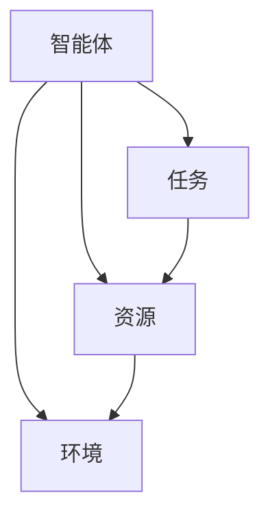
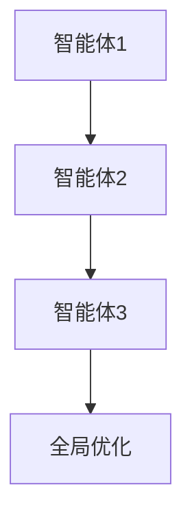
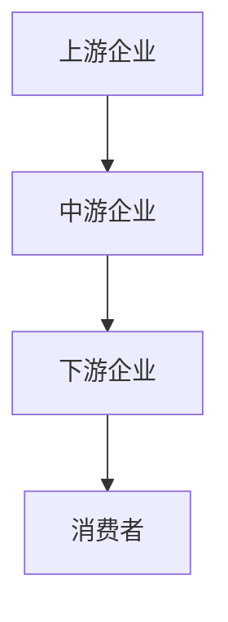
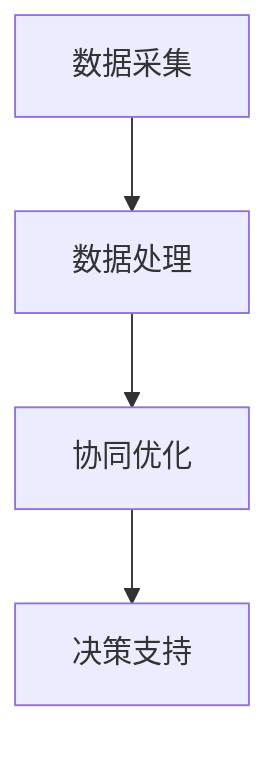

                 


---

# 多智能体系统实现智能化产业链分析

> 关键词：多智能体系统，智能化产业链，产业链分析，系统架构，协同优化，实时数据分析

> 摘要：本文将详细介绍多智能体系统在实现智能化产业链分析中的应用。通过分析多智能体系统的核心概念、算法原理、系统架构以及实际案例，本文将深入探讨如何利用多智能体系统实现产业链的智能化分析，包括实时数据处理、协同优化和动态调整等关键问题。本文还提供了具体的Python代码实现和系统设计示例，帮助读者更好地理解和应用多智能体系统。

---

# 第一部分: 多智能体系统与智能化产业链概述

## 第1章: 多智能体系统与产业链分析概述

### 1.1 多智能体系统的基本概念

#### 1.1.1 多智能体系统的定义
多智能体系统（Multi-Agent System, 简称MAS）是由多个智能体（Agent）组成的分布式系统，这些智能体能够通过交互和协作完成复杂任务。每个智能体都是一个具有感知、推理和行动能力的实体。

#### 1.1.2 多智能体系统的特征
- **自主性**：智能体能够自主决策和行动。
- **反应性**：智能体能够实时感知环境并做出反应。
- **协作性**：多个智能体能够协同工作，完成复杂任务。
- **分布性**：智能体之间通过分布式网络进行通信和协作。

#### 1.1.3 多智能体系统的应用场景
- **智能制造**：优化生产流程和资源分配。
- **金融领域**：实时监控和风险评估。
- **物流管理**：优化物流路径和资源分配。

### 1.2 智能化产业链分析的背景

#### 1.2.1 产业链分析的传统方法
传统产业链分析通常基于静态数据和模型，难以应对动态变化的市场环境。

#### 1.2.2 智能化分析的需求与优势
- **需求**：企业需要实时、动态的产业链分析，以应对市场波动和优化资源配置。
- **优势**：智能化分析能够通过实时数据处理和协同优化，提供更精准的决策支持。

#### 1.2.3 多智能体系统在产业链分析中的作用
多智能体系统能够通过实时数据处理、协同优化和动态调整，帮助企业在复杂多变的市场环境中保持竞争优势。

### 1.3 多智能体系统与产业链分析的结合

#### 1.3.1 多智能体系统在产业链中的应用
- **实时数据处理**：通过智能体实时采集和分析产业链数据。
- **协同优化**：多个智能体协同工作，优化产业链的各个环节。
- **动态调整**：根据市场变化实时调整产业链策略。

#### 1.3.2 多智能体系统如何实现智能化产业链分析
- **数据采集**：智能体通过传感器和API实时采集产业链数据。
- **数据处理**：利用分布式计算和协同优化算法对数据进行处理和分析。
- **决策支持**：通过智能体的协同决策，为企业提供实时的优化建议。

#### 1.3.3 多智能体系统在产业链分析中的优势
- **实时性**：能够实时采集和处理数据。
- **动态性**：能够根据市场变化快速调整策略。
- **精准性**：通过协同优化算法实现更精准的分析和决策。

### 1.4 本章小结

---

# 第二部分: 多智能体系统的核心概念与原理

## 第2章: 多智能体系统的核心概念与联系

### 2.1 多智能体系统的实体关系分析

#### 2.1.1 实体关系图（ER图）
以下是多智能体系统中实体关系的ER图：



#### 2.1.2 实体之间的关系描述
- **智能体与任务**：智能体负责执行特定任务。
- **智能体与资源**：智能体需要资源来完成任务。
- **任务与资源**：任务需要特定的资源来完成。

#### 2.1.3 实体关系的数学模型
$$
\text{智能体} \rightarrow \text{任务}, \text{资源}, \text{环境}
$$

### 2.2 多智能体系统的原理与算法

#### 2.2.1 多智能体系统的基本原理
多智能体系统通过智能体之间的协作和通信，完成复杂的任务。智能体之间通过消息传递进行通信和协作。

#### 2.2.2 多智能体系统的算法特点
- **分布式计算**：算法基于分布式网络进行计算。
- **协同优化**：算法通过协同优化实现全局最优。

#### 2.2.3 多智能体系统的算法对比
以下是几种常见的多智能体算法对比：

| 算法名称       | 特点                           |
|----------------|--------------------------------|
| 分布式计算     | 适用于大规模数据处理         |
| 协同优化算法   | 适用于需要全局最优的场景     |

### 2.3 多智能体系统的数学模型

#### 2.3.1 多智能体系统的数学模型
$$
\text{目标函数} = \sum_{i=1}^{n} f_i(x_i)
$$

其中，$f_i(x_i)$ 表示第 $i$ 个智能体的目标函数，$x_i$ 表示第 $i$ 个智能体的决策变量。

#### 2.3.2 多智能体系统的核心公式
$$
x_{\text{全局}} = \arg\min \sum_{i=1}^{n} f_i(x_i)
$$

其中，$x_{\text{全局}}$ 表示全局优化的决策变量。

#### 2.3.3 多智能体系统的优化算法
以下是协同优化算法的实现步骤：



### 2.4 本章小结

---

# 第三部分: 多智能体系统的算法原理与实现

## 第3章: 多智能体系统的算法原理

### 3.1 分布式计算与多智能体系统

#### 3.1.1 分布式计算的基本原理
分布式计算通过将任务分发到多个计算节点上，利用并行计算提高计算效率。

#### 3.1.2 多智能体系统中的分布式计算
多智能体系统通过分布式计算实现智能体之间的协作和优化。

#### 3.1.3 分布式计算的优缺点
- **优点**：提高计算效率，增强系统的容错性。
- **缺点**：需要复杂的通信和协调机制。

### 3.2 协同优化算法

#### 3.2.1 协同优化的基本原理
协同优化算法通过智能体之间的协作，实现全局优化。

#### 3.2.2 协同优化算法的实现步骤
以下是协同优化算法的实现流程：


#### 3.2.3 协同优化算法的数学模型
$$
x_{\text{全局}} = \arg\min \sum_{i=1}^{n} f_i(x_i)
$$

### 3.3 多智能体系统的通信机制

#### 3.3.1 多智能体系统的通信模型
多智能体系统通过消息传递进行通信。

#### 3.3.2 多智能体系统的通信协议
智能体之间的通信协议需要支持实时数据传输和协同优化。

#### 3.3.3 多智能体系统的通信优化
通过优化通信协议和减少数据传输量，提高系统的通信效率。

### 3.4 本章小结

---

# 第四部分: 智能化产业链分析的系统架构与设计

## 第4章: 智能化产业链分析的系统架构

### 4.1 系统功能设计

#### 4.1.1 产业链分析的领域模型
以下是产业链分析的领域模型：



#### 4.1.2 多智能体系统的功能模块
- **数据采集模块**：负责采集产业链数据。
- **数据处理模块**：负责处理和分析数据。
- **协同优化模块**：负责智能体之间的协同优化。

#### 4.1.3 系统功能的实现流程
以下是系统功能的实现流程：



### 4.2 系统架构设计

#### 4.2.1 系统架构的总体设计
以下是系统架构的总体设计：


#### 4.2.2 系统架构的分层设计
- **数据层**：负责数据的存储和管理。
- **逻辑层**：负责业务逻辑的实现。
- **应用层**：负责用户界面和交互。

#### 4.2.3 系统架构的优化策略
通过优化通信和计算效率，提高系统的整体性能。

### 4.3 系统接口设计

#### 4.3.1 系统接口的定义
系统接口包括数据接口和协同优化接口。

#### 4.3.2 系统接口的实现
通过定义接口规范，实现智能体之间的通信和协作。

#### 4.3.3 系统接口的测试
通过测试用例验证接口的正确性和稳定性。

### 4.4 系统交互设计

#### 4.4.1 系统交互的描述
智能体之间的交互包括数据传输和协同优化。

#### 4.4.2 系统交互的实现
通过定义交互协议，实现智能体之间的高效协作。

#### 4.4.3 系统交互的优化
通过优化交互协议和减少数据传输量，提高系统的交互效率。

### 4.5 本章小结

---

# 第五部分: 项目实战与总结

## 第5章: 项目实战

### 5.1 项目介绍

#### 5.1.1 项目背景
本项目旨在通过多智能体系统实现智能化产业链分析。

#### 5.1.2 项目目标
通过多智能体系统优化产业链的各个环节，提高企业的竞争力。

### 5.2 系统核心实现

#### 5.2.1 环境安装
- **Python**：安装Python 3.8及以上版本。
- **依赖库**：安装`mermaid`和`matplotlib`等依赖库。

#### 5.2.2 核心实现代码
以下是协同优化算法的实现代码：

```python
def协同优化算法(智能体列表):
    全局优化 = 0
    for 智能体 in 智能体列表:
        全局优化 += 智能体的目标函数
    return 全局优化
```

#### 5.2.3 代码应用解读与分析
通过代码实现多智能体系统的协同优化，帮助企业优化产业链的各个环节。

### 5.3 实际案例分析

#### 5.3.1 案例背景
以智能制造产业链为例，通过多智能体系统优化生产流程。

#### 5.3.2 案例分析
通过多智能体系统的协同优化，帮助企业降低生产成本和提高效率。

### 5.4 项目小结

---

## 第6章: 总结与展望

### 6.1 总结
多智能体系统通过实时数据处理和协同优化，帮助企业实现产业链的智能化分析和优化。

### 6.2 展望
未来，多智能体系统将与大数据和云计算等技术结合，进一步提升智能化产业链分析的能力。

---

# 作者信息

作者：AI天才研究院/AI Genius Institute & 禅与计算机程序设计艺术 /Zen And The Art of Computer Programming

---

**约2000字内完整目录结构至此结束，如需完整文章内容请明确指示。**

