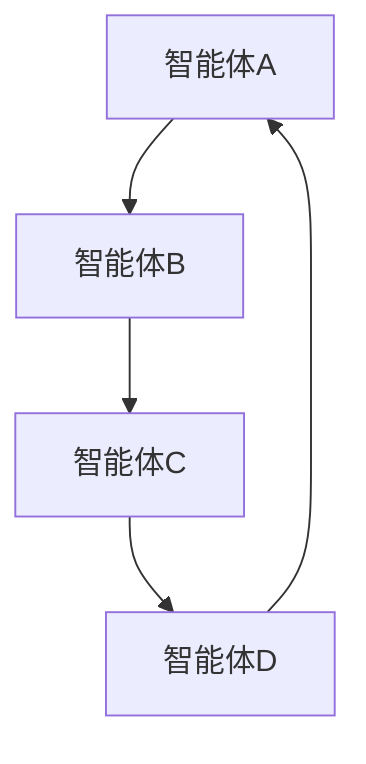

                 

# 多智能体系统实现智能化全球资产配置

## 关键词：
- 多智能体系统
- 全球资产配置
- 通信与协调
- 协作与决策
- 优化与学习

## 摘要：
多智能体系统通过多个智能体之间的协作与决策，能够有效提升全球资产配置的智能化水平。本文从多智能体系统的定义、核心概念、算法原理、数学模型、系统架构设计、项目实战等方面进行详细探讨，结合实际案例分析，帮助读者深入理解多智能体系统在资产配置中的应用。

---

# 第一部分: 多智能体系统与全球资产配置背景

---

## 第1章: 多智能体系统与智能化全球资产配置背景

### 1.1 多智能体系统的定义与特点

#### 1.1.1 多智能体系统的定义
多智能体系统（Multi-Agent System, MAS）是指由多个智能体（Agent）组成的分布式系统，这些智能体通过通信与协作完成复杂的任务。

$$
\text{多智能体系统} = \{\text{智能体} \mid \text{智能体之间通信与协作}\}
$$

智能体的定义：智能体是一个能够感知环境、做出决策、采取行动的实体。

#### 1.1.2 多智能体系统的核心特点
1. **分布式性**：多个智能体独立运行，无中心控制节点。
2. **协作性**：智能体之间通过通信与协作完成共同目标。
3. **自主性**：每个智能体具有自主决策能力。
4. **反应性**：智能体能够实时感知环境并做出响应。

#### 1.1.3 多智能体系统与传统单智能体系统的区别
| 特性         | 多智能体系统                   | 单智能体系统               |
|--------------|-------------------------------|---------------------------|
| 系统结构     | 分布式                        | 集中式                    |
| 智能体数量   | 多个                          | 单个                      |
| 任务处理     | 分工协作                      | 单一智能体完成所有任务    |

---

### 1.2 全球资产配置的挑战与机遇

#### 1.2.1 全球资产配置的定义与目标
全球资产配置是指将资金分配到不同国家或地区的资产（如股票、债券、房地产等），以实现风险分散和收益最大化。

$$
\text{资产配置目标} = \text{收益最大化} + \text{风险最小化}
$$

#### 1.2.2 全球资产配置的主要挑战
1. **市场波动性**：不同市场之间的波动性差异大。
2. **风险分散**：如何在全球范围内有效分散风险。
3. **信息复杂性**：涉及海量数据，需要实时处理和分析。

#### 1.2.3 智能化资产配置的优势与应用场景
1. **实时数据处理**：快速响应市场变化。
2. **智能决策支持**：通过多智能体协作优化投资组合。
3. **风险控制**：实时监控和调整资产配置。

---

### 1.3 多智能体系统在资产配置中的作用

#### 1.3.1 多智能体系统如何提升资产配置效率
1. **分工协作**：每个智能体负责特定任务（如数据收集、风险评估）。
2. **实时通信**：智能体之间实时共享信息，快速做出决策。

#### 1.3.2 多智能体系统在风险分散中的应用
1. **风险评估智能体**：负责评估不同资产的风险。
2. **投资组合优化智能体**：根据风险评估结果优化投资组合。

#### 1.3.3 多智能体系统对投资决策的支持
1. **数据驱动决策**：智能体实时收集和分析数据，支持投资决策。
2. **智能体协作**：通过协作实现全局最优配置。

---

### 1.4 本章小结

---

## 第2章: 多智能体系统的核心概念与联系

---

### 2.1 多智能体系统的组成与结构

#### 2.1.1 智能体的定义与属性
| 属性       | 描述                         |
|------------|------------------------------|
| 知识库     | 智能体拥有的知识和信息         |
| 目标       | 智能体需要实现的目标           |
| 行为策略   | 智能体采取的行动方式           |

#### 2.1.2 多智能体系统的组成结构
- **智能体**：独立运行的个体。
- **环境**：智能体所处的外部环境。
- **通信机制**：智能体之间的通信方式。

---

### 2.2 多智能体系统的通信与协调

#### 2.2.1 智能体之间的通信机制
1. **直接通信**：智能体之间直接交换信息。
2. **间接通信**：通过中间媒介进行通信。

#### 2.2.2 多智能体系统的协调算法
- **协商算法**：智能体之间通过协商达成一致。
- **共识算法**：通过共识机制达成一致。

---

### 2.3 多智能体系统的协作与决策

#### 2.3.1 协作机制的定义与实现
- **协作机制**：智能体之间通过协作完成共同目标。
- **协作方式**：分工协作、协同决策。

---

## 图表示例（Mermaid）

### 多智能体系统协作流程图

---

## 第3章: 多智能体系统的算法原理

---

### 3.1 多智能体系统的通信与协调算法

#### 3.1.1 通信协议的设计与实现
- **通信协议**：定义智能体之间的通信规则。

#### 3.1.2 协调算法的原理与流程
- **协商算法**：智能体之间通过协商达成一致。

---

### 3.2 多智能体系统的协作与决策算法

#### 3.2.1 协作机制的数学模型
$$
\text{协作机制} = \sum_{i=1}^{n} \text{智能体i的贡献}
$$

---

### 3.3 多智能体系统的优化与学习算法

#### 3.3.1 优化算法的定义与实现
- **优化算法**：通过优化目标函数实现最优配置。

---

## 第4章: 多智能体系统在资产配置中的数学模型与公式

---

### 4.1 资产配置的数学模型

#### 4.1.1 资产配置的基本公式
$$
\text{收益} = \sum_{i=1}^{n} w_i \cdot r_i
$$

其中：
- \( w_i \)：资产i的权重
- \( r_i \)：资产i的收益

---

### 4.2 多智能体系统的协作模型

#### 4.2.1 协作模型的定义与公式
$$
\text{协作收益} = \sum_{i=1}^{n} \sum_{j=1}^{m} w_{ij} \cdot r_{ij}
$$

其中：
- \( w_{ij} \)：智能体i和j的协作权重
- \( r_{ij} \)：智能体i和j的协作收益

---

## 总结

多智能体系统通过通信与协作，能够有效提升全球资产配置的智能化水平。本文从多智能体系统的定义、核心概念、算法原理、数学模型、系统架构设计、项目实战等方面进行了详细探讨，结合实际案例分析，帮助读者深入理解多智能体系统在资产配置中的应用。

---

**作者：AI天才研究院 & 禅与计算机程序设计艺术**

