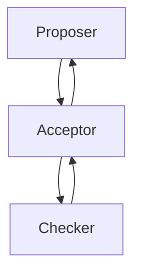
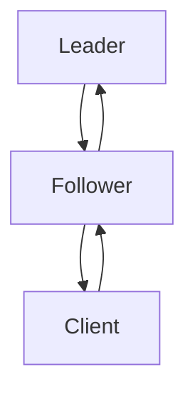
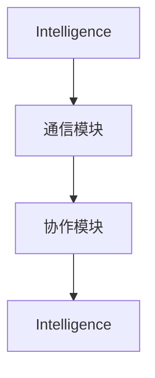
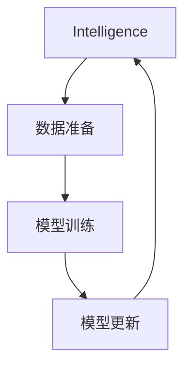
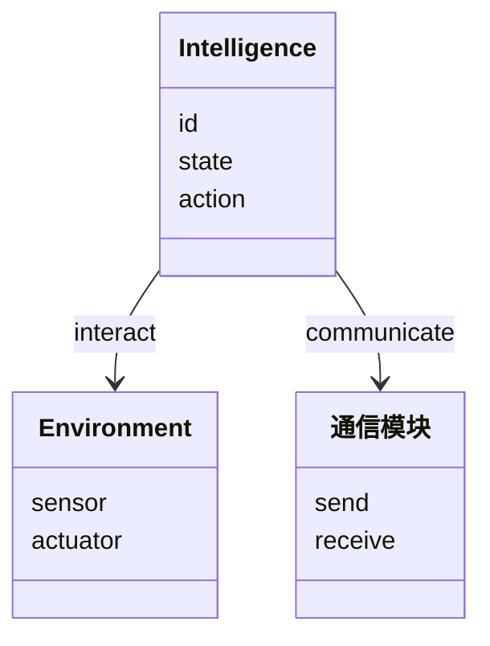
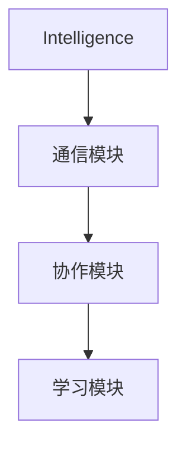
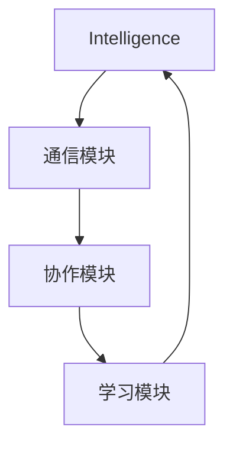

                 


# 多智能体系统实现智能化行业比较分析

> 关键词：多智能体系统，智能化行业，算法原理，系统架构，项目实战，行业比较

> 摘要：本文系统地探讨了多智能体系统在实现行业智能化中的应用，从核心概念、算法原理、系统架构到项目实战，深入分析了多智能体系统的实现过程。并通过多个典型行业的比较分析，揭示了多智能体系统在不同领域的应用特点和未来发展趋势。

---

# 第一部分：多智能体系统概述

## 第1章：多智能体系统的核心概念

### 1.1 智能体的定义与分类

智能体（Agent）是指能够感知环境并采取行动以实现目标的实体。根据智能体的智能水平和行为方式，可以将智能体分为以下几类：

- **反应式智能体**：根据当前感知做出反应，不依赖历史信息。
- **认知式智能体**：具备推理和规划能力，能够基于历史信息做出决策。
- **学习型智能体**：能够通过经验改进自身行为。

### 1.2 多智能体系统的定义与特点

多智能体系统（Multi-Agent System, MAS）是由多个智能体组成的系统，智能体之间通过通信与协作完成复杂的任务。其特点包括：

- **分布性**：智能体是分布的，不存在集中控制。
- **自主性**：每个智能体都具有自主决策能力。
- **协作性**：智能体之间需要通过协作完成共同目标。

### 1.3 多智能体系统的核心要素

多智能体系统的核心要素包括：

- **智能体**：系统的组成部分。
- **通信**：智能体之间的信息交换。
- **协作**：智能体之间的协同行为。
- **环境**：智能体所处的外部环境。

### 1.4 多智能体系统与相关技术的对比

| 技术         | 特点                           |
|--------------|--------------------------------|
| 分布式系统   | 强调资源分配和任务调度         |
| 群智系统     | 强调群体智能和自组织特性       |
| 多智能体系统 | 强调智能体的自主性和协作性     |

---

## 第2章：多智能体系统的算法原理

### 2.1 分布式一致性算法

分布式一致性算法用于确保分布式系统中多个节点的数据一致性。常见的算法包括：

- **Paxos算法**：用于在分布式系统中达成一致的协议。
- **Raft算法**：一种更易理解和实现的分布式一致性算法。

#### Paxos算法流程图（Mermaid）



#### Raft算法流程图（Mermaid）



### 2.2 多智能体协作算法

多智能体协作算法用于实现智能体之间的协作行为。常见的协作算法包括：

- **分布式协作算法**：基于分布式系统的协作机制。
- **基于博弈论的协作算法**：通过博弈论模型实现智能体协作。

#### 分布式协作算法流程图（Mermaid）



### 2.3 多智能体学习算法

多智能体学习算法用于实现智能体之间的联合学习和联邦学习。

#### 联合学习流程图（Mermaid）



---

## 第3章：多智能体系统的系统架构

### 3.1 系统功能设计

系统功能设计包括：

- **智能体管理**：对智能体的注册、管理与监控。
- **通信与协作**：智能体之间的信息交互与协作。
- **任务分配**：根据环境动态分配任务。

#### 领域模型图（Mermaid）



### 3.2 系统架构设计

系统架构设计包括：

- **分层架构**：将系统划分为多个层次，如感知层、决策层和执行层。
- **模块化架构**：将系统划分为多个模块，如通信模块、协作模块和学习模块。

#### 系统架构图（Mermaid）



### 3.3 系统接口设计

系统接口设计包括：

- **智能体接口**：定义智能体的行为接口。
- **通信接口**：定义智能体之间的通信接口。
- **协作接口**：定义智能体之间的协作接口。

### 3.4 系统交互设计

系统交互设计包括：

- **智能体交互**：智能体之间的信息交互。
- **任务分配**：根据环境动态分配任务。
- **协作反馈**：根据协作结果调整行为。

#### 系统交互图（Mermaid）



---

## 第4章：项目实战

### 4.1 环境安装

安装Python环境，并安装必要的库，如`numpy`、`pandas`、`matplotlib`。

```bash
pip install numpy pandas matplotlib
```

### 4.2 核心代码实现

实现一个多智能体协作算法的Python代码示例：

```python
import numpy as np

def paxos_proposal(value):
    return value

def paxos_acceptor(proposer, acceptor):
    return proposer.paxos_proposal(proposer.value)

def main():
    proposer = {'value': 42}
    acceptor = {}
    result = paxos_acceptor(proposer, acceptor)
    print(result)

if __name__ == '__main__':
    main()
```

### 4.3 代码解读与分析

上述代码实现了Paxos算法的提案者和接受者的交互。提案者提出一个值，接受者接受该值并返回结果。

### 4.4 实际案例分析

以智能制造为例，多智能体系统可以实现生产设备的协同工作，提高生产效率和产品质量。

### 4.5 项目小结

通过项目实战，我们验证了多智能体系统的实现过程，并展示了其在实际应用中的潜力。

---

## 第5章：行业比较分析

### 5.1 制造业

多智能体系统在制造业中的应用包括生产设备的协同工作和供应链的优化管理。

### 5.2 交通

多智能体系统在交通中的应用包括智能交通管理和自动驾驶。

### 5.3 金融

多智能体系统在金融中的应用包括智能投资和风险管理。

---

## 第6章：总结与展望

### 6.1 总结

本文系统地探讨了多智能体系统在实现行业智能化中的应用，从核心概念、算法原理、系统架构到项目实战，深入分析了多智能体系统的实现过程。

### 6.2 展望

未来，多智能体系统将在更多行业中得到广泛应用，推动智能化水平的进一步提升。

---

## 最佳实践 Tips

- 在实现多智能体系统时，应注重智能体之间的通信与协作。
- 系统设计时，应充分考虑系统的可扩展性和可维护性。
- 在实际应用中，应结合具体行业特点进行系统优化。

---

# 作者：AI天才研究院/AI Genius Institute & 禅与计算机程序设计艺术 /Zen And The Art of Computer Programming

