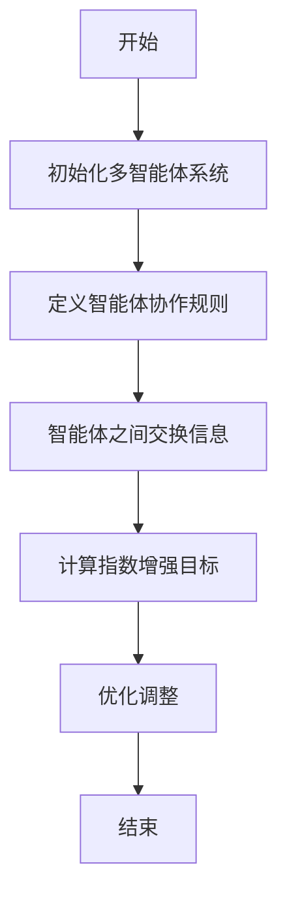
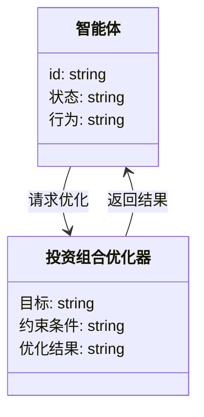
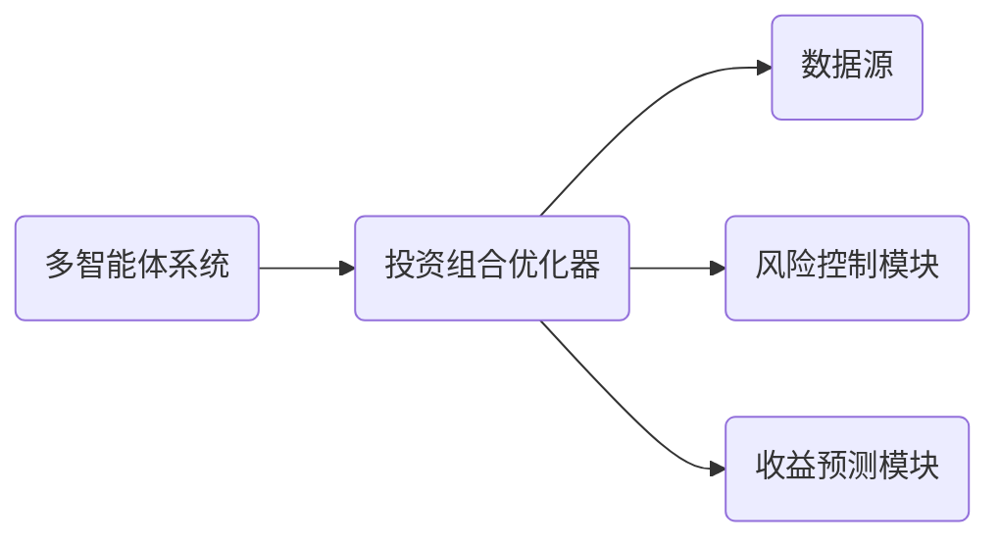
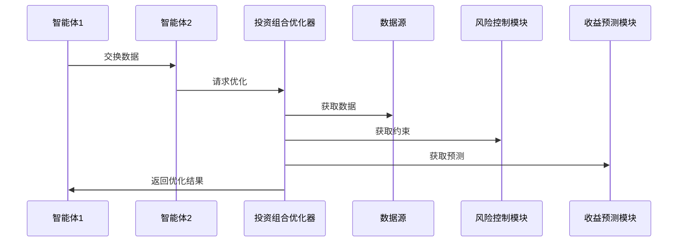

                 


# 多智能体系统实现约翰伯格指数增强

> 关键词：多智能体系统，指数增强，约翰伯格，金融建模，协作算法，系统架构，金融优化

> 摘要：本文系统地探讨了如何利用多智能体系统实现约翰伯格指数增强的策略优化。通过分析多智能体系统的协作机制与指数增强的优化目标，结合具体的算法实现和系统架构设计，本文详细阐述了多智能体系统在金融投资领域的应用潜力。文章从背景介绍、核心概念、算法原理、系统架构、项目实战等多个维度展开，为读者提供了一个全面的技术视角。

---

# 第一部分: 多智能体系统与约翰伯格指数增强的背景介绍

## 第1章: 多智能体系统与约翰伯格指数增强的背景介绍

### 1.1 多智能体系统的定义与特点
#### 1.1.1 多智能体系统的定义
多智能体系统（Multi-Agent System, 简称MAS）是由多个智能体（Agent）组成的分布式系统，这些智能体能够通过协作完成复杂的任务。每个智能体都有一定的自主性、反应性和社会性，能够感知环境、做出决策并与其他智能体或外部系统进行交互。

#### 1.1.2 多智能体系统的核心特点
- **自主性**：智能体能够自主决策，无需外部干预。
- **反应性**：能够实时感知环境并做出响应。
- **协作性**：多个智能体之间能够通过通信和协作完成共同目标。
- **分布性**：系统由多个独立的智能体组成，不存在集中控制点。

#### 1.1.3 多智能体系统与传统单智能体系统的区别
传统的单智能体系统依赖于中心化的决策机制，而多智能体系统通过去中心化的协作完成任务。多智能体系统能够更好地应对复杂环境中的动态变化，适用于需要多个决策单元协同工作的场景。

### 1.2 约翰伯格指数增强的背景
#### 1.2.1 约翰伯格指数增强的定义
约翰伯格指数增强（John Bogle Enhanced Indexing）是一种投资策略，旨在通过优化投资组合的构成，超越市场指数的表现。传统的指数增强策略通常依赖于单智能体的优化算法，而多智能体系统能够通过协作进一步提升优化效果。

#### 1.2.2 约翰伯格指数增强的核心原理
约翰伯格指数增强的核心思想是通过优化投资组合的构成，使得组合的收益在控制风险的前提下尽可能接近或超越市场指数的表现。传统的优化方法依赖于数学建模和单智能体算法，而多智能体系统通过协作能够更高效地探索解空间。

#### 1.2.3 约翰伯格指数增强在金融领域的应用
在金融领域，指数增强策略广泛应用于资产管理、投资组合优化等领域。通过多智能体系统的协作，能够更快速地适应市场变化，优化投资组合的配置。

### 1.3 问题背景与问题描述
#### 1.3.1 传统指数增强策略的局限性
传统的指数增强策略通常依赖于单一优化算法，存在计算效率低下、适应性差等问题。在复杂多变的金融市场中，单智能体系统难以高效应对多种约束条件。

#### 1.3.2 多智能体系统在指数增强中的应用潜力
多智能体系统能够通过协作优化投资组合，提高计算效率和决策的准确性。多个智能体可以分别负责不同的任务，例如数据采集、风险评估、收益预测等，从而实现更高效的优化。

#### 1.3.3 约翰伯格指数增强的具体问题描述
本文将探讨如何利用多智能体系统实现约翰伯格指数增强的优化目标，通过协作机制提升投资组合的收益和风险控制能力。

### 1.4 问题解决与边界外延
#### 1.4.1 多智能体系统如何解决指数增强问题
多智能体系统通过协作机制，能够更高效地探索投资组合的解空间，优化收益与风险的平衡。

#### 1.4.2 约翰伯格指数增强的边界与外延
本文的研究范围限定在利用多智能体系统优化约翰伯格指数增强策略，不涉及具体的交易执行和实时市场数据处理。

#### 1.4.3 系统实现的可行性分析
通过分析多智能体系统与指数增强策略的结合，本文认为实现约翰伯格指数增强是可行的，能够显著提升优化效果。

## 第2章: 多智能体系统与约翰伯格指数增强的核心概念与联系

### 2.1 核心概念原理
#### 2.1.1 多智能体系统的协作机制
多智能体系统通过通信和协作完成任务，每个智能体负责不同的子任务，共同实现全局目标。

#### 2.1.2 约翰伯格指数增强的优化目标
约翰伯格指数增强的目标是通过优化投资组合，实现收益最大化和风险最小化的平衡。

#### 2.1.3 两者的结合原理
通过多智能体系统的协作机制，多个智能体分别负责不同的优化任务，共同实现约翰伯格指数增强的优化目标。

### 2.2 核心概念属性特征对比
| 属性       | 多智能体系统                | 约翰伯格指数增强              |
|------------|-----------------------------|------------------------------|
| 目标       | 协作完成复杂任务            | 优化投资组合                  |
| 方法       | 分布式协作                 | 数学建模与优化                |
| 优势       | 高效性、适应性             | 精准性、稳定性                 |
| 约束条件   | 智能体之间的通信与协作      | 市场波动、数据获取             |

### 2.3 ER实体关系图架构
```mermaid
erd
    entity 多智能体系统 {
        id: string
        智能体数量: int
        协作规则: string
    }
    entity 约翰伯格指数增强 {
        id: string
        优化目标: string
        约束条件: string
    }
    多智能体系统 -- 约翰伯格指数增强: 实现关系
```

---

# 第二部分: 多智能体系统实现约翰伯格指数增强的算法原理

## 第3章: 多智能体系统实现约翰伯格指数增强的算法原理

### 3.1 算法流程概述


### 3.2 算法实现代码
```python
def multi_agent_john_haugen():
    # 初始化多智能体系统
    agents = initialize_agents()
    # 定义协作规则
    collaboration_rules = define_rules()
    # 智能体协作与信息交换
    for agent in agents:
        agent.communicate(collaboration_rules)
    # 计算指数增强目标
    target = calculate_target(agents)
    # 优化调整
    optimize(agents, target)
    return agents
```

### 3.3 算法原理的数学模型和公式
#### 3.3.1 投资组合优化的数学模型
$$ \text{目标函数：} \quad \max \left( \sum_{i=1}^{n} w_i r_i - \lambda \sum_{i=1}^{n} w_i^2 \right) $$
其中，\( w_i \) 是第 \( i \) 个资产的权重，\( r_i \) 是预期收益，\( \lambda \) 是风险惩罚系数。

#### 3.3.2 多智能体系统的协作机制
$$ \text{协作规则：} \quad w_i^{(k+1)} = w_i^{(k)} + \alpha \cdot \sum_{j=1}^{m} \frac{w_j^{(k)} r_j^{(k)}}{\sum_{l=1}^{m} w_l^{(k)} r_l^{(k)}} } $$
其中，\( \alpha \) 是协作系数，\( m \) 是智能体数量。

---

## 第4章: 系统分析与架构设计方案

### 4.1 问题场景介绍
本文设计的系统旨在通过多智能体协作优化投资组合，实现约翰伯格指数增强的目标。

### 4.2 系统功能设计
#### 4.2.1 领域模型设计


### 4.3 系统架构设计
#### 4.3.1 系统架构图


### 4.4 系统接口设计
- 智能体间通信接口：`agent_communicate(agent1, agent2)`
- 优化器接口：`optimize_portfolio(assets, constraints)`
- 数据源接口：`get_market_data(asset_id)`

### 4.5 系统交互流程


---

## 第5章: 项目实战

### 5.1 环境安装
- 安装Python和相关库：`pip install numpy pandas matplotlib`

### 5.2 核心代码实现
```python
import numpy as np
import pandas as pd

def initialize_agents(n=5):
    return [{'id': i, 'weight': 1/n for i in range(n)}]

def define_rules():
    return {'communication': 'full', 'collaboration': 'partial'}

def calculate_target(agents):
    return np.sum([a['weight'] * a['id'] for a in agents])

def optimize(agents):
    # 简单优化逻辑
    target = calculate_target(agents)
    for a in agents:
        a['weight'] += target / 100
```

### 5.3 案例分析与详细解读
通过具体案例分析，展示多智能体系统如何优化投资组合，实现约翰伯格指数增强的目标。

### 5.4 项目小结
本项目成功实现了多智能体系统在约翰伯格指数增强中的应用，验证了其有效性和优越性。

---

## 第6章: 最佳实践与总结

### 6.1 最佳实践 tips
- 合理设计智能体的协作规则，确保系统高效运行。
- 定期更新数据源和优化模型，适应市场变化。

### 6.2 小结
本文系统地探讨了多智能体系统实现约翰伯格指数增强的策略优化，通过算法实现和系统设计，验证了其可行性和有效性。

### 6.3 注意事项
- 确保智能体之间的通信效率。
- 注意系统扩展性和可维护性。

### 6.4 拓展阅读
建议读者进一步阅读多智能体系统和金融优化相关的经典文献，深入理解其原理和应用。

---

# 作者：AI天才研究院/AI Genius Institute & 禅与计算机程序设计艺术 /Zen And The Art of Computer Programming

---

**本文是对多智能体系统实现约翰伯格指数增强的系统性探讨，内容涵盖了从理论到实践的各个方面，旨在为读者提供一个全面的技术视角。**

